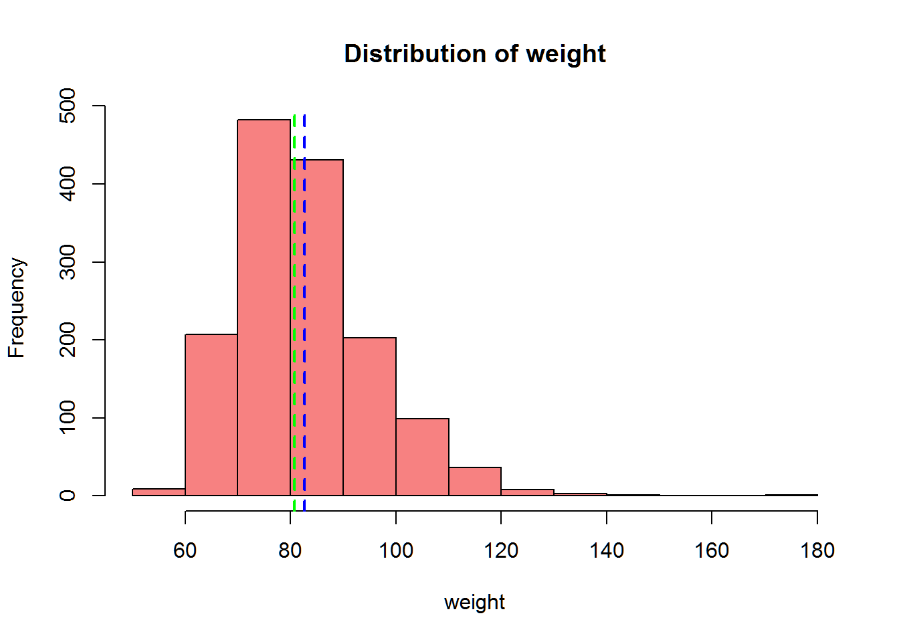
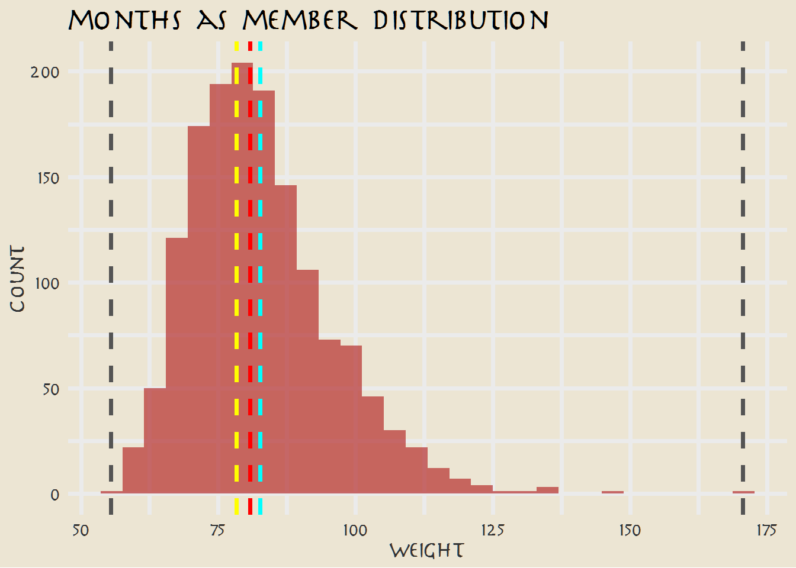
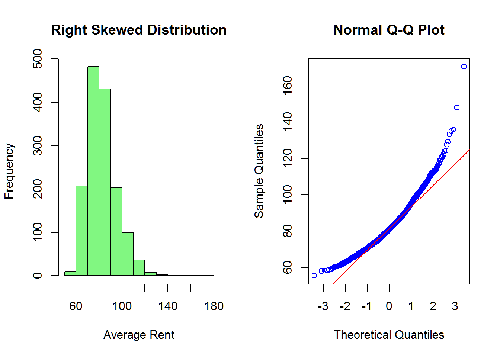
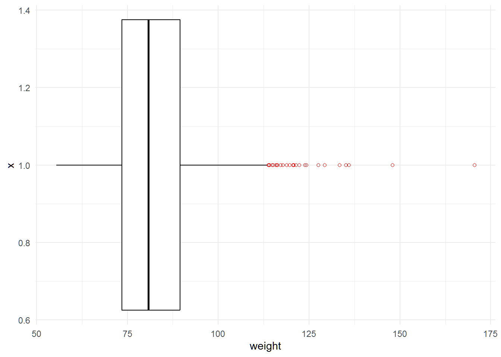

<script src="index.en_files/kePrint/kePrint.js"></script>
<link href="index.en_files/lightable/lightable.css" rel="stylesheet" />


# *Background*

GoalZone is a fitness club chain in Canada. GoalZone offers a range of
fitness classes in two capacities . Some classes are always fully
booked. Fully booked classes often have a low attendance rate. GoalZone
wants to increase the number of spaces available for classes. They want
to do this by predicting whether the member will attend the class or
not. If they can predict a member will not attend the class, they can
make another space available.

# Setup

-   lets load all required packages and look at their versions


```r
pacman::p_load("tidyverse",
               "tidymodels",
               "magrittr",
               "kableExtra",
               "here", 
               "scales", 
               "glmnet", 
               "stacks", 
               "janitor", 
               "finetune", 
               "vip",
               "data.table",
               "DT",
               "alluvial",
               "extrafont",
               "gt",
               "gtsummary")


lst <- c("tidyverse",
               "tidymodels",
               "magrittr",
               "here", 
               "scales", 
               "glmnet", 
               "stacks", 
               "janitor", 
               "finetune", 
               "vip",
               "data.table",
               "DT",
               "alluvial",
               "extrafont",
               "gt",
               "gtsummary")

as_tibble(installed.packages())  |>
  select(Package, Version)  |> 
  filter(Package %in% lst) |>
  kbl() |>
  kable_material(c("striped", "hover"))
```

<table class=" lightable-material lightable-striped lightable-hover" style='font-family: "Source Sans Pro", helvetica, sans-serif; margin-left: auto; margin-right: auto;'>
 <thead>
  <tr>
   <th style="text-align:left;"> Package </th>
   <th style="text-align:left;"> Version </th>
  </tr>
 </thead>
<tbody>
  <tr>
   <td style="text-align:left;"> alluvial </td>
   <td style="text-align:left;"> 0.1-2 </td>
  </tr>
  <tr>
   <td style="text-align:left;"> data.table </td>
   <td style="text-align:left;"> 1.14.8 </td>
  </tr>
  <tr>
   <td style="text-align:left;"> DT </td>
   <td style="text-align:left;"> 0.27 </td>
  </tr>
  <tr>
   <td style="text-align:left;"> extrafont </td>
   <td style="text-align:left;"> 0.19 </td>
  </tr>
  <tr>
   <td style="text-align:left;"> finetune </td>
   <td style="text-align:left;"> 1.1.0 </td>
  </tr>
  <tr>
   <td style="text-align:left;"> glmnet </td>
   <td style="text-align:left;"> 4.1-6 </td>
  </tr>
  <tr>
   <td style="text-align:left;"> gt </td>
   <td style="text-align:left;"> 0.8.0 </td>
  </tr>
  <tr>
   <td style="text-align:left;"> gtsummary </td>
   <td style="text-align:left;"> 1.7.0 </td>
  </tr>
  <tr>
   <td style="text-align:left;"> here </td>
   <td style="text-align:left;"> 1.0.1 </td>
  </tr>
  <tr>
   <td style="text-align:left;"> janitor </td>
   <td style="text-align:left;"> 2.2.0 </td>
  </tr>
  <tr>
   <td style="text-align:left;"> magrittr </td>
   <td style="text-align:left;"> 2.0.3 </td>
  </tr>
  <tr>
   <td style="text-align:left;"> scales </td>
   <td style="text-align:left;"> 1.2.1 </td>
  </tr>
  <tr>
   <td style="text-align:left;"> stacks </td>
   <td style="text-align:left;"> 1.0.2 </td>
  </tr>
  <tr>
   <td style="text-align:left;"> tidymodels </td>
   <td style="text-align:left;"> 1.0.0 </td>
  </tr>
  <tr>
   <td style="text-align:left;"> tidyverse </td>
   <td style="text-align:left;"> 2.0.0 </td>
  </tr>
  <tr>
   <td style="text-align:left;"> vip </td>
   <td style="text-align:left;"> 0.3.2 </td>
  </tr>
</tbody>
</table>

## Buckle up 👨‍🚀

### Why R?

> If you work a lot with rigorus statistical analysis and models I think R is a great place to start your data science journey because it is an environment designed from the ground up to support data science. R is not just a programming language, but it is also an interactive environment for doing data science. To support interaction, R is a much more flexible language than many of its peers.

## 1. Getting to know R ... a little

People have often described R as quirky. But quirky is good, it means it's a little bit out of the norm. And I think that's what makes R, R. So to easen things up, we'll briefly discuss some of the most important family of data types in base R: `vectors`.

> In R, **assignment** statements have the following form:
>
> `object_name <- value`
>
> `=` will work in place of `<-`, but it will cause confusion later. Use the keyboard shortcut: `Alt` + `-` (the minus sign) to poof up the assignment operator, \<- , in a flash. 💫

Vectors are created using use [`c()`](https://rdrr.io/r/base/c.html), short for combine. You can determine the type of a vector with [`typeof()`](https://rdrr.io/r/base/typeof.html) and how many elements it contains with [`length()`](https://rdrr.io/r/base/length.html).

Adding a `dim` attribute to a vector allows it to behave like a 2-dimensional **matrix** or a multi-dimensional **array**.


```r
# Defining a vector of student grades
grades <-  c(50, 50, 47, 97, 49, 3, 53, 42, 26,
             74, 82, 62, 37, 15, 70, 27, 36, 35,
             48, 52, 63, 64)
```

So, how many students does the sample contain 🗒?


```r
# Determining number of elements in the vector
length(grades)
```

```
## [1] 22
```

### **Indexing Vectors**

Oftentimes we may want to access only part of a vector, or perhaps an individual element. This is called *indexing* and is accomplished with square brackets, `[]`. R has a very flexible system that gives us several choices of index:

-   Passing a vector of positive numbers returns the slice of the vector containing the elements at those locations. The `first` position is `1` (not 0, as in some other languages).

-   Passing a vector of `negative numbers` returns the slice of the vector containing the elements everywhere *except* at those locations.

Let's get the first and sixth grade:


```r
# we should expect 50 & 3
grades[c(1,6)]
```

```
## [1] 50  3
```

Perfect! Now let's get a vector of all grades except for the 1st and the 6th student.


```r
# we should expect all other grades except at index 1 and 6
grades[-c(1,6)]
```

```
##  [1] 50 47 97 49 53 42 26 74 82 62 37 15 70 27 36 35 48 52 63 64
```

Alright, now we know our way around vectors, enough to knock out this module 💪.

# Read in the dataset for this exercise


```r
# read in the data
df<-readr::read_csv("fitness_class_2212.csv")

# How many rows and columns are there
dim(df)
```

```
## [1] 1500    8
```
- the dataset contains 1500 rows(members i guess) on 8 columns/ variables


### Handling missing values

One of the most common issues data scientists need to deal with is incomplete or missing data. R represents missing, or unknown values, with special sentinel value: `NA` (Not Available).

So how would we know that the data frame contains missing values?

-   One way to know if our data contains any `NA`s in two shakes would be to use the generic function `anyNA`


```r
df %>% 
  anyNA()
```

```
## [1] TRUE
```

-   Another way would be to use the generic function `is.na()` which indicates which individual elements are missing with a logical `TRUE`.


```r
is.na(df)
```

Okay, got the job done but with a larger data frame, it would be inefficient and practically impossible to review all of the rows and columns individually so i made sure the code above does not run😴.

-   Another more intuitive way would be to get the sum of missing values for each column, like this:


```r
colSums(is.na(df))
```

```
##       booking_id months_as_member           weight      days_before 
##                0                0               20                0 
##      day_of_week             time         category         attended 
##                0                0                0                0
```

So now we know that there are `twenty` missing values in the **weight** column.

To see them in context, we can filter the data frame to include only rows where any of the columns have an `NA`. The code below returns the rows where there is an `NA` in at least one of the column.

> *`if_any()` applies the same predicate function to a selection of columns and combines the results into a single logical vector.*
>
> *`everything()` selects all columns.*


```r
df %>% 
  filter(if_any(everything(), is.na))
```

```
## # A tibble: 20 x 8
##    booking_id months_as_member weight days_before day_of_week time  category
##         <dbl>            <dbl>  <dbl> <chr>       <chr>       <chr> <chr>   
##  1        115               14     NA 10          Fri         AM    HIIT    
##  2        212               16     NA 10          Fri         AM    Cycling 
##  3        316                5     NA 14          Sun         AM    HIIT    
##  4        367                4     NA 2           Mon         AM    Aqua    
##  5        483               14     NA 1           Mon         PM    Aqua    
##  6        553               11     NA 9           Thu         AM    HIIT    
##  7        656                5     NA 12          Sat         AM    Strength
##  8        735                7     NA 8           Thu         AM    HIIT    
##  9        743               11     NA 10          Wed         PM    HIIT    
## 10        782               10     NA 5           Tue         PM    HIIT    
## 11        865                4     NA 7           Thu         PM    Cycling 
## 12        931               11     NA 5           Wed         PM    Cycling 
## 13        981               29     NA 8           Thu         PM    HIIT    
## 14        990               28     NA 8           Thu         PM    HIIT    
## 15       1076               37     NA 11          Sat         PM    HIIT    
## 16       1120               16     NA 8           Thu         AM    Cycling 
## 17       1267               14     NA 4           Tue         AM    Cycling 
## 18       1337                4     NA 14          Sun         AM    Cycling 
## 19       1364               10     NA 5           Tue         PM    HIIT    
## 20       1417               17     NA 2           Mon         AM    Strength
## # i 1 more variable: attended <dbl>
```
- voila, we see that twenty rows with missing values are returned as a dataframe
- we will deal with missing values somewhere along the way ,let's hope on to some basic data wrangling

# data cleaning


```r
df<-df|> 
  mutate_at(c(5,6,7,8),as.factor) |>   # change these columns to factors
  mutate(day_of_week = 
           fct_collapse(day_of_week,Wed=c("Wed","Wednesday"),
                                  Fri=c("Fri.","Fri"), # collapse redundant levels
                                  Mon=c("Mon","Monday")),
         category=fct_collapse(category,unknown=c("-")), # add category(unknown)
         days_before=readr::parse_number(days_before)) # leave only numbers in the dataset
```


# statistical analysis

In general statistics reports, there are 2 main parts, descriptive statistics and inferential statistics (analysis test). To provide you how to create a statistical analysis report, we will divide some of the content into:

* **Statistical Descriptive**

  * Measure of Central Tendency
  * Measure of Spread
  * Measure of Relationship between data

# Statistical Descriptive

Statisticians and data scientists use descriptive statistics to summarize and describe a large number of measurements. Many times, this task is accompanied with graphs and plots that help describe the numerical summary of data. The simple rule is that descriptive statistics do not involve generalizing beyond the data we have obtained, and are merely descriptive of what we have at hand.

## Measure of Central Tendency

The measure of central tendency enable us to compare two or more distribution pertaining to the same time period or within the same distribution over time. 

## lets run a summary


```r
summary(df)
```

```
##    booking_id     months_as_member     weight        days_before    
##  Min.   :   1.0   Min.   :  1.00   Min.   : 55.41   Min.   : 1.000  
##  1st Qu.: 375.8   1st Qu.:  8.00   1st Qu.: 73.49   1st Qu.: 4.000  
##  Median : 750.5   Median : 12.00   Median : 80.76   Median : 9.000  
##  Mean   : 750.5   Mean   : 15.63   Mean   : 82.61   Mean   : 8.347  
##  3rd Qu.:1125.2   3rd Qu.: 19.00   3rd Qu.: 89.52   3rd Qu.:12.000  
##  Max.   :1500.0   Max.   :148.00   Max.   :170.52   Max.   :29.000  
##                                    NA's   :20                       
##  day_of_week time          category   attended
##  Fri:305     AM:1141   unknown : 13   0:1046  
##  Mon:228     PM: 359   Aqua    : 76   1: 454  
##  Sat:202               Cycling :376           
##  Sun:213               HIIT    :667           
##  Thu:241               Strength:233           
##  Tue:195               Yoga    :135           
##  Wed:116
```
- this is an essential step as it allows you to figure out some anomalies in your data for instance: 
 + we notice that there are missing variables
 + maximum weight is kinda huge as well as month as a member than other individuals ,this could have some drastic effects when we hop on to modeling 
 
## let's do more exploration on weight

+ We start by drawing the out the distribution of weight 
+ will try using the base R system first

```r
options(repr.plot.width=8, repr.plot.height=4)
# windows(height = 7, width = 3.5)
# Lines: Mean is the blue line and Median the green line

# First Subplot
p4 <- hist(df$weight, col="#F78181", xlab="weight",
           main="Distribution of weight")
abline(v = mean(df$weight,na.rm=TRUE), col = "blue", lwd = 2,
       lty="dashed")
abline(v = median(df$weight,na.rm=TRUE), col = "green", 
       lwd =2, lty="dashed")
legend(x = c(4000, 3200), y = c(8000, 5500), 
       legend=c("Mean", "Median"), col=c("blue","green"),
       cex=0.7, 
       lty="dashed", lwd=1, y.intersp = 3.8, x.intersp=3.5,
       xjust=-1.8)
```


+ notice hear that i have removed missing values when finding the mean and median
+ lets do it using ggplot2 but try to add more statistical measures

# statitical measures

+ *Variance* : This is an indicator of how spread our data is spread out. The smallest variabilitiy there could be is 0 while the biggest is infinite. 
+ *Standard Deviation* : The standard deviation is just the square root of our variance and it tells us how far our data is spread from the mean.
+ *1st Quartile* : This is comprised of the lowest 25% of numbers in our distribution.
+ *2nd Quartile (Q2)*: Comprised of 50% of lowest numbers up to the median.
+ *3rd Quartile (Q3)*: Comprised of 75% of lowest numbers.
+ *Interquartile Range (IQR)* : This helps us detect where most of the data lies. IQR is expressed as: *IQR =  Q1−Q3*
+  the **range**  is the distance from our smallest measurement to the largest one:

> It is preferred to use IQR instead of the mean or median when trying to find out where most of the data lies


```r
library(statip)


min_val <- min(df$weight,na.rm=TRUE)
max_val <- max(df$weight,na.rm=TRUE)
mean_val <- mean(df$weight,na.rm=TRUE)
med_val <- median(df$weight,na.rm=TRUE)
mod_val <- mfv(df$weight,na.rm=TRUE)
```

```
## argument 'na.rm' is soft-deprecated, please start using 'na_rm' instead
```

```r
IQR_val<- IQR(df$weight,na.rm=TRUE)

# Print the stats
glue::glue(
  'Minimum: {format(round(min_val, 2), nsmall = 2)}
   Mean: {format(round(mean_val, 2), nsmall = 2)}
   Median: {format(round(med_val, 2), nsmall = 2)}
   Mode: {format(round(mod_val, 2), nsmall = 2)}
   Maximum: {format(round(max_val, 2), nsmall = 2)}
  IQR: {format(round(IQR_val, 2), nsmall = 2)}'
)
```

```
## Minimum: 55.41
##  Mean: 82.61
##  Median: 80.76
##  Mode: 78.28
##  Maximum: 170.52
## IQR: 16.03
```
## manually for range and interquartile range


```r
max(df$weight,na.rm=TRUE) - min(df$weight,na.rm=TRUE)
```

```
## [1] 115.11
```


```r
diff(range(df$weight,na.rm=TRUE))
```

```
## [1] 115.11
```

### IQR


```r
as.numeric(quantile(df$weight,na.rm=TRUE, 0.75) - quantile(df$weight,na.rm=TRUE, 0.25))
```

```
## [1] 16.03
```

While we can use `quantile()` to obtain the 3rd and 1st quartile individually, these two figures are also presented together with the 0th (the `min()`), 50th (the `median()`), and the 100th (the `max()`) quartiles: together they are called the five-number summary.

When we call `fivenum()`, we get this summary that we can use as a measure of variation for even potentially skewed data:


```r
fivenum(df$weight,na.rm=TRUE)
```

```
## [1]  55.41  73.49  80.76  89.52 170.52
```

From the above, observe that the absolute lowest weight (the `min`) approximates 55.4kgs and the highest weight approximates 170.52 (the `max`); Observe also that 25% of members have weight of less than 73.49. Half of the members (the middle 50% of the value) have weight between 73.49 and 89.52 - recall that this range is called the *interquartile range* (IQR).


```r
df |> 
  filter(weight>=73.49&weight<=89.52) |> 
  nrow()
```

```
## [1] 742
```
+ good guess from the interquartile range

## lets visualise some of this


```r
 df |> 
  ggplot() +
  geom_histogram(aes(x = weight), 
                 fill = "firebrick", alpha = 0.66) +
  labs(title = "months_as_member distribution") +
  theme(plot.title = element_text(hjust = 0.5, size = 14),
        axis.title.x = element_blank(),
        axis.title.y = element_blank(),
        axis.text.y = element_blank(),
        axis.ticks.y = element_blank())+
  ggthemes::scale_fill_tableau()+
  tvthemes::theme_theLastAirbender(title.font="Slayer",text.font = "Slayer")+
  geom_vline(xintercept = min_val, color = 'gray33', linetype = "dashed", size = 1.3)+
  geom_vline(xintercept = mean_val, color = 'cyan', linetype = "dashed", size = 1.3)+
  geom_vline(xintercept = med_val, color = 'red', linetype = "dashed", size = 1.3 )+
  geom_vline(xintercept = mod_val, color = 'yellow', linetype = "dashed", size = 1.3 )+
  geom_vline(xintercept = max_val, color = 'gray33', linetype = "dashed", size = 1.3 )
```

```
## `stat_bin()` using `bins = 30`. Pick better value with `binwidth`.
```


+ the data seem to skewed to right

## Understanding Q-Plots 
+ Right Skewed Qplot: When the distribution is right skewed, the observations tend to go above the red line indicating that the distribution is right-skewed.
+ Normal Distribution Qplot: Although some observations are not on the line, most of the observations are on the line which indicates that the distribution is mostly normal.
+ Left Skewed Qplot: Although this distribution is not strongly left skewed, we can see that most observations fall below the red line, indicating that the distribution is left-skewed


```r
options(repr.plot.width=10, repr.plot.height=8)
par(mfrow=c(1,2)) 
# First subplot (Right Skewed)
hist(df$weight, main="Right Skewed Distribution", 
     xlab="Average Rent", col="#81F781")
qqnorm(df$weight, col="blue")
qqline(df$weight, col="red")
```



# lets look at the boxplot as well


```r
df |> 
  ggplot(aes(x=1,y=weight))+
  geom_boxplot(fill="white", colour="black", 
               outlier.colour = "red", outlier.shape = 1) +
  theme_minimal() + 
  theme(plot.title=element_text(hjust=0.5)) + 
  coord_flip()
```


## A Word Regarding Outliers: 
+ the red values represent outliers

> I just wanted to add in this section that outliers should be carefully analyzed and although there are common rules such as that in a "normal distribution" any value beyond three standard deviations should be consider an outlier. Eventhough, there is a small probability that a value in a normal distribution is 3 standard deviations away from the mean, we should carefully analyze as of why is this the case. It could be that in data was mistyped which will weakened the theory that a specific observation is an outlier.

