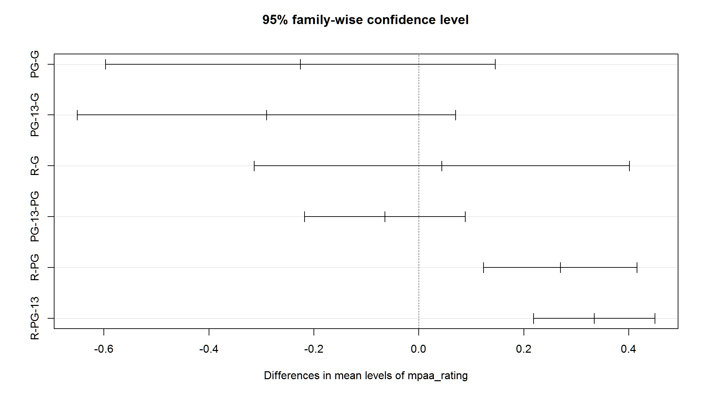

<script src="index.en_files/kePrint/kePrint.js"></script>
<link href="index.en_files/lightable/lightable.css" rel="stylesheet" />
<script src="//yihui.org/js/math-code.js" defer></script>
<!-- Just one possible MathJax CDN below. You may use others. -->
<script defer
  src="//mathjax.rstudio.com/latest/MathJax.js?config=TeX-MML-AM_CHTML">
</script>


# Set up

```r
library(kableExtra)
library(tidyverse)
library(tvthemes)
library(ggthemes)
library(scales)
library(magrittr)

out_new<-vroom::vroom("movies.csv")
out_new |> 
  head(10) |> 
  kable(table.attr = "style = \"color: black;\"") |> 
  kable_styling(fixed_thead = T) |> 
  scroll_box(height = "400px")
```

<div style="border: 1px solid #ddd; padding: 0px; overflow-y: scroll; height:400px; "><table style="color: black; margin-left: auto; margin-right: auto;" class="table">
 <thead>
  <tr>
   <th style="text-align:right;position: sticky; top:0; background-color: #FFFFFF;position: sticky; top:0; background-color: #FFFFFF;"> ...1 </th>
   <th style="text-align:left;position: sticky; top:0; background-color: #FFFFFF;position: sticky; top:0; background-color: #FFFFFF;"> release_date </th>
   <th style="text-align:left;position: sticky; top:0; background-color: #FFFFFF;position: sticky; top:0; background-color: #FFFFFF;"> movie </th>
   <th style="text-align:right;position: sticky; top:0; background-color: #FFFFFF;position: sticky; top:0; background-color: #FFFFFF;"> production_budget </th>
   <th style="text-align:right;position: sticky; top:0; background-color: #FFFFFF;position: sticky; top:0; background-color: #FFFFFF;"> domestic_gross </th>
   <th style="text-align:right;position: sticky; top:0; background-color: #FFFFFF;position: sticky; top:0; background-color: #FFFFFF;"> worldwide_gross </th>
   <th style="text-align:left;position: sticky; top:0; background-color: #FFFFFF;position: sticky; top:0; background-color: #FFFFFF;"> distributor </th>
   <th style="text-align:left;position: sticky; top:0; background-color: #FFFFFF;position: sticky; top:0; background-color: #FFFFFF;"> mpaa_rating </th>
   <th style="text-align:left;position: sticky; top:0; background-color: #FFFFFF;position: sticky; top:0; background-color: #FFFFFF;"> genre </th>
  </tr>
 </thead>
<tbody>
  <tr>
   <td style="text-align:right;"> 1 </td>
   <td style="text-align:left;"> 6/22/2007 </td>
   <td style="text-align:left;"> Evan Almighty </td>
   <td style="text-align:right;"> 1.75e+08 </td>
   <td style="text-align:right;"> 100289690 </td>
   <td style="text-align:right;"> 174131329 </td>
   <td style="text-align:left;"> Universal </td>
   <td style="text-align:left;"> PG </td>
   <td style="text-align:left;"> Comedy </td>
  </tr>
  <tr>
   <td style="text-align:right;"> 2 </td>
   <td style="text-align:left;"> 7/28/1995 </td>
   <td style="text-align:left;"> Waterworld </td>
   <td style="text-align:right;"> 1.75e+08 </td>
   <td style="text-align:right;"> 88246220 </td>
   <td style="text-align:right;"> 264246220 </td>
   <td style="text-align:left;"> Universal </td>
   <td style="text-align:left;"> PG-13 </td>
   <td style="text-align:left;"> Action </td>
  </tr>
  <tr>
   <td style="text-align:right;"> 3 </td>
   <td style="text-align:left;"> 5/12/2017 </td>
   <td style="text-align:left;"> King Arthur: Legend of the Sword </td>
   <td style="text-align:right;"> 1.75e+08 </td>
   <td style="text-align:right;"> 39175066 </td>
   <td style="text-align:right;"> 139950708 </td>
   <td style="text-align:left;"> Warner Bros. </td>
   <td style="text-align:left;"> PG-13 </td>
   <td style="text-align:left;"> Adventure </td>
  </tr>
  <tr>
   <td style="text-align:right;"> 4 </td>
   <td style="text-align:left;"> 12/25/2013 </td>
   <td style="text-align:left;"> 47 Ronin </td>
   <td style="text-align:right;"> 1.75e+08 </td>
   <td style="text-align:right;"> 38362475 </td>
   <td style="text-align:right;"> 151716815 </td>
   <td style="text-align:left;"> Universal </td>
   <td style="text-align:left;"> PG-13 </td>
   <td style="text-align:left;"> Action </td>
  </tr>
  <tr>
   <td style="text-align:right;"> 5 </td>
   <td style="text-align:left;"> 6/22/2018 </td>
   <td style="text-align:left;"> Jurassic World: Fallen Kingdom </td>
   <td style="text-align:right;"> 1.70e+08 </td>
   <td style="text-align:right;"> 416769345 </td>
   <td style="text-align:right;"> 1304866322 </td>
   <td style="text-align:left;"> Universal </td>
   <td style="text-align:left;"> PG-13 </td>
   <td style="text-align:left;"> Action </td>
  </tr>
  <tr>
   <td style="text-align:right;"> 6 </td>
   <td style="text-align:left;"> 8/1/2014 </td>
   <td style="text-align:left;"> Guardians of the Galaxy </td>
   <td style="text-align:right;"> 1.70e+08 </td>
   <td style="text-align:right;"> 333172112 </td>
   <td style="text-align:right;"> 771051335 </td>
   <td style="text-align:left;"> Walt Disney </td>
   <td style="text-align:left;"> PG-13 </td>
   <td style="text-align:left;"> Action </td>
  </tr>
  <tr>
   <td style="text-align:right;"> 7 </td>
   <td style="text-align:left;"> 5/7/2010 </td>
   <td style="text-align:left;"> Iron Man 2 </td>
   <td style="text-align:right;"> 1.70e+08 </td>
   <td style="text-align:right;"> 312433331 </td>
   <td style="text-align:right;"> 621156389 </td>
   <td style="text-align:left;"> Paramount Pictures </td>
   <td style="text-align:left;"> PG-13 </td>
   <td style="text-align:left;"> Action </td>
  </tr>
  <tr>
   <td style="text-align:right;"> 8 </td>
   <td style="text-align:left;"> 4/4/2014 </td>
   <td style="text-align:left;"> Captain America: The Winter Soldier </td>
   <td style="text-align:right;"> 1.70e+08 </td>
   <td style="text-align:right;"> 259746958 </td>
   <td style="text-align:right;"> 714401889 </td>
   <td style="text-align:left;"> Walt Disney </td>
   <td style="text-align:left;"> PG-13 </td>
   <td style="text-align:left;"> Action </td>
  </tr>
  <tr>
   <td style="text-align:right;"> 9 </td>
   <td style="text-align:left;"> 7/11/2014 </td>
   <td style="text-align:left;"> Dawn of the Planet of the Apes </td>
   <td style="text-align:right;"> 1.70e+08 </td>
   <td style="text-align:right;"> 208545589 </td>
   <td style="text-align:right;"> 710644566 </td>
   <td style="text-align:left;"> 20th Century Fox </td>
   <td style="text-align:left;"> PG-13 </td>
   <td style="text-align:left;"> Adventure </td>
  </tr>
  <tr>
   <td style="text-align:right;"> 10 </td>
   <td style="text-align:left;"> 11/10/2004 </td>
   <td style="text-align:left;"> The Polar Express </td>
   <td style="text-align:right;"> 1.70e+08 </td>
   <td style="text-align:right;"> 186493587 </td>
   <td style="text-align:right;"> 310634169 </td>
   <td style="text-align:left;"> Warner Bros. </td>
   <td style="text-align:left;"> G </td>
   <td style="text-align:left;"> Adventure </td>
  </tr>
</tbody>
</table></div>

# first things first ::
## what variables do we have?


```r
names(out_new)
#> [1] "...1"              "release_date"      "movie"            
#> [4] "production_budget" "domestic_gross"    "worldwide_gross"  
#> [7] "distributor"       "mpaa_rating"       "genre"
```
## secondly ,what are the datatypes that we have?

```r
map_dfr(out_new,class)
#> # A tibble: 1 x 9
#>   ...1    release_date movie    production_budget domestic_gross worldwide_gross
#>   <chr>   <chr>        <chr>    <chr>             <chr>          <chr>          
#> 1 numeric character    charact~ numeric           numeric        numeric        
#> # i 3 more variables: distributor <chr>, mpaa_rating <chr>, genre <chr>
```


>This data was featured in the FiveThirtyEight article,["Scary Movies Are The Best 
Investment In Hollywood"](https://fivethirtyeight.com/features/scary-movies-are-the-best-investment-in-hollywood/). 

# Now let`s describe the dataset 

<table>
 <thead>
  <tr>
   <th style="text-align:left;"> Header </th>
   <th style="text-align:left;"> Description </th>
  </tr>
 </thead>
<tbody>
  <tr>
   <td style="text-align:left;"> `release_date` </td>
   <td style="text-align:left;"> month-day-year </td>
  </tr>
  <tr>
   <td style="text-align:left;"> `movie` </td>
   <td style="text-align:left;"> Movie title </td>
  </tr>
  <tr>
   <td style="text-align:left;"> `production_budget` </td>
   <td style="text-align:left;"> Money spent to create the film </td>
  </tr>
  <tr>
   <td style="text-align:left;"> `domestic_gross` </td>
   <td style="text-align:left;"> Gross revenue from USA </td>
  </tr>
  <tr>
   <td style="text-align:left;"> `worldwide_gross` </td>
   <td style="text-align:left;"> Gross worldwide revenue </td>
  </tr>
  <tr>
   <td style="text-align:left;"> `distributor` </td>
   <td style="text-align:left;"> The distribution company </td>
  </tr>
  <tr>
   <td style="text-align:left;"> `mpaa_rating` </td>
   <td style="text-align:left;"> Appropriate age rating by the US-based rating agency </td>
  </tr>
  <tr>
   <td style="text-align:left;"> `genre` </td>
   <td style="text-align:left;"> Film category </td>
  </tr>
</tbody>
</table>

# let's do some touches on the dataset

- Get rid of the blank `X1` Variable.
- Change release date into an actual date.
- change character variables to factors
- Calculate the return on investment as the `worldwide_gross/production_budget`.
- Calculate the percentage of total gross as domestic revenue.
- Get the year, month, and day out of the release date.
- Remove rows where the revenue is $0 (unreleased movies, or data integrity problems), and remove rows missing information about the distributor. Go ahead and remove any data where the rating is unavailable also.

.... but before that lets skim a bit!


```r
out_new |> skimr::skim()
```


<table style='width: auto;'
      class='table table-condensed'>
<caption>Table 1: Data summary</caption>
<tbody>
  <tr>
   <td style="text-align:left;"> Name </td>
   <td style="text-align:left;"> out_new </td>
  </tr>
  <tr>
   <td style="text-align:left;"> Number of rows </td>
   <td style="text-align:left;"> 3401 </td>
  </tr>
  <tr>
   <td style="text-align:left;"> Number of columns </td>
   <td style="text-align:left;"> 9 </td>
  </tr>
  <tr>
   <td style="text-align:left;"> _______________________ </td>
   <td style="text-align:left;">  </td>
  </tr>
  <tr>
   <td style="text-align:left;"> Column type frequency: </td>
   <td style="text-align:left;">  </td>
  </tr>
  <tr>
   <td style="text-align:left;"> character </td>
   <td style="text-align:left;"> 5 </td>
  </tr>
  <tr>
   <td style="text-align:left;"> numeric </td>
   <td style="text-align:left;"> 4 </td>
  </tr>
  <tr>
   <td style="text-align:left;"> ________________________ </td>
   <td style="text-align:left;">  </td>
  </tr>
  <tr>
   <td style="text-align:left;"> Group variables </td>
   <td style="text-align:left;"> None </td>
  </tr>
</tbody>
</table>


**Variable type: character**

<table>
 <thead>
  <tr>
   <th style="text-align:left;"> skim_variable </th>
   <th style="text-align:right;"> n_missing </th>
   <th style="text-align:right;"> complete_rate </th>
   <th style="text-align:right;"> min </th>
   <th style="text-align:right;"> max </th>
   <th style="text-align:right;"> empty </th>
   <th style="text-align:right;"> n_unique </th>
   <th style="text-align:right;"> whitespace </th>
  </tr>
 </thead>
<tbody>
  <tr>
   <td style="text-align:left;"> release_date </td>
   <td style="text-align:right;"> 0 </td>
   <td style="text-align:right;"> 1.00 </td>
   <td style="text-align:right;"> 8 </td>
   <td style="text-align:right;"> 10 </td>
   <td style="text-align:right;"> 0 </td>
   <td style="text-align:right;"> 1768 </td>
   <td style="text-align:right;"> 0 </td>
  </tr>
  <tr>
   <td style="text-align:left;"> movie </td>
   <td style="text-align:right;"> 0 </td>
   <td style="text-align:right;"> 1.00 </td>
   <td style="text-align:right;"> 1 </td>
   <td style="text-align:right;"> 35 </td>
   <td style="text-align:right;"> 0 </td>
   <td style="text-align:right;"> 3400 </td>
   <td style="text-align:right;"> 0 </td>
  </tr>
  <tr>
   <td style="text-align:left;"> distributor </td>
   <td style="text-align:right;"> 48 </td>
   <td style="text-align:right;"> 0.99 </td>
   <td style="text-align:right;"> 3 </td>
   <td style="text-align:right;"> 22 </td>
   <td style="text-align:right;"> 0 </td>
   <td style="text-align:right;"> 201 </td>
   <td style="text-align:right;"> 0 </td>
  </tr>
  <tr>
   <td style="text-align:left;"> mpaa_rating </td>
   <td style="text-align:right;"> 137 </td>
   <td style="text-align:right;"> 0.96 </td>
   <td style="text-align:right;"> 1 </td>
   <td style="text-align:right;"> 5 </td>
   <td style="text-align:right;"> 0 </td>
   <td style="text-align:right;"> 4 </td>
   <td style="text-align:right;"> 0 </td>
  </tr>
  <tr>
   <td style="text-align:left;"> genre </td>
   <td style="text-align:right;"> 0 </td>
   <td style="text-align:right;"> 1.00 </td>
   <td style="text-align:right;"> 5 </td>
   <td style="text-align:right;"> 9 </td>
   <td style="text-align:right;"> 0 </td>
   <td style="text-align:right;"> 5 </td>
   <td style="text-align:right;"> 0 </td>
  </tr>
</tbody>
</table>


**Variable type: numeric**

<table>
 <thead>
  <tr>
   <th style="text-align:left;"> skim_variable </th>
   <th style="text-align:right;"> n_missing </th>
   <th style="text-align:right;"> complete_rate </th>
   <th style="text-align:right;"> mean </th>
   <th style="text-align:right;"> sd </th>
   <th style="text-align:right;"> p0 </th>
   <th style="text-align:right;"> p25 </th>
   <th style="text-align:right;"> p50 </th>
   <th style="text-align:right;"> p75 </th>
   <th style="text-align:right;"> p100 </th>
   <th style="text-align:left;"> hist </th>
  </tr>
 </thead>
<tbody>
  <tr>
   <td style="text-align:left;"> ...1 </td>
   <td style="text-align:right;"> 0 </td>
   <td style="text-align:right;"> 1 </td>
   <td style="text-align:right;"> 1701 </td>
   <td style="text-align:right;"> 981.93 </td>
   <td style="text-align:right;"> 1 </td>
   <td style="text-align:right;"> 851 </td>
   <td style="text-align:right;"> 1701 </td>
   <td style="text-align:right;"> 2551 </td>
   <td style="text-align:right;"> 3401 </td>
   <td style="text-align:left;"> &lt;U+2587&gt;&lt;U+2587&gt;&lt;U+2587&gt;&lt;U+2587&gt;&lt;U+2587&gt; </td>
  </tr>
  <tr>
   <td style="text-align:left;"> production_budget </td>
   <td style="text-align:right;"> 0 </td>
   <td style="text-align:right;"> 1 </td>
   <td style="text-align:right;"> 33284743 </td>
   <td style="text-align:right;"> 34892390.59 </td>
   <td style="text-align:right;"> 250000 </td>
   <td style="text-align:right;"> 9000000 </td>
   <td style="text-align:right;"> 20000000 </td>
   <td style="text-align:right;"> 45000000 </td>
   <td style="text-align:right;"> 175000000 </td>
   <td style="text-align:left;"> &lt;U+2587&gt;&lt;U+2582&gt;&lt;U+2581&gt;&lt;U+2581&gt;&lt;U+2581&gt; </td>
  </tr>
  <tr>
   <td style="text-align:left;"> domestic_gross </td>
   <td style="text-align:right;"> 0 </td>
   <td style="text-align:right;"> 1 </td>
   <td style="text-align:right;"> 45421793 </td>
   <td style="text-align:right;"> 58825660.56 </td>
   <td style="text-align:right;"> 0 </td>
   <td style="text-align:right;"> 6118683 </td>
   <td style="text-align:right;"> 25533818 </td>
   <td style="text-align:right;"> 60323786 </td>
   <td style="text-align:right;"> 474544677 </td>
   <td style="text-align:left;"> &lt;U+2587&gt;&lt;U+2581&gt;&lt;U+2581&gt;&lt;U+2581&gt;&lt;U+2581&gt; </td>
  </tr>
  <tr>
   <td style="text-align:left;"> worldwide_gross </td>
   <td style="text-align:right;"> 0 </td>
   <td style="text-align:right;"> 1 </td>
   <td style="text-align:right;"> 94115117 </td>
   <td style="text-align:right;"> 140918241.82 </td>
   <td style="text-align:right;"> 0 </td>
   <td style="text-align:right;"> 10618813 </td>
   <td style="text-align:right;"> 40159017 </td>
   <td style="text-align:right;"> 117615211 </td>
   <td style="text-align:right;"> 1304866322 </td>
   <td style="text-align:left;"> &lt;U+2587&gt;&lt;U+2581&gt;&lt;U+2581&gt;&lt;U+2581&gt;&lt;U+2581&gt; </td>
  </tr>
</tbody>
</table>


```r
mov <- out_new |>
  select(-1) |>
  mutate(release_date = mdy(release_date)) |> #mdy is the setup of the date variable
  mutate_if(is.character,as.factor) |> 
  mutate(roi = worldwide_gross / production_budget) |>
  mutate(pct_domestic = domestic_gross / worldwide_gross) |>
  mutate(year = year(release_date)) |> 
  mutate(month = month(release_date)) |> 
  mutate(day = as.factor(wday(release_date))) |> 
  arrange(desc(release_date)) |>
  filter(worldwide_gross > 0) |>
  filter(!is.na(distributor)) |>
  filter(!is.na(mpaa_rating))
mov
#> # A tibble: 3,202 x 13
#>    release_date movie           production_budget domestic_gross worldwide_gross
#>    <date>       <fct>                       <dbl>          <dbl>           <dbl>
#>  1 2018-10-12   First Man                60000000       30000050        55500050
#>  2 2018-10-12   Goosebumps 2: ~          35000000       28804812        39904812
#>  3 2018-10-05   Venom                   100000000      171125095       461825095
#>  4 2018-10-05   A Star is Born           36000000      126181246       200881246
#>  5 2018-09-28   Smallfoot                80000000       66361035       137161035
#>  6 2018-09-28   Night School             29000000       66906825        84406825
#>  7 2018-09-28   Hell Fest                 5500000       10751601        12527795
#>  8 2018-09-14   The Predator             88000000       50787159       127987159
#>  9 2018-09-14   White Boy Rick           30000000       23851700        23851700
#> 10 2018-08-17   Mile 22                  35000000       36108758        64708758
#> # i 3,192 more rows
#> # i 8 more variables: distributor <fct>, mpaa_rating <fct>, genre <fct>,
#> #   roi <dbl>, pct_domestic <dbl>, year <dbl>, month <dbl>, day <fct>
```

- fair enough , the date variable looks pretty good now !
- let us look at the distribution of the year variable


```r
ggplot(mov, aes(year)) + 
  geom_histogram(bins=40, fill=avatar_pal()(1))+
  theme_avatar()
```


+ There doesn't appear to be much documented before 1975, so let's restrict (read: filter) the dataset to movies made since 1975. Also, we're going to be doing some analyses by year, and the data for 2018 is still incomplete, let's remove all of 2018. Let's get anything produced in 1975 and after (`>=1975`) but before `2018`.

## filter and remove the years described above


```r
mov<-mov |> 
  filter(year>= 1975 & year < 2018)

ggplot(mov, aes(year)) + 
  geom_histogram(bins=40, fill=avatar_pal()(1))+
  theme_avatar()+
  labs(title="distribution of year")
```


+ that looks awesome ,we can picture that by genre or rating as well


```r
ggplot(mov, aes(year)) + 
  geom_histogram(bins=40, fill=avatar_pal()(1))+
  theme_avatar()+
  facet_wrap(~genre,scales="free")+
  labs(title="distribution of year")
```


```r
ggplot(mov, aes(year)) + 
  geom_histogram(bins=40, fill=avatar_pal()(1))+
  theme_avatar()+
  facet_wrap(~mpaa_rating,scales="free")+
  labs(title="distribution of year")
```


# Days the movies were released


```r
library(ggthemes)

mov |> 
  count(day, sort=TRUE) |> 
  ggplot(aes(y=n,x=fct_reorder(day,n),fill=day)) + 
  geom_col() + 
  labs(x="", y="Number of movies released", 
       title="Which days are movies released on?") + 
  theme_avatar() + scale_fill_avatar()
```


+ most movies were watched on a Friday (Friday night maybe)


```r
library(scales)
mov |> 
  ggplot(aes(day, worldwide_gross,fill=day)) + 
  geom_boxplot() + 
  scale_y_log10(labels=dollar_format()) +
  labs(x="Release day",
       y="Worldwide gross revenue", 
       title="Does the day a movie is release affect revenue?") + 
  scale_fill_avatar()+
  theme_avatar()
```


## let us perfom a statistical test for this

+ Does the mean gross differ?


```r
mov |> 
  group_by(day) |> 
  summarise(average=mean(worldwide_gross),
            median = median(worldwide_gross),
            std.dev= sd(worldwide_gross))
#> # A tibble: 7 x 4
#>   day      average     median    std.dev
#>   <fct>      <dbl>      <dbl>      <dbl>
#> 1 1      70256412.  36674010   78293203.
#> 2 2     141521289.  50446776. 233127207.
#> 3 3     177233110.  80013623  228434437.
#> 4 4     130794183.  62076141  178563855.
#> 5 5     194466996. 121318930. 216828529.
#> 6 6      90769834.  41166033  131301918.
#> 7 7      89889497.  41486381  114314385.
```

### run an anova test on this!


```r
model<-aov(worldwide_gross~day,data=mov)
summary(model)
#>               Df    Sum Sq   Mean Sq F value   Pr(>F)    
#> day            6 1.178e+18 1.963e+17   9.961 6.44e-11 ***
#> Residuals   3110 6.129e+19 1.971e+16                     
#> ---
#> Signif. codes:  0 '***' 0.001 '**' 0.01 '*' 0.05 '.' 0.1 ' ' 1
```
+ `\(H_0\)` : there is no difference in means
+ `\(H_1\)` : means are different

> since p-value is less than 0.05 we reject null hypothesis and conclude that the difference in mean gross is statistically significant

# what about month?


```r
library(scales)
mov |> 
  ggplot(aes(factor(month), worldwide_gross,fill=factor(month))) + 
  geom_boxplot() + 
  scale_y_log10(labels=dollar_format()) +
  labs(x="Release month",
       y="Worldwide gross revenue", 
       title="Does the month a movie is release affect revenue?",
       fill="month") + 
  scale_fill_tableau()+
  theme_avatar()
```


```r
mov |> 
  group_by(month) |> 
  summarize(rev=mean(worldwide_gross))
```


```r
mov |> 
  mutate(month=factor(month, ordered=FALSE)) %$%
  lm(worldwide_gross~month) |> 
  summary()
```

What does the worldwide movie market look like by decade? Let's first group by year and genre and compute the sum of the worldwide gross revenue. After we do that, let's plot a barplot showing year on the x-axis and the sum of the revenue on the y-axis, where we're passing the genre variable to the `fill` aesthetic of the bar.


```r
mov |> 
  group_by(year, genre) |> 
  summarise(revenue=sum(worldwide_gross)) |> 
  ggplot(aes(year, revenue)) + 
  geom_col(aes(fill=genre)) + 
  scale_y_continuous(labels=dollar_format()) + 
  labs(x="", y="Worldwide revenue", title="Worldwide Film Market by Decade")+
  theme_avatar()+
  scale_fill_gravityFalls()
```


# Which genres produce the highest Return on investment?


+ looks like horror movies and drama take the lead .

# next up

Let's make a scatter plot showing the worldwide gross revenue over the production budget and let us facet by genre.


```r
mov |>
  ggplot(aes(production_budget, worldwide_gross)) +
  geom_point(aes(size = roi)) +
  geom_abline(slope = 1, intercept = 0, col = "red") +
  facet_wrap( ~ genre) +
  theme_avatar()+
  scale_x_log10(labels = dollar_format()) +
  scale_y_log10(labels = dollar_format()) +
  theme(axis.text.x = element_text(angle = 45, hjust = 1)) +
  labs(x = "Production Budget", 
       y = "Worldwide gross revenue", 
       size = "Return on Investment")
```


Generally most of the points lie above the "breakeven" line. This is good -- if movies weren't profitable they wouldn't keep making them. Proportionally there seem to be many more larger points in the Horror genre, indicative of higher ROI.

# which are some of the most profitable movies


```r
mov |> 
  arrange(desc(roi)) |> 
  head(20) |> 
  mutate(movie=fct_reorder(movie, roi)) |>
  ggplot(aes(movie, roi)) +
  geom_col(aes(fill=genre)) + 
  scale_fill_avatar()+
  theme_avatar()+
  labs(x="Movie", 
       y="Return On Investment", 
       title="Top 20 most profitable movies") + 
  coord_flip() + 
  geom_text(aes(label=paste0(round(roi), "x "), hjust=1), col="white")
```


# let's look at movie ratings

R-rated movies have a lower average revenue but ROI isn't substantially less. We can see that while G-rated movies have the highest mean revenue, there were relatively few of them produced, and had a lower total revenue. There were more R-rated movies, but PG-13 movies really drove the total revenue worldwide.


```r
mov |>
  group_by(mpaa_rating) |>
  summarize(
    meanrev = mean(worldwide_gross),
    totrev = sum(worldwide_gross),
    roi = mean(roi),
    number = n()
  )
#> # A tibble: 4 x 5
#>   mpaa_rating    meanrev       totrev   roi number
#>   <fct>            <dbl>        <dbl> <dbl>  <int>
#> 1 G           189913348   13863674404  4.42     73
#> 2 PG          147227422.  78324988428  4.64    532
#> 3 PG-13       113477939. 120173136920  3.06   1059
#> 4 R            63627931.  92451383780  4.42   1453
```

Are there fewer R-rated movies being produced? Not really. Let's look at the overall number of movies with any particular rating faceted by genre. 


```r
mov |> 
  count(mpaa_rating, genre) |> 
  ggplot(aes(mpaa_rating, n,fill=mpaa_rating)) + 
  geom_col() + 
  theme_avatar()+
  scale_fill_avatar()+
  facet_wrap(~genre) +
  labs(x="MPAA Rating",
       y="Number of films", 
       title="Number of films by rating for each genre")
```


What about the distributions of ratings?


```r
mov |> 
  ggplot(aes(worldwide_gross)) + 
  geom_histogram(fill=avatar_pal()(1)) + 
  facet_wrap(~mpaa_rating) +
  theme_avatar()+
  scale_x_log10(labels=dollar_format()) + 
  labs(x="Worldwide gross revenue", 
       y="Count",
       title="Distribution of revenue by genre")+
  theme(axis.text.x = element_text(angle = 45, hjust = 1)) 
```


```r
mov |> 
  ggplot(aes(mpaa_rating, worldwide_gross,fill=mpaa_rating)) + 
  scale_fill_avatar()+
  geom_boxplot() + 
  theme_avatar()+
  scale_y_log10(labels=dollar_format()) + 
  labs(x="MPAA Rating", y="Worldwide gross revenue", title="Revenue by rating")
```


- Yes, on average G-rated movies look to perform better. But there aren't that many of them being produced, and they aren't bringing in the lions share of revenue.


```r
mov |> 
  count(mpaa_rating) |> 
  ggplot(aes(mpaa_rating, n,fill=mpaa_rating)) + 
  theme_avatar()+
  scale_fill_avatar()+
  geom_col() + 
  labs(x="MPAA Rating", 
       y="Count",
       title="Total number of movies produced for each rating")
```


```r
mov |> 
  group_by(mpaa_rating) |> 
  summarize(total_revenue=sum(worldwide_gross)) |> 
  ggplot(aes(mpaa_rating, total_revenue ,fill=mpaa_rating)) + 
  geom_col() + 
  scale_fill_tableau()+
  theme_avatar()+
  scale_y_continuous(label=dollar_format()) + 
  labs(x="MPAA Rating", 
       y="Total worldwide revenue",
       title="Total worldwide revenue for each rating")
```


+ PG-13 Seems to bring in more revenue worldwide

> but wait , is there any association between genre and mpaa_rating?


```r
# Create frequency table, save for reuse
ptable <- mov %>%           # Save table for reuse
  select(mpaa_rating, genre) %>%  # Variables for table
  table() %>%              # Create 2 x 2 table
  print()                  # Show table
#>            genre
#> mpaa_rating Action Adventure Comedy Drama Horror
#>       G          0        62      4     7      0
#>       PG        23       293     77   133      6
#>       PG-13    215        80    319   388     57
#>       R        268        14    356   621    194
```
# CHI-SQUARED TEST 

```r
# Get chi-squared test for mpaa_rating and genre
ptable %>% chisq.test()
#> 
#> 	Pearson's Chi-squared test
#> 
#> data:  .
#> X-squared = 1343.7, df = 12, p-value < 2.2e-16
```
+ great ,p-value is less than 0.05 hence we can tell that genre and mpaa_rating are greatly associated .


## let us Join to IMDB reviews dataset and get more insights


```r
imdb <- read_csv("movies_imdb.csv")
head(imdb)
```

## let us inner join the two datasets together

+ do not worry , i will share another tutorial on performing joins exclusively ,otherwise you can check one of my tutorials that compares _SQL and R_


```r
movimdb <- inner_join(mov, imdb, by="movie")
head(movimdb)
```

# What`s next?

## let's see some correlations here

### Correlation

Correlation measures the strength and direction of association between two variables.  There are three common correlation tests: the Pearson product moment (Pearson's r), Spearman's rank-order (Spearman's rho), and Kendall's tau (Kendall's tau). 

Use the **Pearson's r** if both variables are quantitative (interval or ratio), normally distributed, and the relationship is linear with homoscedastic residuals.

The **Spearman's rho** and **Kendal's tao** correlations are [non-parametric](https://www.statisticshowto.datasciencecentral.com/parametric-and-non-parametric-data/) measures, so they are valid for both quantitative and ordinal variables and do not carry the normality and homoscedasticity conditions.  However, non-parametric tests have less statistical power than parametric tests, so only use these correlations if Pearson does not apply.

#### let's correlate


```r
df<- mov |> 
  select_if(is.numeric)

# Correlation matrix for data frame
df %>% cor()
#>                   production_budget domestic_gross worldwide_gross         roi
#> production_budget        1.00000000     0.56946432      0.64987504 -0.08666254
#> domestic_gross           0.56946432     1.00000000      0.92468680  0.18692435
#> worldwide_gross          0.64987504     0.92468680      1.00000000  0.16047814
#> roi                     -0.08666254     0.18692435      0.16047814  1.00000000
#> pct_domestic            -0.31400653    -0.17286869     -0.34792146 -0.05975148
#> year                     0.10558412    -0.06889791      0.03379454 -0.07545929
#> month                    0.02019088     0.03681648      0.02885615  0.02167627
#>                   pct_domestic        year       month
#> production_budget  -0.31400653  0.10558412  0.02019088
#> domestic_gross     -0.17286869 -0.06889791  0.03681648
#> worldwide_gross    -0.34792146  0.03379454  0.02885615
#> roi                -0.05975148 -0.07545929  0.02167627
#> pct_domestic        1.00000000 -0.32547167 -0.05291129
#> year               -0.32547167  1.00000000 -0.07293380
#> month              -0.05291129 -0.07293380  1.00000000
```
#### yooogh ,that looks a bit messy!


```r
# Fewer decimal places
df %>%
  cor() %>%     # Compute correlations
  round(2) %>%  # Round to 2 decimals
  print()
#>                   production_budget domestic_gross worldwide_gross   roi
#> production_budget              1.00           0.57            0.65 -0.09
#> domestic_gross                 0.57           1.00            0.92  0.19
#> worldwide_gross                0.65           0.92            1.00  0.16
#> roi                           -0.09           0.19            0.16  1.00
#> pct_domestic                  -0.31          -0.17           -0.35 -0.06
#> year                           0.11          -0.07            0.03 -0.08
#> month                          0.02           0.04            0.03  0.02
#>                   pct_domestic  year month
#> production_budget        -0.31  0.11  0.02
#> domestic_gross           -0.17 -0.07  0.04
#> worldwide_gross          -0.35  0.03  0.03
#> roi                      -0.06 -0.08  0.02
#> pct_domestic              1.00 -0.33 -0.05
#> year                     -0.33  1.00 -0.07
#> month                    -0.05 -0.07  1.00
```
# Visualize correlation matrix with corrplot() from corrplot package


```r
library(corrplot)

df %>%
  cor() %>%
  corrplot(
    type   = "upper",     # Matrix: full, upper, or lower
    diag   = F,           # Remove diagonal
    order  = "original",  # Order for labels
    tl.col = "black",     # Font color
    tl.srt = 45           # Label angle
  )
```


+ production cost ,world wide gross and domestic gross all seem to be inter-correlated
+ but is it significant?


```r
# SINGLE CORRELATION #######################################

# Use cor.test() to test one pair of variables at a time.
# cor.test() gives r, the hypothesis test, and the
# confidence interval. This command uses the "exposition
# pipe," %$%, from magrittr, which passes the columns from
# the data frame (and not the data frame itself)

df %$% cor.test(production_budget,worldwide_gross)
#> 
#> 	Pearson's product-moment correlation
#> 
#> data:  production_budget and worldwide_gross
#> t = 47.722, df = 3115, p-value < 2.2e-16
#> alternative hypothesis: true correlation is not equal to 0
#> 95 percent confidence interval:
#>  0.6291207 0.6697034
#> sample estimates:
#>      cor 
#> 0.649875
```
+ off course yes ,the correlation is statistically significant

+ Separately for each MPAA rating, i will display the mean IMDB rating and mean number of votes cast.


```
#> # A tibble: 4 x 3
#>   mpaa_rating meanimdb meanvotes
#>   <fct>          <dbl>     <dbl>
#> 1 G               6.54   132015.
#> 2 PG              6.31    81841.
#> 3 PG-13           6.25   102740.
#> 4 R               6.58   107575.
```

## let's try to visualise the above results using boxplots and compare means


+ as seen from the means ,there seem to quite similar mean ratings here ,let's run an _ANOVA_


```r
model<-aov(imdb~mpaa_rating,data=movimdb)
summary(model)
#>               Df Sum Sq Mean Sq F value   Pr(>F)    
#> mpaa_rating    3   63.9  21.314   20.57 3.57e-13 ***
#> Residuals   2587 2680.0   1.036                     
#> ---
#> Signif. codes:  0 '***' 0.001 '**' 0.01 '*' 0.05 '.' 0.1 ' ' 1
```

**comments**

+ p-value is less than 0.05 hence there seem to be significant mean differences here

## but which ratings actually differ?

+ lets run a post-hoc analysis

```r
model_tukey<-TukeyHSD(model)
model_tukey
#>   Tukey multiple comparisons of means
#>     95% family-wise confidence level
#> 
#> Fit: aov(formula = imdb ~ mpaa_rating, data = movimdb)
#> 
#> $mpaa_rating
#>                 diff        lwr        upr     p adj
#> PG-G     -0.22557339 -0.5969917 0.14584492 0.4011330
#> PG-13-G  -0.29020880 -0.6507315 0.07031389 0.1634754
#> R-G       0.04403339 -0.3135888 0.40165555 0.9890254
#> PG-13-PG -0.06463541 -0.2176996 0.08842880 0.6984264
#> R-PG      0.26960678  0.1235053 0.41570829 0.0000131
#> R-PG-13   0.33424219  0.2186105 0.44987391 0.0000000
```
+ the output suggests that the pairs _R and PG_ And _R and P-13_ seem to have statistically significant mean differences
+ we can also visualise these results below


```r
plot(model_tukey)
```



## let's do it for the genre as well

+ we can repeat the same analysis using the genre variable now


```
#> # A tibble: 5 x 3
#>   genre     meanimdb meanvotes
#>   <fct>        <dbl>     <dbl>
#> 1 Action        6.28   154681.
#> 2 Adventure     6.27   130027.
#> 3 Comedy        6.08    71288.
#> 4 Drama         6.88    91101.
#> 5 Horror        5.90    89890.
```


```r
model<-aov(imdb~genre,data=movimdb)
summary(model)
#>               Df Sum Sq Mean Sq F value Pr(>F)    
#> genre          4  352.3   88.07   95.22 <2e-16 ***
#> Residuals   2586 2391.6    0.92                   
#> ---
#> Signif. codes:  0 '***' 0.001 '**' 0.01 '*' 0.05 '.' 0.1 ' ' 1
```
**comments**

+ p-value is less than 0.05 hence there seem to be significant mean differences here

## but which genres actually differ?

+ lets run a post-hoc analysis


```r
model_tukey<-TukeyHSD(model)
model_tukey
#>   Tukey multiple comparisons of means
#>     95% family-wise confidence level
#> 
#> Fit: aov(formula = imdb ~ genre, data = movimdb)
#> 
#> $genre
#>                         diff        lwr         upr     p adj
#> Adventure-Action -0.01295985 -0.2012072  0.17528750 0.9997218
#> Comedy-Action    -0.20902492 -0.3729487 -0.04510117 0.0046218
#> Drama-Action      0.59576901  0.4438527  0.74768536 0.0000000
#> Horror-Action    -0.38546653 -0.6048229 -0.16611019 0.0000168
#> Comedy-Adventure -0.19606507 -0.3706441 -0.02148608 0.0186456
#> Drama-Adventure   0.60872886  0.4453722  0.77208554 0.0000000
#> Horror-Adventure -0.37250669 -0.5999359 -0.14507750 0.0000795
#> Drama-Comedy      0.80479393  0.6701859  0.93940201 0.0000000
#> Horror-Comedy    -0.17644161 -0.3841866  0.03130334 0.1392985
#> Horror-Drama     -0.98123555 -1.1796431 -0.78282803 0.0000000
```
+ looking at the column `p adj` ,we note that a lot of pairs have statistically significant differences in mean rating (`p adj < 0.05`).


## IMDB Ratings by Genre by MPAA rating

> to explore further let's do a fill of genre and MPAA-rating as well


# how does rating compare with world_wide gross?

+ lets Create a scatter plot of worldwide gross revenue by IMDB rating, with the gross revenue on a log scale.


# how does `ROI and ratings` compare?


