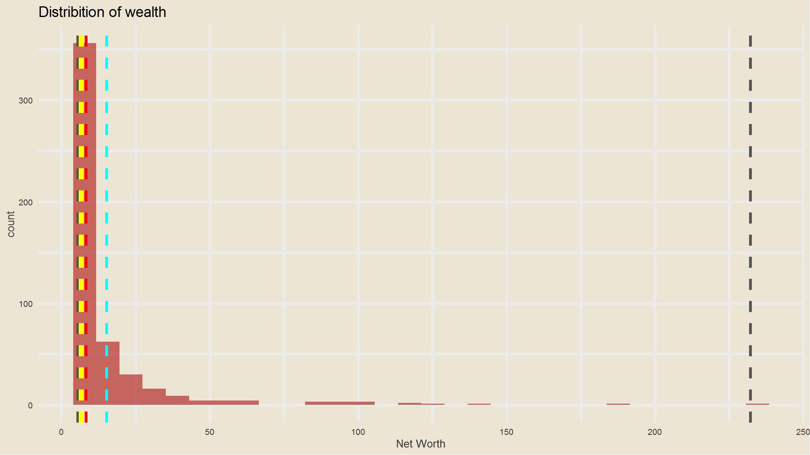
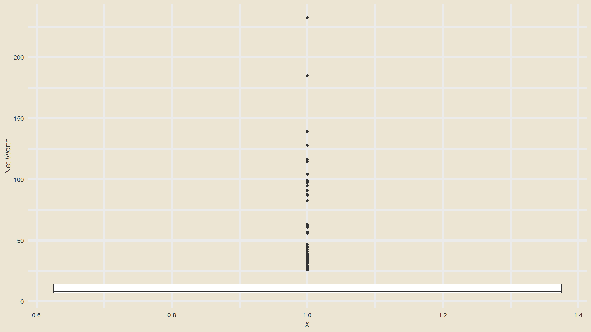
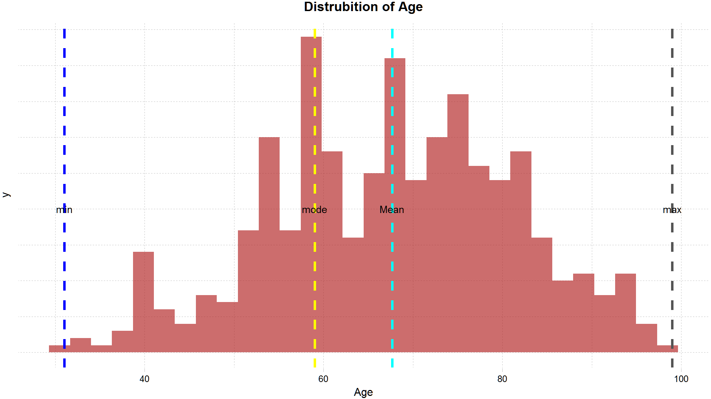
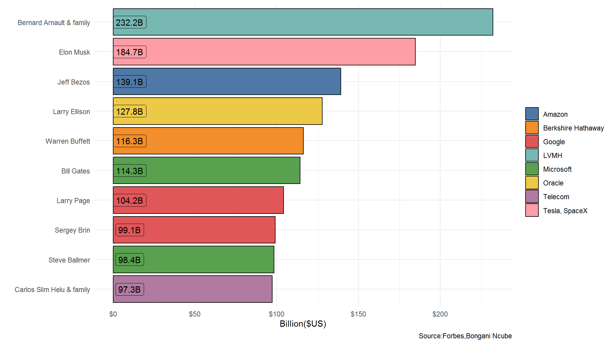
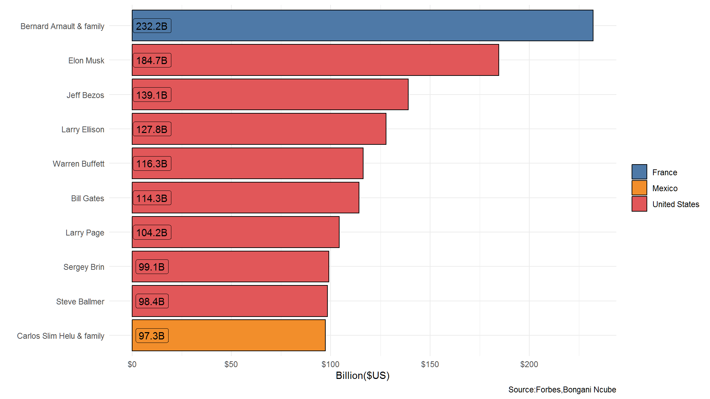
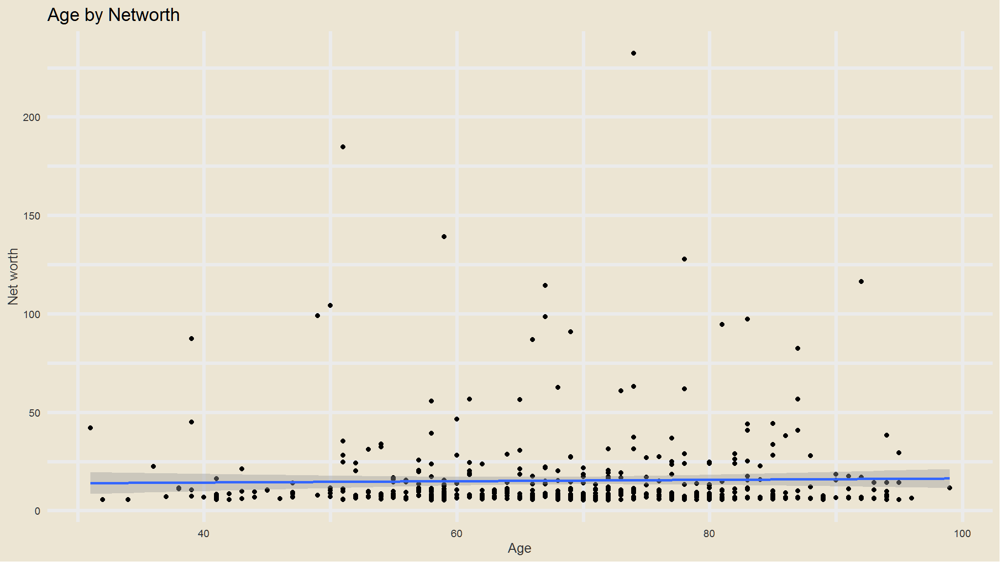
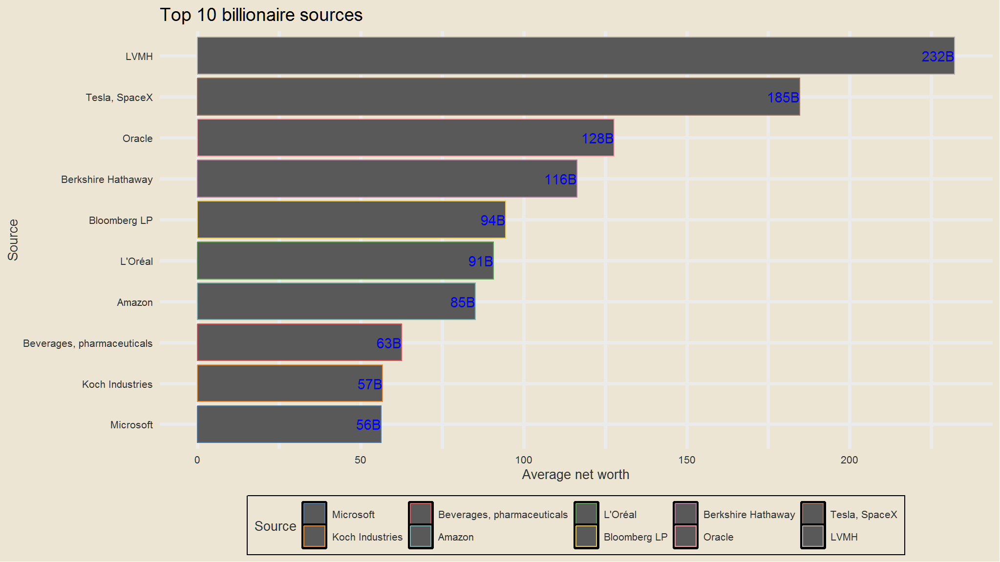
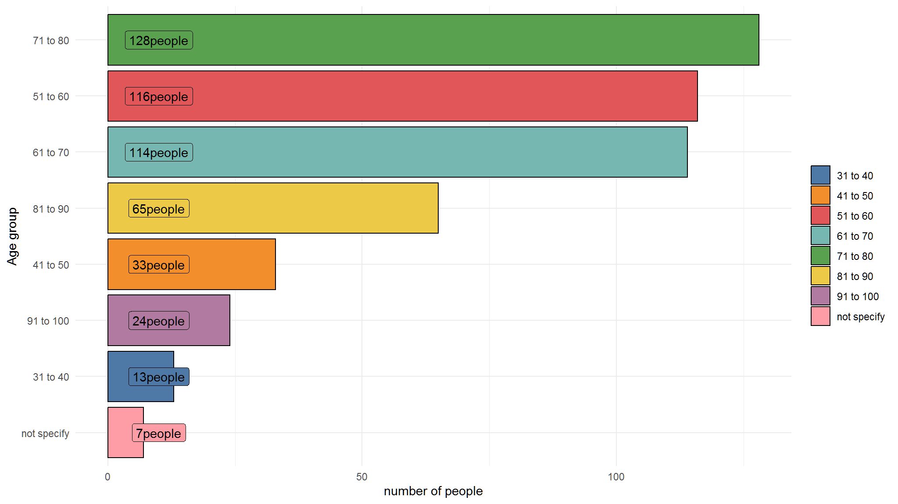
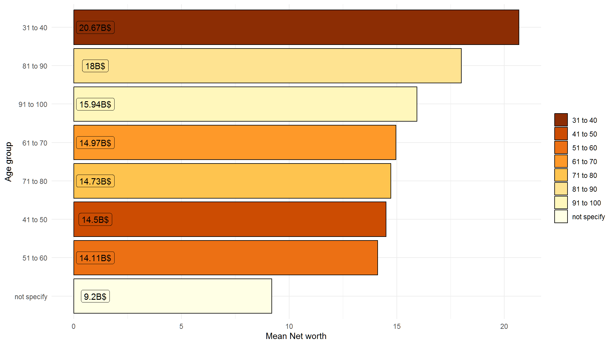

<script src="//yihui.org/js/math-code.js" defer></script>
<!-- Just one possible MathJax CDN below. You may use others. -->
<script defer
  src="//mathjax.rstudio.com/latest/MathJax.js?config=TeX-MML-AM_CHTML">
</script>

# Introduction

The presentation contains data from kaggle , it has data for people recorded as billionaires as of August ,2023.

# Setup

- read in data and load libraries

``` r
library(tidyverse)
library(tvthemes)
library(ggthemes)
library(scales)

new_data <- readxl::read_xlsx("Billionaires.xlsx")
```

## data validation

``` r
names(new_data)
#> [1] "Rank"              "Name"              "Net Worth"        
#> [4] "Change"            "Age"               "Source"           
#> [7] "Country/Territory"
```

- rank : ranking of the billionaire in the world
- Name : name of billionaire
- net worth : measure of his/her total assets
- Country/Territory : country based
- Source : Source of income
- Age : age of billionaire

``` r
sapply(new_data[1,],class)
#>              Rank              Name         Net Worth            Change 
#>         "numeric"       "character"       "character"       "character" 
#>               Age            Source Country/Territory 
#>         "numeric"       "character"       "character"
```

# data cleaning

- we need *net worth* to be numeric so we will remove the characters

``` r
(new_data<-new_data |> 
  mutate(net_worth= readr::parse_number(`Net Worth`)) |> 
  relocate(net_worth,`Net Worth`)) # removes character strings from the data
#> # A tibble: 500 x 8
#>    net_worth `Net Worth`  Rank Name      Change   Age Source `Country/Territory`
#>        <dbl> <chr>       <dbl> <chr>     <chr>  <dbl> <chr>  <chr>              
#>  1     232.  $232.2 B        1 Bernard ~  $0M ~    74 LVMH   France             
#>  2     185.  $184.7 B        2 Elon Musk  $0M ~    51 Tesla~ United States      
#>  3     139.  $139.1 B        3 Jeff Bez~  $0M ~    59 Amazon United States      
#>  4     128.  $127.8 B        4 Larry El~  $0M ~    78 Oracle United States      
#>  5     116.  $116.3 B        5 Warren B~  $0M ~    92 Berks~ United States      
#>  6     114.  $114.3 B        6 Bill Gat~  $0M ~    67 Micro~ United States      
#>  7     104.  $104.2 B        7 Larry Pa~  $0M ~    50 Google United States      
#>  8      99.1 $99.1 B         8 Sergey B~  $0M ~    49 Google United States      
#>  9      98.4 $98.4 B         9 Steve Ba~  $0M ~    67 Micro~ United States      
#> 10      97.3 $97.3 B        10 Carlos S~  $0M ~    83 Telec~ Mexico             
#> # i 490 more rows
```

- nice , we see that we removed the `dollar` and `B` characters.

## Data Exploration

- what is the distribution of wealth?

``` r
library(statip)
min_val <- min(new_data$net_worth)
max_val <- max(new_data$net_worth)
mean_val <- mean(new_data$net_worth)
med_val <- median(new_data$net_worth)
mod_val <- mfv(new_data$net_worth)

# Print the stats
glue::glue(
  'Minimum: {format(round(min_val, 2), nsmall = 2)}
   Mean: {format(round(mean_val, 2), nsmall = 2)}
   Median: {format(round(med_val, 2), nsmall = 2)}
   Mode: {format(round(mod_val, 2), nsmall = 2)}
   Maximum: {format(round(max_val, 2), nsmall = 2)}'
)
#> Minimum: 5.40
#> Mean: 15.19
#> Median: 8.30
#> Mode: 6.20
#> Maximum: 232.20
#> Minimum: 5.40
#> Mean: 15.19
#> Median: 8.30
#> Mode: 7.00
#> Maximum: 232.20


new_data |> 
  ggplot() +
  geom_histogram(aes(x = net_worth), 
                 fill = "firebrick", alpha = 0.66) +
  labs(title = "Distribition of wealth") +
  theme(plot.title = element_text(hjust = 0.5, size = 14),
        axis.title.x = element_blank(),
        axis.title.y = element_blank(),
        axis.text.y = element_blank(),
        axis.ticks.y = element_blank())+
  ggthemes::scale_fill_tableau()+
  tvthemes::theme_theLastAirbender(title.font="Slayer",text.font = "Slayer")+
  geom_vline(xintercept = min_val, color = 'gray33', linetype = "dashed", size = 1.3)+
  geom_vline(xintercept = mean_val, color = 'cyan', linetype = "dashed", size = 1.3)+
  geom_vline(xintercept = med_val, color = 'red', linetype = "dashed", size = 1.3 )+
  geom_vline(xintercept = mod_val, color = 'yellow', linetype = "dashed", size = 1.3 )+
  geom_vline(xintercept = max_val, color = 'gray33', linetype = "dashed", size = 1.3 )+
  labs(x="Net Worth")
```



- the richest person has around `$232B` Whereas most guys are around `$7B`(MODE).

``` r
new_data %>% 
  ggplot(aes(x=1, y=net_worth)) + 
  geom_boxplot() + 
  scale_fill_avatar()+
  theme_avatar()+
  labs(y="Net Worth")
```



## distribution of age

``` r
min_val <- min(new_data$Age,na.rm=TRUE)
max_val <- max(new_data$Age,na.rm=TRUE)
mean_val <- mean(new_data$Age,na.rm=TRUE)
med_val <- median(new_data$Age,na.rm=TRUE)
mod_val <- mfv(new_data$Age,na.rm=TRUE)

# Print the stats
glue::glue(
  'Minimum: {format(round(min_val, 2), nsmall = 2)}
   Mean: {format(round(mean_val, 2), nsmall = 2)}
   Median: {format(round(med_val, 2), nsmall = 2)}
   Mode: {format(round(mod_val, 2), nsmall = 2)}
   Maximum: {format(round(max_val, 2), nsmall = 2)}'
)
#> Minimum: 31.00
#> Mean: 67.69
#> Median: 68.00
#> Mode: 59.00
#> Maximum: 99.00


new_data |> 
  ggplot() +
  geom_histogram(aes(x = Age), 
                 fill = "firebrick", alpha = 0.66) +
  labs(title = "Distrubition of Age") +
  theme(plot.title = element_text(hjust = 0.5, size = 14),
        axis.title.x = element_blank(),
        axis.title.y = element_blank(),
        axis.text.y = element_blank(),
        axis.ticks.y = element_blank())+
  ggthemes::scale_fill_tableau()+
  ggthemes::theme_pander()+
  geom_vline(xintercept = min_val, color = 'blue', linetype = "dashed", size = 1.3)+
  geom_vline(xintercept = mean_val, color = 'cyan', linetype = "dashed", size = 1.3)+
  geom_vline(xintercept = mod_val, color = 'yellow', linetype = "dashed", size = 1.3 )+
  geom_vline(xintercept = max_val, color = 'gray33', linetype = "dashed", size = 1.3 )+
  annotate("text",x=min_val,y=20,label="min")+
  annotate("text",x=max_val,y=20,label="max")+
  annotate("text",x=mean_val,y=20,label="Mean")+
  annotate("text",x=mod_val,y=20,label="mode")
```



- the youngest billionaire is `31 years` of age
- the oldest is close to a `100`

## Who are the top 10 richest?

``` r
plot_data<-new_data |> 
  arrange(desc(net_worth)) |> 
  head(n=10)

ggplot(data=plot_data,
       aes(x=reorder(Name,-desc(net_worth)), y= net_worth,
           fill=Source, label=paste0(net_worth,"B"))) + 
    geom_bar(stat = "identity", colour="black") +
    coord_flip() +
    labs(x=" ", y="Billion($US)", fill=" ",caption="Source:Forbes,Bongani Ncube")  +
    theme_minimal() +
    ggthemes::scale_fill_tableau() +
    scale_y_continuous(label=dollar_format()) +
    geom_label(show_guide  = F, aes(y=10)) 
```



- from the top 10 ,2 are from Google

# which country has the most richest people

``` r
plot_data<-new_data |> 
  arrange(desc(net_worth)) |> 
  head(n=10)

ggplot(data=plot_data,
       aes(x=reorder(Name,-desc(net_worth)), y= net_worth,
           fill=`Country/Territory`, label=paste0(net_worth,"B"))) + 
    geom_bar(stat = "identity", colour="black") +
    coord_flip() +
    labs(x=" ", y="Billion($US)", fill=" ",caption="Source:Forbes,Bongani Ncube")  +
    theme_minimal() +
    ggthemes::scale_fill_tableau() +
    scale_y_continuous(label=dollar_format()) +
    geom_label(show_guide  = F, aes(y=10)) 
```



- the majority of the richest people are from the United States of America

## is there a relationship between age and wet worth?



- not really!

## what are the top 10 sources of wealth for the richest

``` r
new_data |>
  group_by(Source) |> 
  summarise(Average=mean(net_worth,na.rm=TRUE)) |> 
  arrange(desc(Average)) |> 
  head(10) |> 
  mutate(Source=fct_reorder(Source, Average)) |>
  ggplot(aes(Source, Average)) +
  geom_col(aes(color=Source)) + 
  scale_color_tableau() +
  theme_avatar()+
  labs(x="Source", 
       y="Average net worth", 
       title="Top 10 billionaire sources") + 
  coord_flip() + 
  geom_text(aes(label=paste0(round(Average), "B"), hjust=1), col="blue")
```



- still the technology industry seems to the most dominant and most fruitful

## which age groups have the most number of billionaires

``` r
out_new<-new_data |> 
  mutate(age_group = cut(Age,breaks = c(30,40,50,60,70,80,90,100),
                         labels = c("31 to 40","41 to 50","51 to 60",
                                    "61 to 70","71 to 80","81 to 90",
                                    "91 to 100")),
         age_group = if_else(is.na(age_group),"not specify",age_group))

table(out_new$age_group)
#> 
#>    31 to 40    41 to 50    51 to 60    61 to 70    71 to 80    81 to 90 
#>          13          33         116         114         128          65 
#>   91 to 100 not specify 
#>          24           7
```

- i will visualize these results

``` r
plot_data<- out_new |> 
  group_by(age_group) |> 
  summarise(n=n())

ggplot(data=plot_data,
       aes(x=reorder(age_group,-desc(n)), y= n,
           fill=age_group, label=paste0(n,"people"))) + 
    geom_bar(stat = "identity", colour="black") +
    coord_flip() +
    labs(x="Age group", y="number of people", fill=" ")  +
    theme_minimal() +
    ggthemes::scale_fill_tableau() +
    geom_label(show_guide  = F, aes(y=10)) 
```



- majority of the billionaires are in the 51 to 80 age category !

## which age groups have the highest average net worth

``` r
plot_data<- out_new |> 
  group_by(age_group) |> 
  summarise(Average=round(mean(net_worth,na.rm=T),2))

ggplot(data=plot_data,
       aes(x=reorder(age_group,-desc(Average)), y= Average,
           fill=age_group, label=paste0(Average,"B$"))) + 
    geom_bar(stat = "identity", colour="black") +
    coord_flip() +
    labs(x="Age group", y="Mean Net worth", fill=" ")  +
    theme_minimal() +
    scale_fill_brewer(palette = "YlOrBr",direction = -1) + 
    geom_label(show_guide  = F, aes(y=1))
```


