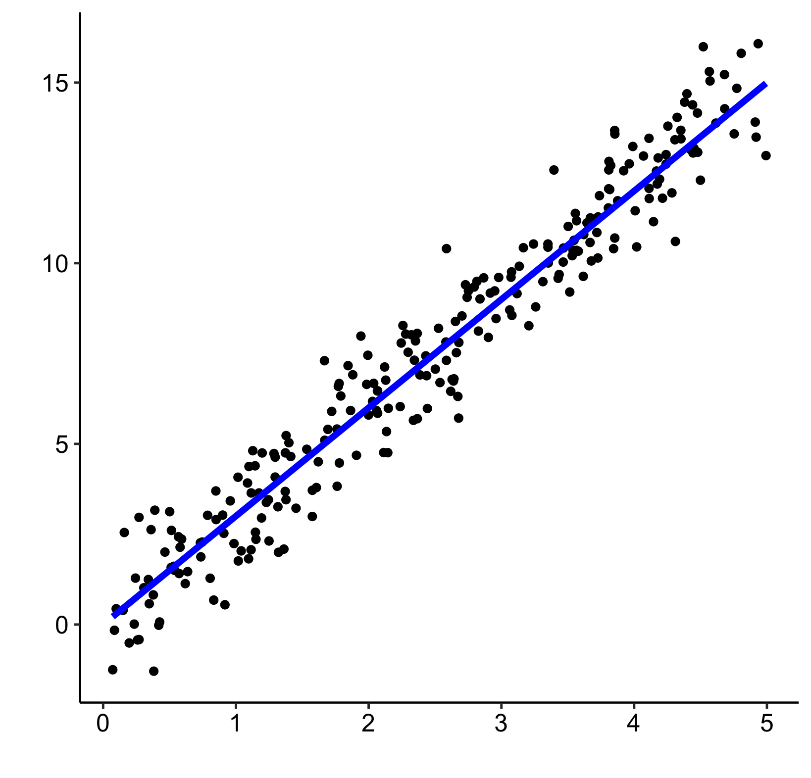

<script src="//yihui.org/js/math-code.js" defer></script>
<!-- Just one possible MathJax CDN below. You may use others. -->
<script defer
  src="//mathjax.rstudio.com/latest/MathJax.js?config=TeX-MML-AM_CHTML">
</script>

```{r setup, include = FALSE}
knitr::opts_chunk$set(cache = TRUE, 
                      echo = TRUE, 
                      message = FALSE, 
                      warning = FALSE,
                      fig.path = "static",
                      fig.height=6, 
                      fig.width = 1.777777*6,
                      fig.align='center',
                      tidy = FALSE, 
                      comment = NA, 
                      highlight = TRUE, 
                      prompt = FALSE, 
                      crop = TRUE,
                      comment = "#>",
                      collapse = TRUE)
knitr::opts_knit$set(width = 60)
library(tidyverse)
library(reshape2)
theme_set(theme_light(base_size = 16))
make_latex_decorator <- function(output, otherwise) {
  function() {
      if (knitr:::is_latex_output()) output else otherwise
  }
}
insert_pause <- make_latex_decorator(". . .", "\n")
insert_slide_break <- make_latex_decorator("----", "\n")
insert_inc_bullet <- make_latex_decorator("> *", "*")
insert_html_math <- make_latex_decorator("", "$$")
```

#

What do we mean by the linear model? Regression is the workhorse of
statistics. It allows us to model a response variable as a function of
predictors plus error. Linear regression is what most people first
encounter in statistics.linear regression relies on four
major assumptions:

1.  There is a linear relationship between response and predictor variables: $y_i = \beta_0 + \beta_1 \times x_i + \epsilon_i$;
2.  The error is normally distributed: $\epsilon_i \sim \mathcal{N}(0,\,\sigma^2)$;
3.  The variance of the error is homogeneous (homoscedastic);
4.  The errors are independent of each other;


# Introduction to Generalized Additive Models (GAMs).

```{r, eval=TRUE}
library(ggplot2, quietly = TRUE)
library(mgcv, quietly = TRUE)
```

A linear model can sometimes accommodate certain types of non-linear responses (e.g. $x^2$), but this approach strongly relies on decisions that can be either arbitrary or well-informed, and is much less flexible than using an additive model. For example, this linear model with multiple predictors can handle a non-linear response, but quickly becomes difficult to interpret and manage:

$$y_i = \beta_0 + \beta_1x_{1,i}+\beta_2x_{2,i}+\beta_3x_{3,i}+...+\beta_kx_{k,i} + \epsilon_i$$

Linear models work very well in certain specific cases where all these criteria are met:

# Good

```{r, fig.align = 'center', out.width = '70%', echo = FALSE, purl = FALSE}

```

In reality, we often cannot meet these criteria. In many cases, linear models are inappropriate:

# questionable

```{r, fig.align = 'center', out.width = '100%', echo = FALSE, purl = FALSE}
knitr::include_graphics("images/linreg_bad.png")
```


# What's next

So, how can we fit a better model? To answer this question, we must first consider what the regression  model is trying to do. The linear model is trying to fit the best __straight line__ that passes through the middle of the data, _without __overfitting___ the data, which is what would happen if we simply drew a line between each point and its neighbours. Linear models do this by finding the best fit straight line that passes through the data.

In the same way, additive models fit a curve through the data, while controlling the ___wiggliness___ of this curve to avoid overfitting. This means additive models like GAMs can capture non-linear relationships by fitting a smooth function through the data, rather than a straight line. 


#

Let us use an example to demonstrate the difference between a linear regression and an additive model.

```{r}
isit <- read.csv("ISIT.csv")
head(isit)
```
#
For now, we will be focusing on Season 2.

```{r}
isit2 <- subset(isit, Season == 2) # OR

# isit2<-isit |> filter(season==2)
  
```

Let's begin by trying to fit a linear regression model to the relationship between `Sources` and `SampleDepth`. We can use the `gam()` command from the `mgcv` package here to model an ordinary least squares regression. We will see below how to use `gam()` to specify a smoothed, non-linear term.


```{r}
# this
linear_model <- gam(Sources ~ SampleDepth, data = isit2)
summary(linear_model)
```


```{r}
# and this are the same ,both assume gaussian distribution
linear<-lm(Sources~SampleDepth,data=isit2)
summary(linear)
```


The linear model is explaining quite a bit of variance in our dataset ( $R_{adj}$ = 0.588), which means it's a pretty good model, right? Well, let's take a look at how our model fits the data:


```{r}
data_plot <- ggplot(data = isit2, aes(y = Sources, x = SampleDepth)) +
  geom_point() +
  geom_line(aes(y = fitted(linear_model)),
            colour = "red", size = 1.2) +
  theme_bw()
```


```{r}
data_plot
```


# what's happening

Are the assumptions of linear regression listed met in this case? As you may have noticed, we are violating the assumptions of the linear model:

1.  There is a strong _non-linear_ relationship between `Sources` and `SampleDepth`.
2.  The error is _not_ normally distributed.
3.  The variance of the error is _not_ homoscedastic.
4.  The errors are _not_ independent of each other.

> we could manually specify a linear model with multiple predictor variables to try to accommodate this non-linear response. For example, we could try to build this linear model with multiple predictors:

$$y_i = \beta_0 + \beta_1(x_{1,i}) + \beta_2(x_{2,i}) + ... + \epsilon$$

# Why GAMs

the fit of the above model would be determined manually based on the modeller's decisions, and would quickly become difficult to work with. One big advantage of using an additive model, such as a GAM,  is that the fitting method (usually maximum likelihood) automatically determines the optimal shape of the curve fit for non-linear responses. This optimal shape is, in other words,  *the degree of smoothness* of $f(x)$.


###
Briefly, GAMs are effectively a nonparametric form of regression where the $\beta x_i$ of a linear regression is replaced by a smooth function of the explanatory variables, $f(x_i)$, and the model becomes:

$$y_i = f(x_i) + \epsilon_i$$
where $y_i$ is the response variable, $x_i$ is the predictor variable, and $f$ is the smooth function.

#
Importantly, given that the smooth function $f(x_i)$ is non-linear and
local, the magnitude of the effect of the explanatory variable can vary
over its range, depending on the relationship between the variable and
the response.

That is, as opposed to one fixed coefficient $\beta$, the function $f$ can continually change over the range of $x_i$.
The degree of smoothness (or wiggliness) of $f$ is controlled using penalized regression determined automatically in `mgcv` using a generalized cross-validation (GCV) routine

We can try to build a more appropriate model by fitting the data with a smoothed (non-linear) term. In `mgcv::gam()`, smooth terms are specified by expressions of the form `s(x)`, where $x$ is the non-linear predictor variable we want to smooth. In this case, we want to apply a smooth function to `SampleDepth`.

#
```{r}
gam_model <- gam(Sources ~ s(SampleDepth), data = isit2)
summary(gam_model)
```

The variance explained by our model has increased  ($R_{adj}$ = 0.81)! When we compare the fit of the linear (red) and non-linear (blue) models, it is clear that the latter is more appropriate for our dataset:

# visually compare the models


```{r}
data_plot <- data_plot +
     geom_line(aes(y = fitted(gam_model)),
               colour = "blue", size = 1.2)
```


```{r}
data_plot
```


# Generalized linear models

## When are linear models a poor choice

+ The response is a proportion, ranging between 0 and 1 inclusive, of a
total number of counts. As the modelled proportion approaches these
boundaries of 0 and 1, the variance of the responses must approach zero.
The variance must be smaller near 0 and 1 than the variation of proportions near 0.5 (where the observations can spread equally in both
directions toward the boundaries). Thus, the variance is not, and can-
not be, constant. Furthermore, because the response is between 0 and 1,
the randomness cannot be normally distributed. For proportions of a
total number of counts, the binomial distribution may be appropriate.

+ The response is a count. As the modelled count approaches zero, the
variance of the responses must approach zero. Furthermore, the normal
distribution is a poor choice for modelling the randomness because counts
are discrete and non-negative. For count data, the Poisson distribution
may be appropriate .

#

+ The response is positive continuous. As the modelled response approaches
zero, the variance of the responses must approach zero. Furthermore,
the normal distribution is a poor choice because positive continuous
data are often right skewed, and because the normal distribution per-
mits negative values. For positive continuous data, distributions such
as the gamma and inverse Gaussian distributions may be appropriate.

#

"Generalized" linear model (GLIM or GLM) refer to a larger class of models popularized by McCullagh and Nelder (1982).

These models come in handy because the response variable $y$ can follow an exponential family distribution with mean $\mu$, which is assumed to follow a (often) nonlinear function. 

In GLM, we need to specify:

+ **a statistical distribution for the residuals of the model**
+ **a link function** for the predicted valued of the model.

For a linear regression with a continuous response variable distributed normally, the predicted values of Y is explained by this equation :

$\mu = \beta x$

where:\
- $\mu$ is the predicted value of the response variable\
- $x$ is the model matrix (*i.e.* predictor variables)\
- $\beta$ is the estimated parameters from the data (*i.e.*
intercept and slope). $\beta x$ is called the **linear predictor**. In math terms, it is the matrix product of the model's matrix $x$ and the vector of the estimated parameters $\beta$. 

# link Functions

For a linear regression with a continuous response variable distributed normally, the linear predictor $\beta x$ is equivalent to the expected values of the response variable. *When the response varaible is not normally distributed, this statement is not true*. I nthis situation, we need to transform the predicted values $\mu$ with a **link function** to obtain a linear relationship with the linear predictor:

$$g(\mu_i) = \rho_i$$

# count data

Count data is characterized by:

- Positive values: you do not count -7 individuals
- Integer values: you do not count 7.56 individuals
- Exhibits larger variance for large values

To illustrate count data we will use a new dataset called `faramea`.

```{r, echo = TRUE, eval = TRUE}
# Load the dataset
faramea <- read.csv("faramea.csv", header = TRUE)
```

In this dataset, the number of trees of the species *Faramea occidentalis* was measured in 43 quadrants in Barro Colorado Island in Panama. For each quadrant, environmental characteristics were also recorded such as elevation or precipitation. Let us take a look at the number of *Faramea occidentalis* found at each quadrant.

#
```{r, echo = TRUE, eval = TRUE, fig.width = 7, fig.height = 4, fig.align = "center"}
# Histogram of F. occidentalis count data
hist(faramea$Faramea.occidentalis, breaks=seq(0,45,1), xlab=expression(paste("Number of ",
italic(Faramea~occidentalis))), ylab="Frequency", main="", col="grey")
```

#
We can see that there are only positive and integer values.

In this example, we want to test whether elevation (a continuous
explanatory variable) influences *Faramea occidentalis* abundance.

#
```{r, echo=F,fig.height=4.0}
plot(faramea$Elevation, faramea$Faramea.occidentalis, ylab = 'F. occidentalis individuals', xlab = 'Elevation(m)')
```

#
Hence, a Poisson GLM (i.e. a simple Poisson regression) seems to be a good choice to model the number of *Faramea occidentalis* as a function of elevation. Poisson GLMs are usually a good way to start modeling count data.

# Poisson GLMs

## The Poisson distribution

The Poisson distribution specifies the probability of a
discrete random variable $Y$ and is given by:


$$f(y, \,\mu)\, =\, Pr(Y = y)\, =\, \frac{\mu^y \times exp{-\mu}}{y!}$$

$$E(Y)\, =\, Var(Y)\, =\, \mu$$

where $\mu$ is the parameter of the Poisson distribution

The Poisson distribution is particularly relevant to model count data because it:

-   specifies the probability only for integer values
-   $P(y \leq 0) = 0$, hence the probability of any negative value is null
-   $Var(Y) = \mu$ (the mean-variance relationship) allows for heterogeneity (e.g. when
    variance generally increases with the mean)

A Poisson GLM will model the value of $\mu$ as a function of different explanatory variables:

# **Step 1.**

We assume $Y_i$ follows a Poisson distribution with mean and variance $\mu_i$.

$$Y_i \sim Poisson(\mu_i)$$

$$E(Y_i) = Var(Y_i) = \mu_i$$

$$f(y_i, \, \mu_i) = \frac{\mu^{y_i}_i \times e^{-\mu_i}}{y!}$$

$\mu_i$ corresponds to the expected number of individuals.

# **Step 2.**

We specify the linear predictor of the model just as in a linear model.

$$\underbrace{\alpha}_\text{Intercept} + \underbrace{\beta_1}_\text{slope of 'Elevation'} \times \text{Elevation}_i$$

# **Step 3.**

The link between the mean of $Y_i$ and linear predictor is a logarithmic function can be written as:

$$log(\mu_i) = \alpha + \beta_1 \times \text{Elevation}_i $$

It can also be written as:

$$\mu_i = e^{ \alpha + \beta \times \text{Elevation}_i}$$

This shows that the impact of each explanatory variable is multiplicative.
Increasing Elevation by one increases $\mu$ by factor of exp( $\beta_\text{Elevation}$ ).

# We can also write it as:

$$\mu_i = e^{\alpha} \times e^{\beta_1^{\text{Elevation}_i}}$$

If $\beta_j = 0$ then $exp(\beta_j) = 1$ and $\mu$ is not related to $x_j$. If $\beta_j > 0$ then $\mu$ increases if $x_j$ increases; if $\beta_j < 0$ then $\mu$ decreases if $x_j$ increases.

# Poisson GLMs in `R`

Fitting a Poisson GLM in R requires only setting `family = poisson` in
the `glm()` function. By default the link function is log.

```{r, echo = TRUE, eval = TRUE}
# Fit a Poisson GLM
glm.poisson = glm(Faramea.occidentalis ~ Elevation,
  data = faramea,
  family = poisson) # this is what makes it a Poisson GLM! Note the default link is log.
summary(glm.poisson)
```

# mixed models? 

Biological and ecological data are often messy. Most of the time there is an inherent structure to data (i.e. single observations are not always independent), relationships between variables of interest might differ depending on grouping factors like species, and more often than not sample sizes are low, making it difficult to fit models that require many parameters to be estimated. 

Linear mixed effects models (LMM) were developed to deal with these issues. They can be applied to a great number of ecological questions and take many different forms. 

```{r, echo = TRUE, eval = TRUE}
# Load the dataset
fish.data <- read.csv('qcbs_w7_data.csv', stringsAsFactors = TRUE) 
# This line will vary depending on where your data is saved. 

# Simple theme for all ggplot figures we produce after this
fig <- theme_bw() + 
  theme(panel.grid.minor=element_blank(), 
        panel.grid.major=element_blank(), 
        panel.background=element_blank(), 
        strip.background=element_blank(), 
        strip.text.y = element_text(),
        legend.background=element_blank(),
        legend.key=element_blank(),
        panel.border = element_rect(colour="black", fill = NA))

```

# Exploring the data graphically!

```{r}
library(patchwork)
# Basic plot aesthetics for the relationship we care about
plot <- ggplot(aes(Fish_Length, Trophic_Pos), data = fish.data)

# Plot 1 - All data
p1<-plot + geom_point() + 
  labs(x = "Length (mm)", y = "Trophic Position", 
       title = "All Data") + 
  fig

# Plot 2 - By species
p2<-plot + geom_point() + 
  facet_wrap(~ Fish_Species) + 
  labs(x = "Length (mm)", y = "Trophic Position", 
       title = "By Species") + 
  fig

# Plot 3 – By lake
p3<-plot + geom_point() + 
  facet_wrap(~ Lake) + 
  labs(x = "Length (mm)", y = "Trophic Position", 
       title = "By Lake") + 
  fig
```

# graphs

```{r}
(p1|p2)/p3
```

# Fixed vs. random effects 

We frequently encounter the terms 'fixed' and 'random' effects in the LMM literature.

There are also many possible definitions, and we chose to present those we think are easier to apply when doing your analyses.

## Fixed effects: deterministic processes 

Data comes from: 

- all possible levels of a factor (**qualitative variable**)
- a predictor (**quantitative variable**)

We wish to make conclusions about the levels of the factor or about the relationship between the response variable and the predictor.

# Random effects: stochastic processes 

Variables with a random effect are also called random factors, as they are only **qualitative variables** (categorical, not continuous). 

A random effect is observed when the data only includes a random sample of the factor's many possible levels, which are all of interest. 

They usually are grouping factors for which you want to control the effect in your model, but are not interested in their specific effect on the response variable. Therefore they enable us to structure the error process.

# How do LMMs work?

## Parameters are varied

In linear mixed models, intercepts and/or slopes are allowed to vary according to a given factor (random effect; e.g. by lake and/or species).

Allowing intercepts and/or slopes to vary by random effects means that you assume they come from a normal distribution. A mean and standard deviation of that distribution are estimated based on your data. The most likely intercepts and slopes from that distribution are then fit by optimization (ex. maximum likelihood or restricted maximum likelihood).

# Intercepts:

If we consider species as a random effect first, we can estimate a mean and standard deviation for the combined distribution of species intercepts rather than separate intercepts for each species. The mean of this distribution is the 'species level model'. 

In this example, we only have three species. In general, the more levels you have for a given factor, the more accurately the parameters of the distribution can be estimated (three may be a little low for estimating a mean and standard deviation but it makes simpler graphs!). *Note that when you implement LMM's in `R`, the intercept in the summary is the species level intercept (i.e. the mean of all random intercepts).*

# Do you need a LMM?

**Determine if you need a mixed model** 

To find out if a mixed model is needed for your data, you need to determine whether it is important to consider the random effects that might influence the relationship you are interested in (in our case, lake and species).

We can do this by:

- 1. Creating a linear model without random effect
- 2. Calculating the residuals of this linear model
- 3. Plot the residuals against the levels of the potential random factors


# **Translate this model...**

$$TP_{ijk} \sim Length_i + Lake_j + Species_k + \epsilon_{ijk}$$

**... into R code**

```{r, echo = TRUE, eval = FALSE}
library(lme4)
lmer(Z_TP ~ Z_Length + (1 | Lake) + (1 | Fish_Species),
     data = fish.data, REML = TRUE)
```

Where: 

- `lmer` -> "linear mixed model" function from `lme4` package
- `(1 | Lake)` -> indicate varying intercepts among lakes
- `REML = TRUE` -> estimation method


