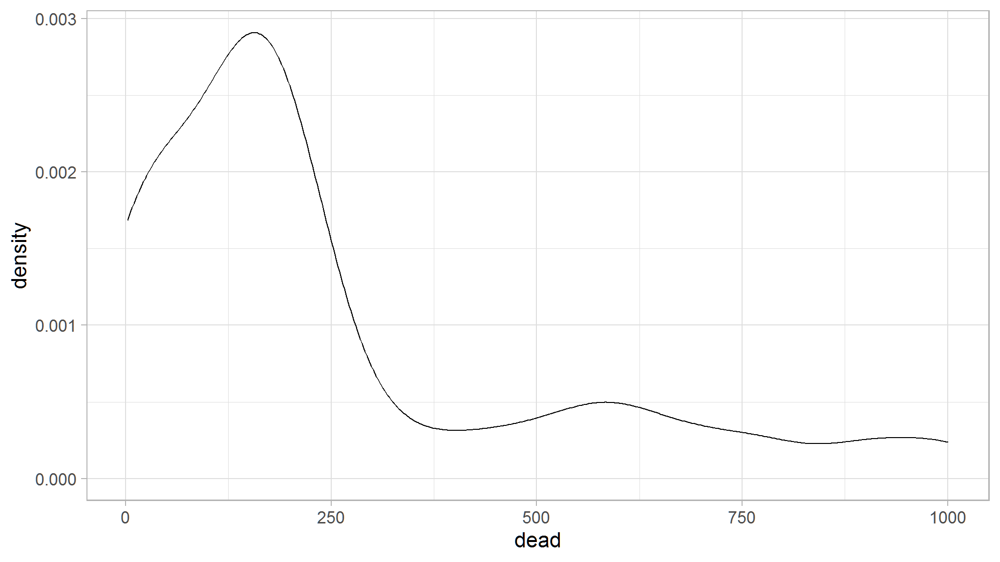

<script src="//yihui.org/js/math-code.js" defer></script>
<!-- Just one possible MathJax CDN below. You may use others. -->
<script defer
  src="//mathjax.rstudio.com/latest/MathJax.js?config=TeX-MML-AM_CHTML">
</script>


# Multinomial

If we have more than two categories or groups that we want to model relative to covariates (e.g., we have observations `\(i = 1,\cdots,n\)` and groups covariates `\(j = 1,\cdots,J\)`), multinomial is our candidate model

Let

-   `\(p_{ij}\)` be the probability that the i-th observation belongs to the j-th group
-   `\(Y_{ij}\)` be the number of observations for individual i in group j; An individual will have observations `\(Y_{i1},Y_{i2},…Y_{iJ}\)`
-   assume the probability of observing this response is given by a multinomial distribution in terms of probabilities `\(p_{ij}\)`, where `\(\sum_{j = 1}^J p_{ij} = 1\)` . For interpretation, we have a baseline category `\(p_{i1} = 1 - \sum_{j = 2}^J p_{ij}\)`

#
The link between the mean response (probability) `\(p_{ij}\)` and a linear function of the covariates

$$
\eta_{ij} = \mathbf{x'_i \beta_j} = \log \frac{p_{ij}}{p_{i1}}, j = 2,..,J
$$

We compare `\(p_{ij}\)` to the baseline `\(p_{i1}\)`, suggesting

$$
p_{ij} = \frac{\exp(\eta_{ij})}{1 + \sum_{i=2}^J \exp(\eta_{ij})}
$$

which is known as **multinomial logistic** model.

# Note:

-   Softmax coding for multinomial logistic regression: rather than selecting a baseline class, we treat all K class symmetrically - equally important (no baseline).

$$
P(Y = k | X = x) = \frac{exp(\beta_{k1} + \dots + \beta_{k_p x_p})}{\sum_{l = 1}^K exp(\beta_{l0} + \dots + \beta_{l_p x_p})}
$$
then the log odds ratio between `\(k-th\)` and `\(k^{t}th\)` classes is

$$
\log (\frac{P(Y=k|X=x)}{P(Y = k' | X=x)}) = (\beta_{k0} - \beta_{k'0}) + \dots + (\beta_{kp} - \beta_{k'p}) x_p
$$

# Poisson GLMs

### The Poisson distribution

The Poisson distribution specifies the probability of a
discrete random variable `\(Y\)` and is given by:


`$$f(y, \,\mu)\, =\, Pr(Y = y)\, =\, \frac{\mu^y \times e^{-\mu}}{y!}$$`

`$$E(Y)\, =\, Var(Y)\, =\, \mu$$`

#
where `\(\mu\)` is the parameter of the Poisson distribution

The Poisson distribution is particularly relevant to model count data because it:

-   specifies the probability only for integer values
-   `\(P(y<0) = 0\)`, hence the probability of any negative value is null
-   `\(Var(Y) = \mu\)` (the mean-variance relationship) allows for heterogeneity (e.g. when
    variance generally increases with the mean)

A Poisson GLM will model the value of `\(\mu\)` as a function of different explanatory variables:

# **Step 1.**

We assume `\(Y_i\)` follows a Poisson distribution with mean and variance `\(\mu_i\)`.

`$$Y_i \sim Poisson(\mu_i)$$`

`$$E(Y_i) = Var(Y_i) = \mu_i$$`

`$$f(y_i, \, \mu_i) = \frac{\mu^{y_i}_i \times e^{-\mu_i}}{y!}$$`

`\(\mu_i\)` corresponds to the expected number of individuals.

# **Step 2.**

We specify the linear predictor of the model just as in a linear model.

`$$\underbrace{\alpha}_\text{Intercept} + \underbrace{\beta_1}_\text{slope of 'variable'} \times \text{variable}_i$$`

# **Step 3.**

The link between the mean of `\(Y_i\)` and linear predictor is a logarithmic function can be written as:

$$log(\mu_i) = \alpha + \beta_1 \times \text{variable}_i $$

It can also be written as:

`$$\mu_i = e^{ \alpha + \beta \times \text{variable}_i}$$`

This shows that the impact of each explanatory variable is multiplicative.
Increasing variable by one increases `\(\mu\)` by factor of exp( `\(\beta_\text{variable}\)` ).

We can also write it as:

`$$\mu_i = e^{\alpha} \times e^{\beta_1^{\text{variable}_i}}$$`

If `\(\beta_j = 0\)` then `\(exp(\beta_j) = 1\)` and `\(\mu\)` is not related to `\(x_j\)`. If `\(\beta_j > 0\)` then `\(\mu\)` increases if `\(x_j\)` increases; if `\(\beta_j < 0\)` then `\(\mu\)` decreases if `\(x_j\)` increases.

# setup

```r
df<-readxl::read_xlsx("multinomial.xlsx")
df<-df |> 
  separate(`y,party,race,gender`,into=c("y","party","race","gender"),",") |> 
  mutate_if(is.character,as.factor) |> 
  mutate(y=as.numeric(y)) |> 
  rename(income="y")
df
#> # A tibble: 12 x 4
#>    income party       race  gender
#>     <dbl> <fct>       <fct> <fct> 
#>  1      5 Democrat    White Male  
#>  2      8 Republican  White Male  
#>  3      2 Independent White Male  
#>  4     10 Democrat    Black Male  
#>  5     12 Republican  Black Male  
#>  6      1 Independent Black Male  
#>  7      7 Democrat    White Female
#>  8      3 Republican  White Female
#>  9      4 Independent White Female
#> 10     11 Democrat    Black Female
#> 11      9 Republican  Black Female
#> 12      6 Independent Black Female

write_csv(df,"multinom.csv")
```

#

```r
summary(df)
#>      income              party      race      gender 
#>  Min.   : 1.00   Democrat   :4   Black:6   Female:6  
#>  1st Qu.: 3.75   Independent:4   White:6   Male  :6  
#>  Median : 6.50   Republican :4                       
#>  Mean   : 6.50                                       
#>  3rd Qu.: 9.25                                       
#>  Max.   :12.00
```
#

```r
table(df$party,df$race)
#>              
#>               Black White
#>   Democrat        2     2
#>   Independent     2     2
#>   Republican      2     2
```

# model with all variables


```r
model<-nnet::multinom(party~.,data=df)
#> # weights:  15 (8 variable)
#> initial  value 13.183347 
#> iter  10 value 8.524672
#> iter  20 value 8.227196
#> iter  30 value 8.224114
#> iter  40 value 8.223844
#> iter  50 value 8.223812
#> final  value 8.223811 
#> converged
model
#> Call:
#> nnet::multinom(formula = party ~ ., data = df)
#> 
#> Coefficients:
#>             (Intercept)     income  raceWhite  genderMale
#> Independent    12.33053 -1.5500393 -6.0737795 -0.07011659
#> Republican      1.12294 -0.1137472 -0.5209413  0.12415647
#> 
#> Residual Deviance: 16.44762 
#> AIC: 32.44762
```

#

```r
summary(model)
#> Call:
#> nnet::multinom(formula = party ~ ., data = df)
#> 
#> Coefficients:
#>             (Intercept)     income  raceWhite  genderMale
#> Independent    12.33053 -1.5500393 -6.0737795 -0.07011659
#> Republican      1.12294 -0.1137472 -0.5209413  0.12415647
#> 
#> Std. Errors:
#>             (Intercept)    income raceWhite genderMale
#> Independent    8.023601 0.9713783  4.955594   2.783173
#> Republican     4.891305 0.4793859  2.613579   1.510782
#> 
#> Residual Deviance: 16.44762 
#> AIC: 32.44762
```

#

`$$\log(\frac{\pi_I}{\pi_D})=12.33053-1.55income-6.07377raceWhite-0.07011659genderMale$$`
`$$\log(\frac{\pi_R}{\pi_D})=1.12294-0.113income-0.52094raceWhite-0.124genderMale$$`

```r
p1<-exp(2.181+11.67-0.096*5000)/(1+exp(2.181+11.67-0.096*5000)+exp(1.58+6.55-0.053*5000))
p1
#> [1] 3.581472e-203
```


```r
p2<-exp(1.58+6.55-0.053*5000)/(1+exp(2.181+11.67-0.096*5000)+exp(2.181+11.67-0.096*5000))
p2
#> [1] 2.771893e-112
```


```r
1-p1-p2
#> [1] 1
```

#

```r
odds<-exp(1.12294-0.1137472*400)
odds
#> [1] 5.342864e-20
```


# NULL MODEL

```r
mod_null<-nnet::multinom(party~1,data=df)
#> # weights:  6 (2 variable)
#> initial  value 13.183347 
#> final  value 13.183347 
#> converged
mod_null
#> Call:
#> nnet::multinom(formula = party ~ 1, data = df)
#> 
#> Coefficients:
#>              (Intercept)
#> Independent 4.440892e-16
#> Republican  4.440892e-16
#> 
#> Residual Deviance: 26.36669 
#> AIC: 30.36669
```

# model with gender

```r
(model_gend<-nnet::multinom(party~gender,data=df))
#> # weights:  9 (4 variable)
#> initial  value 13.183347 
#> final  value 13.183347 
#> converged
#> Call:
#> nnet::multinom(formula = party ~ gender, data = df)
#> 
#> Coefficients:
#>              (Intercept)   genderMale
#> Independent 4.440892e-16 2.220446e-16
#> Republican  4.440892e-16 2.220446e-16
#> 
#> Residual Deviance: 26.36669 
#> AIC: 34.36669
```

# compare the models

```r
anova(mod_null,model_gend,test="Chisq")
#>    Model Resid. df Resid. Dev   Test    Df LR stat. Pr(Chi)
#> 1      1        22   26.36669           NA       NA      NA
#> 2 gender        20   26.36669 1 vs 2     2        0       1
```

# model with race

```r
(model_race<-nnet::multinom(party~race,data=df))
#> # weights:  9 (4 variable)
#> initial  value 13.183347 
#> final  value 13.183347 
#> converged
#> Call:
#> nnet::multinom(formula = party ~ race, data = df)
#> 
#> Coefficients:
#>              (Intercept)    raceWhite
#> Independent 4.440892e-16 2.220446e-16
#> Republican  4.440892e-16 2.220446e-16
#> 
#> Residual Deviance: 26.36669 
#> AIC: 34.36669
```

# cmpare race model to null model

```r
anova(mod_null,model_race,test="Chisq")
#>   Model Resid. df Resid. Dev   Test    Df LR stat. Pr(Chi)
#> 1     1        22   26.36669           NA       NA      NA
#> 2  race        20   26.36669 1 vs 2     2        0       1
```

# model with income

```r
(model_inc<-nnet::multinom(party~income,data=df))
#> # weights:  9 (4 variable)
#> initial  value 13.183347 
#> iter  10 value 9.866125
#> final  value 9.865368 
#> converged
#> Call:
#> nnet::multinom(formula = party ~ income, data = df)
#> 
#> Coefficients:
#>             (Intercept)      income
#> Independent   3.8280816 -0.69719923
#> Republican    0.2589209 -0.03185745
#> 
#> Residual Deviance: 19.73074 
#> AIC: 27.73074
```

# compare income model to null model

```r
anova(mod_null,model_inc,test="Chisq")
#>    Model Resid. df Resid. Dev   Test    Df LR stat.    Pr(Chi)
#> 1      1        22   26.36669           NA       NA         NA
#> 2 income        20   19.73074 1 vs 2     2 6.635959 0.03622595
```

# model with race and income

```r
(model_inc_race<-nnet::multinom(party~income+race,data=df))
#> # weights:  12 (6 variable)
#> initial  value 13.183347 
#> iter  10 value 8.499512
#> iter  20 value 8.244097
#> iter  30 value 8.229818
#> iter  40 value 8.228592
#> iter  50 value 8.228569
#> final  value 8.228567 
#> converged
#> Call:
#> nnet::multinom(formula = party ~ income + race, data = df)
#> 
#> Coefficients:
#>             (Intercept)     income  raceWhite
#> Independent   12.312994 -1.5477287 -6.0862942
#> Republican     1.050129 -0.1008768 -0.4603361
#> 
#> Residual Deviance: 16.45713 
#> AIC: 28.45713
```

# compare models

```r
anova(model_inc_race,model_inc,test="Chisq")
#>           Model Resid. df Resid. Dev   Test    Df LR stat.   Pr(Chi)
#> 1        income        20   19.73074           NA       NA        NA
#> 2 income + race        18   16.45713 1 vs 2     2 3.273602 0.1946016
```

# check using chi square distribution

```r
chisq.test(table(df$party,df$race))
#> 
#> 	Pearson's Chi-squared test
#> 
#> data:  table(df$party, df$race)
#> X-squared = 0, df = 2, p-value = 1
```

# poisson dataset


```r
df<-read.table("canada.txt",sep="",header=TRUE) |> 
  mutate_if(is.character,as.factor) |> 
  as_tibble()
df
#> # A tibble: 36 x 5
#>       id age   smoke           pop  dead
#>    <int> <fct> <fct>         <int> <int>
#>  1     1 40-44 no              656    18
#>  2     2 45-59 no              359    22
#>  3     3 50-54 no              249    19
#>  4     4 55-59 no              632    55
#>  5     5 60-64 no             1067   117
#>  6     6 65-69 no              897   170
#>  7     7 70-74 no              668   179
#>  8     8 75-79 no              361   120
#>  9     9 80+   no              274   120
#> 10    10 40-44 cigarPipeOnly   145     2
#> # i 26 more rows
```

#

```r
ggplot(df,aes(x=dead))+
  geom_density()
```



# model with all variables

```r
model<-glm(dead~age+smoke+pop,data=df,family = poisson)
model
#> 
#> Call:  glm(formula = dead ~ age + smoke + pop, family = poisson, data = df)
#> 
#> Coefficients:
#>         (Intercept)             age45-59             age50-54  
#>           2.7717494            0.6242419            1.0038164  
#>            age55-59             age60-64             age65-69  
#>           1.3818228            1.5011996            2.1365714  
#>            age70-74             age75-79               age80+  
#>           2.3556629            2.2041331            1.9506334  
#> smokecigarretteOnly  smokecigarrettePlus              smokeno  
#>           0.5704051            0.2915664           -0.2113845  
#>                 pop  
#>           0.0004172  
#> 
#> Degrees of Freedom: 35 Total (i.e. Null);  23 Residual
#> Null Deviance:	    8434 
#> Residual Deviance: 584.9 	AIC: 850.9
```

#

```r
extract_eq(model,terms_per_line = 2,wrap=TRUE,use_coefs = TRUE, greek_colors = "blue")
```
$$
`\begin{aligned}
\log ({ \widehat{E( \operatorname{dead} )} })  &= 2.77 + 0.62(\operatorname{age}_{\operatorname{45-59}})\ + \\
&\quad 1(\operatorname{age}_{\operatorname{50-54}}) + 1.38(\operatorname{age}_{\operatorname{55-59}})\ + \\
&\quad 1.5(\operatorname{age}_{\operatorname{60-64}}) + 2.14(\operatorname{age}_{\operatorname{65-69}})\ + \\
&\quad 2.36(\operatorname{age}_{\operatorname{70-74}}) + 2.2(\operatorname{age}_{\operatorname{75-79}})\ + \\
&\quad 1.95(\operatorname{age}_{\operatorname{80+}}) + 0.57(\operatorname{smoke}_{\operatorname{cigarretteOnly}})\ + \\
&\quad 0.29(\operatorname{smoke}_{\operatorname{cigarrettePlus}}) - 0.21(\operatorname{smoke}_{\operatorname{no}})\ + \\
&\quad 0(\operatorname{pop})
\end{aligned}`
$$

# model_null

```r
mod1<-glm(dead~1,data=df,family = poisson)
```
# model with age

```r
mod2<-glm(dead~age,data=df,family = poisson)
```

# COMPARE THE MODELS

```r
anova(mod1,mod2,test="LRT")
#> Analysis of Deviance Table
#> 
#> Model 1: dead ~ 1
#> Model 2: dead ~ age
#>   Resid. Df Resid. Dev Df Deviance  Pr(>Chi)    
#> 1        35     8434.4                          
#> 2        27     4845.0  8   3589.4 < 2.2e-16 ***
#> ---
#> Signif. codes:  0 '***' 0.001 '**' 0.01 '*' 0.05 '.' 0.1 ' ' 1
```

# model with population

```r
mod3<-glm(dead~pop,data=df,family = poisson)
```

# COMPARE NULL TO POPULATION MODEL

```r
anova(mod1,mod3,test="LRT")
#> Analysis of Deviance Table
#> 
#> Model 1: dead ~ 1
#> Model 2: dead ~ pop
#>   Resid. Df Resid. Dev Df Deviance  Pr(>Chi)    
#> 1        35     8434.4                          
#> 2        34     4270.2  1   4164.2 < 2.2e-16 ***
#> ---
#> Signif. codes:  0 '***' 0.001 '**' 0.01 '*' 0.05 '.' 0.1 ' ' 1
```

# model with smoking

```r
mod4<-glm(dead~smoke,data=df,family = poisson)
```

# COMPARE SMOKING MODEL TO NULL MODEL

```r
anova(mod1,mod4,test="LRT")
#> Analysis of Deviance Table
#> 
#> Model 1: dead ~ 1
#> Model 2: dead ~ smoke
#>   Resid. Df Resid. Dev Df Deviance  Pr(>Chi)    
#> 1        35     8434.4                          
#> 2        32     4850.4  3   3584.1 < 2.2e-16 ***
#> ---
#> Signif. codes:  0 '***' 0.001 '**' 0.01 '*' 0.05 '.' 0.1 ' ' 1
```

# REPORT BEST MODEL

```r
report::report(model)
#> We fitted a poisson model (estimated using ML) to predict dead with age, smoke
#> and pop (formula: dead ~ age + smoke + pop). The model's explanatory power is
#> substantial (Nagelkerke's R2 = 1.00). The model's intercept, corresponding to
#> age = 40-44, smoke = cigarPipeOnly and pop = 0, is at 2.77 (95% CI [2.62,
#> 2.92], p < .001). Within this model:
#> 
#>   - The effect of age [45-59] is statistically significant and positive (beta =
#> 0.62, 95% CI [0.46, 0.79], p < .001; Std. beta = 0.62, 95% CI [0.46, 0.79])
#>   - The effect of age [50-54] is statistically significant and positive (beta =
#> 1.00, 95% CI [0.84, 1.16], p < .001; Std. beta = 1.00, 95% CI [0.84, 1.16])
#>   - The effect of age [55-59] is statistically significant and positive (beta =
#> 1.38, 95% CI [1.26, 1.51], p < .001; Std. beta = 1.38, 95% CI [1.26, 1.51])
#>   - The effect of age [60-64] is statistically significant and positive (beta =
#> 1.50, 95% CI [1.38, 1.63], p < .001; Std. beta = 1.50, 95% CI [1.38, 1.63])
#>   - The effect of age [65-69] is statistically significant and positive (beta =
#> 2.14, 95% CI [2.01, 2.26], p < .001; Std. beta = 2.14, 95% CI [2.01, 2.26])
#>   - The effect of age [70-74] is statistically significant and positive (beta =
#> 2.36, 95% CI [2.22, 2.50], p < .001; Std. beta = 2.36, 95% CI [2.22, 2.50])
#>   - The effect of age [75-79] is statistically significant and positive (beta =
#> 2.20, 95% CI [2.05, 2.36], p < .001; Std. beta = 2.20, 95% CI [2.05, 2.36])
#>   - The effect of age [80+] is statistically significant and positive (beta =
#> 1.95, 95% CI [1.79, 2.12], p < .001; Std. beta = 1.95, 95% CI [1.79, 2.12])
#>   - The effect of smoke [cigarretteOnly] is statistically significant and
#> positive (beta = 0.57, 95% CI [0.49, 0.65], p < .001; Std. beta = 0.57, 95% CI
#> [0.49, 0.65])
#>   - The effect of smoke [cigarrettePlus] is statistically significant and
#> positive (beta = 0.29, 95% CI [0.19, 0.40], p < .001; Std. beta = 0.29, 95% CI
#> [0.19, 0.40])
#>   - The effect of smoke [no] is statistically significant and negative (beta =
#> -0.21, 95% CI [-0.30, -0.12], p < .001; Std. beta = -0.21, 95% CI [-0.30,
#> -0.12])
#>   - The effect of pop is statistically significant and positive (beta = 4.17e-04,
#> 95% CI [3.85e-04, 4.50e-04], p < .001; Std. beta = 0.65, 95% CI [0.60, 0.70])
#> 
#> Standardized parameters were obtained by fitting the model on a standardized
#> version of the dataset. 95% Confidence Intervals (CIs) and p-values were
#> computed using a Wald z-distribution approximation.
```


