<link href="index.en_files/tabwid/tabwid.css" rel="stylesheet" />
<script src="index.en_files/tabwid/tabwid.js"></script>
<script src="index.en_files/kePrint/kePrint.js"></script>
<link href="index.en_files/lightable/lightable.css" rel="stylesheet" />
<script src="//yihui.org/js/math-code.js" defer></script>
<!-- Just one possible MathJax CDN below. You may use others. -->
<script defer
  src="//mathjax.rstudio.com/latest/MathJax.js?config=TeX-MML-AM_CHTML">
</script>

# longitudinal data analysis

- If repeated measurements are over time, such data are
  called repeated measures, time-course, or
  longitudinal data
- Studies involving such data are often called longitudinal
  studies (usually a cohort study, although RCTs can also
  be longitudinal).

# features of longitudinal data

- Defining feature: repeated observations on individuals, allowing the
  direct study of change.
- Note that the measurements are commensurate, i.e. the same variable
  is measured repeatedly.
- Longitudinal data require sophisticated statistical techniques because
  the repeated observations are usually (positively) correlated.
- Sequential nature of the measures implies that certain types of
  correlation structures are likely to arise.
- Correlation must be accounted for to obtain valid inferences.

# potential advantages

- They allow investigation of events that occur in time. Essential to the
  study of normal growth and aging, and the effects of individual
  characteristics, treatments, or environmental exposures on those
  changes. Also essential to the study of the temporal pattern of response
  to treatment.
- Can study the order of events.
- Permit more complete ascertainment of exposure histories in
  epidemiologic studies.

# example dataset used in this presentation

- This study was conducted in 16 boys and 11 girls, who at ages 8, 10, 12, and 14 had their distance (mm) from the center of the pituitary gland to the pteryomaxillary fissure measured. Changes in pituitary-pteryomaxillary distances during growth is important in orthodontal therapy.
- The goals of the study were to describe the distance in boys and girls as simple functions of age, and then to compare the functions for boys and girls

# read in data

### The dental dataset contains the following variables:

- id = a sequential number;
- sex = sex, a factor with categories 0 = “Girl”, 1 = “Boy”;
- y8 = Measure at age 8;
- y10 = Measure at age 10;
- y12 = Measure at age 12;
- y14 = Measure at age 14.

# 

``` r
dental<-readr::read_csv("dental.csv")

dat<-dental |> 
  dplyr::select(-1) |> 
  gather(key=ageclass,value=distance,-c(id,sex)) |> 
  arrange(id) |> 
  mutate(agesex=paste0(ageclass,sex),
         age=as.numeric(substr(ageclass,2,1000)),
         age1=as.factor(age),
         sex1=ifelse(sex=="Girl",1,0))
```

# glimpse of the dataset

``` r
(tab<-dat%>%
  head() |> 
  flextable() %>%
  flextable::set_table_properties(width = .75, layout = "autofit") %>%
  flextable::theme_zebra() %>%
  flextable::fontsize(size = 12) %>%
  flextable::fontsize(size = 12, part = "header") %>%
  flextable::align_text_col(align = "center") %>%
  flextable::set_caption(caption = "data summary.")  %>%
  flextable::border_outer())
```

<div class="tabwid"><style>.cl-2439fd90{table-layout:auto;width:75%;}.cl-240edd54{font-family:'Arial';font-size:12pt;font-weight:bold;font-style:normal;text-decoration:none;color:rgba(0, 0, 0, 1.00);background-color:transparent;}.cl-240edd7c{font-family:'Arial';font-size:12pt;font-weight:normal;font-style:normal;text-decoration:none;color:rgba(0, 0, 0, 1.00);background-color:transparent;}.cl-241ca268{margin:0;text-align:right;border-bottom: 0 solid rgba(0, 0, 0, 1.00);border-top: 0 solid rgba(0, 0, 0, 1.00);border-left: 0 solid rgba(0, 0, 0, 1.00);border-right: 0 solid rgba(0, 0, 0, 1.00);padding-bottom:5pt;padding-top:5pt;padding-left:5pt;padding-right:5pt;line-height: 1;background-color:transparent;}.cl-241ca286{margin:0;text-align:center;border-bottom: 0 solid rgba(0, 0, 0, 1.00);border-top: 0 solid rgba(0, 0, 0, 1.00);border-left: 0 solid rgba(0, 0, 0, 1.00);border-right: 0 solid rgba(0, 0, 0, 1.00);padding-bottom:5pt;padding-top:5pt;padding-left:5pt;padding-right:5pt;line-height: 1;background-color:transparent;}.cl-241d0226{background-color:rgba(207, 207, 207, 1.00);vertical-align: middle;border-bottom: 1pt solid rgba(102, 102, 102, 1.00);border-top: 1pt solid rgba(102, 102, 102, 1.00);border-left: 1pt solid rgba(102, 102, 102, 1.00);border-right: 0 solid rgba(0, 0, 0, 1.00);margin-bottom:0;margin-top:0;margin-left:0;margin-right:0;}.cl-241d0244{background-color:rgba(207, 207, 207, 1.00);vertical-align: middle;border-bottom: 1pt solid rgba(102, 102, 102, 1.00);border-top: 1pt solid rgba(102, 102, 102, 1.00);border-left: 0 solid rgba(0, 0, 0, 1.00);border-right: 0 solid rgba(0, 0, 0, 1.00);margin-bottom:0;margin-top:0;margin-left:0;margin-right:0;}.cl-241d024e{background-color:rgba(207, 207, 207, 1.00);vertical-align: middle;border-bottom: 1pt solid rgba(102, 102, 102, 1.00);border-top: 1pt solid rgba(102, 102, 102, 1.00);border-left: 0 solid rgba(0, 0, 0, 1.00);border-right: 0 solid rgba(0, 0, 0, 1.00);margin-bottom:0;margin-top:0;margin-left:0;margin-right:0;}.cl-241d0258{background-color:rgba(207, 207, 207, 1.00);vertical-align: middle;border-bottom: 1pt solid rgba(102, 102, 102, 1.00);border-top: 1pt solid rgba(102, 102, 102, 1.00);border-left: 0 solid rgba(0, 0, 0, 1.00);border-right: 1pt solid rgba(102, 102, 102, 1.00);margin-bottom:0;margin-top:0;margin-left:0;margin-right:0;}.cl-241d0259{background-color:rgba(239, 239, 239, 1.00);vertical-align: middle;border-bottom: 0 solid rgba(0, 0, 0, 1.00);border-top: 0 solid rgba(0, 0, 0, 1.00);border-left: 1pt solid rgba(102, 102, 102, 1.00);border-right: 0 solid rgba(0, 0, 0, 1.00);margin-bottom:0;margin-top:0;margin-left:0;margin-right:0;}.cl-241d0262{background-color:rgba(239, 239, 239, 1.00);vertical-align: middle;border-bottom: 0 solid rgba(0, 0, 0, 1.00);border-top: 0 solid rgba(0, 0, 0, 1.00);border-left: 0 solid rgba(0, 0, 0, 1.00);border-right: 0 solid rgba(0, 0, 0, 1.00);margin-bottom:0;margin-top:0;margin-left:0;margin-right:0;}.cl-241d026c{background-color:rgba(239, 239, 239, 1.00);vertical-align: middle;border-bottom: 0 solid rgba(0, 0, 0, 1.00);border-top: 0 solid rgba(0, 0, 0, 1.00);border-left: 0 solid rgba(0, 0, 0, 1.00);border-right: 0 solid rgba(0, 0, 0, 1.00);margin-bottom:0;margin-top:0;margin-left:0;margin-right:0;}.cl-241d026d{background-color:rgba(239, 239, 239, 1.00);vertical-align: middle;border-bottom: 0 solid rgba(0, 0, 0, 1.00);border-top: 0 solid rgba(0, 0, 0, 1.00);border-left: 0 solid rgba(0, 0, 0, 1.00);border-right: 1pt solid rgba(102, 102, 102, 1.00);margin-bottom:0;margin-top:0;margin-left:0;margin-right:0;}.cl-241d0276{background-color:transparent;vertical-align: middle;border-bottom: 0 solid rgba(0, 0, 0, 1.00);border-top: 0 solid rgba(0, 0, 0, 1.00);border-left: 1pt solid rgba(102, 102, 102, 1.00);border-right: 0 solid rgba(0, 0, 0, 1.00);margin-bottom:0;margin-top:0;margin-left:0;margin-right:0;}.cl-241d0280{background-color:transparent;vertical-align: middle;border-bottom: 0 solid rgba(0, 0, 0, 1.00);border-top: 0 solid rgba(0, 0, 0, 1.00);border-left: 0 solid rgba(0, 0, 0, 1.00);border-right: 0 solid rgba(0, 0, 0, 1.00);margin-bottom:0;margin-top:0;margin-left:0;margin-right:0;}.cl-241d028a{background-color:transparent;vertical-align: middle;border-bottom: 0 solid rgba(0, 0, 0, 1.00);border-top: 0 solid rgba(0, 0, 0, 1.00);border-left: 0 solid rgba(0, 0, 0, 1.00);border-right: 0 solid rgba(0, 0, 0, 1.00);margin-bottom:0;margin-top:0;margin-left:0;margin-right:0;}.cl-241d029e{background-color:transparent;vertical-align: middle;border-bottom: 0 solid rgba(0, 0, 0, 1.00);border-top: 0 solid rgba(0, 0, 0, 1.00);border-left: 0 solid rgba(0, 0, 0, 1.00);border-right: 1pt solid rgba(102, 102, 102, 1.00);margin-bottom:0;margin-top:0;margin-left:0;margin-right:0;}.cl-241d029f{background-color:transparent;vertical-align: middle;border-bottom: 1pt solid rgba(102, 102, 102, 1.00);border-top: 0 solid rgba(0, 0, 0, 1.00);border-left: 1pt solid rgba(102, 102, 102, 1.00);border-right: 0 solid rgba(0, 0, 0, 1.00);margin-bottom:0;margin-top:0;margin-left:0;margin-right:0;}.cl-241d02a8{background-color:transparent;vertical-align: middle;border-bottom: 1pt solid rgba(102, 102, 102, 1.00);border-top: 0 solid rgba(0, 0, 0, 1.00);border-left: 0 solid rgba(0, 0, 0, 1.00);border-right: 0 solid rgba(0, 0, 0, 1.00);margin-bottom:0;margin-top:0;margin-left:0;margin-right:0;}.cl-241d02b2{background-color:transparent;vertical-align: middle;border-bottom: 1pt solid rgba(102, 102, 102, 1.00);border-top: 0 solid rgba(0, 0, 0, 1.00);border-left: 0 solid rgba(0, 0, 0, 1.00);border-right: 0 solid rgba(0, 0, 0, 1.00);margin-bottom:0;margin-top:0;margin-left:0;margin-right:0;}.cl-241d02b3{background-color:transparent;vertical-align: middle;border-bottom: 1pt solid rgba(102, 102, 102, 1.00);border-top: 0 solid rgba(0, 0, 0, 1.00);border-left: 0 solid rgba(0, 0, 0, 1.00);border-right: 1pt solid rgba(102, 102, 102, 1.00);margin-bottom:0;margin-top:0;margin-left:0;margin-right:0;}</style><table data-quarto-disable-processing='true' class='cl-2439fd90'>

<caption style="display:table-caption;margin:0pt;text-align:center;border-bottom: 0.00pt solid transparent;border-top: 0.00pt solid transparent;border-left: 0.00pt solid transparent;border-right: 0.00pt solid transparent;padding-top:3pt;padding-bottom:3pt;padding-left:3pt;padding-right:3pt;line-height: 1;background-color:transparent;">
(#tab:unnamed-chunk-2)data summary.
</caption>

<thead><tr style="overflow-wrap:break-word;"><th class="cl-241d0226"><p class="cl-241ca268"><span class="cl-240edd54">id</span></p></th><th class="cl-241d0244"><p class="cl-241ca286"><span class="cl-240edd54">sex</span></p></th><th class="cl-241d0244"><p class="cl-241ca286"><span class="cl-240edd54">ageclass</span></p></th><th class="cl-241d024e"><p class="cl-241ca268"><span class="cl-240edd54">distance</span></p></th><th class="cl-241d0244"><p class="cl-241ca286"><span class="cl-240edd54">agesex</span></p></th><th class="cl-241d024e"><p class="cl-241ca268"><span class="cl-240edd54">age</span></p></th><th class="cl-241d0244"><p class="cl-241ca286"><span class="cl-240edd54">age1</span></p></th><th class="cl-241d0258"><p class="cl-241ca268"><span class="cl-240edd54">sex1</span></p></th></tr></thead><tbody><tr style="overflow-wrap:break-word;"><td class="cl-241d0259"><p class="cl-241ca268"><span class="cl-240edd7c">1</span></p></td><td class="cl-241d0262"><p class="cl-241ca286"><span class="cl-240edd7c">Girl</span></p></td><td class="cl-241d0262"><p class="cl-241ca286"><span class="cl-240edd7c">y8</span></p></td><td class="cl-241d026c"><p class="cl-241ca268"><span class="cl-240edd7c">21.0</span></p></td><td class="cl-241d0262"><p class="cl-241ca286"><span class="cl-240edd7c">y8Girl</span></p></td><td class="cl-241d026c"><p class="cl-241ca268"><span class="cl-240edd7c">8</span></p></td><td class="cl-241d0262"><p class="cl-241ca286"><span class="cl-240edd7c">8</span></p></td><td class="cl-241d026d"><p class="cl-241ca268"><span class="cl-240edd7c">1</span></p></td></tr><tr style="overflow-wrap:break-word;"><td class="cl-241d0276"><p class="cl-241ca268"><span class="cl-240edd7c">1</span></p></td><td class="cl-241d0280"><p class="cl-241ca286"><span class="cl-240edd7c">Girl</span></p></td><td class="cl-241d0280"><p class="cl-241ca286"><span class="cl-240edd7c">y10</span></p></td><td class="cl-241d028a"><p class="cl-241ca268"><span class="cl-240edd7c">20.0</span></p></td><td class="cl-241d0280"><p class="cl-241ca286"><span class="cl-240edd7c">y10Girl</span></p></td><td class="cl-241d028a"><p class="cl-241ca268"><span class="cl-240edd7c">10</span></p></td><td class="cl-241d0280"><p class="cl-241ca286"><span class="cl-240edd7c">10</span></p></td><td class="cl-241d029e"><p class="cl-241ca268"><span class="cl-240edd7c">1</span></p></td></tr><tr style="overflow-wrap:break-word;"><td class="cl-241d0259"><p class="cl-241ca268"><span class="cl-240edd7c">1</span></p></td><td class="cl-241d0262"><p class="cl-241ca286"><span class="cl-240edd7c">Girl</span></p></td><td class="cl-241d0262"><p class="cl-241ca286"><span class="cl-240edd7c">y12</span></p></td><td class="cl-241d026c"><p class="cl-241ca268"><span class="cl-240edd7c">21.5</span></p></td><td class="cl-241d0262"><p class="cl-241ca286"><span class="cl-240edd7c">y12Girl</span></p></td><td class="cl-241d026c"><p class="cl-241ca268"><span class="cl-240edd7c">12</span></p></td><td class="cl-241d0262"><p class="cl-241ca286"><span class="cl-240edd7c">12</span></p></td><td class="cl-241d026d"><p class="cl-241ca268"><span class="cl-240edd7c">1</span></p></td></tr><tr style="overflow-wrap:break-word;"><td class="cl-241d0276"><p class="cl-241ca268"><span class="cl-240edd7c">1</span></p></td><td class="cl-241d0280"><p class="cl-241ca286"><span class="cl-240edd7c">Girl</span></p></td><td class="cl-241d0280"><p class="cl-241ca286"><span class="cl-240edd7c">y14</span></p></td><td class="cl-241d028a"><p class="cl-241ca268"><span class="cl-240edd7c">23.0</span></p></td><td class="cl-241d0280"><p class="cl-241ca286"><span class="cl-240edd7c">y14Girl</span></p></td><td class="cl-241d028a"><p class="cl-241ca268"><span class="cl-240edd7c">14</span></p></td><td class="cl-241d0280"><p class="cl-241ca286"><span class="cl-240edd7c">14</span></p></td><td class="cl-241d029e"><p class="cl-241ca268"><span class="cl-240edd7c">1</span></p></td></tr><tr style="overflow-wrap:break-word;"><td class="cl-241d0259"><p class="cl-241ca268"><span class="cl-240edd7c">2</span></p></td><td class="cl-241d0262"><p class="cl-241ca286"><span class="cl-240edd7c">Girl</span></p></td><td class="cl-241d0262"><p class="cl-241ca286"><span class="cl-240edd7c">y8</span></p></td><td class="cl-241d026c"><p class="cl-241ca268"><span class="cl-240edd7c">21.0</span></p></td><td class="cl-241d0262"><p class="cl-241ca286"><span class="cl-240edd7c">y8Girl</span></p></td><td class="cl-241d026c"><p class="cl-241ca268"><span class="cl-240edd7c">8</span></p></td><td class="cl-241d0262"><p class="cl-241ca286"><span class="cl-240edd7c">8</span></p></td><td class="cl-241d026d"><p class="cl-241ca268"><span class="cl-240edd7c">1</span></p></td></tr><tr style="overflow-wrap:break-word;"><td class="cl-241d029f"><p class="cl-241ca268"><span class="cl-240edd7c">2</span></p></td><td class="cl-241d02a8"><p class="cl-241ca286"><span class="cl-240edd7c">Girl</span></p></td><td class="cl-241d02a8"><p class="cl-241ca286"><span class="cl-240edd7c">y10</span></p></td><td class="cl-241d02b2"><p class="cl-241ca268"><span class="cl-240edd7c">21.5</span></p></td><td class="cl-241d02a8"><p class="cl-241ca286"><span class="cl-240edd7c">y10Girl</span></p></td><td class="cl-241d02b2"><p class="cl-241ca268"><span class="cl-240edd7c">10</span></p></td><td class="cl-241d02a8"><p class="cl-241ca286"><span class="cl-240edd7c">10</span></p></td><td class="cl-241d02b3"><p class="cl-241ca268"><span class="cl-240edd7c">1</span></p></td></tr></tbody></table></div>

# for the following graphs ill use my own format

``` r
dental_long <- pivot_longer(dental, cols = starts_with("y"), 
                            names_to = "measurement", values_to = "distance") %>% 
  mutate(
    age = parse_number(measurement),
    measurement = fct_inorder(paste("Measure at age", age))
  ) %>% 
  set_variable_labels(
    age = "Age of the child at measurement",
    measurement = "Label for time measurement",
    distance = "Measurement"
  )
```

# 

``` r
group_by(dental_long, sex, measurement) %>% 
  get_summary_stats(distance, show = c("mean", "sd","median","sd","max","min")) |> 
  kableExtra::kbl()
```

<table>
<thead>
<tr>
<th style="text-align:left;">
sex
</th>
<th style="text-align:left;">
measurement
</th>
<th style="text-align:left;">
variable
</th>
<th style="text-align:right;">
n
</th>
<th style="text-align:right;">
mean
</th>
<th style="text-align:right;">
sd
</th>
<th style="text-align:right;">
median
</th>
<th style="text-align:right;">
max
</th>
<th style="text-align:right;">
min
</th>
</tr>
</thead>
<tbody>
<tr>
<td style="text-align:left;">
Boy
</td>
<td style="text-align:left;">
Measure at age 8
</td>
<td style="text-align:left;">
distance
</td>
<td style="text-align:right;">
16
</td>
<td style="text-align:right;">
22.875
</td>
<td style="text-align:right;">
2.453
</td>
<td style="text-align:right;">
23.00
</td>
<td style="text-align:right;">
27.5
</td>
<td style="text-align:right;">
17.0
</td>
</tr>
<tr>
<td style="text-align:left;">
Boy
</td>
<td style="text-align:left;">
Measure at age 10
</td>
<td style="text-align:left;">
distance
</td>
<td style="text-align:right;">
16
</td>
<td style="text-align:right;">
23.812
</td>
<td style="text-align:right;">
2.136
</td>
<td style="text-align:right;">
23.50
</td>
<td style="text-align:right;">
28.0
</td>
<td style="text-align:right;">
20.5
</td>
</tr>
<tr>
<td style="text-align:left;">
Boy
</td>
<td style="text-align:left;">
Measure at age 12
</td>
<td style="text-align:left;">
distance
</td>
<td style="text-align:right;">
16
</td>
<td style="text-align:right;">
25.719
</td>
<td style="text-align:right;">
2.652
</td>
<td style="text-align:right;">
25.00
</td>
<td style="text-align:right;">
31.0
</td>
<td style="text-align:right;">
22.5
</td>
</tr>
<tr>
<td style="text-align:left;">
Boy
</td>
<td style="text-align:left;">
Measure at age 14
</td>
<td style="text-align:left;">
distance
</td>
<td style="text-align:right;">
16
</td>
<td style="text-align:right;">
27.469
</td>
<td style="text-align:right;">
2.085
</td>
<td style="text-align:right;">
26.75
</td>
<td style="text-align:right;">
31.5
</td>
<td style="text-align:right;">
25.0
</td>
</tr>
<tr>
<td style="text-align:left;">
Girl
</td>
<td style="text-align:left;">
Measure at age 8
</td>
<td style="text-align:left;">
distance
</td>
<td style="text-align:right;">
11
</td>
<td style="text-align:right;">
21.182
</td>
<td style="text-align:right;">
2.125
</td>
<td style="text-align:right;">
21.00
</td>
<td style="text-align:right;">
24.5
</td>
<td style="text-align:right;">
16.5
</td>
</tr>
<tr>
<td style="text-align:left;">
Girl
</td>
<td style="text-align:left;">
Measure at age 10
</td>
<td style="text-align:left;">
distance
</td>
<td style="text-align:right;">
11
</td>
<td style="text-align:right;">
22.227
</td>
<td style="text-align:right;">
1.902
</td>
<td style="text-align:right;">
22.50
</td>
<td style="text-align:right;">
25.0
</td>
<td style="text-align:right;">
19.0
</td>
</tr>
<tr>
<td style="text-align:left;">
Girl
</td>
<td style="text-align:left;">
Measure at age 12
</td>
<td style="text-align:left;">
distance
</td>
<td style="text-align:right;">
11
</td>
<td style="text-align:right;">
23.091
</td>
<td style="text-align:right;">
2.365
</td>
<td style="text-align:right;">
23.00
</td>
<td style="text-align:right;">
28.0
</td>
<td style="text-align:right;">
19.0
</td>
</tr>
<tr>
<td style="text-align:left;">
Girl
</td>
<td style="text-align:left;">
Measure at age 14
</td>
<td style="text-align:left;">
distance
</td>
<td style="text-align:right;">
11
</td>
<td style="text-align:right;">
24.091
</td>
<td style="text-align:right;">
2.437
</td>
<td style="text-align:right;">
24.00
</td>
<td style="text-align:right;">
28.0
</td>
<td style="text-align:right;">
19.5
</td>
</tr>
</tbody>
</table>

# 

``` r
(box<-ggplot(dental_long, aes(measurement, distance, fill = measurement)) +
  tvthemes::scale_fill_avatar()+
  geom_boxplot() +
  geom_jitter(width = 0.2) +
  guides(fill = "none") +
  labs(x = "", y = "Dental growth, mm")+
  theme(axis.title = element_text(face = 2),
        axis.title.x = element_text(hjust = 1),
        axis.text.x = element_text(angle = 35, hjust = 1, vjust = 1)))
```

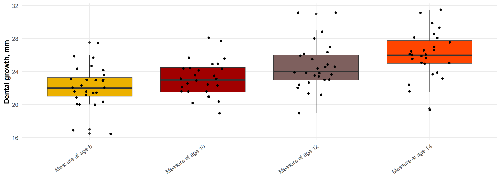

``` r
(box1<-ggplot(dental_long, aes(sex, distance, fill = measurement)) +
  tvthemes::scale_fill_avatar()+
  geom_boxplot() +
  labs(x = "", y = "Dental growth, mm", fill = ""))
```

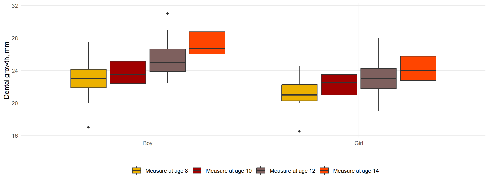

``` r
group_by(dental_long, sex, measurement) %>% 
  summarise(mean_distance = mean(distance), .groups = "drop") %>% 
  ggplot(aes(sex, mean_distance, fill = measurement, label = round(mean_distance))) +
  geom_col(position = "dodge") +
  tvthemes::scale_fill_avatar()+
  geom_text(position = position_dodge(width = 0.9), vjust = -0.5) +
  coord_flip() +
  labs(x = "", y = "Mean Dental growth, mm", fill = "")
```

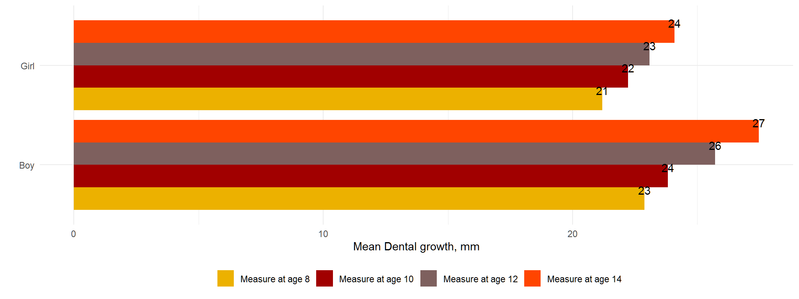

# covariance

``` r
# co-variance matrix
cov_obs <- dplyr::select(dental, starts_with("y")) %>%  cov()
cov_obs
#>           y8      y10      y12      y14
#> y8  5.925926 3.285256 4.875356 4.039886
#> y10 3.285256 4.653846 3.858974 4.532051
#> y12 4.875356 3.858974 7.938746 6.197293
#> y14 4.039886 4.532051 6.197293 7.654558
```

# correlation matrix

``` r
cov2cor(cov_obs)
#>            y8       y10       y12       y14
#> y8  1.0000000 0.6255833 0.7108079 0.5998338
#> y10 0.6255833 1.0000000 0.6348775 0.7593268
#> y12 0.7108079 0.6348775 1.0000000 0.7949980
#> y14 0.5998338 0.7593268 0.7949980 1.0000000
```

# further exploration

``` r
ggpairs(dplyr::select(dental, starts_with("y")), lower = list(continuous = "smooth"))
```

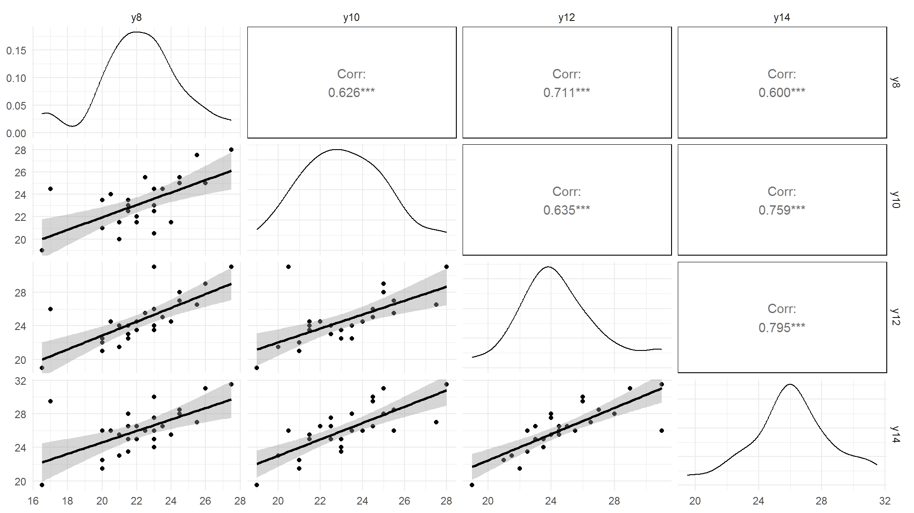

# 

``` r
ggpairs(dental, mapping = aes(colour = sex), columns = 3:6,
        lower = list(continuous = "smooth"))
```

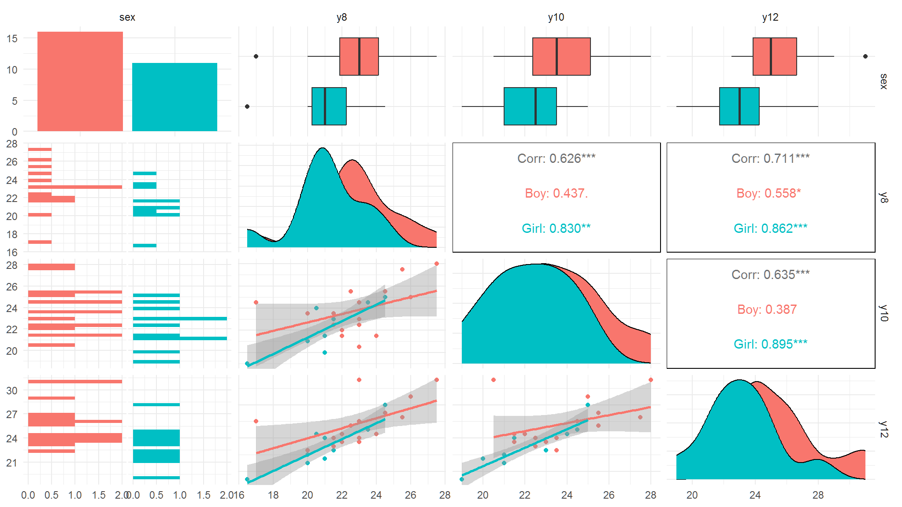

# trend by gender

``` r
(p<-group_by(dental_long, sex, age) %>% 
  summarise(mean = list(mean_ci(distance)), .groups = "drop") %>% 
  unnest_wider(mean) %>% 
  mutate(agex = age - .05 + .05*(sex == "Boy")) %>% 
  ggplot(aes(agex, y, col = sex, shape = sex)) +
  geom_point() +
  ggthemes::scale_shape_cleveland()+
  geom_errorbar(aes(ymin = ymin, ymax = ymax), width = 0.2) +
  geom_line() +
  labs(x = "Age, years", y = "Mean Dental growth, mm", shape = "Sex", col = "Sex"))
```

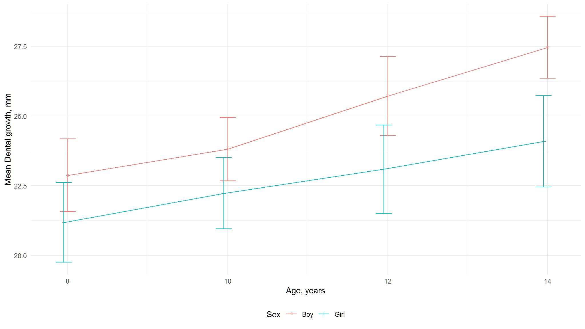

# dental growth per child

``` r
(p<-ggplot(dental_long, aes(age, distance, col = factor(id))) +
  geom_point() +
  geom_line() +
  tvthemes::scale_color_avatar()+
  facet_wrap(~ id) +
  labs(x = "Age, years", y = "Dental growth, mm", col = "Child id") +
  guides(col = guide_legend(nrow = 3)))
```

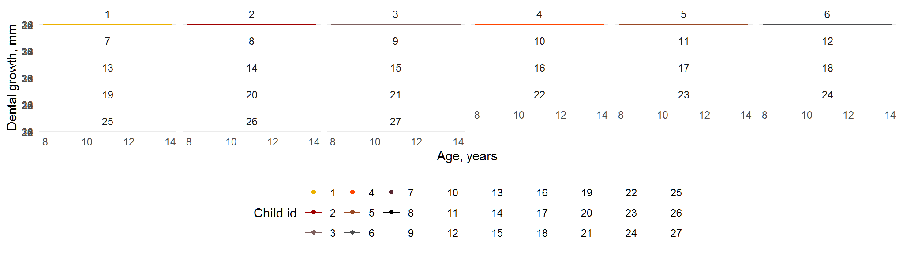

``` r
(q<-ggplot(dental_long, aes(age, distance, col = factor(id))) +
  geom_line() +
  tvthemes::scale_color_avatar()+
  labs(x = "Age, years", y = "Dental growth, mm", col = "Child id") +
  guides(col = guide_legend(nrow = 3)))
```

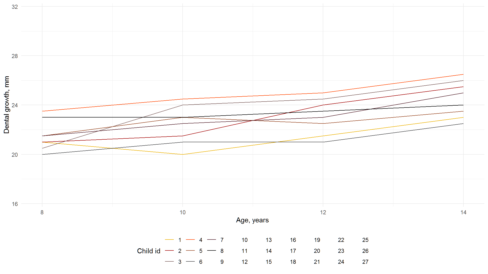

``` r
(m<-ggplot(dental_long, aes(age, distance)) +
  geom_line(aes(group = factor(id))) +
  geom_smooth() +
  facet_grid(~ sex)) 
```

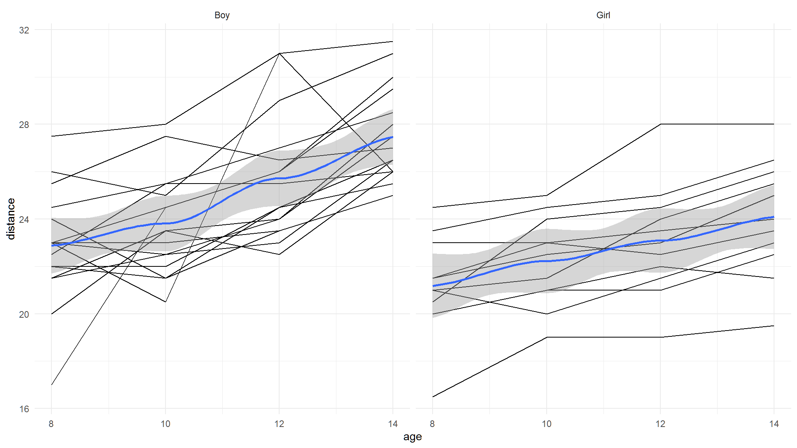

# Variance Components - matrix *V* :

- Maximum Likelihood (ML)
- restricted maximum likelihood (REML)

# What’s the difference between ML and REML

- ML estimates of variances are known to be biased in small samples
- the simplest case: Sample variance

`$$var(x)=\frac{1}{n-1}\sum_{i=1}^n(x_i-\bar{x})^2$$`

- The REML estimation is a generalization of this idea,It provides unbiased estimates of the parameters in the covariance matrix `\(V_i\)` in small samples

# fitting marginal models in R

> Marginal models can be fitted using function *gls()* from the *nlme* package
> it has the following structure

- *model*: a formula specifying the response vector and the covariates to include in
  the model
- *data*: a data frame containing all the variables
- *correlation*: a function describing the assumed correlation structure
- *weights*: a function describing the assumed within-group heteroscedasticity
  structure

# covariance and correlation matrices

<div class="figure" style="text-align: center">


<p class="caption">
Figure 1: The RStudio IDE
</p>

</div>

# Properties

- on the diagonal the variances, off diagonal covariances
- symmetric `\(\rightarrow cov(Y_1 , Y_2 ) = cov(Y_2 , Y_1)\)`

## Variances, covariances and correlations

- variance measures how far a set of numbers is spread out (always positive)
- covariance is a measure of how much two random variables change together
  (positive or negative)
- correlation a measure of the linear correlation (dependence) between two variables
  (between -1 and 1; 0 no correlation)

`$$corr(Y_1,Y_2)=\frac{cov(Y_1.Y_2)}{\sqrt{var(Y_1)\sqrt{var(Y_2}}}$$`

- Due to the fact that the magnitude of the covariance between `\(Y_1\)` and `\(Y_2\)` depends on their variability, we translate the covariance matrix into a correlation matrix

# 

<div class="figure" style="text-align: center">


<p class="caption">
Figure 2: The RStudio IDE
</p>

</div>

# 

- We need an appropriate choice for `\(V_i\)` in order to appropriately describe the
  correlations between the repeated measurements

- compound symmetry

- Gaussian spatial correlation

- autoregressive process

- Toeplitz

- exponential spatial correlation

## 

- *Unstructured* - Every variance and covariance term for observations within a school is a separate parameter and is therefore estimated uniquely; no patterns among variances or correlations are assumed. This structure offers maximum flexibility but is most costly in terms of parameters estimated.
- *Compound symmetry* - Assume variance is constant across all time points and correlation is constant across all pairs of time points. This structure is highly restrictive but least costly in terms of parameters estimated.
- *Autoregressive* - Assume variance is constant across all time points, but correlation drops off in a systematic fashion as the gap in time increases. Autoregressive models expand compound symmetry by allowing for a common structure where points closest in time are most highly correlated.

# 

## 

- *Toeplitz* - Toeplitz is similar to the autoregressive model, except that it does not impose any structure on the decline in correlation as time gaps increase. Thus, it requires more parameters to be estimated than the autoregressive model while providing additional flexibility.
- *Heterogeneous variances* - The assumption that variances are equal across time points found in the compound symmetry, autoregressive, and Toeplitz models can be relaxed by introducing additional parameters to allow unequal (heterogeneous) variances.

# doing it in R

## define a function in R

``` r
corandcov <- function(glsob,cov=T,...){
  corm <- corMatrix(glsob$modelStruct$corStruct)[[5]]
  print(corm)
  varstruct <- print(glsob$modelStruct$varStruct)  
  varests <- coef(varstruct, uncons=F, allCoef=T)
  covm <- corm*glsob$sigma^2*t(t(varests))%*%t(varests)
  return(covm)}
```

# unstructured mean and unstructured covariance

## 

``` r
## model 1
model<-gls(distance~-1+age1*sex1,data=dat,corr=corSymm(form=~1|id) , 
           weights=varIdent(form=~1|age1),
          method="ML")

cc <- corMatrix(model$modelStruct$corStruct)[[5]]
print(cc)
#>           [,1]      [,2]      [,3]      [,4]
#> [1,] 1.0000000 0.5706970 0.6613212 0.5215786
#> [2,] 0.5706970 1.0000000 0.5631718 0.7262192
#> [3,] 0.6613212 0.5631718 1.0000000 0.7280975
#> [4,] 0.5215786 0.7262192 0.7280975 1.0000000
```

# linear average trend

### 

``` r
model2<-gls(distance~age*sex +sex ,data=dat,corr=corSymm(form=~1|id) , 
           weights=varIdent(form=~1|age1),
          method="ML")

cc <- corMatrix(model2$modelStruct$corStruct)[[5]]
print(cc)
#>           [,1]      [,2]      [,3]      [,4]
#> [1,] 1.0000000 0.5443358 0.6525650 0.5187527
#> [2,] 0.5443358 1.0000000 0.5607202 0.7190277
#> [3,] 0.6525650 0.5607202 1.0000000 0.7275928
#> [4,] 0.5187527 0.7190277 0.7275928 1.0000000
```

# compare model 1 and 2

### 

``` r
anova(model2,model,type="LR")
#>        Model df      AIC      BIC    logLik   Test  L.Ratio p-value
#> model2     1 14 447.4770 485.0269 -209.7385                        
#> model      2 18 452.5093 500.7877 -208.2546 1 vs 2 2.967746  0.5632
```

# Parallel average profiles

### 

``` r
model3<-gls(distance~age+sex,data=dat,corr=corSymm(form=~1|id) , 
           weights=varIdent(form=~1|age1),
          method="ML")
cc <- corMatrix(model3$modelStruct$corStruct)[[5]]
print(cc)
#>           [,1]      [,2]      [,3]      [,4]
#> [1,] 1.0000000 0.5623195 0.6420580 0.4754107
#> [2,] 0.5623195 1.0000000 0.5416056 0.6520613
#> [3,] 0.6420580 0.5416056 1.0000000 0.7249401
#> [4,] 0.4754107 0.6520613 0.7249401 1.0000000
```

# compare all the three models

### 

``` r
anova(model,model2,model3,type="LR")
#>        Model df      AIC      BIC    logLik   Test  L.Ratio p-value
#> model      1 18 452.5093 500.7877 -208.2546                        
#> model2     2 14 447.4770 485.0269 -209.7385 1 vs 2 2.967746  0.5632
#> model3     3 13 452.1527 487.0204 -213.0763 2 vs 3 6.675655  0.0098
```

# Topeltz covariance structure

### 

``` r
model4<-gls(distance~age*sex+sex,data=dat,corr=corARMA(form=~1|id,p=3,q=0) , 
           weights=varIdent(form=~1|age1),
          method="ML")
cc <- corMatrix(model4$modelStruct$corStruct)[[5]]
print(cc)
#>           [,1]      [,2]      [,3]      [,4]
#> [1,] 1.0000000 0.6221903 0.6953509 0.4812799
#> [2,] 0.6221903 1.0000000 0.6221903 0.6953509
#> [3,] 0.6953509 0.6221903 1.0000000 0.6221903
#> [4,] 0.4812799 0.6953509 0.6221903 1.0000000
```

# compare all the 4 models

### 

``` r
anova(model,model2,model3,model4,type="LR")
#>        Model df      AIC      BIC    logLik   Test  L.Ratio p-value
#> model      1 18 452.5093 500.7877 -208.2546                        
#> model2     2 14 447.4770 485.0269 -209.7385 1 vs 2 2.967746  0.5632
#> model3     3 13 452.1527 487.0204 -213.0763 2 vs 3 6.675655  0.0098
#> model4     4 11 444.4973 474.0008 -211.2487 3 vs 4 3.655361  0.1608
```

# AR(1) covariance structure

### 

``` r
model5<-gls(distance~age*sex+sex,data=dat,corr=corAR1(form=~1|id) , 
           weights=varIdent(form=~1|age1),
          method="ML")
cc <- corMatrix(model5$modelStruct$corStruct)[[5]]
print(cc)
#>           [,1]      [,2]      [,3]      [,4]
#> [1,] 1.0000000 0.6187219 0.3828168 0.2368571
#> [2,] 0.6187219 1.0000000 0.6187219 0.3828168
#> [3,] 0.3828168 0.6187219 1.0000000 0.6187219
#> [4,] 0.2368571 0.3828168 0.6187219 1.0000000
```

# compare all models

### 

``` r
anova(model,model2,model3,model4,model5)
#>        Model df      AIC      BIC    logLik   Test   L.Ratio p-value
#> model      1 18 452.5093 500.7877 -208.2546                         
#> model2     2 14 447.4770 485.0269 -209.7385 1 vs 2  2.967746  0.5632
#> model3     3 13 452.1527 487.0204 -213.0763 2 vs 3  6.675655  0.0098
#> model4     4 11 444.4973 474.0008 -211.2487 3 vs 4  3.655361  0.1608
#> model5     5  9 456.7470 480.8862 -219.3735 4 vs 5 16.249639  0.0003
```

``` r
cc <- corMatrix(model4$modelStruct$corStruct)[[5]]
print(cc)
#>           [,1]      [,2]      [,3]      [,4]
#> [1,] 1.0000000 0.6221903 0.6953509 0.4812799
#> [2,] 0.6221903 1.0000000 0.6221903 0.6953509
#> [3,] 0.6953509 0.6221903 1.0000000 0.6221903
#> [4,] 0.4812799 0.6953509 0.6221903 1.0000000
```

# General Linear Mixed effects model

- Linear MIXED models mix (consider) both fixed and
  random effects (Hence the name ’Mixed’ models)
- These models are a way of dealing with
  correlated data so we can consider research questions in
  much the same way as independant data; Inferences
  about within-subject effects can be conducted in a
  similar way to (standard) between-subject effects.
- in these models, some subset of the regression coefficients vary randomly from one individual to another, accounting for natural heterogeneity across subjects. Individuals in population are assumed to have their own subject-specific mean response trajectories over time.
- The mean response is modeled as a combination of population characteristics (fixed effects) assumed to be shared by all individuals, while subject-specific effects (random effects) are unique to a particular individual.
- Linear Mixed Models are a particular type of hierarchical models which contains both fixed and random effects.

# Two - Stage Approach

## Growth curve models can be motivated in terms of a two-stage model. In the two-stage model, we assume

1.  A straight line (or curve) fits the observed responses for each subject
    (first stage)
2.  A regression model relating the mean of the individual intercepts and
    slopes to subject-specific covariates (second stage)

# stage 1

`$$Y_{ij}=v_{i1}+v_{i2}t_{ij}+\epsilon_{ij}$$`

where `\(v_{i1}\)` and `\(v_{i2}\)` are parameters specific to the `\(ith\)` subject and the errors,
`\(e_{ij}\)` , are implicitly assumed to be independent within a subject.

# Doing it in R : method 1

``` r
library(nlme);rel_model<-lmList(distance~age,data=Orthodont);plot(augPred(rel_model),grid=TRUE)
```

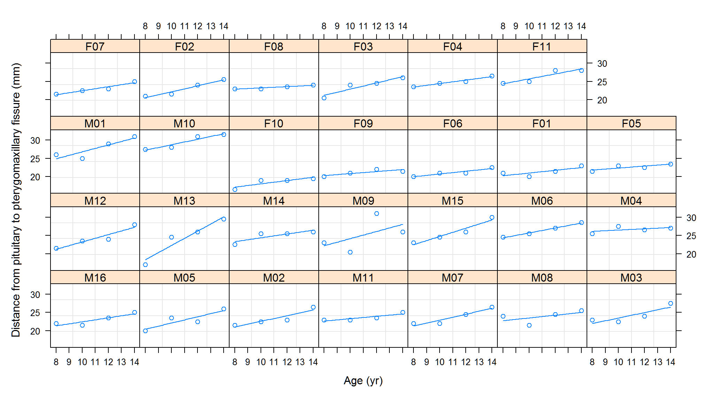

# method 2 : using R’s nested data capabilities

``` r
# created nested dataframes 
dental_nested <- Orthodont %>%  
              group_by(Subject) %>% 
              nest() 

dental_nested
#> # A tibble: 27 x 2
#> # Groups:   Subject [27]
#>    Subject data            
#>    <ord>   <list>          
#>  1 M01     <tibble [4 x 3]>
#>  2 M02     <tibble [4 x 3]>
#>  3 M03     <tibble [4 x 3]>
#>  4 M04     <tibble [4 x 3]>
#>  5 M05     <tibble [4 x 3]>
#>  6 M06     <tibble [4 x 3]>
#>  7 M07     <tibble [4 x 3]>
#>  8 M08     <tibble [4 x 3]>
#>  9 M09     <tibble [4 x 3]>
#> 10 M10     <tibble [4 x 3]>
#> # i 17 more rows
```

# create linear models for each subject or individual

``` r
dental_models<-dental_nested %>% 
  mutate(
    model=map(data,~lm(distance~age,data=.x))
  )
dental_models
#> # A tibble: 27 x 3
#> # Groups:   Subject [27]
#>    Subject data             model 
#>    <ord>   <list>           <list>
#>  1 M01     <tibble [4 x 3]> <lm>  
#>  2 M02     <tibble [4 x 3]> <lm>  
#>  3 M03     <tibble [4 x 3]> <lm>  
#>  4 M04     <tibble [4 x 3]> <lm>  
#>  5 M05     <tibble [4 x 3]> <lm>  
#>  6 M06     <tibble [4 x 3]> <lm>  
#>  7 M07     <tibble [4 x 3]> <lm>  
#>  8 M08     <tibble [4 x 3]> <lm>  
#>  9 M09     <tibble [4 x 3]> <lm>  
#> 10 M10     <tibble [4 x 3]> <lm>  
#> # i 17 more rows
```

# coefficients of multiple models

``` r
dental_models %>%  
  mutate(coef = map(model,~tidy(.x))) %>% 
  unnest(coef) 
#> # A tibble: 54 x 8
#> # Groups:   Subject [27]
#>    Subject data             model  term     estimate std.error statistic p.value
#>    <ord>   <list>           <list> <chr>       <dbl>     <dbl>     <dbl>   <dbl>
#>  1 M01     <tibble [4 x 3]> <lm>   (Interc~   17.3       3.85      4.50  0.0461 
#>  2 M01     <tibble [4 x 3]> <lm>   age         0.95      0.343     2.77  0.109  
#>  3 M02     <tibble [4 x 3]> <lm>   (Interc~   14.8       2.62      5.67  0.0297 
#>  4 M02     <tibble [4 x 3]> <lm>   age         0.775     0.233     3.32  0.0798 
#>  5 M03     <tibble [4 x 3]> <lm>   (Interc~   16         3.55      4.51  0.0459 
#>  6 M03     <tibble [4 x 3]> <lm>   age         0.75      0.316     2.37  0.141  
#>  7 M04     <tibble [4 x 3]> <lm>   (Interc~   24.7       2.23     11.1   0.00803
#>  8 M04     <tibble [4 x 3]> <lm>   age         0.175     0.198     0.882 0.471  
#>  9 M05     <tibble [4 x 3]> <lm>   (Interc~   13.7       3.57      3.82  0.0622 
#> 10 M05     <tibble [4 x 3]> <lm>   age         0.85      0.318     2.67  0.116  
#> # i 44 more rows
```

# model performance

``` r
library(broom)
model_perf<-dental_models %>% 
  mutate(coef=map(model,~glance(.x))) %>% 
  unnest(coef);model_perf
#> # A tibble: 27 x 15
#> # Groups:   Subject [27]
#>    Subject data     model  r.squared adj.r.squared sigma statistic p.value    df
#>    <ord>   <list>   <list>     <dbl>         <dbl> <dbl>     <dbl>   <dbl> <dbl>
#>  1 M01     <tibble> <lm>       0.793        0.690  1.53      7.68  0.109       1
#>  2 M02     <tibble> <lm>       0.847        0.770  1.04     11.0   0.0798      1
#>  3 M03     <tibble> <lm>       0.738        0.607  1.41      5.63  0.141       1
#>  4 M04     <tibble> <lm>       0.280       -0.0800 0.887     0.778 0.471       1
#>  5 M05     <tibble> <lm>       0.781        0.672  1.42      7.14  0.116       1
#>  6 M06     <tibble> <lm>       0.992        0.988  0.194   243.    0.00409     1
#>  7 M07     <tibble> <lm>       0.898        0.847  0.851    17.7   0.0522      1
#>  8 M08     <tibble> <lm>       0.324       -0.0144 1.71      0.957 0.431       1
#>  9 M09     <tibble> <lm>       0.311       -0.0339 4.59      0.902 0.443       1
#> 10 M10     <tibble> <lm>       0.9          0.85   0.791    18.0   0.0513      1
#> # i 17 more rows
#> # i 6 more variables: logLik <dbl>, AIC <dbl>, BIC <dbl>, deviance <dbl>,
#> #   df.residual <int>, nobs <int>
```

# visualy inpect fit of your models

``` r
augmented_models<-dental_models %>% 
  mutate(augmented=map(model,~augment(.x))) %>% 
  unnest(augmented)
```

# visualy inspect the models

``` r
p<-augmented_models %>% 
  ggplot(aes(x=distance,y=age))+
  geom_point()+
  geom_line(aes(y=.fitted),color="red")+ 
  facet_wrap(~Subject,scale="free")
```

# 

``` r
p
```

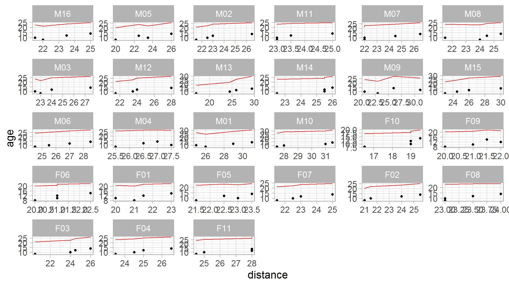

# stage 2 : the intercepts and the slopes are regressed on

other covariates:

`$$v_{i1} = \alpha_1 + X_i\beta_1 + e_{i1}$$`
`$$v_{i2} = \alpha_2 + X_i\beta_2 + e_{i2}$$`

## 

``` r
b<-lapply(rel_model,coef)
V<-lapply(rel_model,vcov)
```

``` r
estm<-rep(c("intercept","slope"),length(b))
subj<-rep(names(b),each=2)
```

``` r
library(metafor)
b<-unlist(b)
V<-bldiag(V)
```

# results for stage 2

``` r
(res2<-rma.mv(b~estm-1,V,random=~estm|subj,struct="UN"))
#> 
#> Multivariate Meta-Analysis Model (k = 54; method: REML)
#> 
#> Variance Components:
#> 
#> outer factor: subj (nlvls = 27)
#> inner factor: estm (nlvls = 2)
#> 
#>             estim    sqrt  k.lvl  fixed      level 
#> tau^2.1    5.6463  2.3762     27     no  intercept 
#> tau^2.2    0.0478  0.2187     27     no      slope 
#> 
#>            rho.intr  rho.slop    intr  slop 
#> intercept         1                 -    27 
#> slope       -0.5726         1      no     - 
#> 
#> Test for Residual Heterogeneity:
#> QE(df = 52) = 1611.6315, p-val < .0001
#> 
#> Test of Moderators (coefficients 1:2):
#> QM(df = 2) = 3080.0218, p-val < .0001
#> 
#> Model Results:
#> 
#>                estimate      se     zval    pval    ci.lb    ci.ub      
#> estmintercept   17.6669  0.6109  28.9196  <.0001  16.4696  18.8642  *** 
#> estmslope        0.5762  0.0555  10.3868  <.0001   0.4675   0.6850  *** 
#> 
#> ---
#> Signif. codes:  0 '***' 0.001 '**' 0.01 '*' 0.05 '.' 0.1 ' ' 1
```

# drawbacks for the

- The two-stage method is less attractive when the number and timing of
  observations varies among subjects, because it does not take proper
  account of the weighting.
- Also, note that the two-stage formulation of the growth curve model
  imposes certain restrictions and structure on the covariates.
- That is, in the two-stage approach covariates at the first stage (except for
  the intercept) must be time-varying, while covariates at the second stage
  must be time-invariant.
- In contrast, in the mixed effects model the only restriction is that the
  columns of Z i are a subset of the columns of `\(X_i\)` .

# the general mixed effects model

- the two stage model can be perfomed explicitly in the analysis
- the associated drawbacks of the two stage model can be avoided by combining the two stages into one model such that

`$$Y_i=Z_i\beta_i+\epsilon_i \cdots (1)$$`

`$$\beta_i=K_i\beta+b_i \cdots (2)$$`
can be simplified to

`$$Y_i=X_i\beta+Z_ib_i+\epsilon_i$$` where `\(Z_iK_i=X_i\)`

# 

it is given that

`$$b_i \sim N(0,D)$$`
`$$\epsilon_i:n_i \times 1$$` error vector
`$$\epsilon_i \sim N(0,R)$$` and `\(b_1\cdots b_N,\epsilon_1,\cdots,\epsilon_N\)` independent

# Terminology

- Random Effects : `\(\beta\)`: `\(p \times 1\)` vector of fixed effects regression coefficient

> Random effects are those where the particular ’groups’
> of observations (levels) are drawn randomly from a population of groups.

- fixed effects : `\(b_i\)` : `\(q\times 1\)` vector of random effects regression coefficient

> are the ones we know (and love), where we
> would expect a differences between two groups to be FIXED
> as we move from the sample to the population

# 

- Variance components are elements in `\(D\)` and `\(R\)`

- `\(Y_i\)` : `\(n_i \times 1\)` response vector

- `\(X_i\)` : `\(n_i \times p\)` design matrix of fixed effects

- `\(Z_i\)` : `\(n_i \times q\)` design matrix of random effects

hence

`$$Y_i \sim N(X_i\beta,V(\alpha))$$`

# features

- D must be symmetric and positive definite

- `\(Z_i\)` columns are subsets of `\(X_i\)` columns

- conditional mean of `\(Y_i\)` given random effects `\(b_i\)` is `\(E(Y_i|b_i)=X_i\beta+Z_ib_i\)`

- the marginal mean of `\(Y_i\)` is `\(E(E(Y_i|b_i))=E(X_i\beta+Z_ib_i)=X_i\beta\)`

# Matrix D

<div class="figure" style="text-align: center">


<p class="caption">
Figure 3: The RStudio IDE
</p>

</div>

# Matrix R

<div class="figure" style="text-align: center">


<p class="caption">
Figure 4: The RStudio IDE
</p>

</div>

# contrasting with the general linear model

<div class="figure" style="text-align: center">


<p class="caption">
Figure 5: The RStudio IDE
</p>

</div>

# cont’d

<div class="figure" style="text-align: center">


<p class="caption">
Figure 6: The RStudio IDE
</p>

</div>

# fitting the General linear mixed effects model (lme package)

``` r
model<-lme(distance~age,random=~age|Subject,data=Orthodont)

#equatiomatic::extract_eq(model)
```

- almost similar to the two stage results

# fitting using the imer package

``` r
lin_0 <- lmer(distance ~ 1 + (1 | id), data = dental_long)
summary(lin_0)
#> Linear mixed model fit by REML. t-tests use Satterthwaite's method [
#> lmerModLmerTest]
#> Formula: distance ~ 1 + (1 | id)
#>    Data: dental_long
#> 
#> REML criterion at convergence: 515.4
#> 
#> Scaled residuals: 
#>     Min      1Q  Median      3Q     Max 
#> -3.2400 -0.5277 -0.1073  0.4732  2.7687 
#> 
#> Random effects:
#>  Groups   Name        Variance Std.Dev.
#>  id       (Intercept) 3.752    1.937   
#>  Residual             4.930    2.220   
#> Number of obs: 108, groups:  id, 27
#> 
#> Fixed effects:
#>             Estimate Std. Error      df t value Pr(>|t|)    
#> (Intercept)  24.0231     0.4297 26.0000   55.91   <2e-16 ***
#> ---
#> Signif. codes:  0 '***' 0.001 '**' 0.01 '*' 0.05 '.' 0.1 ' ' 1
#equatiomatic::extract_eq(lin_0)
```

# interpretation

- The estimated marginal mean of the dental distance is `\(\beta_0=24.02mm\)`
- The estimated variance of the random-effect reflecting between-subject variability is 3.752; the estimated variance of the error term reflecting within-subject variability is 4.930.
- The correlation between any two repeated measures (ICC) is equal to `\(3.76/(3.76+4.93)=0.43\)`

# 

``` r
ranova(lin_0)
#> ANOVA-like table for random-effects: Single term deletions
#> 
#> Model:
#> distance ~ (1 | id)
#>          npar  logLik    AIC   LRT Df Pr(>Chisq)    
#> <none>      3 -257.68 521.36                        
#> (1 | id)    2 -269.14 542.28 22.92  1  1.689e-06 ***
#> ---
#> Signif. codes:  0 '***' 0.001 '**' 0.01 '*' 0.05 '.' 0.1 ' ' 1
```

# comment

- The small p-value suggests evidence of between-individual heterogeneity, which support evidence for choosing a mixed-effects model instead of a only fixed-effects model.

$$
`\begin{aligned}
  \operatorname{distance}_{i}  &\sim N \left(\alpha_{j[i]}, \sigma^2 \right) \\
    \alpha_{j}  &\sim N \left(\mu_{\alpha_{j}}, \sigma^2_{\alpha_{j}} \right)
    \text{, for id j = 1,} \dots \text{,J}
\end{aligned}`
$$

$$
`\begin{aligned}
  \operatorname{Weight}_{i}  &\sim N \left(\alpha_{j[i]} + \beta_{1}(\operatorname{Mnth}), \sigma^2 \right) \\
    \alpha_{j}  &\sim N \left(\gamma_{0}^{\alpha} + \gamma_{1}^{\alpha}(\operatorname{Prog}_{\operatorname{diet+exercise}}) + \gamma_{2}^{\alpha}(\operatorname{Prog}_{\operatorname{modified\ diet}}) + \gamma_{3}^{\alpha}(\operatorname{Mnth} \times \operatorname{Prog}_{\operatorname{diet+exercise}}) + \gamma_{4}^{\alpha}(\operatorname{Mnth} \times \operatorname{Prog}_{\operatorname{modified\ diet}}), \sigma^2_{\alpha_{j}} \right)
    \text{, for ID j = 1,} \dots \text{,J}
\end{aligned}`
$$
