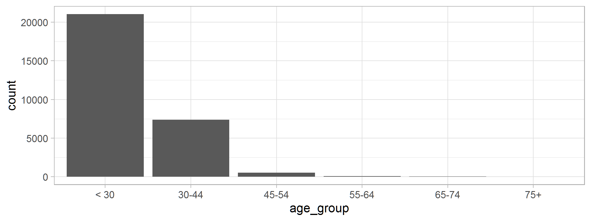
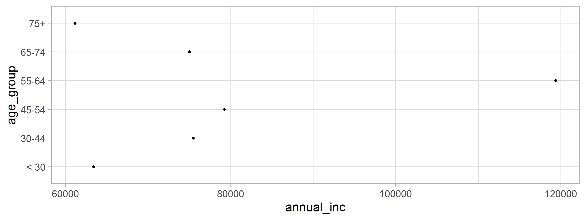
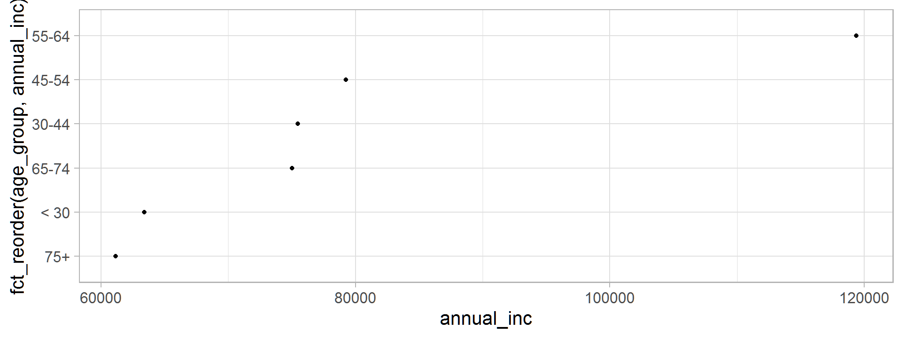
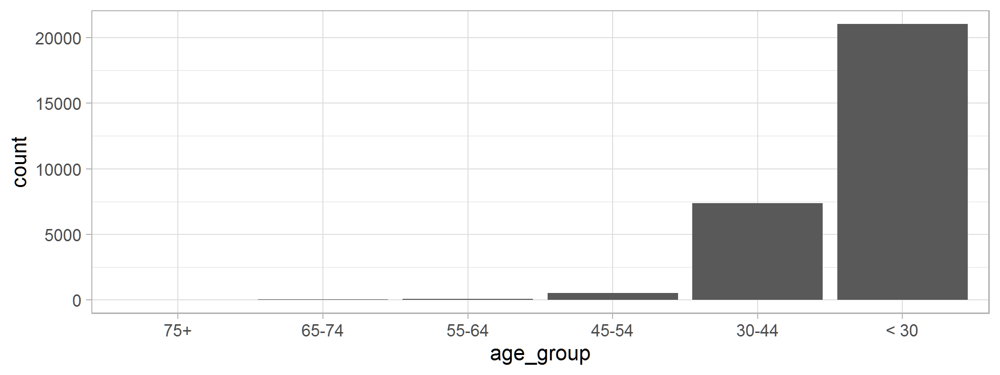

<script src="//yihui.org/js/math-code.js" defer></script>
<!-- Just one possible MathJax CDN below. You may use others. -->
<script defer
  src="//mathjax.rstudio.com/latest/MathJax.js?config=TeX-MML-AM_CHTML">
</script>


# Factors - what are they

- factors are used to work with categorical variables, variables
that  have  a  fixed  and  known  set  of  possible  values.  They  are  also
useful  when  you  want  to  display  character  vectors  in  a  non alphabetical order.
- we encounter them when modeling (linear,GLM,GAMS,Machine learning)
- handling them is on3 stage of machine learning feature engineering

# `factor()`

- Provides a way to provide different categories/enumerations of things without specifying a 
  priority preference. 
    - IE. in `loan data` grade may be a included in a regression, but 
    order in which they are included in the model shouldn't impact the results. 
    Or grade A is not greater than grade B from a regression standpoint.
    
- Option for providing ordinality when it is important to sort categories
    - IE First, Second, Third, are categories, but there is an order to them
    
# creating factors


```r

vec <- factor(c("Hello","world","Hello","Rposit"))
vec
#> [1] Hello  world  Hello  Rposit
#> Levels: Hello Rposit world
```

# Levels of factors are the important piece to them, and they can be edited


```r
factor(c("Hello","world","Hello","Rposit"), levels = c("world","Hello"))
#> [1] Hello world Hello <NA> 
#> Levels: world Hello

levels(vec) <- c("Amazing","Viewers","Are")
vec
#> [1] Amazing Are     Amazing Viewers
#> Levels: Amazing Viewers Are
```
#
- Imagine that you have a variable that records month:


```r
x1 <- c("Dec", "Apr", "Jan", "Mar")
sort(x1)
#> [1] "Apr" "Dec" "Jan" "Mar"
```
- `sort` doesn’t sort in a useful way

- There are only twelve possible months, and there’s nothing saving you from typos:

```r
x2 <- c("Dec", "Apr", "Jam", "Mar")
```

# how can we fix this... create a list with levels

```r
month_levels <- c(
  "Jan", "Feb", "Mar", "Apr", "May", "Jun",
  "Jul", "Aug", "Sep", "Oct", "Nov", "Dec"
)

y1 <- factor(x1, levels = month_levels)
y1
#> [1] Dec Apr Jan Mar
#> Levels: Jan Feb Mar Apr May Jun Jul Aug Sep Oct Nov Dec

sort(y1)
#> [1] Jan Mar Apr Dec
#> Levels: Jan Feb Mar Apr May Jun Jul Aug Sep Oct Nov Dec
```

# working with factors in datasets

- i'm still a big fan of the tidyverse
- we will use the `forcats` package to get the job done
` first lets see what happens when you read in data

### readr package

- by default treats factors as characters
- you can override this by specifying `coltypes`

# setup

```r

# load in libraries
library(labelled)
library(tidyverse)

# read in data
df<-readr::read_csv("loan_data_cleaned.csv")
```
#

```r
# look at the few first rows
head(df,n=4)
#> # A tibble: 4 x 9
#>    ...1 loan_status loan_amnt grade home_ownership annual_inc   age emp_cat
#>   <dbl>       <dbl>     <dbl> <chr> <chr>               <dbl> <dbl> <chr>  
#> 1     1           0      5000 B     RENT                24000    33 0-15   
#> 2     2           0      2400 C     RENT                12252    31 15-30  
#> 3     3           0     10000 C     RENT                49200    24 0-15   
#> 4     4           0      5000 A     RENT                36000    39 0-15   
#> # i 1 more variable: ir_cat <chr>

# check the classes
sapply(df[1,],class)
#>           ...1    loan_status      loan_amnt          grade home_ownership 
#>      "numeric"      "numeric"      "numeric"    "character"    "character" 
#>     annual_inc            age        emp_cat         ir_cat 
#>      "numeric"      "numeric"    "character"    "character"
```

# lets override that coz we need those to be factors

```r
df<-readr::read_csv("loan_data_cleaned.csv",col_types = cols(loan_status=col_factor(),
                                                             grade=col_factor(),
                                                             home_ownership=col_factor(),
                                                             emp_cat=col_factor())) |> 
  select(-1)

sapply(df[1,],class) # great
#>    loan_status      loan_amnt          grade home_ownership     annual_inc 
#>       "factor"      "numeric"       "factor"       "factor"      "numeric" 
#>            age        emp_cat         ir_cat 
#>      "numeric"       "factor"    "character"
```

#
- that's a draw back, cos its cumbersome, lets use `mutate_if()` instead
- we might have as many variables to deal with and listing them one by one is time consuming
- we know in advance that they will be turned to characters 


```r
df<-readr::read_csv("loan_data_cleaned.csv") |> 
  select(-1)
df<- df |> 
  mutate_if(is.character,as.factor)

# check class
sapply(df[1,],class) # great
#>    loan_status      loan_amnt          grade home_ownership     annual_inc 
#>      "numeric"      "numeric"       "factor"       "factor"      "numeric" 
#>            age        emp_cat         ir_cat 
#>      "numeric"       "factor"       "factor"
```

# labeling variables

```r
# put variable labels
labelled::var_label(df)<-list(loan_status="default status",
                    annual_inc="annual income",
                    home_ownership="house ownership",
                    loan_amnt="loan amount",
                    emp_cat="employment category")
```

# creating factors and modifying them

- lets make use of `cut` from base R to turn numerics to factors
- i find this function very useful in most cases

#

```r
out_new<-df |> 
  mutate(age_group=cut(age, c(min(df$age)-1, 30,45,55,65,75, max(df$age)+1), 
                        c("< 30", "30-44","45-54","55-64","65-74","75+"), right = FALSE))
# check this out
out_new |> 
  select(age,age_group)
#> # A tibble: 29,091 x 2
#>      age age_group
#>    <dbl> <fct>    
#>  1    33 30-44    
#>  2    31 30-44    
#>  3    24 < 30     
#>  4    39 30-44    
#>  5    24 < 30     
#>  6    28 < 30     
#>  7    22 < 30     
#>  8    22 < 30     
#>  9    28 < 30     
#> 10    22 < 30     
#> # i 29,081 more rows
```
# lets have glimpse at this

```r
table(out_new$age_group)
#> 
#>  < 30 30-44 45-54 55-64 65-74   75+ 
#> 21038  7380   537   101    30     5
### or##

out_new |>
  count(age_group)
#> # A tibble: 6 x 2
#>   age_group     n
#>   <fct>     <int>
#> 1 < 30      21038
#> 2 30-44      7380
#> 3 45-54       537
#> 4 55-64       101
#> 5 65-74        30
#> 6 75+           5
```
#

```r
ggplot(out_new, aes(age_group)) +geom_bar()
```



# modifying factor order

```r
dat_sum <- out_new |>
  group_by(age_group) |>
  summarize(
    annual_inc= mean(annual_inc, na.rm = TRUE),
    n = n()
  )
```
#

```r
ggplot(dat_sum, aes(annual_inc, age_group)) + geom_point()
```



# fct_reorder() 

- It is difficult to interpret this plot because there’s no overall pattern.
- We can improve it by reordering the levels of age_group using  fct_reorder() .  _ fct_reorder()  takes three arguments:
  + f , the factor whose levels you want to modify.
  + x , a numeric vector that you want to use to reorder the levels.
  
# 

```r
ggplot(dat_sum, aes(annual_inc, fct_reorder(age_group,annual_inc))) + geom_point()
```


- there is some increasing order now.. its more useful when there are many levels per factor

# `fct_infreq`

- you can use `fct_infreq` to order levels in
increasing frequency: this is the simplest type of reordering because
it doesn’t need any extra variables. 

```r
p1<-out_new |>
  mutate(age_group = age_group |> fct_infreq() |> fct_rev()) |>
  ggplot(aes(age_group)) +
    geom_bar()
```
#

```r
p1
```



# fct_recode()

+ The most general and powerful  tool  is  fct_recode() .It  allows  you  to  recode,  or  change,  the value of each level. For example, take  gss_cat$partyid


```r
out_new |> 
  mutate(age_group1=fct_recode(age_group,
                               "less than 30" ="< 30",
                               "greater than 75"="75+")) |> 
  count(age_group1)
#> # A tibble: 6 x 2
#>   age_group1          n
#>   <fct>           <int>
#> 1 less than 30    21038
#> 2 30-44            7380
#> 3 45-54             537
#> 4 55-64             101
#> 5 65-74              30
#> 6 greater than 75     5
```
# `fct_collapse()`
+ If  you  want  to  collapse  a  lot  of  levels,  `fct_collapse()`


```r
out_new |> 
  mutate(age_group2=fct_collapse(age_group,
                                 "30-54"=c("30-44","45-54"),
                                 "55-74"=c("55-64","65-74"))) |> 
  count(age_group2)
#> # A tibble: 4 x 2
#>   age_group2     n
#>   <fct>      <int>
#> 1 < 30       21038
#> 2 30-54       7917
#> 3 55-74        131
#> 4 75+            5
```

# `fct_lump()`
+ Sometimes you just want to lump together all the small groups to
make a plot or table simpler. That’s the job of  `fct_lump()`:

```r
out_new %>%
  mutate(age_group3= fct_lump(age_group)) %>%
  count(age_group3)
#> # A tibble: 2 x 2
#>   age_group3     n
#>   <fct>      <int>
#> 1 < 30       21038
#> 2 Other       8053
```
#
+ The default behavior is to progressively lump together the smallest
groups, ensuring that the aggregate is still the smallest group
+ Instead,  we  can  use  the  n   parameter  to  specify  how  many  groups
(excluding other) we want to keep:

#

```r
out_new %>%
  mutate(age_group3= fct_lump(age_group,n=3)) %>%
  count(age_group3)
#> # A tibble: 4 x 2
#>   age_group3     n
#>   <fct>      <int>
#> 1 < 30       21038
#> 2 30-44       7380
#> 3 45-54        537
#> 4 Other        136
```


