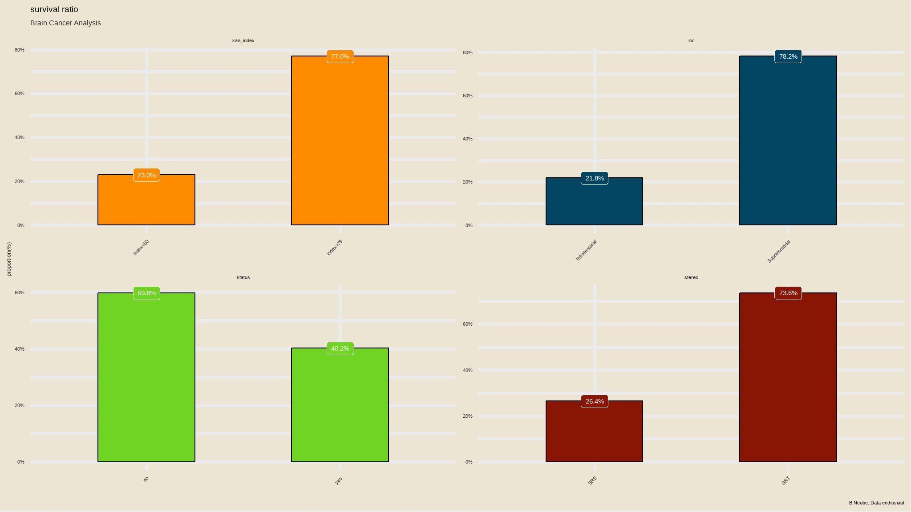
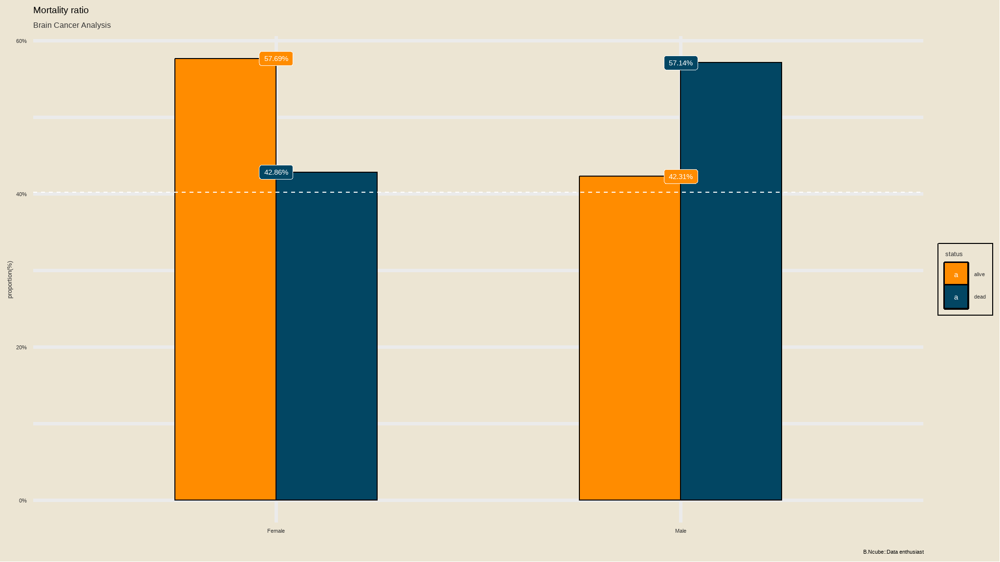

<script src="//yihui.org/js/math-code.js" defer></script>
<!-- Just one possible MathJax CDN below. You may use others. -->
<script defer
  src="//mathjax.rstudio.com/latest/MathJax.js?config=TeX-MML-AM_CHTML">
</script>

# Introduction

In this tutorial i explore the brain cancer dataset . This is a work in progress and will be continuously updated along the way . The main emphasis is in using the **tidymodels** approach for fitting regression models in R.

## Methodology

My research aims at patients’ brain cancer survival analysis . In the analysis I did a detailed research on the variables that determine whether patients get over a disease or surrender in a certain duration time. Thus I used a non-parametric statistic estimator to create a Kaplan-Meier Survival model to measure the survival function from lifetime duration data. We fit a cox proportional model and Logistic regression model.

## Brain Cancer Data

A data frame with 88 observations and 8 variables:

- sex : Factor with levels “Female” and “Male”
- diagnosis : Factor with levels “Meningioma”, “LG glioma”, “HG glioma”, and “Other”.
- Location : factor with levels “Infratentorial” and “Supratentorial”.
- ki : Karnofsky index.
- gtv : Gross tumor volume, in cubic centimeters.
- stereo : Stereotactic method factor with levels “SRS” and “SRT”.
- status : Whether the patient is dead at the end of the study: 0=No, 1=yes.
- time : Survival time, in months.

# Setup

``` r
library(pacman)
p_load(tidyverse, tidymodels, ISLR2, survival, censored)

glimpse(BrainCancer)
#> Rows: 88
#> Columns: 8
#> $ sex       <fct> Female, Male, Female, Female, Male, Female, Male, Male, Fema~
#> $ diagnosis <fct> Meningioma, HG glioma, Meningioma, LG glioma, HG glioma, Men~
#> $ loc       <fct> Infratentorial, Supratentorial, Infratentorial, Supratentori~
#> $ ki        <int> 90, 90, 70, 80, 90, 80, 80, 80, 70, 100, 80, 90, 90, 90, 60,~
#> $ gtv       <dbl> 6.11, 19.35, 7.95, 7.61, 5.06, 4.82, 3.19, 12.37, 12.16, 2.5~
#> $ stereo    <fct> SRS, SRT, SRS, SRT, SRT, SRS, SRT, SRT, SRT, SRT, SRT, SRS, ~
#> $ status    <int> 0, 1, 0, 1, 1, 0, 0, 0, 0, 0, 1, 0, 0, 0, 0, 1, 1, 0, 1, 0, ~
#> $ time      <dbl> 57.64, 8.98, 26.46, 47.80, 6.30, 52.75, 55.80, 42.10, 34.66,~
```

``` r
skimr::skim(BrainCancer)
```

|                                                  |             |
|:-------------------------------------------------|:------------|
| Name                                             | BrainCancer |
| Number of rows                                   | 88          |
| Number of columns                                | 8           |
| \_\_\_\_\_\_\_\_\_\_\_\_\_\_\_\_\_\_\_\_\_\_\_   |             |
| Column type frequency:                           |             |
| factor                                           | 4           |
| numeric                                          | 4           |
| \_\_\_\_\_\_\_\_\_\_\_\_\_\_\_\_\_\_\_\_\_\_\_\_ |             |
| Group variables                                  | None        |

<span id="tab:unnamed-chunk-2"></span>Table 1: Data summary

**Variable type: factor**

| skim_variable | n_missing | complete_rate | ordered | n_unique | top_counts                        |
|:--------------|----------:|--------------:|:--------|---------:|:----------------------------------|
| sex           |         0 |          1.00 | FALSE   |        2 | Fem: 45, Mal: 43                  |
| diagnosis     |         1 |          0.99 | FALSE   |        4 | Men: 42, HG : 22, Oth: 14, LG : 9 |
| loc           |         0 |          1.00 | FALSE   |        2 | Sup: 69, Inf: 19                  |
| stereo        |         0 |          1.00 | FALSE   |        2 | SRT: 65, SRS: 23                  |

**Variable type: numeric**

| skim_variable | n_missing | complete_rate |  mean |    sd |    p0 |   p25 |   p50 |  p75 |   p100 | hist  |
|:--------------|----------:|--------------:|------:|------:|------:|------:|------:|-----:|-------:|:------|
| ki            |         0 |             1 | 81.02 | 10.51 | 40.00 | 80.00 | 80.00 | 90.0 | 100.00 | ▁▁▃▇▇ |
| gtv           |         0 |             1 |  8.66 |  8.66 |  0.01 |  2.50 |  6.51 | 12.1 |  34.64 | ▇▃▁▁▁ |
| status        |         0 |             1 |  0.40 |  0.49 |  0.00 |  0.00 |  0.00 |  1.0 |   1.00 | ▇▁▁▁▅ |
| time          |         0 |             1 | 27.46 | 20.12 |  0.07 | 10.39 | 24.03 | 41.6 |  82.56 | ▇▅▅▂▁ |

# Explanatory data Analysis(EDA)

## mortality Rate

``` r
data<-BrainCancer |> 
  mutate(brain_status=ifelse(status==1,"yes","no"))


data|>
  dplyr::group_by(brain_status)|> 
  dplyr::summarize(count=n(),
             mean=mean(gtv, na.rm = T),
             std_dev=sd(gtv, na.rm = T),
             median=median(gtv, na.rm = T), 
             min=min(gtv, na.rm = T),
             max=max(gtv, na.rm = T))|> 
 tibble::column_to_rownames(var = "brain_status") |> 
 base::as.matrix()
#>     count      mean  std_dev median  min   max
#> no     53  7.022075 7.753337   4.72 0.01 31.74
#> yes    35 11.142286 9.451387  11.38 0.14 34.64

#Calculate mortality rate
print(paste('Mortality rate (%) is ',round(35/(35+53)*100,digits=2)))
#> [1] "Mortality rate (%) is  39.77"
```

``` r
blogdown::shortcode("spoiler",text="click here",.content="the Mortality rate is approximately `40%`")
```

{}
the Mortality rate is approximately `40%`
{}

``` r
library(extrafont)
loadfonts(quiet=TRUE)

iv_rates <- data |>
  group_by(brain_status) |>
  summarize(count = n()) |> 
  mutate(prop = count/sum(count)) |>
  ungroup() 

plot<-iv_rates |>
  ggplot(aes(x=brain_status, y=prop, fill=brain_status)) + 
  geom_col(color="black",width = 0.5)+ 
  theme(legend.position="bottom") + 
  geom_label(aes(label=scales::percent(prop)), color="white") + 
  labs(
    title = "mortality ratio",
    subtitle = "Brain Cancer Analysis",
    y = "proportion(%)", 
    x = "",
    fill="status",
    caption="B.Ncube::Data enthusiast") + 
  scale_y_continuous(labels = scales::percent)+ 
geom_hline(yintercept = (sum(data$status)/nrow(data)), col = "white", lty = 2) +
  tvthemes::scale_fill_kimPossible()+
  tvthemes::theme_theLastAirbender(title.font="Slayer",
                                   text.font = "Slayer")+
  theme(legend.position = 'right')
plot
```


## mortality rate by sex

### Create a customised function for summarising categorical data per status

``` r
summarize_status <- function(tbl){
  tbl %>% 
  #group_by(occup) %>% 
  summarise(n_died = sum(brain_status == "yes"), n_total = n()) %>%
  ungroup() %>% 
  mutate(pct_died = n_died / n_total) %>% 
  arrange(desc(pct_died)) %>% 
  mutate(low = qbeta(0.025, n_died + 5, n_total - n_died + .5),
         high = qbeta(0.975, n_died + 5, n_total - n_died + .5),
         pct = n_total / sum(n_total),
         percentage=scales::percent(pct_died))
  } 
```

### mortality rate summary per sex

``` r
data |> 
  group_by(sex) |> 
  summarize_status()
#> # A tibble: 2 x 8
#>   sex    n_died n_total pct_died   low  high   pct percentage
#>   <fct>   <int>   <int>    <dbl> <dbl> <dbl> <dbl> <chr>     
#> 1 Male       20      43    0.465 0.376 0.653 0.489 47%       
#> 2 Female     15      45    0.333 0.267 0.533 0.511 33%
```

- from the dataset , `\(\frac{20}{43}\)` men died while the other 15 where woman who died
- we can present these more visually with the graphs below


``` r
library(glue)
bind_count = function(x){
  as_tibble(x) %>% 
  add_count(value) %>% 
  mutate(value = glue("{value} ({n})")) %>%
    pull(value)
  
}
```

``` r
# Scatter plot
data %>% 
  na.omit() %>% 
  group_by(diagnosis = bind_count(diagnosis)) %>% 
  summarize_status() %>% 
  mutate(diagnosis = fct_reorder(diagnosis, pct_died)) %>% 
  ggplot(mapping = aes(x = pct_died, y = diagnosis)) +
  geom_point(aes(size = pct), show.legend = T) +
  geom_errorbarh(aes(xmin = low, xmax = high), height = .3) +
  labs(
    x = "Percentage of patients in each category who died",
    title = "Distribution of status by diagnosis",
    size = "%prevalence",
    subtitle = ""
  ) +
  scale_x_continuous(labels = percent) +
  scale_size_continuous(labels = percent) +
  theme(plot.title = element_text(hjust = 0.5))
```



{}

It seems that cumulatively, people with **LG glioma** and **HG glioma** had high chances of death.

{}

## distribution of numeric variables

``` r

# Histogram of all numeric variables
data %>%
  keep(is.numeric) %>% 
  gather() %>% 
  ggplot(aes(value)) +
  facet_wrap(~ key, scales = "free") +
  geom_histogram(bins=30,fill=tvthemes::avatar_pal()(1))+
  ggthemes::theme_wsj()
```


- status is really not supposed to be numeric but rather a factor variable
- time and gross tumor volume are all positively skewed
- karnofsky index is as good as being a factor so i will further categorize the data

## further manipulation

``` r
data <- data |> 
  mutate(kan_index = ifelse(ki>=80,"index > 79","index < 80"))

data |> 
  janitor::tabyl(kan_index)
#>   kan_index  n   percent
#>  index < 80 20 0.2272727
#>  index > 79 68 0.7727273
```

## comparing dependent variable with numeric variables

``` r
subset <- data |>
  dplyr::select(gtv,time,ki,status)


# Bring in external file for visualisations
source('functions/visualisations.R')

# Use plot function
plot <- histoplotter(subset, status, 
                     chart_x_axis_lbl = "survival status", 
                     chart_y_axis_lbl = 'Measures',
                     boxplot_color = 'navy', 
                     boxplot_fill = tvthemes::avatar_pal()(1), 
                     box_fill_transparency = 0.2) 

# Add extras to plot
plot + 
  tvthemes::theme_theLastAirbender() +
  tvthemes::scale_color_avatar()+
  theme(legend.position = 'top') 
```


## categorical data

``` r
iv_rates <- data |>
  dplyr::mutate(status = ifelse(status==1,"yes","no")) |>
  select(kan_index,loc,stereo,status) |> 
  gather() |> 
  group_by(key,value) |>
  summarize(count = n()) |> 
  mutate(prop = count/sum(count)) |>
  ungroup() 

plot<-iv_rates |>
  ggplot(aes(fill=key, y=prop, x=value)) + 
  geom_col(color="black",width = 0.5)+ 
  facet_wrap(~key,scales="free") +
  theme(legend.position="bottom") + 
  geom_label(aes(label=scales::percent(prop)), color="white") + 
  labs(
    title = "survival ratio",
    subtitle = "Brain Cancer Analysis",
    y = "proportion(%)", 
    x = "",
    fill="status",
    caption="B.Ncube::Data enthusiast") + 
  scale_y_continuous(labels = scales::percent)+
  tvthemes::scale_fill_kimPossible()+
  tvthemes::theme_theLastAirbender(title.font="Slayer",
                                   text.font = "Slayer")+
  theme(legend.position = 'none')+
  theme(axis.text.x = element_text(angle = 45, hjust = 1)) 
plot
```


``` r
library(gtsummary)
data |>
  select(sex,diagnosis,loc,stereo,status) |> 
  tbl_summary(
    by = status,
    statistic = list(
      all_continuous() ~ "{mean} ({sd})",
      all_categorical() ~ "{n} / {N} ({p}%)"), 
    label = status ~ "status")|> 
  add_p(test = all_continuous() ~ "t.test",
        pvalue_fun = function(x) style_pvalue(x, digits = 2))|> 
   modify_header(statistic ~ "**Test Statistic**")|>
  bold_labels()|> 
  modify_fmt_fun(statistic ~ style_sigfig) %>% 
  modify_caption("**Table 1. Patient Characteristic**")  %>%
  modify_header(label ~ "**Variable**") %>% 
  modify_spanning_header(c("stat_1", "stat_2") ~ "**Survival Status**") %>%
  modify_footnote(all_stat_cols() ~ "Mean (SD) or Frequency (%)") %>%
  bold_labels() %>%
  as_gt()
```

<div id="otofmlnfmj" style="padding-left:0px;padding-right:0px;padding-top:10px;padding-bottom:10px;overflow-x:auto;overflow-y:auto;width:auto;height:auto;">
<style>#otofmlnfmj table {
  font-family: system-ui, 'Segoe UI', Roboto, Helvetica, Arial, sans-serif, 'Apple Color Emoji', 'Segoe UI Emoji', 'Segoe UI Symbol', 'Noto Color Emoji';
  -webkit-font-smoothing: antialiased;
  -moz-osx-font-smoothing: grayscale;
}

#otofmlnfmj thead, #otofmlnfmj tbody, #otofmlnfmj tfoot, #otofmlnfmj tr, #otofmlnfmj td, #otofmlnfmj th {
  border-style: none;
}

#otofmlnfmj p {
  margin: 0;
  padding: 0;
}

#otofmlnfmj .gt_table {
  display: table;
  border-collapse: collapse;
  line-height: normal;
  margin-left: auto;
  margin-right: auto;
  color: #333333;
  font-size: 16px;
  font-weight: normal;
  font-style: normal;
  background-color: #FFFFFF;
  width: auto;
  border-top-style: solid;
  border-top-width: 2px;
  border-top-color: #A8A8A8;
  border-right-style: none;
  border-right-width: 2px;
  border-right-color: #D3D3D3;
  border-bottom-style: solid;
  border-bottom-width: 2px;
  border-bottom-color: #A8A8A8;
  border-left-style: none;
  border-left-width: 2px;
  border-left-color: #D3D3D3;
}

#otofmlnfmj .gt_caption {
  padding-top: 4px;
  padding-bottom: 4px;
}

#otofmlnfmj .gt_title {
  color: #333333;
  font-size: 125%;
  font-weight: initial;
  padding-top: 4px;
  padding-bottom: 4px;
  padding-left: 5px;
  padding-right: 5px;
  border-bottom-color: #FFFFFF;
  border-bottom-width: 0;
}

#otofmlnfmj .gt_subtitle {
  color: #333333;
  font-size: 85%;
  font-weight: initial;
  padding-top: 3px;
  padding-bottom: 5px;
  padding-left: 5px;
  padding-right: 5px;
  border-top-color: #FFFFFF;
  border-top-width: 0;
}

#otofmlnfmj .gt_heading {
  background-color: #FFFFFF;
  text-align: center;
  border-bottom-color: #FFFFFF;
  border-left-style: none;
  border-left-width: 1px;
  border-left-color: #D3D3D3;
  border-right-style: none;
  border-right-width: 1px;
  border-right-color: #D3D3D3;
}

#otofmlnfmj .gt_bottom_border {
  border-bottom-style: solid;
  border-bottom-width: 2px;
  border-bottom-color: #D3D3D3;
}

#otofmlnfmj .gt_col_headings {
  border-top-style: solid;
  border-top-width: 2px;
  border-top-color: #D3D3D3;
  border-bottom-style: solid;
  border-bottom-width: 2px;
  border-bottom-color: #D3D3D3;
  border-left-style: none;
  border-left-width: 1px;
  border-left-color: #D3D3D3;
  border-right-style: none;
  border-right-width: 1px;
  border-right-color: #D3D3D3;
}

#otofmlnfmj .gt_col_heading {
  color: #333333;
  background-color: #FFFFFF;
  font-size: 100%;
  font-weight: normal;
  text-transform: inherit;
  border-left-style: none;
  border-left-width: 1px;
  border-left-color: #D3D3D3;
  border-right-style: none;
  border-right-width: 1px;
  border-right-color: #D3D3D3;
  vertical-align: bottom;
  padding-top: 5px;
  padding-bottom: 6px;
  padding-left: 5px;
  padding-right: 5px;
  overflow-x: hidden;
}

#otofmlnfmj .gt_column_spanner_outer {
  color: #333333;
  background-color: #FFFFFF;
  font-size: 100%;
  font-weight: normal;
  text-transform: inherit;
  padding-top: 0;
  padding-bottom: 0;
  padding-left: 4px;
  padding-right: 4px;
}

#otofmlnfmj .gt_column_spanner_outer:first-child {
  padding-left: 0;
}

#otofmlnfmj .gt_column_spanner_outer:last-child {
  padding-right: 0;
}

#otofmlnfmj .gt_column_spanner {
  border-bottom-style: solid;
  border-bottom-width: 2px;
  border-bottom-color: #D3D3D3;
  vertical-align: bottom;
  padding-top: 5px;
  padding-bottom: 5px;
  overflow-x: hidden;
  display: inline-block;
  width: 100%;
}

#otofmlnfmj .gt_spanner_row {
  border-bottom-style: hidden;
}

#otofmlnfmj .gt_group_heading {
  padding-top: 8px;
  padding-bottom: 8px;
  padding-left: 5px;
  padding-right: 5px;
  color: #333333;
  background-color: #FFFFFF;
  font-size: 100%;
  font-weight: initial;
  text-transform: inherit;
  border-top-style: solid;
  border-top-width: 2px;
  border-top-color: #D3D3D3;
  border-bottom-style: solid;
  border-bottom-width: 2px;
  border-bottom-color: #D3D3D3;
  border-left-style: none;
  border-left-width: 1px;
  border-left-color: #D3D3D3;
  border-right-style: none;
  border-right-width: 1px;
  border-right-color: #D3D3D3;
  vertical-align: middle;
  text-align: left;
}

#otofmlnfmj .gt_empty_group_heading {
  padding: 0.5px;
  color: #333333;
  background-color: #FFFFFF;
  font-size: 100%;
  font-weight: initial;
  border-top-style: solid;
  border-top-width: 2px;
  border-top-color: #D3D3D3;
  border-bottom-style: solid;
  border-bottom-width: 2px;
  border-bottom-color: #D3D3D3;
  vertical-align: middle;
}

#otofmlnfmj .gt_from_md > :first-child {
  margin-top: 0;
}

#otofmlnfmj .gt_from_md > :last-child {
  margin-bottom: 0;
}

#otofmlnfmj .gt_row {
  padding-top: 8px;
  padding-bottom: 8px;
  padding-left: 5px;
  padding-right: 5px;
  margin: 10px;
  border-top-style: solid;
  border-top-width: 1px;
  border-top-color: #D3D3D3;
  border-left-style: none;
  border-left-width: 1px;
  border-left-color: #D3D3D3;
  border-right-style: none;
  border-right-width: 1px;
  border-right-color: #D3D3D3;
  vertical-align: middle;
  overflow-x: hidden;
}

#otofmlnfmj .gt_stub {
  color: #333333;
  background-color: #FFFFFF;
  font-size: 100%;
  font-weight: initial;
  text-transform: inherit;
  border-right-style: solid;
  border-right-width: 2px;
  border-right-color: #D3D3D3;
  padding-left: 5px;
  padding-right: 5px;
}

#otofmlnfmj .gt_stub_row_group {
  color: #333333;
  background-color: #FFFFFF;
  font-size: 100%;
  font-weight: initial;
  text-transform: inherit;
  border-right-style: solid;
  border-right-width: 2px;
  border-right-color: #D3D3D3;
  padding-left: 5px;
  padding-right: 5px;
  vertical-align: top;
}

#otofmlnfmj .gt_row_group_first td {
  border-top-width: 2px;
}

#otofmlnfmj .gt_row_group_first th {
  border-top-width: 2px;
}

#otofmlnfmj .gt_summary_row {
  color: #333333;
  background-color: #FFFFFF;
  text-transform: inherit;
  padding-top: 8px;
  padding-bottom: 8px;
  padding-left: 5px;
  padding-right: 5px;
}

#otofmlnfmj .gt_first_summary_row {
  border-top-style: solid;
  border-top-color: #D3D3D3;
}

#otofmlnfmj .gt_first_summary_row.thick {
  border-top-width: 2px;
}

#otofmlnfmj .gt_last_summary_row {
  padding-top: 8px;
  padding-bottom: 8px;
  padding-left: 5px;
  padding-right: 5px;
  border-bottom-style: solid;
  border-bottom-width: 2px;
  border-bottom-color: #D3D3D3;
}

#otofmlnfmj .gt_grand_summary_row {
  color: #333333;
  background-color: #FFFFFF;
  text-transform: inherit;
  padding-top: 8px;
  padding-bottom: 8px;
  padding-left: 5px;
  padding-right: 5px;
}

#otofmlnfmj .gt_first_grand_summary_row {
  padding-top: 8px;
  padding-bottom: 8px;
  padding-left: 5px;
  padding-right: 5px;
  border-top-style: double;
  border-top-width: 6px;
  border-top-color: #D3D3D3;
}

#otofmlnfmj .gt_last_grand_summary_row_top {
  padding-top: 8px;
  padding-bottom: 8px;
  padding-left: 5px;
  padding-right: 5px;
  border-bottom-style: double;
  border-bottom-width: 6px;
  border-bottom-color: #D3D3D3;
}

#otofmlnfmj .gt_striped {
  background-color: rgba(128, 128, 128, 0.05);
}

#otofmlnfmj .gt_table_body {
  border-top-style: solid;
  border-top-width: 2px;
  border-top-color: #D3D3D3;
  border-bottom-style: solid;
  border-bottom-width: 2px;
  border-bottom-color: #D3D3D3;
}

#otofmlnfmj .gt_footnotes {
  color: #333333;
  background-color: #FFFFFF;
  border-bottom-style: none;
  border-bottom-width: 2px;
  border-bottom-color: #D3D3D3;
  border-left-style: none;
  border-left-width: 2px;
  border-left-color: #D3D3D3;
  border-right-style: none;
  border-right-width: 2px;
  border-right-color: #D3D3D3;
}

#otofmlnfmj .gt_footnote {
  margin: 0px;
  font-size: 90%;
  padding-top: 4px;
  padding-bottom: 4px;
  padding-left: 5px;
  padding-right: 5px;
}

#otofmlnfmj .gt_sourcenotes {
  color: #333333;
  background-color: #FFFFFF;
  border-bottom-style: none;
  border-bottom-width: 2px;
  border-bottom-color: #D3D3D3;
  border-left-style: none;
  border-left-width: 2px;
  border-left-color: #D3D3D3;
  border-right-style: none;
  border-right-width: 2px;
  border-right-color: #D3D3D3;
}

#otofmlnfmj .gt_sourcenote {
  font-size: 90%;
  padding-top: 4px;
  padding-bottom: 4px;
  padding-left: 5px;
  padding-right: 5px;
}

#otofmlnfmj .gt_left {
  text-align: left;
}

#otofmlnfmj .gt_center {
  text-align: center;
}

#otofmlnfmj .gt_right {
  text-align: right;
  font-variant-numeric: tabular-nums;
}

#otofmlnfmj .gt_font_normal {
  font-weight: normal;
}

#otofmlnfmj .gt_font_bold {
  font-weight: bold;
}

#otofmlnfmj .gt_font_italic {
  font-style: italic;
}

#otofmlnfmj .gt_super {
  font-size: 65%;
}

#otofmlnfmj .gt_footnote_marks {
  font-size: 75%;
  vertical-align: 0.4em;
  position: initial;
}

#otofmlnfmj .gt_asterisk {
  font-size: 100%;
  vertical-align: 0;
}

#otofmlnfmj .gt_indent_1 {
  text-indent: 5px;
}

#otofmlnfmj .gt_indent_2 {
  text-indent: 10px;
}

#otofmlnfmj .gt_indent_3 {
  text-indent: 15px;
}

#otofmlnfmj .gt_indent_4 {
  text-indent: 20px;
}

#otofmlnfmj .gt_indent_5 {
  text-indent: 25px;
}
</style>
<table class="gt_table" data-quarto-disable-processing="false" data-quarto-bootstrap="false">
  <caption>(#tab:unnamed-chunk-15)<strong>Table 1. Patient Characteristic</strong></caption>
  <thead>
    
    <tr class="gt_col_headings gt_spanner_row">
      <th class="gt_col_heading gt_columns_bottom_border gt_left" rowspan="2" colspan="1" scope="col" id="&lt;strong&gt;Variable&lt;/strong&gt;"><strong>Variable</strong></th>
      <th class="gt_center gt_columns_top_border gt_column_spanner_outer" rowspan="1" colspan="2" scope="colgroup" id="&lt;strong&gt;Survival Status&lt;/strong&gt;">
        <span class="gt_column_spanner"><strong>Survival Status</strong></span>
      </th>
      <th class="gt_col_heading gt_columns_bottom_border gt_center" rowspan="2" colspan="1" scope="col" id="&lt;strong&gt;Test Statistic&lt;/strong&gt;"><strong>Test Statistic</strong></th>
      <th class="gt_col_heading gt_columns_bottom_border gt_center" rowspan="2" colspan="1" scope="col" id="&lt;strong&gt;p-value&lt;/strong&gt;&lt;span class=&quot;gt_footnote_marks&quot; style=&quot;white-space:nowrap;font-style:italic;font-weight:normal;&quot;&gt;&lt;sup&gt;2&lt;/sup&gt;&lt;/span&gt;"><strong>p-value</strong><span class="gt_footnote_marks" style="white-space:nowrap;font-style:italic;font-weight:normal;"><sup>2</sup></span></th>
    </tr>
    <tr class="gt_col_headings">
      <th class="gt_col_heading gt_columns_bottom_border gt_center" rowspan="1" colspan="1" scope="col" id="&lt;strong&gt;0&lt;/strong&gt;, N = 53&lt;span class=&quot;gt_footnote_marks&quot; style=&quot;white-space:nowrap;font-style:italic;font-weight:normal;&quot;&gt;&lt;sup&gt;1&lt;/sup&gt;&lt;/span&gt;"><strong>0</strong>, N = 53<span class="gt_footnote_marks" style="white-space:nowrap;font-style:italic;font-weight:normal;"><sup>1</sup></span></th>
      <th class="gt_col_heading gt_columns_bottom_border gt_center" rowspan="1" colspan="1" scope="col" id="&lt;strong&gt;1&lt;/strong&gt;, N = 35&lt;span class=&quot;gt_footnote_marks&quot; style=&quot;white-space:nowrap;font-style:italic;font-weight:normal;&quot;&gt;&lt;sup&gt;1&lt;/sup&gt;&lt;/span&gt;"><strong>1</strong>, N = 35<span class="gt_footnote_marks" style="white-space:nowrap;font-style:italic;font-weight:normal;"><sup>1</sup></span></th>
    </tr>
  </thead>
  <tbody class="gt_table_body">
    <tr><td headers="label" class="gt_row gt_left" style="font-weight: bold;">sex</td>
<td headers="stat_1" class="gt_row gt_center"></td>
<td headers="stat_2" class="gt_row gt_center"></td>
<td headers="statistic" class="gt_row gt_center">1.6</td>
<td headers="p.value" class="gt_row gt_center">0.21</td></tr>
    <tr><td headers="label" class="gt_row gt_left">    Female</td>
<td headers="stat_1" class="gt_row gt_center">30 / 53 (57%)</td>
<td headers="stat_2" class="gt_row gt_center">15 / 35 (43%)</td>
<td headers="statistic" class="gt_row gt_center"></td>
<td headers="p.value" class="gt_row gt_center"></td></tr>
    <tr><td headers="label" class="gt_row gt_left">    Male</td>
<td headers="stat_1" class="gt_row gt_center">23 / 53 (43%)</td>
<td headers="stat_2" class="gt_row gt_center">20 / 35 (57%)</td>
<td headers="statistic" class="gt_row gt_center"></td>
<td headers="p.value" class="gt_row gt_center"></td></tr>
    <tr><td headers="label" class="gt_row gt_left" style="font-weight: bold;">diagnosis</td>
<td headers="stat_1" class="gt_row gt_center"></td>
<td headers="stat_2" class="gt_row gt_center"></td>
<td headers="statistic" class="gt_row gt_center"></td>
<td headers="p.value" class="gt_row gt_center"><0.001</td></tr>
    <tr><td headers="label" class="gt_row gt_left">    Meningioma</td>
<td headers="stat_1" class="gt_row gt_center">33 / 52 (63%)</td>
<td headers="stat_2" class="gt_row gt_center">9 / 35 (26%)</td>
<td headers="statistic" class="gt_row gt_center"></td>
<td headers="p.value" class="gt_row gt_center"></td></tr>
    <tr><td headers="label" class="gt_row gt_left">    LG glioma</td>
<td headers="stat_1" class="gt_row gt_center">5 / 52 (9.6%)</td>
<td headers="stat_2" class="gt_row gt_center">4 / 35 (11%)</td>
<td headers="statistic" class="gt_row gt_center"></td>
<td headers="p.value" class="gt_row gt_center"></td></tr>
    <tr><td headers="label" class="gt_row gt_left">    HG glioma</td>
<td headers="stat_1" class="gt_row gt_center">5 / 52 (9.6%)</td>
<td headers="stat_2" class="gt_row gt_center">17 / 35 (49%)</td>
<td headers="statistic" class="gt_row gt_center"></td>
<td headers="p.value" class="gt_row gt_center"></td></tr>
    <tr><td headers="label" class="gt_row gt_left">    Other</td>
<td headers="stat_1" class="gt_row gt_center">9 / 52 (17%)</td>
<td headers="stat_2" class="gt_row gt_center">5 / 35 (14%)</td>
<td headers="statistic" class="gt_row gt_center"></td>
<td headers="p.value" class="gt_row gt_center"></td></tr>
    <tr><td headers="label" class="gt_row gt_left">    Unknown</td>
<td headers="stat_1" class="gt_row gt_center">1</td>
<td headers="stat_2" class="gt_row gt_center">0</td>
<td headers="statistic" class="gt_row gt_center"></td>
<td headers="p.value" class="gt_row gt_center"></td></tr>
    <tr><td headers="label" class="gt_row gt_left" style="font-weight: bold;">loc</td>
<td headers="stat_1" class="gt_row gt_center"></td>
<td headers="stat_2" class="gt_row gt_center"></td>
<td headers="statistic" class="gt_row gt_center">3.5</td>
<td headers="p.value" class="gt_row gt_center">0.060</td></tr>
    <tr><td headers="label" class="gt_row gt_left">    Infratentorial</td>
<td headers="stat_1" class="gt_row gt_center">15 / 53 (28%)</td>
<td headers="stat_2" class="gt_row gt_center">4 / 35 (11%)</td>
<td headers="statistic" class="gt_row gt_center"></td>
<td headers="p.value" class="gt_row gt_center"></td></tr>
    <tr><td headers="label" class="gt_row gt_left">    Supratentorial</td>
<td headers="stat_1" class="gt_row gt_center">38 / 53 (72%)</td>
<td headers="stat_2" class="gt_row gt_center">31 / 35 (89%)</td>
<td headers="statistic" class="gt_row gt_center"></td>
<td headers="p.value" class="gt_row gt_center"></td></tr>
    <tr><td headers="label" class="gt_row gt_left" style="font-weight: bold;">stereo</td>
<td headers="stat_1" class="gt_row gt_center"></td>
<td headers="stat_2" class="gt_row gt_center"></td>
<td headers="statistic" class="gt_row gt_center">4.2</td>
<td headers="p.value" class="gt_row gt_center">0.040</td></tr>
    <tr><td headers="label" class="gt_row gt_left">    SRS</td>
<td headers="stat_1" class="gt_row gt_center">18 / 53 (34%)</td>
<td headers="stat_2" class="gt_row gt_center">5 / 35 (14%)</td>
<td headers="statistic" class="gt_row gt_center"></td>
<td headers="p.value" class="gt_row gt_center"></td></tr>
    <tr><td headers="label" class="gt_row gt_left">    SRT</td>
<td headers="stat_1" class="gt_row gt_center">35 / 53 (66%)</td>
<td headers="stat_2" class="gt_row gt_center">30 / 35 (86%)</td>
<td headers="statistic" class="gt_row gt_center"></td>
<td headers="p.value" class="gt_row gt_center"></td></tr>
  </tbody>
  
  <tfoot class="gt_footnotes">
    <tr>
      <td class="gt_footnote" colspan="5"><span class="gt_footnote_marks" style="white-space:nowrap;font-style:italic;font-weight:normal;"><sup>1</sup></span> Mean (SD) or Frequency (%)</td>
    </tr>
    <tr>
      <td class="gt_footnote" colspan="5"><span class="gt_footnote_marks" style="white-space:nowrap;font-style:italic;font-weight:normal;"><sup>2</sup></span> Pearson’s Chi-squared test; Fisher’s exact test</td>
    </tr>
  </tfoot>
</table>
</div>

**Comments**
+ the plimenary suggest that at 5% level of significance ,diagnosis( Meningioma , LG glioma ,HG glioma and other diagnostics) and stereo variable are significantly associated with survival of patients.

``` r
data |>
  select(gtv,time,sex) |> 
  tbl_summary(
    by = sex,
    statistic = list(
      all_continuous() ~ "{mean} ({sd})",
      all_categorical() ~ "{n} / {N} ({p}%)"), 
    label = sex ~ "sex")|> 
  add_p(test = all_continuous() ~ "t.test",
        pvalue_fun = function(x) style_pvalue(x, digits = 2))|> 
   modify_header(statistic ~ "**Test Statistic**")|>
  bold_labels()|> 
  modify_fmt_fun(statistic ~ style_sigfig) %>% 
  modify_caption("**Table 1. Patient Characteristic**")  %>%
  modify_header(label ~ "**Variable**") %>% 
  modify_spanning_header(c("stat_1", "stat_2") ~ "**Survival Status**") %>%
  modify_footnote(all_stat_cols() ~ "Mean (SD) or Frequency (%)") %>%
  bold_labels() %>%
  as_gt()
```

<div id="aupwirtwtf" style="padding-left:0px;padding-right:0px;padding-top:10px;padding-bottom:10px;overflow-x:auto;overflow-y:auto;width:auto;height:auto;">
<style>#aupwirtwtf table {
  font-family: system-ui, 'Segoe UI', Roboto, Helvetica, Arial, sans-serif, 'Apple Color Emoji', 'Segoe UI Emoji', 'Segoe UI Symbol', 'Noto Color Emoji';
  -webkit-font-smoothing: antialiased;
  -moz-osx-font-smoothing: grayscale;
}

#aupwirtwtf thead, #aupwirtwtf tbody, #aupwirtwtf tfoot, #aupwirtwtf tr, #aupwirtwtf td, #aupwirtwtf th {
  border-style: none;
}

#aupwirtwtf p {
  margin: 0;
  padding: 0;
}

#aupwirtwtf .gt_table {
  display: table;
  border-collapse: collapse;
  line-height: normal;
  margin-left: auto;
  margin-right: auto;
  color: #333333;
  font-size: 16px;
  font-weight: normal;
  font-style: normal;
  background-color: #FFFFFF;
  width: auto;
  border-top-style: solid;
  border-top-width: 2px;
  border-top-color: #A8A8A8;
  border-right-style: none;
  border-right-width: 2px;
  border-right-color: #D3D3D3;
  border-bottom-style: solid;
  border-bottom-width: 2px;
  border-bottom-color: #A8A8A8;
  border-left-style: none;
  border-left-width: 2px;
  border-left-color: #D3D3D3;
}

#aupwirtwtf .gt_caption {
  padding-top: 4px;
  padding-bottom: 4px;
}

#aupwirtwtf .gt_title {
  color: #333333;
  font-size: 125%;
  font-weight: initial;
  padding-top: 4px;
  padding-bottom: 4px;
  padding-left: 5px;
  padding-right: 5px;
  border-bottom-color: #FFFFFF;
  border-bottom-width: 0;
}

#aupwirtwtf .gt_subtitle {
  color: #333333;
  font-size: 85%;
  font-weight: initial;
  padding-top: 3px;
  padding-bottom: 5px;
  padding-left: 5px;
  padding-right: 5px;
  border-top-color: #FFFFFF;
  border-top-width: 0;
}

#aupwirtwtf .gt_heading {
  background-color: #FFFFFF;
  text-align: center;
  border-bottom-color: #FFFFFF;
  border-left-style: none;
  border-left-width: 1px;
  border-left-color: #D3D3D3;
  border-right-style: none;
  border-right-width: 1px;
  border-right-color: #D3D3D3;
}

#aupwirtwtf .gt_bottom_border {
  border-bottom-style: solid;
  border-bottom-width: 2px;
  border-bottom-color: #D3D3D3;
}

#aupwirtwtf .gt_col_headings {
  border-top-style: solid;
  border-top-width: 2px;
  border-top-color: #D3D3D3;
  border-bottom-style: solid;
  border-bottom-width: 2px;
  border-bottom-color: #D3D3D3;
  border-left-style: none;
  border-left-width: 1px;
  border-left-color: #D3D3D3;
  border-right-style: none;
  border-right-width: 1px;
  border-right-color: #D3D3D3;
}

#aupwirtwtf .gt_col_heading {
  color: #333333;
  background-color: #FFFFFF;
  font-size: 100%;
  font-weight: normal;
  text-transform: inherit;
  border-left-style: none;
  border-left-width: 1px;
  border-left-color: #D3D3D3;
  border-right-style: none;
  border-right-width: 1px;
  border-right-color: #D3D3D3;
  vertical-align: bottom;
  padding-top: 5px;
  padding-bottom: 6px;
  padding-left: 5px;
  padding-right: 5px;
  overflow-x: hidden;
}

#aupwirtwtf .gt_column_spanner_outer {
  color: #333333;
  background-color: #FFFFFF;
  font-size: 100%;
  font-weight: normal;
  text-transform: inherit;
  padding-top: 0;
  padding-bottom: 0;
  padding-left: 4px;
  padding-right: 4px;
}

#aupwirtwtf .gt_column_spanner_outer:first-child {
  padding-left: 0;
}

#aupwirtwtf .gt_column_spanner_outer:last-child {
  padding-right: 0;
}

#aupwirtwtf .gt_column_spanner {
  border-bottom-style: solid;
  border-bottom-width: 2px;
  border-bottom-color: #D3D3D3;
  vertical-align: bottom;
  padding-top: 5px;
  padding-bottom: 5px;
  overflow-x: hidden;
  display: inline-block;
  width: 100%;
}

#aupwirtwtf .gt_spanner_row {
  border-bottom-style: hidden;
}

#aupwirtwtf .gt_group_heading {
  padding-top: 8px;
  padding-bottom: 8px;
  padding-left: 5px;
  padding-right: 5px;
  color: #333333;
  background-color: #FFFFFF;
  font-size: 100%;
  font-weight: initial;
  text-transform: inherit;
  border-top-style: solid;
  border-top-width: 2px;
  border-top-color: #D3D3D3;
  border-bottom-style: solid;
  border-bottom-width: 2px;
  border-bottom-color: #D3D3D3;
  border-left-style: none;
  border-left-width: 1px;
  border-left-color: #D3D3D3;
  border-right-style: none;
  border-right-width: 1px;
  border-right-color: #D3D3D3;
  vertical-align: middle;
  text-align: left;
}

#aupwirtwtf .gt_empty_group_heading {
  padding: 0.5px;
  color: #333333;
  background-color: #FFFFFF;
  font-size: 100%;
  font-weight: initial;
  border-top-style: solid;
  border-top-width: 2px;
  border-top-color: #D3D3D3;
  border-bottom-style: solid;
  border-bottom-width: 2px;
  border-bottom-color: #D3D3D3;
  vertical-align: middle;
}

#aupwirtwtf .gt_from_md > :first-child {
  margin-top: 0;
}

#aupwirtwtf .gt_from_md > :last-child {
  margin-bottom: 0;
}

#aupwirtwtf .gt_row {
  padding-top: 8px;
  padding-bottom: 8px;
  padding-left: 5px;
  padding-right: 5px;
  margin: 10px;
  border-top-style: solid;
  border-top-width: 1px;
  border-top-color: #D3D3D3;
  border-left-style: none;
  border-left-width: 1px;
  border-left-color: #D3D3D3;
  border-right-style: none;
  border-right-width: 1px;
  border-right-color: #D3D3D3;
  vertical-align: middle;
  overflow-x: hidden;
}

#aupwirtwtf .gt_stub {
  color: #333333;
  background-color: #FFFFFF;
  font-size: 100%;
  font-weight: initial;
  text-transform: inherit;
  border-right-style: solid;
  border-right-width: 2px;
  border-right-color: #D3D3D3;
  padding-left: 5px;
  padding-right: 5px;
}

#aupwirtwtf .gt_stub_row_group {
  color: #333333;
  background-color: #FFFFFF;
  font-size: 100%;
  font-weight: initial;
  text-transform: inherit;
  border-right-style: solid;
  border-right-width: 2px;
  border-right-color: #D3D3D3;
  padding-left: 5px;
  padding-right: 5px;
  vertical-align: top;
}

#aupwirtwtf .gt_row_group_first td {
  border-top-width: 2px;
}

#aupwirtwtf .gt_row_group_first th {
  border-top-width: 2px;
}

#aupwirtwtf .gt_summary_row {
  color: #333333;
  background-color: #FFFFFF;
  text-transform: inherit;
  padding-top: 8px;
  padding-bottom: 8px;
  padding-left: 5px;
  padding-right: 5px;
}

#aupwirtwtf .gt_first_summary_row {
  border-top-style: solid;
  border-top-color: #D3D3D3;
}

#aupwirtwtf .gt_first_summary_row.thick {
  border-top-width: 2px;
}

#aupwirtwtf .gt_last_summary_row {
  padding-top: 8px;
  padding-bottom: 8px;
  padding-left: 5px;
  padding-right: 5px;
  border-bottom-style: solid;
  border-bottom-width: 2px;
  border-bottom-color: #D3D3D3;
}

#aupwirtwtf .gt_grand_summary_row {
  color: #333333;
  background-color: #FFFFFF;
  text-transform: inherit;
  padding-top: 8px;
  padding-bottom: 8px;
  padding-left: 5px;
  padding-right: 5px;
}

#aupwirtwtf .gt_first_grand_summary_row {
  padding-top: 8px;
  padding-bottom: 8px;
  padding-left: 5px;
  padding-right: 5px;
  border-top-style: double;
  border-top-width: 6px;
  border-top-color: #D3D3D3;
}

#aupwirtwtf .gt_last_grand_summary_row_top {
  padding-top: 8px;
  padding-bottom: 8px;
  padding-left: 5px;
  padding-right: 5px;
  border-bottom-style: double;
  border-bottom-width: 6px;
  border-bottom-color: #D3D3D3;
}

#aupwirtwtf .gt_striped {
  background-color: rgba(128, 128, 128, 0.05);
}

#aupwirtwtf .gt_table_body {
  border-top-style: solid;
  border-top-width: 2px;
  border-top-color: #D3D3D3;
  border-bottom-style: solid;
  border-bottom-width: 2px;
  border-bottom-color: #D3D3D3;
}

#aupwirtwtf .gt_footnotes {
  color: #333333;
  background-color: #FFFFFF;
  border-bottom-style: none;
  border-bottom-width: 2px;
  border-bottom-color: #D3D3D3;
  border-left-style: none;
  border-left-width: 2px;
  border-left-color: #D3D3D3;
  border-right-style: none;
  border-right-width: 2px;
  border-right-color: #D3D3D3;
}

#aupwirtwtf .gt_footnote {
  margin: 0px;
  font-size: 90%;
  padding-top: 4px;
  padding-bottom: 4px;
  padding-left: 5px;
  padding-right: 5px;
}

#aupwirtwtf .gt_sourcenotes {
  color: #333333;
  background-color: #FFFFFF;
  border-bottom-style: none;
  border-bottom-width: 2px;
  border-bottom-color: #D3D3D3;
  border-left-style: none;
  border-left-width: 2px;
  border-left-color: #D3D3D3;
  border-right-style: none;
  border-right-width: 2px;
  border-right-color: #D3D3D3;
}

#aupwirtwtf .gt_sourcenote {
  font-size: 90%;
  padding-top: 4px;
  padding-bottom: 4px;
  padding-left: 5px;
  padding-right: 5px;
}

#aupwirtwtf .gt_left {
  text-align: left;
}

#aupwirtwtf .gt_center {
  text-align: center;
}

#aupwirtwtf .gt_right {
  text-align: right;
  font-variant-numeric: tabular-nums;
}

#aupwirtwtf .gt_font_normal {
  font-weight: normal;
}

#aupwirtwtf .gt_font_bold {
  font-weight: bold;
}

#aupwirtwtf .gt_font_italic {
  font-style: italic;
}

#aupwirtwtf .gt_super {
  font-size: 65%;
}

#aupwirtwtf .gt_footnote_marks {
  font-size: 75%;
  vertical-align: 0.4em;
  position: initial;
}

#aupwirtwtf .gt_asterisk {
  font-size: 100%;
  vertical-align: 0;
}

#aupwirtwtf .gt_indent_1 {
  text-indent: 5px;
}

#aupwirtwtf .gt_indent_2 {
  text-indent: 10px;
}

#aupwirtwtf .gt_indent_3 {
  text-indent: 15px;
}

#aupwirtwtf .gt_indent_4 {
  text-indent: 20px;
}

#aupwirtwtf .gt_indent_5 {
  text-indent: 25px;
}
</style>
<table class="gt_table" data-quarto-disable-processing="false" data-quarto-bootstrap="false">
  <caption>(#tab:unnamed-chunk-16)<strong>Table 1. Patient Characteristic</strong></caption>
  <thead>
    
    <tr class="gt_col_headings gt_spanner_row">
      <th class="gt_col_heading gt_columns_bottom_border gt_left" rowspan="2" colspan="1" scope="col" id="&lt;strong&gt;Variable&lt;/strong&gt;"><strong>Variable</strong></th>
      <th class="gt_center gt_columns_top_border gt_column_spanner_outer" rowspan="1" colspan="2" scope="colgroup" id="&lt;strong&gt;Survival Status&lt;/strong&gt;">
        <span class="gt_column_spanner"><strong>Survival Status</strong></span>
      </th>
      <th class="gt_col_heading gt_columns_bottom_border gt_center" rowspan="2" colspan="1" scope="col" id="&lt;strong&gt;Test Statistic&lt;/strong&gt;"><strong>Test Statistic</strong></th>
      <th class="gt_col_heading gt_columns_bottom_border gt_center" rowspan="2" colspan="1" scope="col" id="&lt;strong&gt;p-value&lt;/strong&gt;&lt;span class=&quot;gt_footnote_marks&quot; style=&quot;white-space:nowrap;font-style:italic;font-weight:normal;&quot;&gt;&lt;sup&gt;2&lt;/sup&gt;&lt;/span&gt;"><strong>p-value</strong><span class="gt_footnote_marks" style="white-space:nowrap;font-style:italic;font-weight:normal;"><sup>2</sup></span></th>
    </tr>
    <tr class="gt_col_headings">
      <th class="gt_col_heading gt_columns_bottom_border gt_center" rowspan="1" colspan="1" scope="col" id="&lt;strong&gt;Female&lt;/strong&gt;, N = 45&lt;span class=&quot;gt_footnote_marks&quot; style=&quot;white-space:nowrap;font-style:italic;font-weight:normal;&quot;&gt;&lt;sup&gt;1&lt;/sup&gt;&lt;/span&gt;"><strong>Female</strong>, N = 45<span class="gt_footnote_marks" style="white-space:nowrap;font-style:italic;font-weight:normal;"><sup>1</sup></span></th>
      <th class="gt_col_heading gt_columns_bottom_border gt_center" rowspan="1" colspan="1" scope="col" id="&lt;strong&gt;Male&lt;/strong&gt;, N = 43&lt;span class=&quot;gt_footnote_marks&quot; style=&quot;white-space:nowrap;font-style:italic;font-weight:normal;&quot;&gt;&lt;sup&gt;1&lt;/sup&gt;&lt;/span&gt;"><strong>Male</strong>, N = 43<span class="gt_footnote_marks" style="white-space:nowrap;font-style:italic;font-weight:normal;"><sup>1</sup></span></th>
    </tr>
  </thead>
  <tbody class="gt_table_body">
    <tr><td headers="label" class="gt_row gt_left" style="font-weight: bold;">gtv</td>
<td headers="stat_1" class="gt_row gt_center">8 (7)</td>
<td headers="stat_2" class="gt_row gt_center">10 (10)</td>
<td headers="statistic" class="gt_row gt_center">-1.1</td>
<td headers="p.value" class="gt_row gt_center">0.26</td></tr>
    <tr><td headers="label" class="gt_row gt_left" style="font-weight: bold;">time</td>
<td headers="stat_1" class="gt_row gt_center">28 (20)</td>
<td headers="stat_2" class="gt_row gt_center">27 (21)</td>
<td headers="statistic" class="gt_row gt_center">0.31</td>
<td headers="p.value" class="gt_row gt_center">0.76</td></tr>
  </tbody>
  
  <tfoot class="gt_footnotes">
    <tr>
      <td class="gt_footnote" colspan="5"><span class="gt_footnote_marks" style="white-space:nowrap;font-style:italic;font-weight:normal;"><sup>1</sup></span> Mean (SD) or Frequency (%)</td>
    </tr>
    <tr>
      <td class="gt_footnote" colspan="5"><span class="gt_footnote_marks" style="white-space:nowrap;font-style:italic;font-weight:normal;"><sup>2</sup></span> Welch Two Sample t-test</td>
    </tr>
  </tfoot>
</table>
</div>

- the *t.test* suggest that there is no significant difference in mean survival time and gtv between sex.

# Kaplan-Meier survival curves.

``` r
library(survminer)
fit <- survfit(Surv(time, status) ~ sex, data = data)
# Access to the sort summary table
summary(fit)$table
#>            records n.max n.start events    rmean se(rmean) median 0.95LCL
#> sex=Female      45    45      45     15 53.15313  5.645267  51.02   46.16
#> sex=Male        43    43      43     20 46.28717  5.656114  31.25   20.69
#>            0.95UCL
#> sex=Female      NA
#> sex=Male        NA

ggsurvplot(fit, data = data,
 surv.median.line = "hv", # Add medians survival

 # Change legends: title & labels
 legend.title = "Sex",
 legend.labs = c("Male", "Female"),
 # Add p-value and tervals
 pval = TRUE,

 conf.int = TRUE,
 # Add risk table
 risk.table = TRUE,
 tables.height = 0.2,
 tables.theme = theme_cleantable(),

 # Color palettes. Use custom color: c("#E7B800", "#2E9FDF"),
 # or brewer color (e.g.: "Dark2"), or ggsci color (e.g.: "jco")
 palette = "#Dark2",
 ggtheme = theme_bw(), # Change ggplot2 theme
 font.main = c(14, "bold", "darkblue"),
 font.x = c(12, "bold.italic", "darkblue"),
 font.y = c(12, "bold.italic", "darkblue"),
 font.tickslab = c(10, "plain", "darkgreen")
)
```



- females tend to survive longer than men
- the difference in survival time is not statistically significant at 5% level of significance

## difference in survival per diagnosis


## difference in survival per Stereotactic


- those with location at supratentorial have a longer survival time as compared to their counterparts
- the difference in survival time is rather not statistically significant

# Now lets fit a model

## Logistic regression

``` r
source(file = "R/helper.R")
data$status<-as.factor(data$status)

lr_mod <- parsnip::logistic_reg()|> 
   set_engine('glm') |> 
  set_mode("classification")  

model<-lr_mod |> 
  fit(status~. -time,data=data)

model %>%
  pluck("fit") %>%
  summary()
#> 
#> Call:
#> stats::glm(formula = status ~ . - time, family = stats::binomial, 
#>     data = data)
#> 
#> Deviance Residuals: 
#>     Min       1Q   Median       3Q      Max  
#> -3.0935  -0.7025   0.4192   0.7665   2.3333  
#> 
#> Coefficients:
#>                     Estimate Std. Error z value Pr(>|z|)    
#> (Intercept)         -5.36393    3.50137  -1.532 0.125535    
#> sexMale             -0.30110    0.56563  -0.532 0.594500    
#> diagnosisLG glioma  -1.14990    0.84737  -1.357 0.174777    
#> diagnosisHG glioma  -2.64083    0.73785  -3.579 0.000345 ***
#> diagnosisOther      -1.01974    0.90625  -1.125 0.260492    
#> locSupratentorial   -0.96505    0.89706  -1.076 0.282021    
#> ki                   0.11264    0.05147   2.189 0.028630 *  
#> gtv                 -0.03413    0.03468  -0.984 0.325042    
#> stereoSRT           -0.34450    0.73961  -0.466 0.641369    
#> kan_indexindex > 79 -1.05054    1.08104  -0.972 0.331158    
#> ---
#> Signif. codes:  0 '***' 0.001 '**' 0.01 '*' 0.05 '.' 0.1 ' ' 1
#> 
#> (Dispersion parameter for binomial family taken to be 1)
#> 
#>     Null deviance: 117.264  on 86  degrees of freedom
#> Residual deviance:  84.789  on 77  degrees of freedom
#>   (1 observation deleted due to missingness)
#> AIC: 104.79
#> 
#> Number of Fisher Scoring iterations: 5
```

# perform a stepwise regression

``` r
stepmodel_logit <- stats::step(model, direction = "both", trace = FALSE)
summary(stepmodel_logit)
#> 
#> Call:
#> glm(formula = status ~ diagnosis + ki, family = binomial, data = data)
#> 
#> Coefficients:
#>                    Estimate Std. Error z value Pr(>|z|)    
#> (Intercept)        -4.81278    2.30775  -2.085  0.03703 *  
#> diagnosisLG glioma -1.39942    0.80736  -1.733  0.08304 .  
#> diagnosisHG glioma -2.84898    0.69866  -4.078 4.55e-05 ***
#> diagnosisOther     -0.57859    0.72100  -0.802  0.42227    
#> ki                  0.07735    0.02947   2.625  0.00867 ** 
#> ---
#> Signif. codes:  0 '***' 0.001 '**' 0.01 '*' 0.05 '.' 0.1 ' ' 1
#> 
#> (Dispersion parameter for binomial family taken to be 1)
#> 
#>     Null deviance: 117.264  on 86  degrees of freedom
#> Residual deviance:  89.741  on 82  degrees of freedom
#>   (1 observation deleted due to missingness)
#> AIC: 99.741
#> 
#> Number of Fisher Scoring iterations: 4
narative_model <- get_narative_model(model = stepmodel_logit, target = "status")
```

We fitted a logistic regression to predict status. The model Intercepet is at -4.81. Within this model: <br>, 1. The effect of diagnosis L G glioma is negative with value: -1.4<br>, 2. The effect of diagnosis H G glioma is negative with value: -2.85<br>, 3. The effect of diagnosis Other is negative with value: -0.58<br>, 4. The effect of ki is positive with value: 0.08<br>

## **comments and interprettations**

- from the logistic regression `diagnosis-HG glioma` and karnofsky index are statistically significant predictors of survival.
- we speak of **odds** when we use logistic regression

## Now we fit a Cox proportional hazards model:

``` r
cox_spec <- 
  proportional_hazards() %>% 
  set_engine("survival")

cox_fit <- cox_spec |> 
  fit(Surv(time, status) ~ ., data = BrainCancer)


cox_fit %>%
  pluck("fit") %>%
  summary()
#> Call:
#> survival::coxph(formula = Surv(time, status) ~ ., data = data, 
#>     model = TRUE, x = TRUE)
#> 
#>   n= 87, number of events= 35 
#>    (1 observation deleted due to missingness)
#> 
#>                        coef exp(coef) se(coef)      z Pr(>|z|)    
#> sexMale             0.18375   1.20171  0.36036  0.510  0.61012    
#> diagnosisLG glioma  0.91502   2.49683  0.63816  1.434  0.15161    
#> diagnosisHG glioma  2.15457   8.62414  0.45052  4.782 1.73e-06 ***
#> diagnosisOther      0.88570   2.42467  0.65787  1.346  0.17821    
#> locSupratentorial   0.44119   1.55456  0.70367  0.627  0.53066    
#> ki                 -0.05496   0.94653  0.01831 -3.001  0.00269 ** 
#> gtv                 0.03429   1.03489  0.02233  1.536  0.12466    
#> stereoSRT           0.17778   1.19456  0.60158  0.296  0.76760    
#> ---
#> Signif. codes:  0 '***' 0.001 '**' 0.01 '*' 0.05 '.' 0.1 ' ' 1
#> 
#>                    exp(coef) exp(-coef) lower .95 upper .95
#> sexMale               1.2017     0.8321    0.5930    2.4352
#> diagnosisLG glioma    2.4968     0.4005    0.7148    8.7215
#> diagnosisHG glioma    8.6241     0.1160    3.5664   20.8546
#> diagnosisOther        2.4247     0.4124    0.6678    8.8031
#> locSupratentorial     1.5546     0.6433    0.3914    6.1741
#> ki                    0.9465     1.0565    0.9132    0.9811
#> gtv                   1.0349     0.9663    0.9906    1.0812
#> stereoSRT             1.1946     0.8371    0.3674    3.8839
#> 
#> Concordance= 0.794  (se = 0.04 )
#> Likelihood ratio test= 41.37  on 8 df,   p=2e-06
#> Wald test            = 38.7  on 8 df,   p=6e-06
#> Score (logrank) test = 46.59  on 8 df,   p=2e-07
```

We fitted a logistic regression to predict status. The model Intercepet is at -4.81. Within this model: <br>, 1. The effect of diagnosis L G glioma is negative with value: -1.4<br>, 2. The effect of diagnosis H G glioma is negative with value: -2.85<br>, 3. The effect of diagnosis Other is negative with value: -0.58<br>, 4. The effect of ki is positive with value: 0.08<br>

## perform stepwise regression on `cox`

``` r
stepmodel_cox <- MASS::stepAIC(cox_fit, direction = "both", trace = FALSE)
summary(stepmodel_cox)
#> Call:
#> coxph(formula = Surv(time, status) ~ diagnosis + ki + gtv, data = BrainCancer)
#> 
#>   n= 87, number of events= 35 
#>    (1 observation deleted due to missingness)
#> 
#>                        coef exp(coef) se(coef)      z Pr(>|z|)    
#> diagnosisLG glioma  1.09706   2.99535  0.60985  1.799   0.0720 .  
#> diagnosisHG glioma  2.23701   9.36528  0.43529  5.139 2.76e-07 ***
#> diagnosisOther      0.72336   2.06134  0.57704  1.254   0.2100    
#> ki                 -0.05417   0.94727  0.01832 -2.957   0.0031 ** 
#> gtv                 0.04166   1.04254  0.02043  2.040   0.0414 *  
#> ---
#> Signif. codes:  0 '***' 0.001 '**' 0.01 '*' 0.05 '.' 0.1 ' ' 1
#> 
#>                    exp(coef) exp(-coef) lower .95 upper .95
#> diagnosisLG glioma    2.9953     0.3339    0.9065    9.8981
#> diagnosisHG glioma    9.3653     0.1068    3.9903   21.9805
#> diagnosisOther        2.0613     0.4851    0.6652    6.3874
#> ki                    0.9473     1.0557    0.9139    0.9819
#> gtv                   1.0425     0.9592    1.0016    1.0851
#> 
#> Concordance= 0.786  (se = 0.043 )
#> Likelihood ratio test= 40.33  on 5 df,   p=1e-07
#> Wald test            = 38.72  on 5 df,   p=3e-07
#> Score (logrank) test = 46.19  on 5 df,   p=8e-09
narative_model <- get_narative_model_cox(model = stepmodel_cox, target = "status")
```

We fitted a Cox Proportional Hazards model to predict status.. Within this model: <br>, 1. The effect of diagnosis H G glioma is positive with value: 2.24<br>, 2. The effect of diagnosis Other is positive with value: 0.72<br>, 3. The effect of ki is negative with value: -0.05<br>, 4. The effect of gtv is positive with value: 0.04<br>
