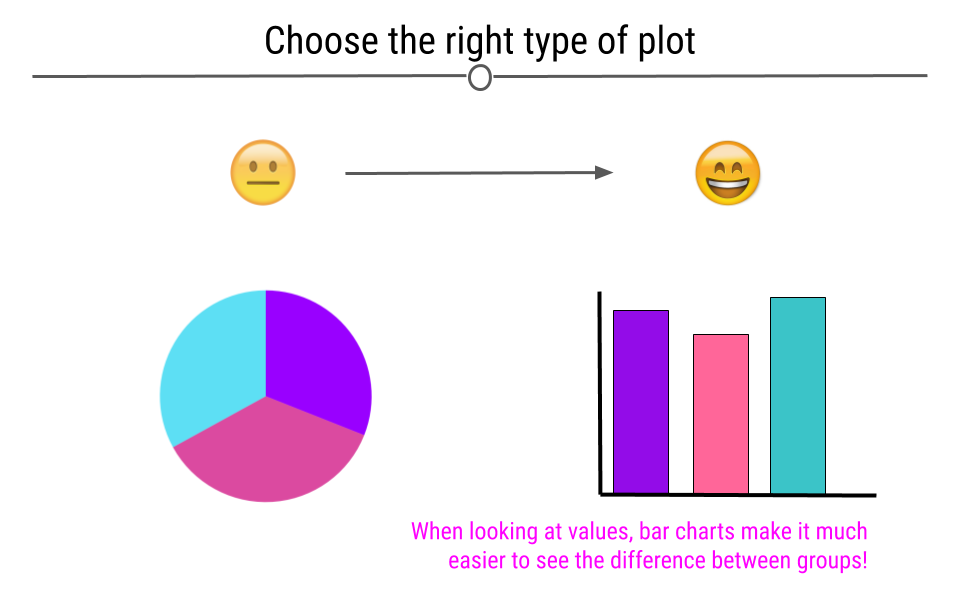
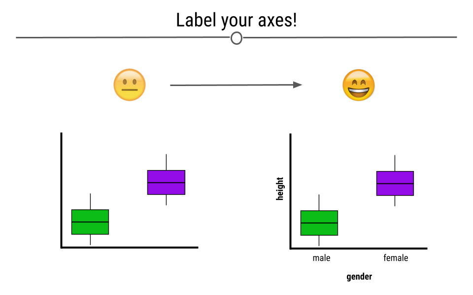
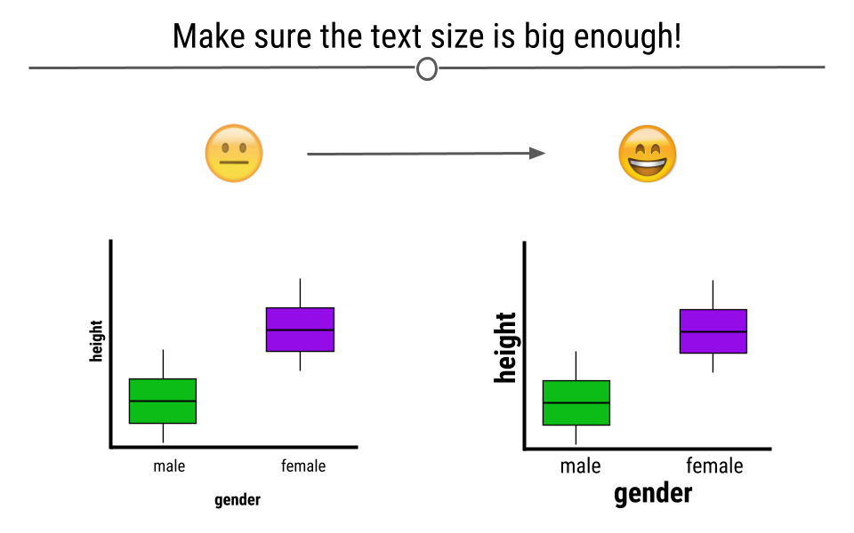
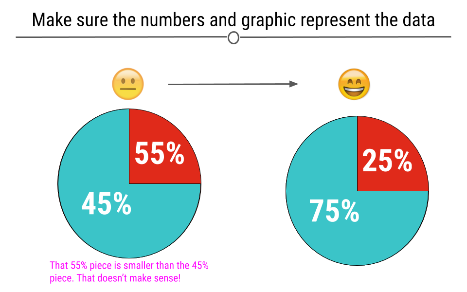
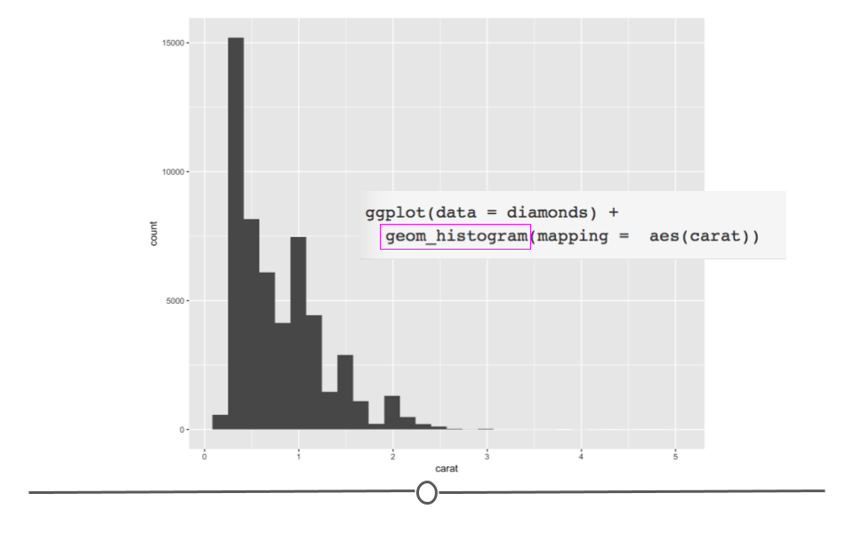
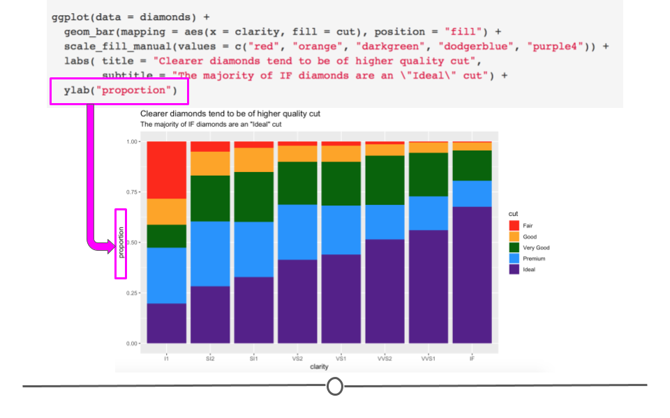
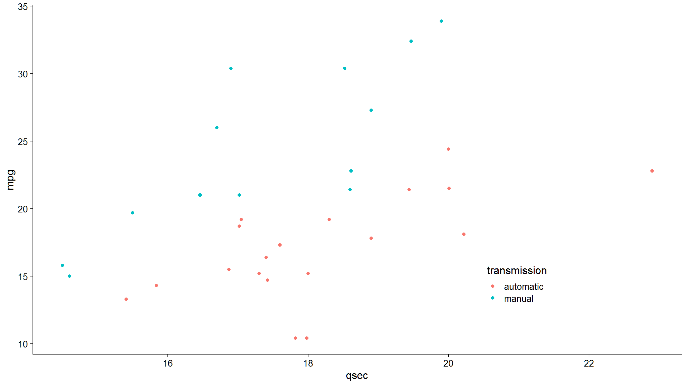

<script src="//yihui.org/js/math-code.js" defer></script>
<!-- Just one possible MathJax CDN below. You may use others. -->
<script defer
  src="//mathjax.rstudio.com/latest/MathJax.js?config=TeX-MML-AM_CHTML">
</script>


# Introduction

ggplot2 is an R package by Hadley Wickham and Winston Chang that implements Wilkinson's Grammar of Graphics. The emphasis of ggplot2 is on rapid exploration of data, and especially high-dimensional data. Think of base graphic functions as drawing with data (examples of base graphic functions are `plot()`, `points()`, and `lines()`. With base graphics, you have complete control over every pixel in a plot but it can take a lot of time and code to produce a plot.

The grammar of graphics implemented in `ggplot2` is based on the idea that you can build *any* plot as long as you have a few pieces of information. To start building plots in `ggplot2`, we'll need some data and we'll need to know the type of plot we want to make. The type of plot you want to make in `ggplot2` is referred to as a geom. This will get us started, but the idea behind ggplot2 is that every new concept we introduce will be layered on top of the information you've already learned. In this way, ggplot2 is *layered* - layers of information add on top of each other as you build your graph. In code written to generate a `ggplot2` figure, you will see each line is separated by a plus sign (`+`). Think of each line as a different layer of the graph. We're simply adding one layer on top of the previous layers to generate the graph. You'll see exactly what we mean by this throughout each section in this lesson.

Good graphical displays of data require rapid iteration and lots of exploration. If it takes you hours to code a plot in base graphics, you're unlikely to throw it out and explore other ways of visualizing the data, you're unlikely to explore all the dimensions of your data, and you're unlikely to discover problems with your data or models. 


# Making Good Plots

The goal of data visualization in data analysis is to improve understanding of the data.this could mean improving our own understanding of the data *or* using visualization to improve someone else's understanding of the data. 

# Choose the Right Type of Plot

If your goal is to allow the viewer to compare values across groups, pie charts should largely be avoided. This is because it's easier for the human eye to differentiate between bar heights than it is between similarly-sized slices of a pie. Thinking about the best way to visualize your data before making the plot is an important step in the process of data visualization.





# Be Mindful When Choosing Colors

Choosing colors that work for the story you're trying to convey with your visualization is important. Avoiding colors that are hard to see on a screen or when projected, such as pastels, is a good idea. Additionally, red-green color blindness is common and leads to difficulty in distinguishing reds from greens. Simply avoiding making comparisons between these two colors is a good first step when visualizing data. 


Beyond red-green color blindness, there is an entire group of experts out there in color theory.To learn more about available [color palettes in R](https://github.com/EmilHvitfeldt/r-color-palettes) or to read more from a pro named Lisa Charlotte Rost [talking about color choices in data visualization](https://lisacharlotterost.github.io/2016/04/22/Colors-for-DataVis/), feel free to read more.


# Label the Axes

Whether you're making an exploratory or explanatory visualization, labeled axes are a must. They help tell the story of the figure. Making sure the axes are clearly labeled is also important. Rather than labeling the graph below with "h" and "g," we chose the labels "height" and "gender," making it clear to the viewer exactly what is being plotted.




### Make Sure the Text is Readable

Often text on plots is too small for viewers to read. By being mindful of the size of the text on your axes, in your legend, and used for your labels, your visualizations will be greatly improved.




# Make Sure the Numbers Add Up

When you're making a plot that should sum to 100, make sure that it in fact does. Taking a look at visualizations after you make them to ensure that they make sense is an important part of the data visualization process. 


# Make Sure the Numbers and Plots Make Sense Together

Another common error is having labels that don't reflect the underlying graphic. For example, here, we can see on the left that the turquoise piece is more than half the graph, and thus the label 45% must be incorrect. At right, we see that the labels match what we see in the figure.





# Make Comparisons Easy on Viewers

There are many ways in which you can make comparisons easier on the viewer. For example, avoiding unnecessary whitespace between the bars on your graph can help viewers make comparisons between the bars on the barplot.


# Use y-axes That Start at Zero

Often, in an attempt to make differences between groups look larger than they are, y-axis will be started at a value other than zero. This is misleading. Y-axis for numerical information should start at zero. 


# Keep It Simple

The goal of data visualization is to improve understanding of data. Sometimes complicated visualizations cannot be avoided; however, when possible, keep it simple. 

Here, the graphic on the left does not immediately convey a main point. It's hard to interpret what each point means or what the story of this graphic is supposed to be. In contrast, the graphics on the right are simpler and each show a more obvious story. Make sure that your main point comes through:


Let's look at some illustrative ggplot2 code:


```r
library(dplyr)
library(ggplot2)
# fake data:
d <- data.frame(x = c(1:8, 1:8), y = runif(16),
  group1 = rep(gl(2, 4, labels = c("a", "b")), 2),
  group2 = gl(2, 8))
head(d)
#>   x         y group1 group2
#> 1 1 0.4020217      a      1
#> 2 2 0.9453288      a      1
#> 3 3 0.3134161      a      1
#> 4 4 0.9542361      a      1
#> 5 5 0.8777534      b      1
#> 6 6 0.1413235      b      1
```


```r
ggplot(data = d, aes(x = x, y = y, colour = group1)) + geom_point() +
  facet_grid(~group2)
```


The basic format in this example is:

1.  `ggplot()`: start an object and specify the data

2.  `geom_point()`: we want a scatter plot; this is called a "geom"

3.  `aes()`: specifies the "aesthetic" elements; a legend is automatically created

4.  `facet_grid()`: specifies the "faceting" or panel layout

There are also statistics, scales, and annotation options, among others. At a minimum, you must specify the data, some aesthetics, and a geom and we will focus on those today.


# Geoms

`geom` refers to a geometric object. It determines the “shape” of the plot elements. Some common geoms:

`geom`              | Description
------------------- | -----------
`geom_point()`      | Points
`geom_line()`       | Lines
`geom_ribbon()`     | Ribbons, y range with continuous x values
`geom_polygon()`    | Polygon, a filled path
`geom_pointrange()` | Vertical line with a point in the middle
`geom_linerange()`  | An interval represented by a vertical line
`geom_path()`       | Connect observations in original order
`geom_histogram()`  | Histograms
`geom_text()`       | Text annotations
`geom_violin()`     | Violin plot (another name for a beanplot)
`geom_map()`        | Polygons on a map


```r
# load the tidyverse
library(tidyverse)
```

As we get started plotting in `ggplot2`, plots will take the following general form:


```r
ggplot(data = DATASET) + 
  geom_PLOT_TYPE(mapping = aes(VARIABLE(S)))
```


When using `ggplot2` to generate figures, you will always begin by calling the `ggplot()` function. You'll then specify your dataset within the `ggplot()` function. Then, before making your plot you will also have to specify what **geom** type you're interested in plotting. We'll focus on a few basic geoms in the next section and give examples of each plot type (geom), but for now we'll just work with a single geom: `geom_point`. 

`geom_point` is most helpful for creating scatterplots. As a reminder from an earlier lesson, scatterplots are useful when you're looking at the relationship between two numeric variables. Within `geom` you will specify the arguments needed to tell `ggplot2` how you want your plot to look. 

You will map your variables using the aesthetic argument **`aes`**. We'll walk through examples below to make all of this clear. However, get comfortable with the overall look of the code now.

# Example Dataset: `diamonds`

To build your first plot in `ggplot2` we'll make use of the fact that there are some datasets already available in R. One frequently-used dataset is known as `diamonds`. This dataset contains prices and other attributes of 53,940 diamonds, with each row containing information about a different diamond. If you look at the first few rows of data, you can get an idea of what data are included in this dataset. 


```r
diamonds <- as_tibble(diamonds)
diamonds
#> # A tibble: 53,940 x 10
#>    carat cut       color clarity depth table price     x     y     z
#>    <dbl> <ord>     <ord> <ord>   <dbl> <dbl> <int> <dbl> <dbl> <dbl>
#>  1  0.23 Ideal     E     SI2      61.5    55   326  3.95  3.98  2.43
#>  2  0.21 Premium   E     SI1      59.8    61   326  3.89  3.84  2.31
#>  3  0.23 Good      E     VS1      56.9    65   327  4.05  4.07  2.31
#>  4  0.29 Premium   I     VS2      62.4    58   334  4.2   4.23  2.63
#>  5  0.31 Good      J     SI2      63.3    58   335  4.34  4.35  2.75
#>  6  0.24 Very Good J     VVS2     62.8    57   336  3.94  3.96  2.48
#>  7  0.24 Very Good I     VVS1     62.3    57   336  3.95  3.98  2.47
#>  8  0.26 Very Good H     SI1      61.9    55   337  4.07  4.11  2.53
#>  9  0.22 Fair      E     VS2      65.1    61   337  3.87  3.78  2.49
#> 10  0.23 Very Good H     VS1      59.4    61   338  4     4.05  2.39
#> # i 53,930 more rows
```


Here you see a lot of numbers and can get an idea of what data are available in this dataset. For example, in looking at the column names across the top, you can see that we have information about how many carats each diamond is (`carat`), some information on the quality of the diamond cut (`cut`), the color of the diamond from J (worst) to D (best) (`color`), along with a number of other pieces of information about each diamond.

We will use this dataset to better understand how to generate plots in R, using `ggplot2`.

# Scatterplots: `geom_point()`

In `ggplot2` we specify these by defining `x` and `y` *within* the `aes()` argument. The `x` argument defines which variable will be along the bottom of the plot. The `y` refers to which variable will be along the left side of the plot. If we wanted to understand the relationship between the number of carats in a diamond and that diamond's price, we may do the following:


```r
# generate scatterplot with geom_point()
ggplot(data = diamonds) + 
  geom_point(mapping = aes(x = carat, y = price))
```


In this plot, we see that, in general, the larger the diamond is (or the more carats it has), the more expensive the diamond is (price), which is probably what we would have expected. However, now, we have a plot that definitively supports this conclusion!

# Aesthetics

What if we wanted to alter the size, color or shape of the points? Probably unsurprisingly, these can all be changed within the aesthetics argument. After all, something's aesthetic refers to how something looks. Thus, if you want to change the look of your graph, you'll want to play around with the plot's aesthetics. 

In fact, in the plots above you'll notice that we specified what should be on the x and y axis within the `aes()` call. These are aesthetic mappings too! We were telling ggplot2 what to put on each axis, which will clearly affect how the plot looks, so it makes sense that these calls have to occur within `aes()`. Additionally now, we'll focus on arguments within `aes()` that change how the points on the plot look. 

# Point color

In the scatterplot we just generated, we saw that there was a relationship between carat and price, such that the more carats a diamond has, generally, the higher the price. But, it's not a perfectly linear trend. What we mean by that is that not all diamonds that were 2 carats were exactly the same price. And, not all 3 carat diamonds were exactly the same price. What if we were interested in finding out a little bit more about why this is the case?

Well, we could look at the clarity of the diamonds to see whether or not that affects the price of the diamonds? To add clarity to our plot, we could change the color of our points to differ based on clarity:


```r
# adjusting color within aes
ggplot(data = diamonds) + 
  geom_point(mapping = aes(x = carat, y = price, color = clarity))
```


Here, we see that not only are the points now colored by clarity, ggplot2 has also automatically added a legend for us with the various classes and their corresponding point color. 

By coloring our points by a different variable in the dataset, we now understand our dataset better. This is one of the goals of data visualization! And, specifically, what we're doing here in `ggplot2` is known as **mapping a variable to an aesthetic**. We took another variable in the dataset, mapped it to a color, and then put those colors on the points in the plot. Well, we only told `ggplot2` what variable to map. It took care of the rest!


```r
# manually control color point outside aes
ggplot(data = diamonds) + 
  geom_point(mapping = aes(x = carat, y = price), color = "red") 
```


# Facets

In addition to mapping variables to different aesthetics, you can also opt to use facets to help make sense of your data visually. Rather than plotting all the data on a single plot and visually altering the point size or color of a third variable in a scatterplot, you could break each level of that third variable out into a separate subplot. To do this, you would use faceting. Faceting is particularly helpful for looking at categorical variables. 

To use faceting, you would add an additional layer (+) to your code and use the `facet_wrap()` function. Within facet wrap, you specify the variable by which you want your subplots to be made:


```r
ggplot(data = diamonds) + 
  geom_point(mapping = aes(x = carat, y = price)) + 
  # facet by clarity
  facet_wrap(~clarity, nrow = 2)
```


Here, read the tilde as the word "by". Specifically here, we want a scatterplot of the relationship between carat and price and we want it faceted (broken down) **by (~)** clarity.


Now, we have eight different plots, one for each level of clarity, where we can see the relationship between diamond carats and price.

You'll note here we've opted to specify that we want 2 rows of subplots (`nrow = 2`). You can play around with the number of rows you want in your output to customize how your output plot appears. 

# Geoms

Thus far in this lesson we've only looked at scatterplots, which means we've only called `geom_point`. However, there are *many* additional geoms that we could call to generate different plots. Simply, a *geom* is just a shape we use to represent the data. In the case of scatterplots, they don't *really* use a geom since each actual point is plotted individually. Other plots, such as the boxplots, barplots, and histograms we described in previous lessons help to summarize or represent the data in a meaningful way, without plotting each individual point. The shapes used in these different types of plots to represent what's going on in the data is that plot's geom. 

To see exactly what we mean by geoms being "shapes that represent the data", let's keep using the `diamonds` dataset, but instead of looking at the relationship between two numeric variables in a scatterplot, let's take a step back and take a look at a single numeric variable using a histogram. 

# Histograms: `geom_histogram`

To review, histograms allow you to quickly visualize the range of values your variable takes and the shape of your data. (Are all the numbers clustered around center? Or, are they all at the extremes of the range? Somewhere in between? The answers to these questions describe the "shape" of the values of your variable.

For example, if we wanted to see what the distribution of carats was for these data, we could to the following.


```r
# change geom_ to generate histogram
ggplot(data = diamonds) + 
  geom_histogram(mapping =  aes(carat))
```





# Barplots: geom_bar

Barplots show the relationship between a set of numbers and a **categorical** variable. In the diamonds dataset, we may be interested in knowing how many diamonds there are of each cut of diamonds. There are five categories for cut of diamond. If we make a barplot for this variable, we can see the number of diamonds in each category.


```r
# geom_bar for bar plots
ggplot(data = diamonds) + 
  geom_bar(mapping = aes(cut))
```


Again, the changes to the code are minimal. We are now interested in plotting the categorical variable `cut` and state that we want a bar plot, by including `geom_bar()`. 


Here, we again use rectangular shapes to represent the data, but we're not showing the distribution of a single variable (as we were with `geom_histogram`). Rather, we're using rectangles to show the count (number) of diamonds within each category within cut. Thus, we need a different geom: `geom_bar`!

# Boxplots: `geom_boxplot`

Boxplots provide a summary of a numerical variable across categories. For example, if you were interested to see how the price of a diamond (a numerical variable) changed across different diamond color categories (categorical variable), you may want to use a boxplot. To do so, you would specify that using `geom_boxplot`:


```r
# geom_boxplot for boxplots
ggplot(data = diamonds) + 
  geom_boxplot(mapping = aes(x = color, y = price))
```


In the code, we see that again, we only have to change what variables we want to be included in the plot and the type of plot (or geom). We want to use `geom_boxplot()` to get a basic boxplot.


In the figure itself we see that the median price (the black horizontal bar in the middle of each box represents the median for each category) increases as the diamond color increases from the worst category (J) to the best (D).


Now, if you wanted to change the color of this boxplot, it would just take a small addition to the code for the plot you just generated.


```r
# fill globally changes bar color outside aes
ggplot(data = diamonds) + 
  geom_boxplot(mapping = aes(x = color, y = price), 
               fill = "red")
```


Here, by specifying the color "red" in the `fill` argument, you're able to change the plot's appearance. In the next lesson, we'll go deeper into the many ways in which a plot can be customized within `ggplot2`!

# `ggplot2`: Customization

So far, we have walked through the steps of generating a number of different graphs (using different `geoms`) in `ggplot2`. We discussed the basics of mapping variables to your graph to customize its appearance or aesthetic (using size, shape, and color within `aes()`). Here, we'll build on what we've previously learned to really get down to how to customize your plots so that they're as clear as possible for communicating your results to others. 


Since we're already familiar with it, we'll continue to use the `diamonds` dataset that we've been using to learn about `ggplot2`.

# Colors

To get started, we'll learn how to control color across plots in `ggplot2`. Previously, we discussed using color within `aes()` on a scatterplot to automatically color points by the clarity of the diamond when looking at the relationship between price and carat.


```r
ggplot(diamonds) + 
  geom_point(mapping = aes(x = carat, y = price, color = clarity))
```


However, what if we wanted to carry this concept over to a bar plot and look at how many diamonds we have of each clarity group?


```r
# generate bar plot
ggplot(diamonds) + 
  geom_bar(aes(x = clarity))
```


As a general note, we've stopped including `data =` and `mapping =` here within our code. We included it so far to be explicit; however, in code you see in the world, the names of the arguments will typically be excluded and we want you to be familiar with code that appears as you see above.


OK, well that's a start since we see the breakdown, but all the bars are the same color. What if we adjusted color within `aes()`?


```r
# color changes outline of bar
ggplot(diamonds) + 
  geom_bar(aes(x = clarity, color = clarity))
```


As expected, color added a legend for each level of clarity; however, it colored the lines around the bars on the plot, rather than the bars themselves. In order to color the bars themselves, you want to specify the more helpful argument `fill`:


```r
# use fill to color bars
ggplot(diamonds) + 
  geom_bar(aes(x = clarity, fill = clarity))
```


Color is particularly helpful here, however, if we wanted to map a *different* variable onto each bar. For example, what if we wanted to see the breakdown of diamond "cut" within each "clarity" bar? 


```r
# fill by separate variable (cut) = stacked bar chart
ggplot(diamonds) + 
  geom_bar(aes(x = clarity, fill = cut))
```


Now we're getting some new information! We can see that each level in clarity appears to have diamonds of all levels of cut. Color here has really helped us understand more about the data.

But what if we were going to present these data? While there is no comparison between red and green (which is good!), there is a fair amount of yellow in this plot. Some projectors don't handle projecting yellow well, and it will show up too light on the screen. To avoid this, let's manually change the colors in this bar chart! To do so we'll add an additional layer to the plot using `scale_fill_manual`.


```r
ggplot(diamonds) + 
  geom_bar(aes(x = clarity, fill = cut)) +
  # manually control colors used
  scale_fill_manual(values = c("red", "orange", "darkgreen", "dodgerblue", "purple4"))
```


Here, we've specified five different colors within the `values` argument of `scale_fill_manual()`, one for each cut of diamond. The names of these colors can be specified using the names explained on the third page of the cheatsheet [here](https://www.nceas.ucsb.edu/~frazier/RSpatialGuides/colorPaletteCheatsheet.pdf). (Note: There are other ways to specify colors within R. Explore the details in that cheatsheet to better understand the various ways!)

What we've just generated is a **stacked bar chart**. It's a pretty good name for this type of chart as the bars for cut are all stacked on top of one another. If you don't want a stacked bar chart you could use one of the other `position` options: `identity`, `fill`, or `dodge`.


Returning to our question about proportion of each cut within each clarity group, we'll want to use `position = "fill"` within `geom_bar()`. Building off of what we've already done:


```r
ggplot(diamonds) + 
  # fill scales to 100%
  geom_bar(aes(x = clarity, fill = cut), position = "fill") +
  scale_fill_manual(values = c("red", "orange", "darkgreen", "dodgerblue", "purple4"))
```


Here, we've specified how we want to adjust the position of the bars in the plot. Each bar is now of equal height and we can compare each colored bar across the different clarities. As expected, we see that among the best clarity group (IF), we see more diamonds of the best cut ("Ideal")!


Briefly, we'll take a quick detour to look at `position = "dodge"`. This position adjustment places each object *next to one another*. This will not allow for easy comparison across groups, as we just saw with the last group but will allow values within each clarity group to be visualized.


```r
ggplot(diamonds) + 
  # dodge rather than stack produces grouped bar plot
  geom_bar(aes(x = clarity, fill = cut), position = "dodge") +
  scale_fill_manual(values = c("red", "orange", "darkgreen", "dodgerblue", "purple4"))
```


# Labels

Text on plots is incredibly helpful. A good title tells viewers what they should be getting out of the plot. Axis labels are incredibly important to inform viewers of what's being plotted. Annotations on plots help guide viewers to important points in the plot. We'll discuss how to control all of these now!

# Titles 

Now that we have an understanding of how to manually adjust color, let's improve the clarity of our plots by including helpful labels by adding an additional `labs()` layer. We'll return to the plot where we were comparing proportions of diamond cut across diamond clarity groups.

You can include a `title`, `subtitle`, and/or `caption` within the `labs()` function. Each argument, as per usual, will be specified by a comma. 


```r
ggplot(diamonds) + 
  geom_bar(aes(x = clarity, fill = cut), position = "fill") +
  scale_fill_manual(values = c("red", "orange", "darkgreen", "dodgerblue", "purple4")) +
  # add titles
  labs(title = "Clearer diamonds tend to be of higher quality cut",
       subtitle = "The majority of IF diamonds are an \"Ideal\" cut")
```


 
 
# Axis labels
 
You may have noticed that our y-axis label says "count", but it's not actually a count anymore. In reality, it's a proportion. Having appropriately labeled axes is *so important*. Otherwise, viewers won't know what's being plotted. So, we should really fix that now using the `ylab()` function. Note: we won't be changing the x-axis label, but if you were interested in doing so, you would use `xlab("label")`.


```r
ggplot(diamonds) + 
  geom_bar(aes(x = clarity, fill = cut), position = "fill") +
  scale_fill_manual(values = c("red", "orange", "darkgreen", "dodgerblue", "purple4")) +
  labs(title = "Clearer diamonds tend to be of higher quality cut",
       subtitle = "The majority of IF diamonds are an \"Ideal\" cut") +
  # add y axis label explicitly
  ylab("proportion")
```


Note that the x- and y- axis labels can *also* be changed within `labs()`, using the argument (`x = ` and `y =` respectively).



 

# `cowplot`

#### Theme

The standard theme within `cowplot`, which works for many types of plots is `theme_cowplot()`. This theme is very similar to `theme_classic()`, which removes the background color, removes grid lines, and plots only the x- and y- axis lines (rather than a box around all the data). We'll use this theme for the examples from this package. However, note that there are a number of additional themes available from the `cowplot` package. We will use the number 12 within this function to indicate that we want to use a font size of 12.


```r
# install and load package
# install.packages("cowplot")
library(cowplot)
```


We'll continue to use the `mtcars` dataset for these examples.

```r
mtcars <- mtcars %>%
  mutate(transmission = fct_recode(as.factor(am), "automatic" = "0", "manual" = "1"),
         engine = fct_recode(as.factor(vs), "v-shaped" = "0", "straight" = "1"))
```


We'll use these data to generate a scatterplot plotting the relationship between 1/4 mile speed (`qsec`) and gas mileage (`mpg`). We'll color the points by this new column `transmission` and apply `theme_cowplot`. Finally, we'll assign this to `p1`, as we'll ultimately generate a few different plots.


```r
p1 <- ggplot(mtcars, aes(qsec, mpg, color = transmission)) + 
  geom_point() +
  theme_cowplot(12) + 
  theme(legend.position = c(0.7, 0.2))
p1
```




Let's make a similar plot, but color by engine type. We'll want to manually change the colors here so that we aren't using the same colors for transmission and engine. We'll store this in `p2`.


```r
p2 <- ggplot(mtcars, aes(qsec, mpg, color = engine)) + 
  geom_point() +
  scale_color_manual(values = c("red", "blue")) +
  theme_cowplot(12) +
  theme(legend.position = c(0.7, 0.2))
```


```r
p2
```


Great - we've now got two plots with the same theme and similar appearance. What if we wanted to combine these into a single grid for presentation purposes?

# Multiple Plots

Combining plots is made simple within the `cowplot` package using the `plot_grid()` function:


```r
# plot side by side
plot_grid(p1, p2, ncol = 2)
```


Here, we specify the two plots we'd like to plot on a single grid and we also optionally include how many columns we'd like using the `ncol` parameter. 


To plot these one on top of the other, you could specify for `plot_grid()` to use a single column.


```r
# plot on top of one another
plot_grid(p1, p2, ncol = 1)
```


Note that by default, the plots will share the space equally, but it's also possible to make one larger than the other within the grid using `rel_widths` and `rel_heights`.

For example, if you had a faceted plot summarizing the number of cars by transmission and engine (which we'll call `p3`):


```r
# generate faceted plot
p3 <- ggplot(mtcars, aes(engine)) + 
  geom_bar() + 
  facet_wrap(~transmission) +
  scale_y_continuous(expand = expand_scale(mult = c(0, 0.1))) +
  theme_minimal_hgrid(12) +
  panel_border(color = "black") +
  theme(strip.background = element_rect(fill = "gray80"))
```


```r
p3
```


Note that for this plot we've chosen a different theme, allowing for horizontal grid lines. This can be helpful when visualizing bar plots.


If we were to plot these next to one another using the defaults, the faceted plot would be squished:


```r
# plot next to one another
plot_grid(p1, p3)
```


We can use `rel_widths` to specify the relative width for the plot on the left relative to the plot on the right: 


```r
# control relative spacing within grid
plot_grid(p1, p3, rel_widths = c(1, 1.3))
```


Notice how the plot on the left is now a bit more narrow and the plot on the right is a bit wider.


# `patchwork`

The `patchwork` package is similar to the `cowplot` package in that they both are helpful for combining plots together. They each allow for different plot modifications, so it is useful to know about both packages.

With the `patchwork` package, plots can be combined using a few operators, such as `"+"`, `"/"`, and `"|".

To combine two plots together we can simply add them together with the `+` sign or place them next to one another using the `|`:


```r
#install.packages(patchwork)
library(patchwork)
p1 + p2
```


```r
p1 | p2
```


If we want a plot above another plot we can use the "/" symbol:

