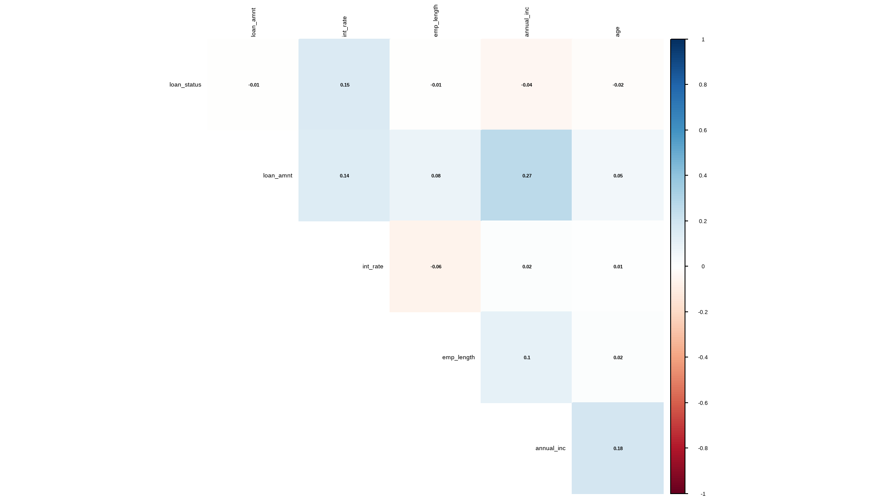
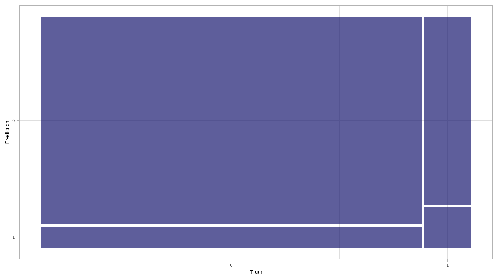

<script src="index.en_files/htmlwidgets/htmlwidgets.js"></script>
<script src="index.en_files/plotly-binding/plotly.js"></script>
<script src="index.en_files/typedarray/typedarray.min.js"></script>
<script src="index.en_files/jquery/jquery.min.js"></script>
<link href="index.en_files/crosstalk/css/crosstalk.min.css" rel="stylesheet" />
<script src="index.en_files/crosstalk/js/crosstalk.min.js"></script>
<link href="index.en_files/plotly-htmlwidgets-css/plotly-htmlwidgets.css" rel="stylesheet" />
<script src="index.en_files/plotly-main/plotly-latest.min.js"></script>
<script src="//yihui.org/js/math-code.js" defer></script>
<!-- Just one possible MathJax CDN below. You may use others. -->
<script defer
  src="//mathjax.rstudio.com/latest/MathJax.js?config=TeX-MML-AM_CHTML">
</script>

### Machine Learning Scientist With an R track

[View certificate](https://www.datacamp.com/statement-of-accomplishment/track/25b6113cff605043f45a51720cfbcb68068016f4?raw=1)


## A gentle introduction to classification

### 

> *Classification* is a form of machine learning in which you train a model to predict which category an item belongs to. *Categorical* data has distinct ‘classes’, rather than numeric values.

### Details

Classification is an example of a *supervised* machine learning technique, which means it relies on data that includes known *feature* values (for example, diagnostic measurements for patients) as well as known *label* values (for example, a classification of non-diabetic or diabetic). A classification algorithm is used to fit a subset of the data to a function that can calculate the `probability` for each class label from the feature values. The remaining data is used to evaluate the model by comparing the predictions it generates from the features to the known class labels.

The simplest form of classification is *binary* classification, in which the label is 0 or 1, representing one of two classes; for example, “True” or “False”; “Internal” or “External”; “Profitable” or “Non-Profitable”; and so on.

## setup libraries

``` r
suppressWarnings(if(!require("pacman")) install.packages("pacman"))

pacman::p_load('tidyverse', 
               'tidymodels', 
               'ranger',
               "themis",
               "dlookr",
               "naniar",
               "VIM",
               'vip', 
               'skimr', 
               'here', 
               'kernlab',
               'janitor', 
               'paletteer',
               "ggthemes",
               "data.table",
               "magrittr")

lst <- c(
    'tidyverse', 
               'tidymodels', 
               'ranger',
               "themis",
               "dlookr",
               "naniar",
               "VIM",
               'vip', 
               'skimr', 
               'here', 
               'kernlab',
               'janitor', 
               'paletteer',
               "ggthemes",
               "data.table",
               "magrittr"
)

as_tibble(installed.packages())  |>
  select(Package, Version)  |> 
  filter(Package %in% lst)
#> # A tibble: 16 x 2
#>    Package    Version
#>    <chr>      <chr>  
#>  1 data.table 1.14.8 
#>  2 dlookr     0.6.2  
#>  3 ggthemes   4.2.4  
#>  4 here       1.0.1  
#>  5 janitor    2.2.0  
#>  6 kernlab    0.9-32 
#>  7 magrittr   2.0.3  
#>  8 naniar     1.0.0  
#>  9 paletteer  1.5.0  
#> 10 ranger     0.15.1 
#> 11 skimr      2.1.5  
#> 12 themis     1.0.2  
#> 13 tidymodels 1.1.1  
#> 14 tidyverse  2.0.0  
#> 15 VIM        6.2.2  
#> 16 vip        0.4.1
```

## Binary classification

Let’s start by looking at an example of *binary classification*, where the model must predict a label that belongs to one of two classes. In this exercise, we’ll train a binary classifier to predict whether or not a customer defaulted from a loan or not or not.

## Import the data and clean

The first step in any machine learning project is to `explore the data` . So, let’s begin by importing a CSV file of loan data into a `tibble` (a modern a modern reimagining of the data frame):

``` r
# Read the csv file into a tibble
loan_data <- read_csv(file = "loan_data.csv") |> 
  dplyr::select(-1) |> 
  mutate(`default status`=ifelse(loan_status==1,
                               "defaulted","non-default")) |>
  mutate_if(is.character,as.factor)
```

## data exploration

``` r
## to avoid function conflicts

group_by<-dplyr::group_by
select<-dplyr::select

iv_rates <- loan_data |>
  select(home_ownership, loan_status) |>
  mutate(home_ownership=as.factor(home_ownership)) |> 
  group_by(home_ownership) |>
  summarize(avg_div_rate = mean(loan_status, na.rm=TRUE)) |>
  ungroup() |>
  mutate(
    regions = home_ownership |>
      fct_reorder(avg_div_rate))

plot<-iv_rates |>
  ggplot(aes(x=regions, y=avg_div_rate, fill=regions)) + 
  geom_col(color="black",width = 0.5)+ 
  theme(legend.position="bottom") + 
  geom_label(aes(label=scales::percent(avg_div_rate)), color="white") + 
  labs(
    title = "default status by Home ownership status",
    subtitle = "Credit Risk theory",
    y = "Default Rates", 
    x = "home ownership",
    fill="home ownership",
    caption="B.Ncube::Data enthusiast") + 
  scale_y_continuous(labels = scales::percent)
plot
```


### Make it look more fancy!

``` r
library(tvthemes)
library(extrafont)
loadfonts(quiet=TRUE)

plot+
  ggthemes::scale_fill_tableau()+
  tvthemes::theme_theLastAirbender(title.font="sans",text.font = "sans")
```


## crosstabs

- How to use crosstabs in base R

``` r
loan_data |> 
  select_if(is.factor) %$%
  table(grade,home_ownership) |> 
  prop.table() * (100) |> 
  round(2)
#>      home_ownership
#> grade     MORTGAGE        OTHER          OWN         RENT
#>     A 16.722810395  0.082496906  2.866767496 13.495118933
#>     B 12.477657088  0.109995875  2.450845593 17.028736422
#>     C  6.909115908  0.054997938  1.491819057 11.302076172
#>     D  3.715798158  0.054997938  0.859342775  6.476007150
#>     E  1.051835556  0.024061598  0.178743297  1.728997663
#>     F  0.285301801  0.006874742  0.044685824  0.388422934
#>     G  0.092809020  0.000000000  0.017186855  0.082496906
```

- let’s use `janitor` for crosstabs

``` r
loan_data |> 
  tabyl(grade,home_ownership) |> 
  adorn_totals(c('row','col')) |> # add  total for both rows and columns
  adorn_percentages("all") |> # pct among all for each cell
  adorn_pct_formatting(digits = 1)  |> 
  adorn_ns() # add counts 
#>  grade       MORTGAGE     OTHER          OWN           RENT           Total
#>      A 16.7%  (4,865) 0.1% (24) 2.9%   (834) 13.5%  (3,926)  33.2%  (9,649)
#>      B 12.5%  (3,630) 0.1% (32) 2.5%   (713) 17.0%  (4,954)  32.1%  (9,329)
#>      C  6.9%  (2,010) 0.1% (16) 1.5%   (434) 11.3%  (3,288)  19.8%  (5,748)
#>      D  3.7%  (1,081) 0.1% (16) 0.9%   (250)  6.5%  (1,884)  11.1%  (3,231)
#>      E  1.1%    (306) 0.0%  (7) 0.2%    (52)  1.7%    (503)   3.0%    (868)
#>      F  0.3%     (83) 0.0%  (2) 0.0%    (13)  0.4%    (113)   0.7%    (211)
#>      G  0.1%     (27) 0.0%  (0) 0.0%     (5)  0.1%     (24)   0.2%     (56)
#>  Total 41.3% (12,002) 0.3% (97) 7.9% (2,301) 50.5% (14,692) 100.0% (29,092)
```

## further exploration

``` r

cont_table <- loan_data %$% 
  table(grade,home_ownership)

# Let's create a frequency table

freq_df <- apply(cont_table, 2, function(x) round(x/sum(x),2))
                 
# Change the structure of our frequency table.
melt_df <- melt(freq_df)
```

``` r
names(melt_df) <- c("grade", "home_ownership", "Frequency")


ggplot(melt_df, aes(x = grade, y = Frequency, fill = home_ownership)) +
  geom_col(position = "stack") +
  facet_grid(home_ownership ~ .) + 
scale_fill_brewer(palette="Dark2") + theme_minimal() + theme(legend.position="None") +
  ggthemes::scale_fill_tableau()+
  ggthemes::theme_fivethirtyeight()
```


- most people in both home ownership statuses are of `salary grade A`

## Mosaic plot

``` r
conti_df <- loan_data %$% 
  table(grade,home_ownership) |> 
  as.data.frame.matrix()


conti_df$groupSum <- rowSums(conti_df)
conti_df$xmax <- cumsum(conti_df$groupSum)
conti_df$xmin <- conti_df$xmax - conti_df$groupSum
# The groupSum column needs to be removed; don't remove this line
conti_df$groupSum <- NULL

conti_df$grade <- rownames(conti_df)

melt_df <- melt(conti_df, id.vars = c("grade", "xmin", "xmax"), variable.name = "home_ownership")

df_melt <- melt_df |>
  group_by(grade) |>
  mutate(ymax = cumsum(value/sum(value)),
         ymin = ymax - value/sum(value))


index <- df_melt$xmax == max(df_melt$xmax)


df_melt$xposn <- df_melt$xmin + (df_melt$xmax - df_melt$xmin)/2

# geom_text for ages (i.e. the x axis)


p1<- ggplot(df_melt, aes(ymin = ymin,
                 ymax = ymax,
                 xmin = xmin,
                 xmax = xmax,
                 fill = home_ownership)) +
  geom_rect(colour = "white") +
  scale_x_continuous(expand = c(0,0)) +
  scale_y_continuous(expand = c(0,0)) +
  scale_fill_brewer(palette="RdBu") +
  theme_minimal() 

p1 + 
  geom_text(aes(x = xposn, label = grade),
            y = 0.15, angle = 90,
            size = 3, hjust = 1,
            show.legend = FALSE) + labs(title="Mosaic Plot") + theme(plot.title=element_text(hjust=0.5))+
  ggthemes::scale_fill_tableau()+
  ggthemes::theme_fivethirtyeight()
```


## Alluvial Diagram

``` r

library(alluvial)

tbl_summary <- loan_data |>
  mutate(default_status=ifelse(loan_status==1,
                               "defaulted","non-default")) |>
  group_by(default_status, grade, home_ownership) |>
  summarise(N = n()) |> 
  ungroup() |>
  na.omit()

  
alluvial(tbl_summary[, c(1:4)],

         freq=tbl_summary$N, border=NA,

         col=ifelse(tbl_summary$default_status == "defaulted", "blue", "gray"),

         cex=0.65,

         ordering = list(

           order(tbl_summary$default_status, tbl_summary$home_ownership=="RENT"),

           order(tbl_summary$grade, tbl_summary$home_ownership=="RENT"),

           NULL,

           NULL))
```


## distribution of numeric variables

``` r

# Histogram of all numeric variables
loan_data %>%
  keep(is.numeric) %>% 
  gather() %>% 
  ggplot(aes(value)) +
  facet_wrap(~ key, scales = "free") +
  geom_histogram(bins=30,fill=tvthemes::avatar_pal()(1))+
  ggthemes::theme_wsj()
```


## further exploration

``` r
library(ggpubr)
heatmap_tbl <- iv_rates <- loan_data |>
  select(home_ownership, loan_status,grade) |>
  mutate(home_ownership=as.factor(home_ownership)) |> 
  group_by(grade,home_ownership) |>
  summarize(avg_div_rate = mean(loan_status, na.rm=TRUE)) |>
  ungroup() |>
  mutate(
    regions = home_ownership |>
      fct_reorder(avg_div_rate)
)


heatmap_tbl |>
  ggplot(aes(grade, regions)) + 
  geom_tile(aes(fill=avg_div_rate))+
  scale_fill_gradient2_tableau()+ 
  facet_wrap(~grade) + 
  theme_minimal() + 
  theme(legend.position="none", axis.text.x = element_text(angle=45, hjust=1)) +
  geom_text(aes(label = scales::percent(avg_div_rate)), size=2.5) + 
labs(
    fill = "",
    title = "loan status by salary grade in grouped by home ownership",
    y="Home ownership"
)
```


## exploring for missing values

``` r
# checking if there are any missing values in the |>
anyNA(loan_data)
#> [1] TRUE

# explore the number of missing values per each variable
colSums(is.na(loan_data))
#>    loan_status      loan_amnt       int_rate          grade     emp_length 
#>              0              0           2776              0            809 
#> home_ownership     annual_inc            age default status 
#>              0              0              0              0

# get the proportion of missing data 
prop_miss(loan_data)
#> [1] 0.01369219

# get the summary of missing data
miss_var_summary(loan_data)
#> # A tibble: 9 x 3
#>   variable       n_miss pct_miss
#>   <chr>           <int>    <dbl>
#> 1 int_rate         2776     9.54
#> 2 emp_length        809     2.78
#> 3 loan_status         0     0   
#> 4 loan_amnt           0     0   
#> 5 grade               0     0   
#> 6 home_ownership      0     0   
#> 7 annual_inc          0     0   
#> 8 age                 0     0   
#> 9 default status      0     0
```

We can explore the pattern of missing data using `aggr()` function from `VIM`. The `numbers` and `prop` arguments indicate that we want the missing information on the y-axis of the plot to be in number not proportion.

``` r
aggr(loan_data, numbers = TRUE, prop = FALSE)
```


``` r
dlookr::plot_na_pareto(loan_data)
```


- The proportion of missing values to the whole dataset seems so small to be neglected
- counts and proportions of missing values are presented in the pareto chart in descenting order by bars

``` r
dlookr::plot_na_hclust(loan_data)
```


## Discriptive statistics

``` r
select<-dplyr::select
loan_data <- loan_data |>
  mutate(`default status`=ifelse(loan_status==1,"defaulted","non-default")) 

mental_act<- loan_data |> 
  select(`default status`,grade) |>
  table()

# chisquared test
res <-chisq.test(mental_act)
# extract chi-sqaured test objects
result_method <- res$method
result_stat <- paste0(attributes(res$statistic), ": ", round(res$statistic, 2))
result_pvalue <- paste0("p-value: ", scientific(res$p.value,5))
result_df <- paste0(attributes(res$parameter), ": ", res$parameter)
#create the plot
loan_data |>
  ggplot(aes(`default status`, fill = grade)) +
  geom_bar(position = "fill")+
  annotate("text", x = 1.5, y = 0.6, size = 3, color = "black", label = result_method, fontface = "bold")+
  annotate("text", x = 1.5, y = 0.55, size = 3, color = "black", label = result_stat, fontface = "bold")+
  annotate("text", x = 1.5, y = 0.5, size = 3, color = "black", label = result_pvalue, fontface = "bold")+
  annotate("text", x = 1.5, y = 0.45, size = 3, color = "black", label = result_df, fontface = "bold")+
  annotate("text", x = 1.5, y = 0.4, size = 3, color = "black", label = "The test shows a significant association between default status and grade", fontface = "bold")+
  theme(axis.title.y = element_blank())+
  labs(title = "default by grade",
       subtitle = "grade A and B are more prone to default",
       x = "default status",
       fill= "grade",
       y="Proportion",
       caption = "Visualisation: Bongani Ncube | Data: Credit risk")+
  tvthemes::scale_fill_avatar()+
  tvthemes::theme_avatar()
```


- there is an association between grade and default status at 5% level of significance

## boxplots

``` r
subset <- loan_data |>
  dplyr::select(-loan_status,-grade,-home_ownership) |> 
  na.omit()


# Bring in external file for visualisations
source('functions/visualisations.R')

# Use plot function
plot <- histoplotter(subset, `default status`, 
                     chart_x_axis_lbl = '`default status`', 
                     chart_y_axis_lbl = 'Measures',boxplot_color = 'navy', 
                     boxplot_fill = '#89CFF0', box_fill_transparency = 0.2) 

# Add extras to plot
plot + 
  ggthemes::theme_solarized() +
  theme(legend.position = 'none') + 
  scale_color_manual(values=c('defaulted' = 'red', 
                              'non-defaulted' = 'blue'))
```


- boxplots show that age and annual income have outliers

``` r
p_term <- ggplot(loan_data , aes(x=as.factor(home_ownership) ,fill = `default status`)) + 
  stat_count(aes(y = (..count..)/sum(..count..)), 
             geom="bar", position="fill", width = 0.3)  + 
  scale_y_continuous(labels = percent_format())+
  labs(x="Loan Term in Months", y="Ratio") + 
  ggtitle("Ratio of loan status w.r.t grade") + 
  theme_hc(base_size = 18, base_family = "sans") + 
  ggthemes::scale_fill_tableau()+
  ggthemes::theme_fivethirtyeight()+
  tvthemes::scale_fill_avatar() + 
  theme(plot.background = element_rect(fill="white"), axis.text.x = element_text(colour = "black"),axis.text.y = element_text(colour = "black")) 
      # View Plot  
p_term
```


- Let’s check now default ratio vs huge and small loans (say something above and below median)

``` r
# default ratio vs huge and small loans

loan_data %>%
  mutate(high_low=ifelse(loan_amnt>median(loan_amnt),"high","low")) %>% 
  select(loan_status, high_low) %>%
  group_by(loan_status, high_low) %>%
  summarise(NObs = n()) %>%
  group_by(high_low) %>%
  mutate(default_Ratio = if_else(loan_status == 1, round(NObs/sum(NObs)*100,2), NA_real_)) %>%
  mutate(loan_status = loan_status |> as.factor()) %>%
  ggplot() +
  geom_bar(aes(high_low, NObs, fill = loan_status), alpha = 0.5, stat = "identity", position = "dodge") +
  geom_line(data = . %>% filter(loan_status == "1"),
            aes(high_low, default_Ratio *100, group = loan_status), col = "firebrick") +
  geom_point(data = . %>% filter(loan_status == "1"),
             aes(high_low, default_Ratio *100), size = 2, col = "firebrick") +
  labs(title = "default Ratio  vs loan amount",
       y = "Number of observations") +
  tvthemes::scale_fill_avatar() +
  scale_y_continuous(sec.axis = sec_axis(~ . / 100)) +
  theme(plot.title = element_text(hjust = 0.5, size = 14))
```


## let\`s look at correlations

``` r
mydatacor=cor(loan_data |> select_if(is.numeric) |> na.omit())
corrplot::corrplot(mydatacor,
                   method="color",type="upper",
                   addCoef.col="black",
                   tl.col="black",
                   tl.cex=0.9,
                   diag=FALSE,
                   number.cex=0.7
)
```



- there is a small degree of correlation between loan amount and annual income

## Modeling the data

### data preprocessing

- the proportion of missing values is small and hence can be neglected so for this tutorial i removed all missing values

``` r
# Remove missing data
cases<-complete.cases(loan_data)

loan_data_select<-loan_data[cases,] |> 
  mutate(loan_status=as.factor(loan_status)) 
```

## is the data balanced?

``` r
loadfonts(quiet=TRUE)

iv_rates <- loan_data_select |>
  group_by(`default status`) |>
  summarize(count = n()) |> 
  mutate(prop = count/sum(count)) |>
  ungroup() 

plot<-iv_rates |>
  ggplot(aes(x=`default status`, y=prop, fill=`default status`)) + 
  geom_col(color="black",width = 0.5)+ 
  theme(legend.position="bottom") + 
  geom_label(aes(label=scales::percent(prop)), color="white") + 
  labs(
    title = "default ratio",
    subtitle = "",
    y = "proportion(%)", 
    x = "",
    fill="",
    caption="B.Ncube::Data enthusiast") + 
  scale_y_continuous(labels = scales::percent)+ 
  tvthemes::scale_fill_kimPossible()+
  tvthemes::theme_theLastAirbender(title.font="sans",
                                   text.font = "sans")+
  theme(legend.position = 'right')
plot
```


- the dataset is not balanced so we have to perform `SMOTE` (synthetic Minority Oversampling Technique)

## Split the data

Our includes known values for the label, so we can use this to train a classifier so that it finds a statistical relationship between the features and the label value; but how will we know if our model is any good? How do we know it will predict correctly when we use it with new data that it wasn’t trained with?

It is best practice to hold out some of your data for **testing** in order to get a better estimate of how your models will perform on new data by comparing the predicted labels with the already known labels in the test set.

In R, the amazing Tidymodels framework provides a collection of packages for modeling and machine learning using **tidyverse** principles.

- `initial_split()`: specifies how data will be split into a training and testing set

- `training()` and `testing()` functions extract the data in each split

### data spliting

``` r
# Split data into 70% for training and 30% for testing
set.seed(2056)
loan_data_split <- loan_data_select|>
  select(-`default status`) |> 
  initial_split(prop = 0.70)


# Extract the data in each split
loan_data_train <- training(loan_data_split)
loan_data_test <- testing(loan_data_split)


# Print the number of cases in each split
cat("Training cases: ", nrow(loan_data_train), "\n",
    "Test cases: ", nrow(loan_data_test), sep = "")
#> Training cases: 17899
#> Test cases: 7672


# Print out the first 5 rows of the training set
loan_data_train|>
  slice_head(n = 5)
#> # A tibble: 5 x 8
#>   loan_status loan_amnt int_rate grade emp_length home_ownership annual_inc
#>   <fct>           <dbl>    <dbl> <fct>      <dbl> <fct>               <dbl>
#> 1 0               15000     16   D             15 OWN                 42996
#> 2 0                3250     11.5 B              6 MORTGAGE            67200
#> 3 0               21000      7.9 A              1 MORTGAGE           144000
#> 4 1                4475     16.9 D              3 RENT                13200
#> 5 0                6000     10.4 B             18 MORTGAGE           120000
#> # i 1 more variable: age <dbl>
```

## Train and Evaluate a Binary Classification Model

OK, now we’re ready to train our model by fitting the training features to the training labels (`loan status`). There are various algorithms we can use to train the model. In this example, we’ll use *`Logistic Regression`*, Logistic regression is a binary classification algorithm, meaning it predicts 2 categories.

### Logistic Regression formulation

``` r
# Make a model specifcation
logreg_spec <- logistic_reg()|>
  set_engine("glm")|>
  set_mode("classification")

# Print the model specification
logreg_spec
#> Logistic Regression Model Specification (classification)
#> 
#> Computational engine: glm
```

After a model has been *specified*, the model can be `estimated` or `trained` using the `fit()` function.

``` r
# Train a logistic regression model
logreg_fit <- logreg_spec|>
  fit(loan_status ~ ., data = loan_data_train)

# Print the model object
logreg_fit |> 
  pluck("fit") |> 
  summary()
#> 
#> Call:
#> stats::glm(formula = loan_status ~ ., family = stats::binomial, 
#>     data = data)
#> 
#> Coefficients:
#>                       Estimate Std. Error z value Pr(>|z|)    
#> (Intercept)         -2.951e+00  2.250e-01 -13.117  < 2e-16 ***
#> loan_amnt           -4.802e-06  4.363e-06  -1.100 0.271114    
#> int_rate             8.142e-02  2.399e-02   3.393 0.000690 ***
#> gradeB               4.152e-01  1.134e-01   3.660 0.000252 ***
#> gradeC               6.354e-01  1.638e-01   3.879 0.000105 ***
#> gradeD               6.865e-01  2.088e-01   3.287 0.001011 ** 
#> gradeE               8.125e-01  2.616e-01   3.106 0.001900 ** 
#> gradeF               1.270e+00  3.359e-01   3.781 0.000156 ***
#> gradeG               1.495e+00  4.499e-01   3.323 0.000890 ***
#> emp_length           9.257e-03  3.708e-03   2.496 0.012549 *  
#> home_ownershipOTHER  4.587e-01  3.396e-01   1.351 0.176799    
#> home_ownershipOWN   -1.054e-01  9.962e-02  -1.058 0.289959    
#> home_ownershipRENT  -6.580e-02  5.568e-02  -1.182 0.237262    
#> annual_inc          -5.888e-06  8.143e-07  -7.232 4.77e-13 ***
#> age                 -4.834e-03  4.096e-03  -1.180 0.237945    
#> ---
#> Signif. codes:  0 '***' 0.001 '**' 0.01 '*' 0.05 '.' 0.1 ' ' 1
#> 
#> (Dispersion parameter for binomial family taken to be 1)
#> 
#>     Null deviance: 12296  on 17898  degrees of freedom
#> Residual deviance: 11746  on 17884  degrees of freedom
#> AIC: 11776
#> 
#> Number of Fisher Scoring iterations: 5
```

The model print out shows the coefficients learned during training.

Now we’ve trained the model using the training data, we can use the test data we held back to evaluate how well it predicts using `predict()`.

``` r
# Make predictions then bind them to the test set
results <- loan_data_test|>
  select(loan_status)|>
  bind_cols(logreg_fit|>
              predict(new_data = loan_data_test))


# Compare predictions
results|>
  slice_head(n = 10)
#> # A tibble: 10 x 2
#>    loan_status .pred_class
#>    <fct>       <fct>      
#>  1 0           0          
#>  2 0           0          
#>  3 0           0          
#>  4 1           0          
#>  5 0           0          
#>  6 0           0          
#>  7 0           0          
#>  8 0           0          
#>  9 0           0          
#> 10 1           0
```

Tidymodels has a few more tricks up its sleeve:`yardstick` - a package used to measure the effectiveness of models using performance metrics.

you might want to check the *accuracy* of the predictions - in simple terms, what proportion of the labels did the model predict correctly?

`yardstick::accuracy()` does just that!

``` r
# Calculate accuracy: proportion of data predicted correctly
accuracy(data = results, truth = loan_status, estimate = .pred_class)
#> # A tibble: 1 x 3
#>   .metric  .estimator .estimate
#>   <chr>    <chr>          <dbl>
#> 1 accuracy binary         0.889
```

The accuracy is returned as a decimal value - a value of 1.0 would mean that the model got 100% of the predictions right; while an accuracy of 0.0 is, well, pretty useless 😐!

The \[`conf_mat()`\] function from yardstick calculates this cross-tabulation of observed and predicted classes.

``` r
# Confusion matrix for prediction results
conf_mat(data = results, truth = loan_status, estimate = .pred_class)
#>           Truth
#> Prediction    0    1
#>          0 6823  849
#>          1    0    0
```

Awesome!

Let’s interpret the confusion matrix. Our model is asked to classify cases between two binary categories, category `1` for people who defaulted and category `0` for those who did not.

- If your model predicts a person as `1` (defaulted) and they belong to category `1` (defaulted) in reality we call this a `true positive`, shown by the top left number `0`.

- If your model predicts a person as `0` (non-defaulted) and they belong to category `1` (defaulted) in reality we call this a `false negative`, shown by the bottom left number `849`.

- If your model predicts a patient as `1` (defaulted) and they belong to category `0` (negative) in reality we call this a `false positive`, shown by the top right number `0`.

- If your model predicts a patient as `0` (negative) and they belong to category `0` (negative) in reality we call this a `true negative`, shown by the bottom right number `6823`.

Our confusion matrix can thus be expressed in the following form:

| Truth |
|:-----:|

|               |                        |                      |
|:-------------:|:----------------------:|:--------------------:|
| **Predicted** |           1            |          0           |
|       1       | `\(6823 _{\ \ \ TP}\)` | `\(849_{\ \ \ FP}\)` |
|       0       |   `\(0_{\ \ \ FN}\)`   |  `\(0_{\ \ \ TN}\)`  |

Note that the correct (*`true`*) predictions form a diagonal line from top left to bottom right - these figures should be significantly higher than the *false* predictions if the model is any good.

The confusion matrix is helpful since it gives rise to other metrics that can help us better evaluate the performance of a classification model. Let’s go through some of them:

🎓 Precision: `TP/(TP + FP)` defined as the proportion of predicted positives that are actually positive.

🎓 Recall: `TP/(TP + FN)` defined as the proportion of positive results out of the number of samples which were actually positive. Also known as `sensitivity`.

🎓 Specificity: `TN/(TN + FP)` defined as the proportion of negative results out of the number of samples which were actually negative.

🎓 Accuracy: `TP + TN/(TP + TN + FP + FN)` The percentage of labels predicted accurately for a sample.

🎓 F Measure: A weighted average of the precision and recall, with best being 1 and worst being 0.

Tidymodels provides yet another succinct way of evaluating all these metrics. Using `yardstick::metric_set()`, you can combine multiple metrics together into a new function that calculates all of them at once.

``` r
# Combine metrics and evaluate them all at once
eval_metrics <- metric_set(ppv, recall, accuracy, f_meas)
eval_metrics(data = results, truth = loan_status, estimate = .pred_class)
#> # A tibble: 4 x 3
#>   .metric  .estimator .estimate
#>   <chr>    <chr>          <dbl>
#> 1 ppv      binary         0.889
#> 2 recall   binary         1    
#> 3 accuracy binary         0.889
#> 4 f_meas   binary         0.941
```

Until now, we’ve considered the predictions from the model as being either 1 or 0 class labels. Actually, things are a little more complex than that. Statistical machine learning algorithms, like logistic regression, are based on `probability`; so what actually gets predicted by a binary classifier is the probability that the label is true ($P(y)$) and the probability that the label is false ($1-P(y)$). A threshold value of 0.5 is used to decide whether the predicted label is a `1` ($P(y)>0.5$) or a `0` ($P(y)<=0.5$). Let’s see the probability pairs for each case:

``` r
# Predict class probabilities and bind them to results
results <- results|>
  bind_cols(logreg_fit|>
              predict(new_data = loan_data_test, type = "prob"))

  


# Print out the results
results|>
  slice_head(n = 10)
#> # A tibble: 10 x 4
#>    loan_status .pred_class .pred_0 .pred_1
#>    <fct>       <fct>         <dbl>   <dbl>
#>  1 0           0             0.878  0.122 
#>  2 0           0             0.783  0.217 
#>  3 0           0             0.958  0.0417
#>  4 1           0             0.846  0.154 
#>  5 0           0             0.899  0.101 
#>  6 0           0             0.927  0.0727
#>  7 0           0             0.949  0.0511
#>  8 0           0             0.942  0.0584
#>  9 0           0             0.781  0.219 
#> 10 1           0             0.911  0.0892
```

The decision to score a prediction as a 1 or a 0 depends on the threshold to which the predicted probabilities are compared. If we were to change the threshold, it would affect the predictions; and therefore change the metrics in the confusion matrix. A common way to evaluate a classifier is to examine the *true positive rate* (which is another name for recall) and the *false positive rate* (1 - specificity) for a range of possible thresholds. These rates are then plotted against all possible thresholds to form a chart known as a *received operator characteristic (ROC) chart*, like this:

``` r
# Make a roc_chart
results|>
  roc_curve(truth = loan_status, .pred_0)|>
  autoplot()
```


The ROC chart shows the curve of the true and false positive rates for different threshold values between 0 and 1. A perfect classifier would have a curve that goes straight up the left side and straight across the top. The diagonal line across the chart represents the probability of predicting correctly with a 50/50 random prediction; so you want the curve to be higher than that (or your model is no better than simply guessing!).

The area under the curve (AUC) is a value between 0 and 1 that quantifies the overall performance of the model. One way of interpreting AUC is as the probability that the model ranks a random positive example more highly than a random negative example. The closer to 1 this value is, the better the model. Once again, Tidymodels includes a function to calculate this metric: `yardstick::roc_auc()`

``` r
# Compute the AUC
results|>
  roc_auc(loan_status, .pred_1)
#> # A tibble: 1 x 3
#>   .metric .estimator .estimate
#>   <chr>   <chr>          <dbl>
#> 1 roc_auc binary         0.358
```

## Recipes and workflows

#### Data preprocessing with recipes

In this case, the ROC curve and its AUC indicate that the model performs better than a random guess

In practice, it’s common to perform some preprocessing of the data to make it easier for the algorithm to fit a model to it. There’s a huge range of preprocessing transformations you can perform to get your data ready for modeling, but we’ll limit ourselves to a few common techniques:

- Scaling numeric features so they’re on the same scale. This prevents features with large values from producing coefficients that disproportionately affect the predictions.

- Encoding categorical variables. For example, by using a *one hot encoding* technique you can create “*dummy*” or *indicator variables* which replace the original categorical feature with numeric columns whose values are either 1 or 0.

## 

- in this excercise i perfom `smote` analysis to the data since it was not balanced

``` r
# Preprocess the data for modelling
loan_data_recipe <- recipe(loan_status ~ ., data = loan_data_train)|>
  step_mutate(grade = factor(grade))|>
  step_normalize(all_numeric_predictors())|>
  step_dummy(all_nominal_predictors()) |> 
  step_smote(loan_status)

# Print the recipe
loan_data_recipe
```

``` r
loadfonts(quiet=TRUE)

iv_rates <- loan_data_recipe|> 
  prep()|> 
  juice() |>
  group_by(loan_status) |>
  summarize(count = n()) |> 
  mutate(prop = count/sum(count)) |>
  ungroup() 

plot<-iv_rates |>
  ggplot(aes(x=loan_status, y=prop, fill=loan_status)) + 
  geom_col(color="black",width = 0.5)+ 
  theme(legend.position="bottom") + 
  geom_label(aes(label=scales::percent(prop)), color="white") + 
  labs(
    title = "default ratio after `SMOTE`",
    subtitle = "",
    y = "proportion(%)", 
    x = "",
    fill="",
    caption="B.Ncube::Data enthusiast") + 
  scale_y_continuous(labels = scales::percent)+ 
  tvthemes::scale_fill_kimPossible()+
  tvthemes::theme_theLastAirbender(title.font="sans",
                                   text.font = "sans")+
  theme(legend.position = 'right')
plot
```


We just created a recipe containing an outcome and its corresponding predictors, specifying that the grade variable should be converted to a categorical variable (factor), all the numeric predictors normalized and creating dummy variables for the nominal predictors as well as apply synthetic minority sampling 🙌.

#### Bundling it all together using a workflow

Now that we have a recipe and a model specification we defined previously, we need to find a way of bundling them together into an object that will first preprocess the data, fit the model on the preprocessed data and also allow for potential post-processing activities.

``` r
# Redefine the model specification
logreg_spec <- logistic_reg()|>
  set_engine("glm")|>
  set_mode("classification")

# Bundle the recipe and model specification
lr_wf <- workflow()|>
  add_recipe(loan_data_recipe)|>
  add_model(logreg_spec)

# Print the workflow
lr_wf
#> == Workflow ====================================================================
#> Preprocessor: Recipe
#> Model: logistic_reg()
#> 
#> -- Preprocessor ----------------------------------------------------------------
#> 4 Recipe Steps
#> 
#> * step_mutate()
#> * step_normalize()
#> * step_dummy()
#> * step_smote()
#> 
#> -- Model -----------------------------------------------------------------------
#> Logistic Regression Model Specification (classification)
#> 
#> Computational engine: glm
```

After a workflow has been *specified*, a model can be `trained` using the [`fit()`](https://tidymodels.github.io/parsnip/reference/fit.html) function.

``` r
# Fit a workflow object
lr_wf_fit <- lr_wf|>
  fit(data = loan_data_train)

# Print wf object
lr_wf_fit 
#> == Workflow [trained] ==========================================================
#> Preprocessor: Recipe
#> Model: logistic_reg()
#> 
#> -- Preprocessor ----------------------------------------------------------------
#> 4 Recipe Steps
#> 
#> * step_mutate()
#> * step_normalize()
#> * step_dummy()
#> * step_smote()
#> 
#> -- Model -----------------------------------------------------------------------
#> 
#> Call:  stats::glm(formula = ..y ~ ., family = stats::binomial, data = data)
#> 
#> Coefficients:
#>          (Intercept)             loan_amnt              int_rate  
#>             -0.32661              -0.03427               0.39198  
#>           emp_length            annual_inc                   age  
#>              0.04200              -0.49492              -0.05106  
#>              grade_B               grade_C               grade_D  
#>              0.28914               0.41422               0.39906  
#>              grade_E               grade_F               grade_G  
#>              0.45640               1.06126               0.89788  
#> home_ownership_OTHER    home_ownership_OWN   home_ownership_RENT  
#>              0.10231              -0.26174              -0.10054  
#> 
#> Degrees of Freedom: 31911 Total (i.e. Null);  31897 Residual
#> Null Deviance:	    44240 
#> Residual Deviance: 41500 	AIC: 41530
```

``` r
lr_fitted_add <- lr_wf_fit|>
  extract_fit_parsnip()|> 
  tidy() |> 
  mutate(Significance = ifelse(p.value < 0.05, 
                               "Significant", "Insignificant"))|> 
  arrange(desc(p.value)) 
#Create a ggplot object to visualise significance
plot <- lr_fitted_add|> 
  ggplot(mapping = aes(x=term, y=p.value, fill=Significance)) +
  geom_col() + 
  ggthemes::scale_fill_tableau() +
  theme(axis.text.x = element_text(face="bold", 
                                   color="#0070BA",
                                   size=8, 
                                   angle=90)) +
  geom_hline(yintercept = 0.05, col = "black", lty = 2) +
  labs(y="P value", 
       x="Terms",
       title="P value significance chart",
       subtitle="significant variables in the model",
       caption="Produced by Bongani Ncube")

plotly::ggplotly(plot) 
```

<div class="plotly html-widget html-fill-item-overflow-hidden html-fill-item" id="htmlwidget-1" style="width:1023.999552px;height:576px;"></div>
<script type="application/json" data-for="htmlwidget-1">{"x":{"data":[{"orientation":"v","width":0.89999999999999858,"base":0,"x":[11],"y":[0.62538879142965753],"text":"term: home_ownership_OTHER<br />p.value: 6.253888e-01<br />Significance: Insignificant","type":"bar","textposition":"none","marker":{"autocolorscale":false,"color":"rgba(78,121,167,1)","line":{"width":1.8897637795275593,"color":"transparent"}},"name":"Insignificant","legendgroup":"Insignificant","showlegend":true,"xaxis":"x","yaxis":"y","hoverinfo":"text","frame":null},{"orientation":"v","width":[0.89999999999999858,0.89999999999999858,0.89999999999999947,0.90000000000000036,0.89999999999999858,0.90000000000000036,0.90000000000000013,0.90000000000000036,0.89999999999999858,0.90000000000000036,0.89999999999999858,0.89999999999999991,0.89999999999999858,0.90000000000000036],"base":[0,0,0,0,0,0,0,0,0,0,0,0,0,0],"x":[15,10,8,4,13,7,2,6,12,5,9,1,14,3],"y":[0.010579737388954019,0.0014651357920665116,0.00061656704288145972,0.00051361423912026452,0.00015708514100705242,0.00010659478016674217,3.5411133209377153e-05,2.4552342548489314e-07,9.3565010855581959e-08,7.8120141111877934e-08,9.9283112435311387e-09,2.9622538572442305e-10,1.5104316326029598e-23,8.2595344263265906e-79],"text":["term: loan_amnt<br />p.value: 1.057974e-02<br />Significance: Significant","term: grade_G<br />p.value: 1.465136e-03<br />Significance: Significant","term: grade_E<br />p.value: 6.165670e-04<br />Significance: Significant","term: emp_length<br />p.value: 5.136142e-04<br />Significance: Significant","term: home_ownership_RENT<br />p.value: 1.570851e-04<br />Significance: Significant","term: grade_D<br />p.value: 1.065948e-04<br />Significance: Significant","term: age<br />p.value: 3.541113e-05<br />Significance: Significant","term: grade_C<br />p.value: 2.455234e-07<br />Significance: Significant","term: home_ownership_OWN<br />p.value: 9.356501e-08<br />Significance: Significant","term: grade_B<br />p.value: 7.812014e-08<br />Significance: Significant","term: grade_F<br />p.value: 9.928311e-09<br />Significance: Significant","term: (Intercept)<br />p.value: 2.962254e-10<br />Significance: Significant","term: int_rate<br />p.value: 1.510432e-23<br />Significance: Significant","term: annual_inc<br />p.value: 8.259534e-79<br />Significance: Significant"],"type":"bar","textposition":"none","marker":{"autocolorscale":false,"color":"rgba(242,142,43,1)","line":{"width":1.8897637795275593,"color":"transparent"}},"name":"Significant","legendgroup":"Significant","showlegend":true,"xaxis":"x","yaxis":"y","hoverinfo":"text","frame":null},{"x":[0.40000000000000002,15.6],"y":[0.050000000000000003,0.050000000000000003],"text":"yintercept: 0.05","type":"scatter","mode":"lines","line":{"width":1.8897637795275593,"color":"rgba(0,0,0,1)","dash":"dash"},"hoveron":"points","showlegend":false,"xaxis":"x","yaxis":"y","hoverinfo":"text","frame":null}],"layout":{"margin":{"t":60.387251510539187,"r":10.62681610626816,"b":151.7180941838476,"l":62.69821502698214},"plot_bgcolor":"rgba(255,255,255,1)","paper_bgcolor":"rgba(255,255,255,1)","font":{"color":"rgba(0,0,0,1)","family":"","size":21.253632212536321},"title":{"text":"P value significance chart","font":{"color":"rgba(0,0,0,1)","family":"","size":25.504358655043593},"x":0,"xref":"paper"},"xaxis":{"domain":[0,1],"automargin":true,"type":"linear","autorange":false,"range":[0.40000000000000002,15.6],"tickmode":"array","ticktext":["(Intercept)","age","annual_inc","emp_length","grade_B","grade_C","grade_D","grade_E","grade_F","grade_G","home_ownership_OTHER","home_ownership_OWN","home_ownership_RENT","int_rate","loan_amnt"],"tickvals":[1,2,3,4,5,6,7,8,9,10,11,12,13,14,15],"categoryorder":"array","categoryarray":["(Intercept)","age","annual_inc","emp_length","grade_B","grade_C","grade_D","grade_E","grade_F","grade_G","home_ownership_OTHER","home_ownership_OWN","home_ownership_RENT","int_rate","loan_amnt"],"nticks":null,"ticks":"outside","tickcolor":"rgba(179,179,179,1)","ticklen":5.3134080531340802,"tickwidth":0.48303709573946191,"showticklabels":true,"tickfont":{"color":"rgba(0,112,186,1)","family":"","size":10.62681610626816},"tickangle":-90,"showline":false,"linecolor":null,"linewidth":0,"showgrid":true,"gridcolor":"rgba(222,222,222,1)","gridwidth":0.48303709573946191,"zeroline":false,"anchor":"y","title":{"text":"Terms","font":{"color":"rgba(0,0,0,1)","family":"","size":21.253632212536321}},"hoverformat":".2f"},"yaxis":{"domain":[0,1],"automargin":true,"type":"linear","autorange":false,"range":[-0.031269439571482878,0.6566582310011404],"tickmode":"array","ticktext":["0.0","0.2","0.4","0.6"],"tickvals":[0,0.20000000000000001,0.40000000000000008,0.60000000000000009],"categoryorder":"array","categoryarray":["0.0","0.2","0.4","0.6"],"nticks":null,"ticks":"outside","tickcolor":"rgba(179,179,179,1)","ticklen":5.3134080531340802,"tickwidth":0.48303709573946191,"showticklabels":true,"tickfont":{"color":"rgba(77,77,77,1)","family":"","size":17.002905770029056},"tickangle":-0,"showline":false,"linecolor":null,"linewidth":0,"showgrid":true,"gridcolor":"rgba(222,222,222,1)","gridwidth":0.48303709573946191,"zeroline":false,"anchor":"x","title":{"text":"P value","font":{"color":"rgba(0,0,0,1)","family":"","size":21.253632212536321}},"hoverformat":".2f"},"shapes":[{"type":"rect","fillcolor":"transparent","line":{"color":"rgba(179,179,179,1)","width":0.96607419147892382,"linetype":"solid"},"yref":"paper","xref":"paper","x0":0,"x1":1,"y0":0,"y1":1}],"showlegend":true,"legend":{"bgcolor":"rgba(255,255,255,1)","bordercolor":"transparent","borderwidth":2.7487473156764488,"font":{"color":"rgba(0,0,0,1)","family":"","size":17.002905770029059},"title":{"text":"Significance","font":{"color":"rgba(0,0,0,1)","family":"","size":21.253632212536321}}},"hovermode":"closest","barmode":"relative"},"config":{"doubleClick":"reset","modeBarButtonsToAdd":["hoverclosest","hovercompare"],"showSendToCloud":false},"source":"A","attrs":{"1a060025be2":{"x":{},"y":{},"fill":{},"type":"bar"},"1a053fb6174":{"yintercept":{}}},"cur_data":"1a060025be2","visdat":{"1a060025be2":["function (y) ","x"],"1a053fb6174":["function (y) ","x"]},"highlight":{"on":"plotly_click","persistent":false,"dynamic":false,"selectize":false,"opacityDim":0.20000000000000001,"selected":{"opacity":1},"debounce":0},"shinyEvents":["plotly_hover","plotly_click","plotly_selected","plotly_relayout","plotly_brushed","plotly_brushing","plotly_clickannotation","plotly_doubleclick","plotly_deselect","plotly_afterplot","plotly_sunburstclick"],"base_url":"https://plot.ly"},"evals":[],"jsHooks":[]}</script>

- all variables whose p value lies below the black line are `statistically significant`

👏! We now have a trained workflow. The workflow print out shows the coefficients learned during training.

This allows us to use the model trained by this workflow to predict labels for our test set, and compare the performance metrics with the basic model we created previously.

``` r
# Make predictions on the test set
results <- loan_data_test|>
  select(loan_status)|>
  bind_cols(lr_wf_fit|>
              predict(new_data = loan_data_test))|>
  bind_cols(lr_wf_fit|>
              predict(new_data = loan_data_test, type = "prob"))

# Print the results
results|>
  slice_head(n = 10)
#> # A tibble: 10 x 4
#>    loan_status .pred_class .pred_0 .pred_1
#>    <fct>       <fct>         <dbl>   <dbl>
#>  1 0           1             0.459   0.541
#>  2 0           1             0.279   0.721
#>  3 0           0             0.760   0.240
#>  4 1           1             0.400   0.600
#>  5 0           0             0.527   0.473
#>  6 0           0             0.582   0.418
#>  7 0           0             0.695   0.305
#>  8 0           0             0.669   0.331
#>  9 0           1             0.291   0.709
#> 10 1           0             0.565   0.435
```

Let’s take a look at the confusion matrix:

``` r
# Confusion matrix for prediction results
results|>
  conf_mat(truth = loan_status, estimate = .pred_class)
#>           Truth
#> Prediction    0    1
#>          0 3915  316
#>          1 2908  533
```

``` r
# Visualize conf mat
update_geom_defaults(geom = "rect", new = list(fill = "midnightblue", alpha = 0.7))

results|>
  conf_mat(loan_status, .pred_class)|>
  autoplot()
```


What about our other metrics such as ppv, sensitivity etc?

``` r
# Evaluate other desired metrics
eval_metrics(data = results, truth = loan_status, estimate = .pred_class)
#> # A tibble: 4 x 3
#>   .metric  .estimator .estimate
#>   <chr>    <chr>          <dbl>
#> 1 ppv      binary         0.925
#> 2 recall   binary         0.574
#> 3 accuracy binary         0.580
#> 4 f_meas   binary         0.708

# Evaluate ROC_AUC metrics
results|>
  roc_auc(loan_status, .pred_0)
#> # A tibble: 1 x 3
#>   .metric .estimator .estimate
#>   <chr>   <chr>          <dbl>
#> 1 roc_auc binary         0.643

# Plot ROC_CURVE
results|>
  roc_curve(loan_status, .pred_0)|>
  autoplot()
```


## Try a different algorithm

Now let’s try a different algorithm. Previously we used a logistic regression algorithm, which is a *linear* algorithm. There are many kinds of classification algorithm we could try, including:

- **Support Vector Machine algorithms**: Algorithms that define a *hyperplane* that separates classes.

- **Tree-based algorithms**: Algorithms that build a decision tree to reach a prediction

- **Ensemble algorithms**: Algorithms that combine the outputs of multiple base algorithms to improve generalizability.

This time, we’ll train the model using an *ensemble* algorithm named *Random Forest* that averages the outputs of multiple random decision trees. Random forests help to reduce tree correlation by injecting more randomness into the tree-growing process. More specifically, instead of considering all predictors in the data, for calculating a given split, random forests pick a random sample of predictors to be considered for that split.

``` r
# Preprocess the data for modelling
loan_data_recipe <- recipe(loan_status ~ ., data = loan_data_train)|>
  step_mutate(grade = factor(grade))|>
  step_normalize(all_numeric_predictors())|>
  step_dummy(all_nominal_predictors()) |> 
  step_smote(loan_status)

# Build a random forest model specification
rf_spec <- rand_forest()|>
  set_engine("ranger", importance = "impurity")|>
  set_mode("classification")

# Bundle recipe and model spec into a workflow
rf_wf <- workflow()|>
  add_recipe(loan_data_recipe)|>
  add_model(rf_spec)

# Fit a model
rf_wf_fit <- rf_wf|>
  fit(data = loan_data_train)

# Make predictions on test data
results <- loan_data_test|>
  select(loan_status)|>
  bind_cols(rf_wf_fit|>
              predict(new_data = loan_data_test))|>
  bind_cols(rf_wf_fit|>
              predict(new_data = loan_data_test, type = "prob"))

# Print out predictions
results|>
  slice_head(n = 10)
#> # A tibble: 10 x 4
#>    loan_status .pred_class .pred_0 .pred_1
#>    <fct>       <fct>         <dbl>   <dbl>
#>  1 0           0             0.699  0.301 
#>  2 0           0             0.632  0.368 
#>  3 0           0             0.942  0.0578
#>  4 1           0             0.548  0.452 
#>  5 0           0             0.706  0.294 
#>  6 0           0             0.670  0.330 
#>  7 0           0             0.729  0.271 
#>  8 0           0             0.729  0.271 
#>  9 0           1             0.447  0.553 
#> 10 1           0             0.668  0.332
```

💪 There goes our random_forest model. Let’s evaluate its metrics!

``` r
# Confusion metrics for rf_predictions
results|>
  conf_mat(loan_status, .pred_class)
#>           Truth
#> Prediction    0    1
#>          0 6194  700
#>          1  629  149

# Confusion matrix plot
results|>
  conf_mat(loan_status, .pred_class)|>
  autoplot()
```



There is a considerable increase in the number of `True Positives` and `True Negatives`, which is a step in the right direction.

Let’s take a look at other evaluation metrics

``` r
# Evaluate other intuitive classification metrics
rf_met <- results|>
  eval_metrics(truth = loan_status, estimate = .pred_class)

# Evaluate ROC_AOC
auc <- results|>
  roc_auc(loan_status, .pred_0)

# Plot ROC_CURVE
curve <- results|>
  roc_curve(loan_status, .pred_0)|>
  autoplot()

# Return metrics
list(rf_met, auc, curve)
#> [[1]]
#> # A tibble: 4 x 3
#>   .metric  .estimator .estimate
#>   <chr>    <chr>          <dbl>
#> 1 ppv      binary         0.898
#> 2 recall   binary         0.908
#> 3 accuracy binary         0.827
#> 4 f_meas   binary         0.903
#> 
#> [[2]]
#> # A tibble: 1 x 3
#>   .metric .estimator .estimate
#>   <chr>   <chr>          <dbl>
#> 1 roc_auc binary         0.613
#> 
#> [[3]]
```


let’s make a Variable Importance Plot to see which predictor variables have the most impact in our model.

``` r
# Load vip
library(vip)

# Extract the fitted model from the workflow
rf_wf_fit|>
  extract_fit_parsnip()|>
# Make VIP plot
  vip()
```


## Conclusion

- notable it can be seen that `interest rate`, `employment length` and `age` are the most important variables in predecting loan default
- this article served to show you some of the ways to visualise data as well as fitting logistic and a random forest model using tidymodels.
- the logistic regression model performed considerably better than xgboost

# *References*

- Iannone R, Cheng J, Schloerke B, Hughes E, Seo J (2022). *gt: Easily
  Create Presentation-Ready Display Tables*. R package version 0.8.0,
  <https://CRAN.R-project.org/package=gt>.

- Kuhn et al., (2020). Tidymodels: a collection of packages for
  modeling and machine learning using tidyverse principles.
  <https://www.tidymodels.org>

- Wickham H, Averick M, Bryan J, Chang W, McGowan LD, François R,
  Grolemund G, Hayes A, Henry L, Hester J, Kuhn M, Pedersen TL, Miller
  E, Bache SM, Müller K, Ooms J, Robinson D, Seidel DP, Spinu V,
  Takahashi K, Vaughan D, Wilke C, Woo K, Yutani H (2019). “Welcome to
  the tidyverse.” *Journal of Open Source Software*, *4*(43), 1686.
  <doi:10.21105/joss.01686>

**Further reading**

- H. Wickham and G. Grolemund, [*R for Data Science: Visualize, Model,
  Transform, Tidy, and Import Data*](https://r4ds.had.co.nz/).

- H. Wickham, [Advanced R](https://adv-r.hadley.nz/)
