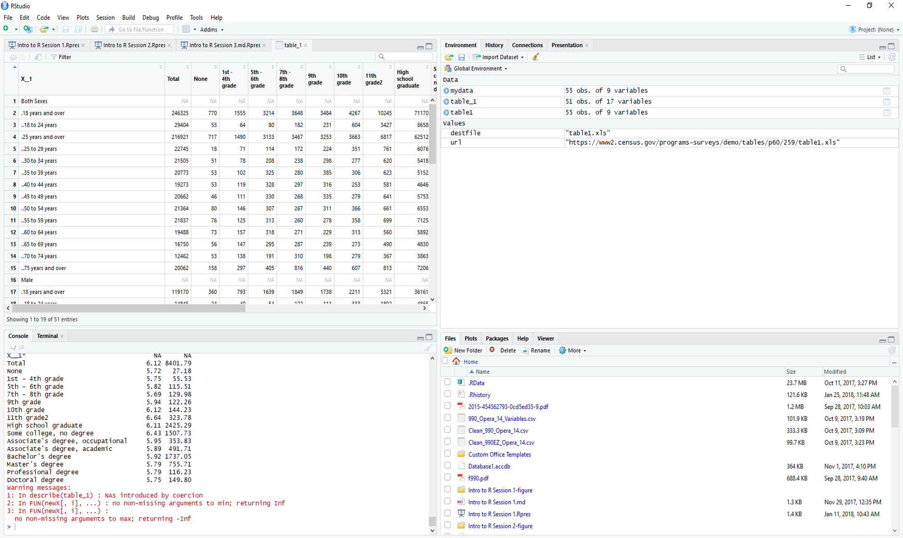

<script src="//yihui.org/js/math-code.js" defer></script>
<!-- Just one possible MathJax CDN below. You may use others. -->
<script defer
  src="//mathjax.rstudio.com/latest/MathJax.js?config=TeX-MML-AM_CHTML">
</script>


## Instructor coordinates

- Department of Mathematics and Computational Sciences , University of Zimbabwe

### What is R?

-   R is an open source programming language and environment.
-   It is designed for data analysis, graphical display and data
    simulations.
-   It is one of the world's leading statistical programming
    environments.
    
### Why use R?

* R is open-source! This means that it is free, and constantly being updated and improved.
* It is compatible. R works on most existing operating systems.
* R can help you create tables, produce graphs and do your statistics, all within the same program. So with R, there is no need to use more than one program to manage data for your publications. Everything can happen in one single program.
* More and more scientists are using R every year. This means that its capacities are constantly growing and will continue to increase over time. This also means that there is a big online community of people that can help with any problems you have in R.

### One stop shop for data science workflows


### Always saves my day!


### very flexible


### Amazing Community


### all you need


## Using RStudio

RStudio is an integrated development environment (IDE) for R. Basically,
it's a place where you can easily use the R language, visualize tables
and figures and even run all your statistical analyses. We recommend
using it instead of the traditional command line as it provides great
visual aid and a number of useful tools that you will learn more about
over the course of this workshop.


###

It includes a **console**, and a **syntax-highlighting editor** that supports direct code execution with tools for plotting, history, debugging and workspace management.

It integrates with R (and other programming languages) to provide a lot of useful features:

* RStudio supports authoring HTML, PDF, Word, and presentation documents
* RStudio supports version control with Git (direction to Github) and Subversion
* RStudio makes it easy to start new or find existing projects
* RStudio supports interactive graphics with Shiny and ggvis

There are other IDE for R: **Atom, Visual Studio, Jupyter notebook, and Jupyter lab**


### Open RStudio


### The RStudio interface

When you open RStudio for the first time, the screen will be divided across three main Pane groups:

1. **Console, Terminal, Job** group;
2. **Environment, History, Connections** group;
3. **Files, Plot, Packages, Help, Viewer** panes; and
4. **Script** pane group

Once you *Open a Script* or *Create a New Script* (File > New File > R script or `Ctrl/Cmd + Shift + N`), the fourth panel will appear.


### interface


### pane 1


### pane 2 


### cheatsheet 


## Writing an R script

An R script is a text file that contains all of the commands you will
use. Once written and saved, your R script will allow you to make
changes and re-run analyses with little effort.


# Creating an R script

{width="500"}


## Commands & Comments

+ Use the '# symbol' to denote comments in scripts. 
+ The '# symbol' tells R to ignore anything remaining on a given line of the script when running commands.
+ Since comments are ignored when running script, they allow you to leave
yourself notes in your code or tell collaborators what you did. 
+ A script with comments is a good step towards reproducible science, and
annotating someone's script is a good way to learn. Try to be as
detailed as possible!


```r
# This is a comment, not a command
```

## Header

It is recommended that you use comments to put a header at the beginning
of your script with essential information: project name, author, date,
version of R


```r
## R for Actuaries training ##
## session 1 - inroduction to basic R
## Author: Bongani Ncube
## Date: 
## R version 4.2.2
```

## Section Heading

You can use four \# signs in a row to create section headings to help
organize your script. This allows you to move quickly between sections
and hide sections. For example:


```r
#### Housekeeping ####
```


## Housekeeping

+ The first command at the top of all scripts should be `rm(list=ls())`.
This will clear R's memory, and will help prevent errors such as using
old data that has been left in your workspace.


```r
A<-"Test" # Put some data in workspace
A <- "Test" # Add some spaces to organize your data!
A = "Test" # You can do this, but it does not mean you should
# Check objects in the workspace
ls()
# [1] "A"
A
# [1] "Test"
# Clean Workspace
rm(list=ls())
A
```

## Important Reminders

1.  R is ready for commands when you see the chevron '\>' displayed in
    the terminal. If the chevron isn't displayed, it means you typed an
    incomplete command and R is waiting for more input. Press ESC to
    exit and get R ready for a new command.
2.  R is case sensitive. i.e. "A" is a different object than "a"


```r
a<-10
A<-5
a
A

rm(list=ls())  # Clears R workspace again
```

## Back to today`s business

### Using R as a calculator

The first thing to know about the R console is that you can use it as a calculator.

### Arithmetic Operators

* Additions and Subtractions


```r
1+1
#> [1] 2

10-1
#> [1] 9
```

* Multiplications and Divisions


```r
2*2
#> [1] 4

8/2
#> [1] 4
```

* Exponents


```r
2^3
#> [1] 8
```

----------------------------------------------------------------------------------------------

##
### example 1

Use R to calculate the following skill testing question: 

`\(2 + 16 * 24 -56\)`


------------------------------------------------------------------------------------------------

### example 2

Use R to calculate the following skill testing equation:

`\(2 + 16 * 24 - 56 / (2 + 1) - 457\)`

*Pay attention to the order of operations when thinking about this question!*

> Note that R *always* follows the order of priorities.


## Manipulating objects in R

### Objects

You have learned so far how to use R as a calculator to obtain various
numerical values. However, it can get tiresome to always write the same
code down in the R console, especially if you have to use some values
repeatedly. This is where the concept of **object** becomes useful.

R is an object-oriented programming language. What this means is that we can allocate a name to values we've created to save them in our
**workspace**. An object is composed of three parts: 

* a **value** we're
* an **identifier** and 
* the **assignment operator**.

##

1.  The **value** can be almost anything we want: a number, the result of a
    calculation, a string of characters, a data frame, a plot or a
    function.
2.  The **identifier** is the name you assign to the value. Whenever you
    want to refer to this value, you simply type the identifier in the R
    console and R will return its value. Identifiers can include only
    letters, numbers, periods and underscores, and should always begin
    with a letter.
3.  The **assignment operator** resembles an arrow (`<-`) and is used to
    link the value to the identifier.


## The following code clarifies these ideas:


```r
## Let's create an object called mean_x.
## The # symbol is used in R to indicate comments. It is not processed by R.
# It is important to add comments to code so that it can be understood and used by other people.
mean_x <- (2 + 6) / 2
# Typing its name will return its value.
mean_x
#> [1] 4
```

Here, `(2 + 6) / 2` is the value you want to save as an object. The
identifier `mean_x` is assigned to this value. Typing `mean_x` returns
the value of the calculation (*i.e.* 4). You have to be careful when
typing the identifier because R is case-sensitive: writing `mean_x` is
not the same as writing `MEAN_X`. You can see that the assignment
operator `<-` creates an explicit link between the value and the
identifier. It always points from the value to the identifier. Note that
it is also possible to use the equal sign `=` as the assignment operator


## Good practices in R code

### **Name**

-   Try having short and explicit names for your variables. Naming a
    variable `var` is not very informative.
-   Use an underscore (`_`), or a dot (`.`) to separate words within a
    name and try to be consistent!
-   Avoid using names of existing functions and variables (e.g., `c`,
    `table`, `T`, etc.)

### **Space**

1.  Add spaces around all operators (`=`, `+`, `-`, `<-`, etc.) to make
    the code more readable.
2.  Always put a space after a comma, and never before (like in regular
    English).

## 

### CHALLENGE 1

+ Create an object with a value of 1 + 1.718282 (Euler's number) and
name it `euler_value`

+ Create an object with the area of a circle that has radius of `26 cm`


## Data types and structure

### Core data types in R

**Data types ** define how the values are stored in R. 
We can obtain the type and mode of an object using the function `typeof()`.
The core data types are:

* **Numeric**-type with **integer** and **double** values


```r
(x <- 1.1)
#> [1] 1.1
typeof(x)
#> [1] "double"

(y <- 2L)
#> [1] 2
typeof(y)
#> [1] "integer"
```


* **Character**-type (always between `" "`)

```r
z <- "hie my name is Bongani Ncube!"
typeof(z)
#> [1] "character"
```

* **Logical**-type

```r
t <- TRUE
typeof(t)
#> [1] "logical"

f<- FALSE
typeof(f)
#> [1] "logical"
```


## Data structure in R: scalars

Until this moment, we have created objects that had just **one element** inside them. An object that has just a single value or unit like a number or a text string is called a **scalar**.


```r
#Examples of scalars
a <- 100
b <- 3/100
c <- (a+b)/b
d <- "species"
e <- "genus"
```

## combinations of scalars

By creating combinations of **scalars**, we can create data with different structures in R. 

Using R to analyze your data is an important aspect of this software.
Data comes in different forms and can be grouped in distinct categories.
Depending on the nature of the values enclosed inside your data or
object, R classifies them accordingly. The following figure illustrates
common objects found in R.


{.align-center width="500"}

## Data structure in R: vectors

+ A vector is an entity consisting of several scalars stored in a single object. 
+ All values in a vector must be the same mode which are either **numeric**, **character** and **logical**. 
+ Character vectors include text strings or a mix of text
strings and other modes. You need to use `""` to delimit elements in a
character vector. 
+ Logical vectors include `TRUE/FALSE` entries only. A
vector with a single value (usually a constant) is called an atomic
vector.
+ When you have more than one value in a vector, you need a way to tell R to group all these values to create a
vector. The trick here is to use the `c()` function in this format:
`vector.name <- c(value1, value2, value3, ...)`. 
+ The function `c()` means combine or concatenate. It is a quick and easy function so remember it!


## examples in R

```r
## Create a numeric vector with the c (which means combine or concatenate) function.
## We will learn about functions soon!
num_vector <- c(1, 4, 3, 98, 32, -76, -4)

## Create a character vector. Always use "" to delimit text strings!
char_vector <- c("blue", "red", "green")

## Create a logical or boolean vector. Don't use "" or R will consider this as text strings.
bool_vector <- c(TRUE, TRUE, FALSE)

##It is also possible to use abbreviations for logical vectors.
bool_vector2 <- c(T, T, F)
```

## Creating vectors of sequential values:
### a:b

The `a:b` takes two numeric scalars `a` and `b` as *arguments*, and returns a vector of numbers from the starting point `a` to the ending point `b`, in steps of `1` unit:


```r
(ncube1<-1:8)
#> [1] 1 2 3 4 5 6 7 8

(ncube2<-7.5:1.5)
#> [1] 7.5 6.5 5.5 4.5 3.5 2.5 1.5
```
### seq()

`seq()` allows us to create a sequence, like `a:b`, but also allows us to specify either the size of the steps (the `by` argument), or the total length of the sequence (the `length.out` argument):

```r
seq(from = 1, to = 10, by = 2)
#> [1] 1 3 5 7 9

seq(from = 20, to = 2, by = -2)
#>  [1] 20 18 16 14 12 10  8  6  4  2
```

## rep()

`rep()` allows you to repeat a scalar (or vector) a specified number of times, or to a desired length:


```r
rep(x = 1:3, each = 2, times = 2)
#>  [1] 1 1 2 2 3 3 1 1 2 2 3 3

rep(x = c(1,2), each = 3)
#> [1] 1 1 1 2 2 2
```


## CHALLENGE 2

+ Create a vector containing the first five odd numbers (starting from 1) and name it odd_n.
+ Create a vector containing any five cities you know in Zimbabwe


## Operations using vectors

+ vectors can be used for calculations. The only difference is
that when a vector has more than 1 element, the operation is applied on
all elements of the vector. The following example clarifies this.


```r
## Create two numeric vectors.
x <- c(1:5)
y <- 6

## Let's sum both vectors.
## 6 is added to all elements of the x vector.
x + y
#> [1]  7  8  9 10 11

## Let's multiply x by y
x * y
#> [1]  6 12 18 24 30
```

## Lists
### A list allows you to

* gather a variety of objects under one name in an ordered way
* these objects can be matrices, vectors, data frames, even other lists
* a list is some kind super data type
* you can store practically any piece of information in it!

### example in R


```r
my_list <- list(one = 1, two = c(1, 2), five = seq(1, 4, length=5),
          six = c("Bongani", "Lenny"))
names(my_list)
#> [1] "one"  "two"  "five" "six"
```


### indexing lists

```r
my_list[2]
#> $two
#> [1] 1 2
my_list[[2]]
#> [1] 1 2
```


## matrices

+ While vectors have one dimension, matrices have two dimensions, determined by **rows** and **columns**.
+ like **vectors** and **scalars** matrices can contain only one type of data: `numeric`, `character`, or `logical`.

There are many ways to create your own matrix. Let us start with a simple one:

```r
(mat1<-matrix(data = 1:10,
       nrow = 2,
       ncol = 5))
#>      [,1] [,2] [,3] [,4] [,5]
#> [1,]    1    3    5    7    9
#> [2,]    2    4    6    8   10
```

##
###

```r
(mat2<-matrix(c(1,2,3,4,5,6), 
       nrow = 2, 
       ncol = 3))
#>      [,1] [,2] [,3]
#> [1,]    1    3    5
#> [2,]    2    4    6
```

## cont`d
###


```r
(mat3<-matrix(c(1,2,3,4,5,6),2,3))
#>      [,1] [,2] [,3]
#> [1,]    1    3    5
#> [2,]    2    4    6

(mat4<-matrix(c(1,2,3,4,5,6),2,3,byrow = TRUE))
#>      [,1] [,2] [,3]
#> [1,]    1    2    3
#> [2,]    4    5    6
```

## 

We can also combine multiple vectors using `cbind()` and `rbind()`:


```r
nickname <- c("kat", "gab", "lo")
animal <- c("dog", "mouse", "cat")

(matrix5<-rbind(nickname, animal))
#>          [,1]  [,2]    [,3] 
#> nickname "kat" "gab"   "lo" 
#> animal   "dog" "mouse" "cat"

(matrix6<-cbind(nickname, animal))
#>      nickname animal 
#> [1,] "kat"    "dog"  
#> [2,] "gab"    "mouse"
#> [3,] "lo"     "cat"
```

## calculations with matrices

Similarly as in the case of vectors, operations with matrices work just fine:


```r
(mat_1 <- matrix(data = 1:9,
                 nrow = 3,
                 ncol = 3))
#>      [,1] [,2] [,3]
#> [1,]    1    4    7
#> [2,]    2    5    8
#> [3,]    3    6    9
(mat_2 <- matrix(data = 9:1,
                 nrow = 3,
                 ncol = 3))
#>      [,1] [,2] [,3]
#> [1,]    9    6    3
#> [2,]    8    5    2
#> [3,]    7    4    1
```

## The product of the matrices is:


```r
mat_1 * mat_2
#>      [,1] [,2] [,3]
#> [1,]    9   24   21
#> [2,]   16   25   16
#> [3,]   21   24    9

mat_1 %*% mat_2
#>      [,1] [,2] [,3]
#> [1,]   90   54   18
#> [2,]  114   69   24
#> [3,]  138   84   30
```

### CHALLENGE 3

1. Create an object containing a matrix with 2 rows and 3 columns, with values from 1 to 6, sorted per column.
2. Create another object with a matrix with 2 rows and 3 columns, with the names of six animals you like. 


## data frames

+ A data frame is a group of vectors of the same length (*i.e.* the
same number of elements). Columns are always variables and rows are
observations, cases, sites or replicates.
+ Differently than a matrix, a data frame can contain different modes saved in different columns (but always the same mode in a column). 

It is in this format that ecological data are usually stored. The following
example shows a fictitious dataset representing 4 sites where soil pH
and the number of plant species were recorded. There is also a
"fertilised" variable (fertilized or not). Let's have a look at the
creation of a data frame.

  site_id   soil_pH   num_sp   fertilised
  --------- --------- -------- ----------------
  A1.01     5.6       17       yes
  A1.02     7.3       23       yes
  B1.01     4.1       15       no
  B1.02     6.0       7        no

## example in R

```r
# We first start by creating vectors.
site_id <- c("A1.01", "A1.02", "B1.01", "B1.02") #identifies the sampling site
soil_pH <- c(5.6, 7.3, 4.1, 6.0) #soil pH
num_sp <- c(17, 23, 15, 7) #number of species
fertilised <- c("yes", "yes", "no", "no") #identifies the treatment applied

# We then combine them to create a data frame with the data.frame function.
soil_fertilisation_data <- data.frame(site_id, soil_pH, num_sp, fertilised)

# Visualise it!
soil_fertilisation_data
#>   site_id soil_pH num_sp fertilised
#> 1   A1.01     5.6     17        yes
#> 2   A1.02     7.3     23        yes
#> 3   B1.01     4.1     15         no
#> 4   B1.02     6.0      7         no
```

Note how the data frame integrated the name of the objects as column names


## Indexing

### Indexing a vector

Typing an object's name in R returns the complete object. But what if
our object is a huge data frame with millions of entries? It can easily
become confusing to identify specific elements of an object. R allows us
to extract only part of an object. This is called indexing. We specify
the position of values we want to extract from an object with brackets
`[ ]`. The following code illustrates the concept of indexation with
vectors.

## Lets do it in R 


```r
odd_n <- c(1, 3, 5, 7, 9)

# To obtain the value in the second position, we do as follows:
odd_n[2]
#> [1] 3

# We can also obtain values for multiple positions within a vector with c()
odd_n[c(2, 4)]
#> [1] 3 7

# We can remove values pertaining to particular positions from a vector using the minus (-) sign before the position value
odd_n[c(-1, -2)]
#> [1] 5 7 9

odd_n[-4]
#> [1] 1 3 5 9
```


```r
# If you select a position that is not in the numeric vector
odd_n[c(1,6)]
#> [1]  1 NA
```

There is no sixth value in this vector so R returns a null value (i.e. NA). NA stands for 'Not available'.


```r
# You can use logical statement to select values.
odd_n[odd_n > 4]
#> [1] 5 7 9

# REMEMBER  PREVIOUS VECTOR
char_vector
#> [1] "blue"  "red"   "green"
# Extract all elements of the character vector corresponding exactly to "blue".
char_vector[char_vector == "blue"]
#> [1] "blue"
# Note the use of the double equal sign ==.
```


----------------------------------------------------------------------------------------


## CHALLENGE 4


```r
num_vector <- c(1, 4, 3, 98, 32, -76, -4)
```

Using the vector `num_vector` and our indexing abilities:
 
 a) Extract the 4th value of the `num_vector` vector.

 b) Extract the 1st and 3rd values of the `num_vector` vector.

 c) Extract all values of the `num_vector` vector excluding the 2nd and 4th values.
 
 d) Extract from the 6th to the 10th value.

## Naming vectors


```r
my_vector <- c("Bongani Ncube", "Data Analyst")
names(my_vector) <- c("Name", "Profession")
my_vector
#>            Name      Profession 
#> "Bongani Ncube"  "Data Analyst"
```
### Inspect my_vector using:

* the `attributes()` function
* the `length()` function
* the `str()` function

## Indexing a data frame

For data frames, the concept of indexation is similar, but we usually
have to specify two dimensions: the row and column numbers. The R syntax
is

`dataframe[row number, column number]`.

Here are a few examples of data frame indexation. Note that the first
four operations are also valid for indexing matrices.

##
###


```r
# Extract the 1st row of the data frame
soil_fertilisation_data[1, ]
#>   site_id soil_pH num_sp fertilised
#> 1   A1.01     5.6     17        yes

# Extract the 3rd columm
soil_fertilisation_data[, 3]
#> [1] 17 23 15  7

# Extract the 2nd element of the 4th column
soil_fertilisation_data[2, 4]
#> [1] "yes"

# Extract lines 2 to 4
soil_fertilisation_data[2:4]
#>   soil_pH num_sp fertilised
#> 1     5.6     17        yes
#> 2     7.3     23        yes
#> 3     4.1     15         no
#> 4     6.0      7         no
```

## We can subset columns from it using the column names:


```r
##Remember that our soil_fertilisation_data data frame had column names?
soil_fertilisation_data
#>   site_id soil_pH num_sp fertilised
#> 1   A1.01     5.6     17        yes
#> 2   A1.02     7.3     23        yes
#> 3   B1.01     4.1     15         no
#> 4   B1.02     6.0      7         no

##We can subset columns using column names:
soil_fertilisation_data[ , c("site_id", "soil_pH")]
#>   site_id soil_pH
#> 1   A1.01     5.6
#> 2   A1.02     7.3
#> 3   B1.01     4.1
#> 4   B1.02     6.0
```

##
###

```r
# And, also subset columns from it using "$"
soil_fertilisation_data$site_id
#> [1] "A1.01" "A1.02" "B1.01" "B1.02"
```

## A quick note on logical statements

R gives you the possibility to test logical statements, *i.e.* to
evaluate whether a statement is true or false. You can compare objects
with the following logical operators:

  Operator   Description
  ---------- --------------------------
  \<         less than
  \<=        less than or equal to
  \>         greater than
  \>=        greater than or equal to
  ==         exactly equal to
  !=         not equal to
  x \| y     x OR y
  x & y      x AND y

## The following examples illustrate how to use these operators properly.


```r
# First, let's create two vectors for comparison.
x2 <- c(1:5)
y2 <- c(1, 2, -7, 4, 5)

# Let's verify if the elements in x2 are greater or equal to 3.
# R returns a TRUE/FALSE value for each element (in order).
x2 >= 3
#> [1] FALSE FALSE  TRUE  TRUE  TRUE

# Let's see if the elements of x2 are exactly equal to those of y2.
x2 == y2
#> [1]  TRUE  TRUE FALSE  TRUE  TRUE

# Is 3 not equal to 4? Of course!
3 != 4
#> [1] TRUE
```


## testing conditions

### We can, for instance, test if values within a vector or a matrix are *numeric*:

```r
char_vector
#> [1] "blue"  "red"   "green"
is.numeric(char_vector)
#> [1] FALSE

odd_n
#> [1] 1 3 5 7 9
is.numeric(odd_n)
#> [1] TRUE
```

## Or whether they are of the *character* type:

```r
char_vector
#> [1] "blue"  "red"   "green"
is.character(char_vector)
#> [1] TRUE

odd_n
#> [1] 1 3 5 7 9
is.character(odd_n)
#> [1] FALSE
```

### And, also, if they are vectors:

```r
char_vector
#> [1] "blue"  "red"   "green"

is.vector(char_vector)
#> [1] TRUE
```

-------------------------------------------------------------------------------------

### CHALLENGE 5

a) Extract the `num_sp` column from `soil_fertilisation_data` and multiply its values
  by the first four values of the `num_vector` vector.
b) After that, write a statement that checks if the values you
   obtained are greater than 25. Refer to challenge 9 to complete this
   challenge.


## R packages

+ R **packages** extend the functionality of R by providing additional functions, and can be downloaded for free from the internet.


## Install and load an R package

The `ggplot2` package is a very popular package for data visualisation.

### Install the package


```r
install.packages("ggplot2")
```

### Load the installed package


```r
library(ggplot2)
```

### And give it a try


```r
head(diamonds)
qplot(clarity, data = diamonds, fill = cut, geom = "bar") 
```

Packages are developed and maintained by R users worldwide, and shared with the R community through CRAN: now there are over 10 000 packages online!

## Inbuilt Dataframes

+ R has many inbuilt dataframes
+ some datasets come with packages 

### exploring datasets

```r
data("mtcars")
## renamae the data
my_cars_data<-mtcars
```

## structure of the data

```r
str(my_cars_data)
#> 'data.frame':	32 obs. of  11 variables:
#>  $ mpg : num  21 21 22.8 21.4 18.7 18.1 14.3 24.4 22.8 19.2 ...
#>  $ cyl : num  6 6 4 6 8 6 8 4 4 6 ...
#>  $ disp: num  160 160 108 258 360 ...
#>  $ hp  : num  110 110 93 110 175 105 245 62 95 123 ...
#>  $ drat: num  3.9 3.9 3.85 3.08 3.15 2.76 3.21 3.69 3.92 3.92 ...
#>  $ wt  : num  2.62 2.88 2.32 3.21 3.44 ...
#>  $ qsec: num  16.5 17 18.6 19.4 17 ...
#>  $ vs  : num  0 0 1 1 0 1 0 1 1 1 ...
#>  $ am  : num  1 1 1 0 0 0 0 0 0 0 ...
#>  $ gear: num  4 4 4 3 3 3 3 4 4 4 ...
#>  $ carb: num  4 4 1 1 2 1 4 2 2 4 ...
```

## first and last few rows


```r
## first few rows
head(my_cars_data)
#>                    mpg cyl disp  hp drat    wt  qsec vs am gear carb
#> Mazda RX4         21.0   6  160 110 3.90 2.620 16.46  0  1    4    4
#> Mazda RX4 Wag     21.0   6  160 110 3.90 2.875 17.02  0  1    4    4
#> Datsun 710        22.8   4  108  93 3.85 2.320 18.61  1  1    4    1
#> Hornet 4 Drive    21.4   6  258 110 3.08 3.215 19.44  1  0    3    1
#> Hornet Sportabout 18.7   8  360 175 3.15 3.440 17.02  0  0    3    2
#> Valiant           18.1   6  225 105 2.76 3.460 20.22  1  0    3    1

## last few rows
tail(my_cars_data)
#>                 mpg cyl  disp  hp drat    wt qsec vs am gear carb
#> Porsche 914-2  26.0   4 120.3  91 4.43 2.140 16.7  0  1    5    2
#> Lotus Europa   30.4   4  95.1 113 3.77 1.513 16.9  1  1    5    2
#> Ford Pantera L 15.8   8 351.0 264 4.22 3.170 14.5  0  1    5    4
#> Ferrari Dino   19.7   6 145.0 175 3.62 2.770 15.5  0  1    5    6
#> Maserati Bora  15.0   8 301.0 335 3.54 3.570 14.6  0  1    5    8
#> Volvo 142E     21.4   4 121.0 109 4.11 2.780 18.6  1  1    4    2
```
## summary

```r
summary(my_cars_data)
#>       mpg             cyl             disp             hp       
#>  Min.   :10.40   Min.   :4.000   Min.   : 71.1   Min.   : 52.0  
#>  1st Qu.:15.43   1st Qu.:4.000   1st Qu.:120.8   1st Qu.: 96.5  
#>  Median :19.20   Median :6.000   Median :196.3   Median :123.0  
#>  Mean   :20.09   Mean   :6.188   Mean   :230.7   Mean   :146.7  
#>  3rd Qu.:22.80   3rd Qu.:8.000   3rd Qu.:326.0   3rd Qu.:180.0  
#>  Max.   :33.90   Max.   :8.000   Max.   :472.0   Max.   :335.0  
#>       drat             wt             qsec             vs        
#>  Min.   :2.760   Min.   :1.513   Min.   :14.50   Min.   :0.0000  
#>  1st Qu.:3.080   1st Qu.:2.581   1st Qu.:16.89   1st Qu.:0.0000  
#>  Median :3.695   Median :3.325   Median :17.71   Median :0.0000  
#>  Mean   :3.597   Mean   :3.217   Mean   :17.85   Mean   :0.4375  
#>  3rd Qu.:3.920   3rd Qu.:3.610   3rd Qu.:18.90   3rd Qu.:1.0000  
#>  Max.   :4.930   Max.   :5.424   Max.   :22.90   Max.   :1.0000  
#>        am              gear            carb      
#>  Min.   :0.0000   Min.   :3.000   Min.   :1.000  
#>  1st Qu.:0.0000   1st Qu.:3.000   1st Qu.:2.000  
#>  Median :0.0000   Median :4.000   Median :2.000  
#>  Mean   :0.4062   Mean   :3.688   Mean   :2.812  
#>  3rd Qu.:1.0000   3rd Qu.:4.000   3rd Qu.:4.000  
#>  Max.   :1.0000   Max.   :5.000   Max.   :8.000
```

## Elementary descriptive statistics of populations and samples

+ Any collection of numerical data on one or more variables can be described using a number of common statistical concepts.  Let `\(x = x_1, x_2, \dots, x_n\)` be a sample of `\(n\)` observations of a variable drawn from a population.

### Mean, variance and standard deviation

* The **mean** is the average value of the observations and is defined by adding up all the values and dividing by the number of observations.  The mean `\(\bar{x}\)` of our sample `\(x\)` is defined as:

$$
\bar{x} = \frac{1}{n}\sum_{i = 1}^{n}x_i
$$

##

While the mean of a sample `\(x\)` is denoted by `\(\bar{x}\)`, the mean of an entire population is usually denoted by `\(\mu\)`.  The mean can have a different interpretation depending on the type of data being studied.  Let's look at the mean of three different columns of our `my_cars_data` data, making sure to ignore any missing data.


```r
mean(my_cars_data$mpg, na.rm = TRUE)
#> [1] 20.09062

#### manually we can calculate as
sum(my_cars_data$mpg)/nrow(my_cars_data)
#> [1] 20.09062
```

This looks very intuitive and appears to be the average amount of mpg made by the cars in the data set.


```r
mean(my_cars_data$drat, na.rm = TRUE)
#> [1] 3.596563
```

Given that this data can only have the value of 0 or 1, we interpret this mean as *likelihood* or *expectation* that an individual will be labeled as 1. 


```r
mean(my_cars_data$performance, na.rm = TRUE)
#> [1] NA
```


##

+ Other common statistical summary measures include the *median*, which is the middle value when the values are ranked in order, and the *mode*, which is the most frequently occurring value.

+ The **variance** is a measure of how much the data varies around its mean.  There are two different definitions of variance.  
+ The **population variance** assumes that that we are working with the entire population and is defined as the average squared difference from the mean:

$$
\mathrm{Var}_p(x) = \frac{1}{n}\sum_{i = 1}^{n}(x_i - \bar{x})^2
$$

+ The **sample variance** assumes that we are working with a sample and attempts to estimate the variance of a larger population by applying *Bessel's correction* to account for potential sampling error.    The sample variance is:

$$
\mathrm{Var}_s(x) = \frac{1}{n-1}\sum_{i = 1}^{n}(x_i - \bar{x})^2
$$

##

You can see that

$$
\mathrm{Var}_p(x) = \frac{n - 1}{n}\mathrm{Var}_s(x)
$$
So as the data set gets larger, the sample variance and the population variance become less and less distinguishable, which intuitively makes sense.

## In R 


```r
## sample variance 
(sample_variance_mpg <- var(my_cars_data$mpg, na.rm = TRUE))
#> [1] 36.3241
```

So where necessary, we need to apply a transformation to get the population variance.


```r
## population variance (need length of non-NA data)
n <- length(na.omit(my_cars_data$mpg))
(population_variance_mpg <- ((n-1)/n) * sample_variance_mpg)
#> [1] 35.18897
```

## Standard deviation

+ Variance does not have intuitive scale relative to the data being studied, because we have used a squared distance metric, therefore we can square-root it to get a measure of deviance on the same scale as the data.
+ We call this the *standard deviation* `\(\sigma(x)\)`, where `\(\mathrm{Var}(x) = \sigma(x)^2\)`.  As with variance, standard deviation has both population and sample versions, and the sample version is calculated by default. Conversion between the two takes the form

$$
\sigma_p(x) = \sqrt{\frac{n-1}{n}}\sigma_s(x)
$$


```r
## sample standard deviation
(sample_sd_mpg <- sd(my_cars_data$mpg, na.rm = TRUE))
#> [1] 6.026948

## verify that sample sd is sqrt(sample var)
sample_sd_mpg == sqrt(sample_variance_mpg)
#> [1] TRUE

## calculate population standard deviation
(population_sd_mpg <- sqrt((n-1)/n) * sample_sd_mpg)
#> [1] 5.93203
```

* Given the range of mpg is [10.4, 33.9] and the mean is 20, we see that the standard deviation gives a more intuitive sense of the 'spread' of the data relative to its inherent scale.

## correlation

+ **Pearson's correlation** coefficient divides the covariance by the product of the standard deviations of the two variables: 

$$
r_{x, y} = \frac{\mathrm{cov}(x, y)}{\sigma(x)\sigma(y)}
$$
This creates a scale of `\(-1\)` to `\(1\)` for `\(r_{x, y}\)`, which is an intuitive way of understanding both the direction and strength of the relationship between `\(x\)` and `\(y\)`, with `\(-1\)` indicating that `\(x\)` increases perfectly as `\(y\)` decreases, `\(1\)` indicating that `\(x\)` increases perfectly as `\(y\)` increases, and `\(0\)` indicating that there is no relationship between the two.

As before, there is a sample and population version of the correlation coefficient, and R calculates the sample version by default.  Similar transformations can be used to determine a population correlation coefficient and over large samples the two measures converge.


```r
## calculate sample correlation between mpg and customer_rate
cor(my_cars_data$mpg, my_cars_data$cyl, use = "complete.obs")
#> [1] -0.852162
```


+ Correlating ranked variables involves an adjusted approach leading to **Spearman's rho** ($\rho$) or **Kendall's tau** ($\tau$), among others.  We will not dive into the mathematics of this here.  Spearman's or Kendall's variant should be used whenever at least one of the variables is a ranked variable, and both variants are available in R.


```r
# spearman's rho correlation
cor(my_cars_data$mpg, my_cars_data$cyl, 
    method = "spearman", use = "complete.obs")
#> [1] -0.9108013

# kendall's tau correlation
cor(my_cars_data$mpg, my_cars_data$cyl, 
    method = "kendall", use = "complete.obs")
#> [1] -0.7953134
```


