<script src="index.en_files/kePrint/kePrint.js"></script>

<link href="index.en_files/lightable/lightable.css" rel="stylesheet" />

<script src="//yihui.org/js/math-code.js" defer></script>
<!-- Just one possible MathJax CDN below. You may use others. -->
<script defer
  src="//mathjax.rstudio.com/latest/MathJax.js?config=TeX-MML-AM_CHTML">
</script>

{}

## doing survival analysis in R

### functions

The core functions we’ll use out of the survival package include:

- `Surv()`: Creates a survival object.
- `survfit()`: Fits a survival curve using either a formula, of from a previously fitted Cox model.
- `coxph()`: Fits a Cox proportional hazards regression model.

Other optional functions you might use include:

- `cox.zph()`: Tests the proportional hazards assumption of a Cox regression model.
- `survdiff()`: Tests for differences in survival between two groups using a log-rank / Mantel-Haenszel test.[^1]

`Surv()` creates the response variable, and typical usage takes the time to event,\[^time2\] and whether or not the event occured (i.e., death vs censored). `survfit()` creates a survival curve that you could then display or plot. `coxph()` implements the regression analysis, and models specified the same way as in regular linear models, but using the `coxph()` function.
{}

# Data description

{}

- [x] status : event at discharge (alive or dead)  
- [x] sex : male or female  
- [x] dm : diabetes (yes or no)  
- [x] gcs : Glasgow Coma Scale (value from 3 to 15)  
- [x] sbp : Systolic blood pressure (mmHg)  
- [x] dbp : Diastolic blood pressure (mmHg)  
- [x] wbc : Total white cell count  
- [x] time2 : days in ward  
- [x] stroke_type : surv_data type (Ischaemic surv_data or Haemorrhagic surv_data)  
- [x] referral_from : patient was referred from a hospital or not from a hospital
  {}

# setup

``` r
# load in packages
library(tidyverse)
library(rms)
library(broom)
library(survival)
library(survminer)
library(data.table)
library(DT)

surv_data <- read_csv('stroke_data.csv')
```

## take a look at the dataset

``` r
kableExtra::kbl(head(surv_data))
```

<table>
<thead>
<tr>
<th style="text-align:left;">
doa
</th>
<th style="text-align:left;">
dod
</th>
<th style="text-align:left;">
status
</th>
<th style="text-align:left;">
sex
</th>
<th style="text-align:left;">
dm
</th>
<th style="text-align:right;">
gcs
</th>
<th style="text-align:right;">
sbp
</th>
<th style="text-align:right;">
dbp
</th>
<th style="text-align:right;">
wbc
</th>
<th style="text-align:right;">
time2
</th>
<th style="text-align:left;">
stroke_type
</th>
<th style="text-align:left;">
referral_from
</th>
</tr>
</thead>
<tbody>
<tr>
<td style="text-align:left;">
17/2/2011
</td>
<td style="text-align:left;">
18/2/2011
</td>
<td style="text-align:left;">
alive
</td>
<td style="text-align:left;">
male
</td>
<td style="text-align:left;">
no
</td>
<td style="text-align:right;">
15
</td>
<td style="text-align:right;">
151
</td>
<td style="text-align:right;">
73
</td>
<td style="text-align:right;">
12.5
</td>
<td style="text-align:right;">
1
</td>
<td style="text-align:left;">
IS
</td>
<td style="text-align:left;">
non-hospital
</td>
</tr>
<tr>
<td style="text-align:left;">
20/3/2011
</td>
<td style="text-align:left;">
21/3/2011
</td>
<td style="text-align:left;">
alive
</td>
<td style="text-align:left;">
male
</td>
<td style="text-align:left;">
no
</td>
<td style="text-align:right;">
15
</td>
<td style="text-align:right;">
196
</td>
<td style="text-align:right;">
123
</td>
<td style="text-align:right;">
8.1
</td>
<td style="text-align:right;">
1
</td>
<td style="text-align:left;">
IS
</td>
<td style="text-align:left;">
non-hospital
</td>
</tr>
<tr>
<td style="text-align:left;">
9/4/2011
</td>
<td style="text-align:left;">
10/4/2011
</td>
<td style="text-align:left;">
dead
</td>
<td style="text-align:left;">
female
</td>
<td style="text-align:left;">
no
</td>
<td style="text-align:right;">
11
</td>
<td style="text-align:right;">
126
</td>
<td style="text-align:right;">
78
</td>
<td style="text-align:right;">
15.3
</td>
<td style="text-align:right;">
1
</td>
<td style="text-align:left;">
HS
</td>
<td style="text-align:left;">
hospital
</td>
</tr>
<tr>
<td style="text-align:left;">
12/4/2011
</td>
<td style="text-align:left;">
13/4/2011
</td>
<td style="text-align:left;">
dead
</td>
<td style="text-align:left;">
male
</td>
<td style="text-align:left;">
no
</td>
<td style="text-align:right;">
3
</td>
<td style="text-align:right;">
170
</td>
<td style="text-align:right;">
103
</td>
<td style="text-align:right;">
13.9
</td>
<td style="text-align:right;">
1
</td>
<td style="text-align:left;">
IS
</td>
<td style="text-align:left;">
hospital
</td>
</tr>
<tr>
<td style="text-align:left;">
12/4/2011
</td>
<td style="text-align:left;">
13/4/2011
</td>
<td style="text-align:left;">
alive
</td>
<td style="text-align:left;">
female
</td>
<td style="text-align:left;">
yes
</td>
<td style="text-align:right;">
15
</td>
<td style="text-align:right;">
103
</td>
<td style="text-align:right;">
62
</td>
<td style="text-align:right;">
14.7
</td>
<td style="text-align:right;">
1
</td>
<td style="text-align:left;">
IS
</td>
<td style="text-align:left;">
non-hospital
</td>
</tr>
<tr>
<td style="text-align:left;">
4/5/2011
</td>
<td style="text-align:left;">
5/5/2011
</td>
<td style="text-align:left;">
dead
</td>
<td style="text-align:left;">
female
</td>
<td style="text-align:left;">
no
</td>
<td style="text-align:right;">
3
</td>
<td style="text-align:right;">
91
</td>
<td style="text-align:right;">
55
</td>
<td style="text-align:right;">
14.2
</td>
<td style="text-align:right;">
1
</td>
<td style="text-align:left;">
HS
</td>
<td style="text-align:left;">
hospital
</td>
</tr>
</tbody>
</table>

### Creating a Survival Object

{}
The survival object is created by the function `survival::Surv`, which typically requires two arguments: `event` and `time`. The survival object will be used as the outcome by the survival analysis methods we explore.

Some key components of this `survfit` object that will be used to create survival curves include:

- `time`: the timepoints at which the curve has a step, i.e. at least one event occurred
- `surv`: the estimate of survival at the corresponding `time`
  {}

``` r
surv_object <- survival::Surv(
  event = surv_data$status=="dead",
  time = surv_data$time2
)

head(surv_object, 20)
#>  [1] 1+ 1+ 1  1  1+ 1  1+ 1+ 1  1+ 1+ 1+ 1  1  1+ 1  1+ 1  1+ 1+
```

{}

## Estimating the Survival Function: Kaplan-Meier Estimator

The Kaplan-Meier (KM) Estimator is a non-parametric method that estimates the survival probabilities at each time an event occurs. We will use the function `survival::survfit()`, which uses the KM Estimator, to estimate survival probabilities from our data.

`survfit` requires two arguments:

1.  A formula object where the outcome is a survival object
2.  A data frame

{}

``` r
km_result <- survival::survfit(
  surv_object ~ 1,
  data = surv_data
)
```

## The Output of survfit

    #> # A tibble: 17 x 5
    #>     TIME N_RISK N_EVENT CENSOR SURVIVAL
    #>    <dbl>  <dbl>   <dbl>  <dbl>    <dbl>
    #>  1     1    213       9     14    0.958
    #>  2     2    190       4     20    0.938
    #>  3     3    166       4     32    0.915
    #>  4     4    130       4     36    0.887
    #>  5     5     90       5     20    0.838
    #>  6     6     65       3      6    0.799
    #>  7     7     56       4      6    0.742
    #>  8     9     42       1      8    0.724
    #>  9    10     37       1      1    0.705
    #> 10    12     33       4      5    0.619
    #> 11    14     24       2      2    0.568
    #> 12    18     19       1      3    0.538
    #> 13    22     15       1      5    0.502
    #> 14    25      9       2      4    0.390
    #> 15    28      5       1      1    0.312
    #> 16    29      4       1      0    0.234
    #> 17    41      2       1      1    0.117

## The survival probabilities for all patients:

``` r
>KM <- survfit(Surv(time = time2,event = status == "dead" ) ~ 1, 
              data = surv_data)
>summary(KM)
Call: survfit(formula = Surv(time = time2, event = status == "dead") ~ 
    1, data = surv_data)

 time n.risk n.event survival std.err lower 95% CI upper 95% CI
    1    213       9    0.958  0.0138       0.9311        0.985
    2    190       4    0.938  0.0168       0.9053        0.971
    3    166       4    0.915  0.0198       0.8770        0.955
    4    130       4    0.887  0.0237       0.8416        0.934
    5     90       5    0.838  0.0310       0.7790        0.901
    6     65       3    0.799  0.0367       0.7301        0.874
    7     56       4    0.742  0.0438       0.6608        0.833
    9     42       1    0.724  0.0462       0.6391        0.821
   10     37       1    0.705  0.0489       0.6150        0.807
   12     33       4    0.619  0.0587       0.5142        0.746
   14     24       2    0.568  0.0642       0.4548        0.708
   18     19       1    0.538  0.0674       0.4206        0.687
   22     15       1    0.502  0.0718       0.3792        0.664
   25      9       2    0.390  0.0892       0.2494        0.611
   28      5       1    0.312  0.0998       0.1669        0.584
   29      4       1    0.234  0.1009       0.1007        0.545
   41      2       1    0.117  0.0970       0.0231        0.593
```

## Next, we will estimate the survival probabilities for stroke type:

- this will give us two tables ,relating to two factors that we have in the data

``` r
>KM_str_type2 <- survfit(Surv(time = time2, 
                             event = status == "dead" ) ~ stroke_type, 
                        data = surv_data)
>summary(KM_str_type2)

Call: survfit(formula = Surv(time = time2, event = status == "dead") ~ 
    stroke_type, data = surv_data)

                stroke_type=HS 
 time n.risk n.event survival std.err lower 95% CI upper 95% CI
    1     69       6    0.913  0.0339       0.8489        0.982
    2     61       1    0.898  0.0365       0.8293        0.973
    3     58       4    0.836  0.0453       0.7520        0.930
    4     52       2    0.804  0.0489       0.7136        0.906
    5     47       4    0.736  0.0554       0.6346        0.853
    6     38       2    0.697  0.0589       0.5905        0.822
    7     34       2    0.656  0.0621       0.5447        0.790
    9     30       1    0.634  0.0638       0.5205        0.772
   10     27       1    0.611  0.0656       0.4945        0.754
   12     24       2    0.560  0.0693       0.4390        0.713
   14     19       1    0.530  0.0717       0.4068        0.691
   18     15       1    0.495  0.0751       0.3675        0.666
   22     11       1    0.450  0.0806       0.3166        0.639
   25      6       2    0.300  0.1019       0.1541        0.584
   29      2       1    0.150  0.1176       0.0322        0.698
```

{}
+ this is another output ,technically they should be together in one call
{}

``` r
stroke_type=IS 
 time n.risk n.event survival std.err lower 95% CI upper 95% CI
    1    144       3    0.979  0.0119        0.956        1.000
    2    129       3    0.956  0.0174        0.923        0.991
    4     78       2    0.932  0.0241        0.886        0.980
    5     43       1    0.910  0.0318        0.850        0.975
    6     27       1    0.876  0.0451        0.792        0.970
    7     22       2    0.797  0.0676        0.675        0.941
   12      9       2    0.620  0.1223        0.421        0.912
   14      5       1    0.496  0.1479        0.276        0.890
   28      3       1    0.331  0.1671        0.123        0.890
   41      1       1    0.000     NaN           NA           NA
```

{}

## Plot the survival probability

The KM estimate provides the survival probabilities. We can plot these probabilities to look at the trend of survival over time. The plot provides

1.  survival probability on the `\(y-axis\)`
2.  time on the `\(x-axis\)`
    {}

## Plotting the Survival Function

``` r
survminer::ggsurvplot(
  km_result,
  pval = TRUE,
  conf.int = TRUE,
  xlab = "Time",
  ylab = "Probability of dying"
)
```

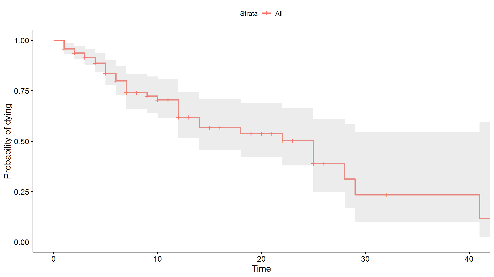

## Using the KM Estimator to Plot Multiple Survival Functions

``` r
km_result_jobs <- survival::survfit(surv_object ~stroke_type, data = surv_data)

survminer::ggsurvplot(km_result_jobs, pval = TRUE, xlab = "Time", ylab = "Probability of dying")
```

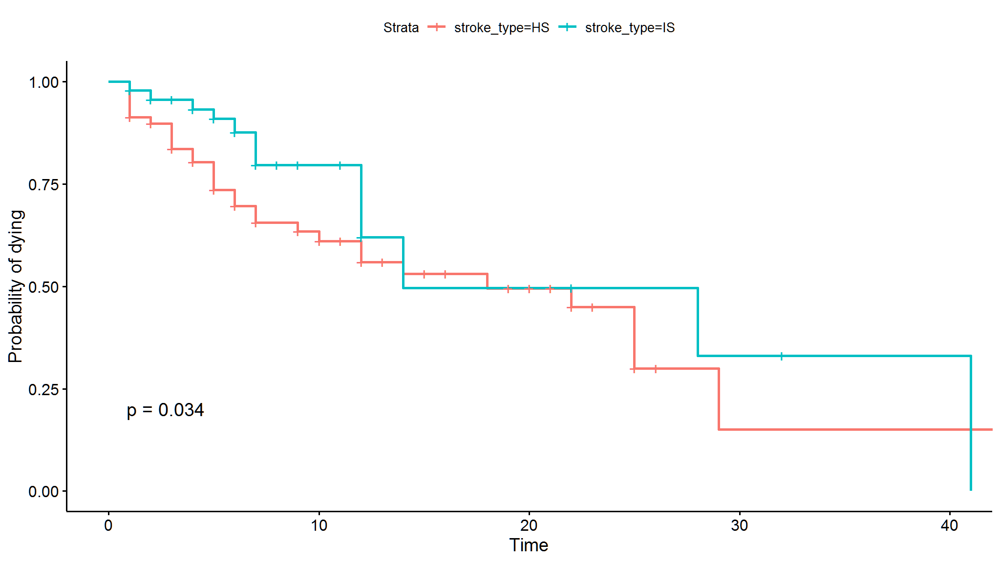

## Making it more fency

- i always love to make the graphs more fency
- i have used ggplot2 extended functionalities to make the plots pretty neat

``` r
library(paletteer)
p1<-ggsurvplot(KM_str_type2, 
           data = surv_data,
           palette = paletteer_d("ggsci::light_blue_material")[seq(2,10,2)], 
                 size = 1.2, conf.int = FALSE, 
                 legend.labs = levels(surv_data$stroke_type),
                 legend.title = "",
                 ggtheme = theme_minimal() + 
             theme(plot.title = element_text(face = "bold")),
                 title = "Probability of dying",
                 xlab = "Time",
                 ylab = "Probability of dying",
                 legend = "bottom", censor = FALSE)

p1$plot +
  scale_x_continuous(expand = c(0, 0), breaks = seq(1,43,1),
                     labels = seq(1,43,1),
                     limits = c(0, 820)) +
  scale_y_continuous(expand = c(0, 0), breaks = seq(0,1,0.2),
                     labels = scales::percent_format(accuracy = 1)) +
  theme_classic() 
```

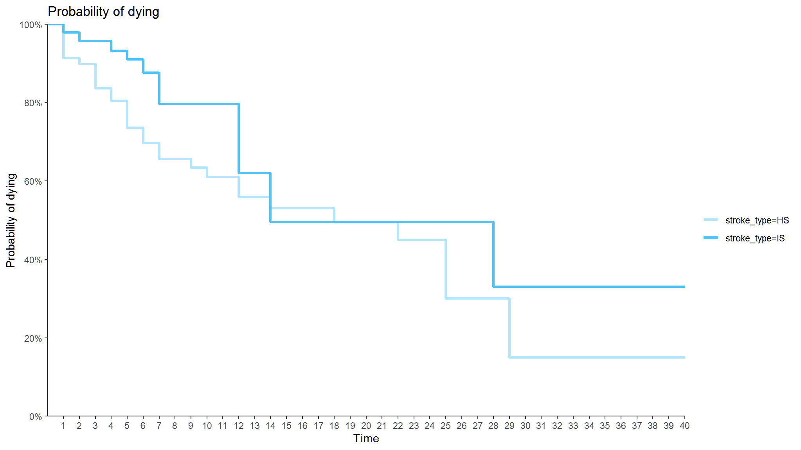

We can perform the Kaplan-Meier estimates for variable dm too:

``` r
KM_dm <- survfit(Surv(time = time2, 
                      event = status == "dead" ) ~ dm,
                 data = surv_data)
summary(KM_dm)
#> Call: survfit(formula = Surv(time = time2, event = status == "dead") ~ 
#>     dm, data = surv_data)
#> 
#>                 dm=no 
#>  time n.risk n.event survival std.err lower 95% CI upper 95% CI
#>     1    141       8    0.943  0.0195       0.9058        0.982
#>     2    122       4    0.912  0.0242       0.8661        0.961
#>     3    102       2    0.894  0.0268       0.8434        0.949
#>     4     82       2    0.873  0.0303       0.8152        0.934
#>     5     54       5    0.792  0.0441       0.7100        0.883
#>     6     40       3    0.732  0.0524       0.6366        0.843
#>     7     34       2    0.689  0.0575       0.5854        0.812
#>    10     24       1    0.661  0.0619       0.5498        0.794
#>    12     20       4    0.529  0.0771       0.3971        0.703
#>    18     13       1    0.488  0.0812       0.3521        0.676
#>    22      9       1    0.434  0.0884       0.2908        0.647
#>    25      4       1    0.325  0.1149       0.1627        0.650
#>    29      3       1    0.217  0.1171       0.0752        0.625
#> 
#>                 dm=yes 
#>  time n.risk n.event survival std.err lower 95% CI upper 95% CI
#>     1     72       1    0.986  0.0138       0.9594        1.000
#>     3     64       2    0.955  0.0253       0.9070        1.000
#>     4     48       2    0.915  0.0367       0.8463        0.990
#>     7     22       2    0.832  0.0653       0.7137        0.971
#>     9     15       1    0.777  0.0811       0.6330        0.953
#>    14      9       2    0.604  0.1248       0.4030        0.906
#>    25      5       1    0.483  0.1471       0.2662        0.878
#>    28      2       1    0.242  0.1860       0.0534        1.000
#>    41      1       1    0.000     NaN           NA           NA
```

And then we can plot the survival estimates for patients with and without diabetes:

``` r
p2<-ggsurvplot(KM_dm, 
           data = surv_data, 
                 palette = paletteer_c("grDevices::Set 2", 12), 
                 size = 1.2, conf.int = FALSE,
                 legend.labs = levels(surv_data$dm),
                 legend.title = "",
                 ggtheme = theme_minimal() + 
             theme(plot.title = element_text(face = "bold")),
                 title = "Probability of dying",
                 xlab = "Time till discharge",
                 ylab = "Probability of dying",
                 legend = "bottom", censor = FALSE)

p2
```

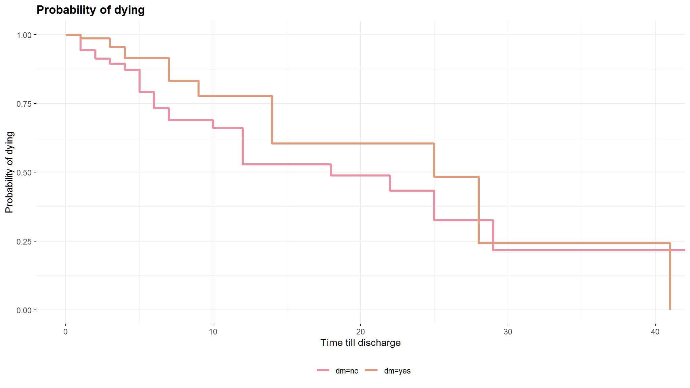

- Typically we will also want to see the numbers at risk in a table below
  the x-axis. We can add this using `add_risktable()`:

``` r
library(ggsurvfit)
survfit2(Surv(time = time2,event = status == "dead" ) ~ dm, data = surv_data) %>% 
  ggsurvfit() +
  labs(
    x = "Days",
    y = "Overall survival probability"
    ) + 
  add_confidence_interval() +
  add_risktable()
```

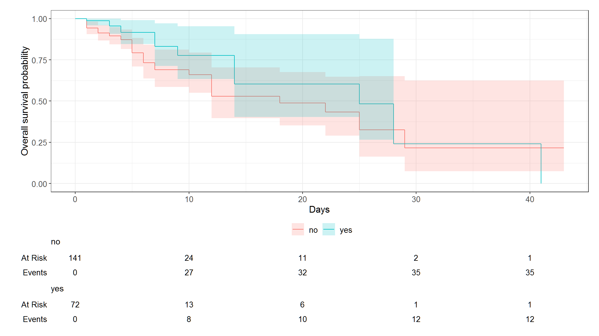
{}

## Comparing Kaplan-Meier estimates across groups

There are a number of available tests to compare the survival estimates between groups based on KM. The tests include:

1.  log-rank (default)
2.  peto-peto test

### Log-rank test

to answer question if the survival estimates are different between levels or groups we can use statistical tests for example the log rank and the peto-peto tests.

For all the test, the null hypothesis is that that the survival estimates between levels or groups are not different. For example, to do that:
{}

``` r
>survdiff(Surv(time = time2, 
              event = status == "dead") ~ stroke_type, 
         data = surv_data,
         rho = 0)
Call:
survdiff(formula = Surv(time = time2, event = status == "dead") ~ 
    stroke_type, data = surv_data, rho = 0)

                 N Observed Expected (O-E)^2/E (O-E)^2/V
stroke_type=HS  69       31     24.2      1.92      4.51
stroke_type=IS 144       17     23.8      1.95      4.51

 Chisq= 4.5  on 1 degrees of freedom, p= 0.03 
```

{}
\> The survival estimates between the surv_data types (*IS* vs *HS* groups) are different at the level of `\(5\%\)` significance (p-value = 0.03).

{}

## *And for the survival estimates based on diabetes status:*

``` r
>survdiff(Surv(time = time2, 
              event = status == "dead") ~ dm, 
         data = surv_data,
         rho = 0)
Call:
survdiff(formula = Surv(time = time2, event = status == "dead") ~ 
    dm, data = surv_data, rho = 0)

         N Observed Expected (O-E)^2/E (O-E)^2/V
dm=no  141       35     29.8     0.919      2.54
dm=yes  72       13     18.2     1.500      2.54

 Chisq= 2.5  on 1 degrees of freedom, p= 0.1 
```

The survival estimates between patients with and without diabetes (dm status *yes* vs *no* groups) are not different (p-value = 0.1).

## Cox PH General model

The Cox model is expressed by the **hazard function** denoted by `\(h(t)\)`.
This model can be used to fit univariable and multivariable regression
models that have survival outcomes. The hazard function can be
interpreted as the risk of dying at time t. It can be estimated as
follow:

`\(h(t, X_{i}) = h_{0}(t)e^{ \sum_{j=1}^{p} \beta_{j}X_{i,j}} = h_{0}(t)exp(\beta_{1}X_{i,1} + ... +\ beta_{p}X_{i,p})\)`

where:

- `\(h(t)\)` is the hazard, the instantaneous rate at which events occur.
- `\(h_{0}(t)\)` is called the **baseline hazards** (when all X’s are
  equal to 0), depends on `\(t\)`
- `\(X = (X_{1}, X_{2},..., X_{p})\)` explanatory/predictor variables
- `\(e^{ \sum_{i=1}^{p} \beta_{i}X_{i}}\)`, depends only on X’s, called
  .

Because the **baseline hazard** `\(h_{0}(t)\)` is an unspecified function,
the Cox model us a **semiparametric** model.

{}
Advantages of the model: “robust” model, so that the results from using
the Cox model will closely approximate the results for the correct parametric model.
{}

The Cox model can be written as a multiple linear regression of the
logarithm of the hazard on the variables `\(X_{i}\)`, with the baseline
hazard, `\(h_{0}(t)\)`, being an ‘intercept’ term that varies with time.

`$$log(h(t, X_{i})) = log(h_{0}(t)) + \sum_{j=1}^{p} \beta_{j}X_{i,j}$$`

We can compute the **hazard ratio**, which is the ratio of hazards
between two groups at any particular point in time: “hazard for one
individual divided by the hazard for a different individual”.

`$$\hat{HR} = \frac{\hat{h}(t, X^{*})}{\hat{h}(t, X)} = e^{ \sum_{i=1}^{p} \beta_{i} (X^{*}_{i} - X_{i})}$$`

with:

`\(X^{*}\)`: set of predictors for one individual

X: set of predictors for the other individual

This model shows that the hazard ratio is equal to
`\(e^{ \sum_{i=1}^{p} \beta_{i} (X^{*}_{i} - X_{i})}\)`, and remains
constant over time t (hence the name proportional hazards regression).
In this sense, we do not need the baseline hazard because we can
interpret coefficients as hazard ratios.

{}
A hazard ratio above 1 indicates a covariate that is positively
associated with the event probability, and thus negatively associated
with the length of survival.

In summary,

- HR = 1 : No effect
- HR \< 1: Reduction in the hazard
- HR \> 1: Increase in Hazard

As a note, in clinical studies, a covariate with hazard ratio :

- greater than 1 (i.e.: b\>0) is called bad prognostic factor.
- smaller than 1 (i.e.: b\<0) is called good prognostic factor.
  {}

As a consequence, a major assumption of this model is that the HR is
constant over time because it is independent of time. Or equivalently
that the hazard for one individual is proportional to the hazard for any
other individual, where the proportionality constant is independent of
time.

It is possible, nevertheless, to consider X’s which do involve t. Such
X’s are called time-dependent variables. If time-dependent variables are
considered, the Cox model form may still be used, but such a model no
longer satisfies the PH assumption, and is called the extended Cox
model.

{}

### Compute the Cox Model

- The coxph() function uses the same syntax as lm(), glm(), etc. The
  response variable you create with Surv() goes on the left hand side
  of the formula, specified with a \~. Explanatory variables go on the
  right side.
  {}

## COX PH model with surv_data type variable only

``` r
(surv_data_stype <- coxph(Surv(time2,status == 'dead') ~  stroke_type
                       ,data = surv_data))
#> Call:
#> coxph(formula = Surv(time2, status == "dead") ~ stroke_type, 
#>     data = surv_data)
#> 
#>                  coef exp(coef) se(coef)      z      p
#> stroke_typeIS -0.6622    0.5157   0.3172 -2.088 0.0368
#> 
#> Likelihood ratio test=4.52  on 1 df, p=0.03344
#> n= 213, number of events= 48
```

{}

## interpretting

The effect of surv_data type is significantly related to survival (p-value =
0.0368), with better survival in Ischaemic surv_data in comparison to the other type (hazard ratio of dying = 0.5157).

The model is statistically significant. That 0.03344 p-value of the
model is really close to the p = 0.03 p-value we saw on the
Kaplan-Meier nodel as well as the likelihood ratio test = 4.52 is close
to the log-rank chi-square (4.5) in the Kaplan-Meier model.
{}

`\(e^{\beta_{1}}\)` = `\(e^{-0.6622}\)` = 0.5157 is the hazard ratio - the
multiplicative effect of that variable on the hazard rate (for each unit
increase in that variable). Ischaemic surv_data patients have 0.588 (\~ 60%) times the hazard of dying in comparison to haemorage.

{}

### Model Building

> this is important when perfoming statistical analysis

- first build a model with all varibles

``` r
>surv_data_stype <- coxph(Surv(time2,status == 'dead') ~ gcs + stroke_type
                      + sex + dm + sbp ,data = surv_data)
>summary(surv_data_stype)
Call:
coxph(formula = Surv(time2, status == "dead") ~ gcs + stroke_type + 
    sex + dm + sbp, data = surv_data)

  n= 213, number of events= 48 

                   coef exp(coef)  se(coef)      z Pr(>|z|)    
gcs           -0.170038  0.843633  0.037167 -4.575 4.76e-06 ***
stroke_typeIS -0.103523  0.901655  0.346749 -0.299    0.765    
sexmale       -0.203488  0.815880  0.334159 -0.609    0.543    
dmyes         -0.439913  0.644093  0.343960 -1.279    0.201    
sbp           -0.001765  0.998237  0.004017 -0.439    0.660    
---
Signif. codes:  0 ‘***’ 0.001 ‘**’ 0.01 ‘*’ 0.05 ‘.’ 0.1 ‘ ’ 1
```

``` r
              exp(coef) exp(-coef) lower .95 upper .95
gcs              0.8436      1.185    0.7844    0.9074
stroke_typeIS    0.9017      1.109    0.4570    1.7791
sexmale          0.8159      1.226    0.4238    1.5706
dmyes            0.6441      1.553    0.3282    1.2639
sbp              0.9982      1.002    0.9904    1.0061

Concordance= 0.78  (se = 0.035 )
Likelihood ratio test= 28.88  on 5 df,   p=2e-05
Wald test            = 27.71  on 5 df,   p=4e-05
Score (logrank) test = 31.45  on 5 df,   p=8e-06
```

- the estimate which is the log hazard. If you exponentiate it, you will get hazard ratio
- the standard error
- the p-value
- the confidence intervals for the log hazard
  {}

``` r
stroke_type <- coxph(Surv(time2,status == 'dead') ~ gcs + stroke_type+dbp+wbc
                      + sex + dm + sbp ,data = surv_data)
tidy(surv_data_stype,
     exponentiate = TRUE) 
#> # A tibble: 1 x 5
#>   term          estimate std.error statistic p.value
#>   <chr>            <dbl>     <dbl>     <dbl>   <dbl>
#> 1 stroke_typeIS    0.516     0.317     -2.09  0.0368
```

### using rms package

``` r
fatal_mv1<-rms::cph(Surv(time2,status == 'dead') ~ gcs + stroke_type+dbp+wbc
                      + sex + dm + sbp ,data = surv_data)
```

## variable importance

``` r
plot(anova(fatal_mv1),margin=c("chisq","d.f","P"))
```

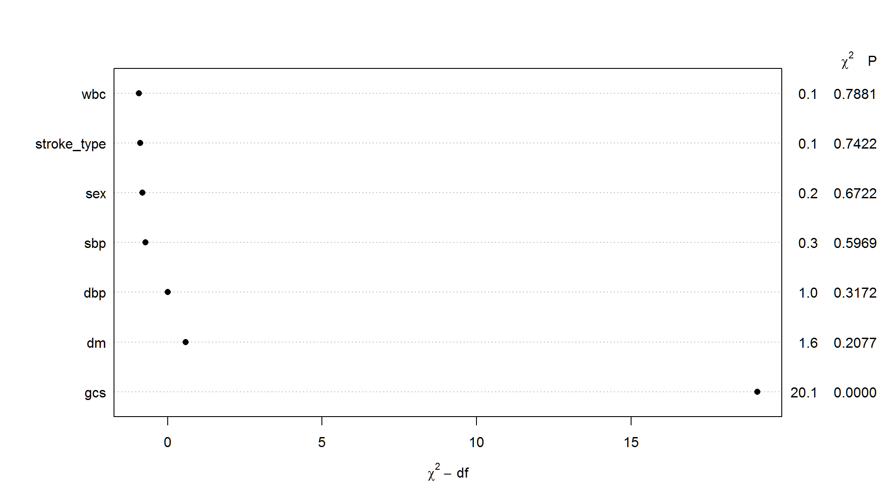

## now we create univariate models as in logistic regression

By using `tbl_uvregression()` we can generate simple univariable model for all covariates in one line of code. In return, we get the crude HR for all the covariates of interest.

``` r
library(gt)
library(gtsummary)
surv_data |>
  dplyr::select(time2, status, sex, dm, gcs, sbp, dbp, wbc, 
                stroke_type) |>
  tbl_uvregression(
    method = coxph,
    y = Surv(time2, event = status == 'dead'),
    exponentiate = TRUE,
    pvalue_fun = ~style_pvalue(.x, digits = 3)
  ) |>
  as_gt()
```

<div id="oyjukhxmop" style="padding-left:0px;padding-right:0px;padding-top:10px;padding-bottom:10px;overflow-x:auto;overflow-y:auto;width:auto;height:auto;">
<style>#oyjukhxmop table {
  font-family: system-ui, 'Segoe UI', Roboto, Helvetica, Arial, sans-serif, 'Apple Color Emoji', 'Segoe UI Emoji', 'Segoe UI Symbol', 'Noto Color Emoji';
  -webkit-font-smoothing: antialiased;
  -moz-osx-font-smoothing: grayscale;
}

#oyjukhxmop thead, #oyjukhxmop tbody, #oyjukhxmop tfoot, #oyjukhxmop tr, #oyjukhxmop td, #oyjukhxmop th {
  border-style: none;
}

#oyjukhxmop p {
  margin: 0;
  padding: 0;
}

#oyjukhxmop .gt_table {
  display: table;
  border-collapse: collapse;
  line-height: normal;
  margin-left: auto;
  margin-right: auto;
  color: #333333;
  font-size: 16px;
  font-weight: normal;
  font-style: normal;
  background-color: #FFFFFF;
  width: auto;
  border-top-style: solid;
  border-top-width: 2px;
  border-top-color: #A8A8A8;
  border-right-style: none;
  border-right-width: 2px;
  border-right-color: #D3D3D3;
  border-bottom-style: solid;
  border-bottom-width: 2px;
  border-bottom-color: #A8A8A8;
  border-left-style: none;
  border-left-width: 2px;
  border-left-color: #D3D3D3;
}

#oyjukhxmop .gt_caption {
  padding-top: 4px;
  padding-bottom: 4px;
}

#oyjukhxmop .gt_title {
  color: #333333;
  font-size: 125%;
  font-weight: initial;
  padding-top: 4px;
  padding-bottom: 4px;
  padding-left: 5px;
  padding-right: 5px;
  border-bottom-color: #FFFFFF;
  border-bottom-width: 0;
}

#oyjukhxmop .gt_subtitle {
  color: #333333;
  font-size: 85%;
  font-weight: initial;
  padding-top: 3px;
  padding-bottom: 5px;
  padding-left: 5px;
  padding-right: 5px;
  border-top-color: #FFFFFF;
  border-top-width: 0;
}

#oyjukhxmop .gt_heading {
  background-color: #FFFFFF;
  text-align: center;
  border-bottom-color: #FFFFFF;
  border-left-style: none;
  border-left-width: 1px;
  border-left-color: #D3D3D3;
  border-right-style: none;
  border-right-width: 1px;
  border-right-color: #D3D3D3;
}

#oyjukhxmop .gt_bottom_border {
  border-bottom-style: solid;
  border-bottom-width: 2px;
  border-bottom-color: #D3D3D3;
}

#oyjukhxmop .gt_col_headings {
  border-top-style: solid;
  border-top-width: 2px;
  border-top-color: #D3D3D3;
  border-bottom-style: solid;
  border-bottom-width: 2px;
  border-bottom-color: #D3D3D3;
  border-left-style: none;
  border-left-width: 1px;
  border-left-color: #D3D3D3;
  border-right-style: none;
  border-right-width: 1px;
  border-right-color: #D3D3D3;
}

#oyjukhxmop .gt_col_heading {
  color: #333333;
  background-color: #FFFFFF;
  font-size: 100%;
  font-weight: normal;
  text-transform: inherit;
  border-left-style: none;
  border-left-width: 1px;
  border-left-color: #D3D3D3;
  border-right-style: none;
  border-right-width: 1px;
  border-right-color: #D3D3D3;
  vertical-align: bottom;
  padding-top: 5px;
  padding-bottom: 6px;
  padding-left: 5px;
  padding-right: 5px;
  overflow-x: hidden;
}

#oyjukhxmop .gt_column_spanner_outer {
  color: #333333;
  background-color: #FFFFFF;
  font-size: 100%;
  font-weight: normal;
  text-transform: inherit;
  padding-top: 0;
  padding-bottom: 0;
  padding-left: 4px;
  padding-right: 4px;
}

#oyjukhxmop .gt_column_spanner_outer:first-child {
  padding-left: 0;
}

#oyjukhxmop .gt_column_spanner_outer:last-child {
  padding-right: 0;
}

#oyjukhxmop .gt_column_spanner {
  border-bottom-style: solid;
  border-bottom-width: 2px;
  border-bottom-color: #D3D3D3;
  vertical-align: bottom;
  padding-top: 5px;
  padding-bottom: 5px;
  overflow-x: hidden;
  display: inline-block;
  width: 100%;
}

#oyjukhxmop .gt_spanner_row {
  border-bottom-style: hidden;
}

#oyjukhxmop .gt_group_heading {
  padding-top: 8px;
  padding-bottom: 8px;
  padding-left: 5px;
  padding-right: 5px;
  color: #333333;
  background-color: #FFFFFF;
  font-size: 100%;
  font-weight: initial;
  text-transform: inherit;
  border-top-style: solid;
  border-top-width: 2px;
  border-top-color: #D3D3D3;
  border-bottom-style: solid;
  border-bottom-width: 2px;
  border-bottom-color: #D3D3D3;
  border-left-style: none;
  border-left-width: 1px;
  border-left-color: #D3D3D3;
  border-right-style: none;
  border-right-width: 1px;
  border-right-color: #D3D3D3;
  vertical-align: middle;
  text-align: left;
}

#oyjukhxmop .gt_empty_group_heading {
  padding: 0.5px;
  color: #333333;
  background-color: #FFFFFF;
  font-size: 100%;
  font-weight: initial;
  border-top-style: solid;
  border-top-width: 2px;
  border-top-color: #D3D3D3;
  border-bottom-style: solid;
  border-bottom-width: 2px;
  border-bottom-color: #D3D3D3;
  vertical-align: middle;
}

#oyjukhxmop .gt_from_md > :first-child {
  margin-top: 0;
}

#oyjukhxmop .gt_from_md > :last-child {
  margin-bottom: 0;
}

#oyjukhxmop .gt_row {
  padding-top: 8px;
  padding-bottom: 8px;
  padding-left: 5px;
  padding-right: 5px;
  margin: 10px;
  border-top-style: solid;
  border-top-width: 1px;
  border-top-color: #D3D3D3;
  border-left-style: none;
  border-left-width: 1px;
  border-left-color: #D3D3D3;
  border-right-style: none;
  border-right-width: 1px;
  border-right-color: #D3D3D3;
  vertical-align: middle;
  overflow-x: hidden;
}

#oyjukhxmop .gt_stub {
  color: #333333;
  background-color: #FFFFFF;
  font-size: 100%;
  font-weight: initial;
  text-transform: inherit;
  border-right-style: solid;
  border-right-width: 2px;
  border-right-color: #D3D3D3;
  padding-left: 5px;
  padding-right: 5px;
}

#oyjukhxmop .gt_stub_row_group {
  color: #333333;
  background-color: #FFFFFF;
  font-size: 100%;
  font-weight: initial;
  text-transform: inherit;
  border-right-style: solid;
  border-right-width: 2px;
  border-right-color: #D3D3D3;
  padding-left: 5px;
  padding-right: 5px;
  vertical-align: top;
}

#oyjukhxmop .gt_row_group_first td {
  border-top-width: 2px;
}

#oyjukhxmop .gt_row_group_first th {
  border-top-width: 2px;
}

#oyjukhxmop .gt_summary_row {
  color: #333333;
  background-color: #FFFFFF;
  text-transform: inherit;
  padding-top: 8px;
  padding-bottom: 8px;
  padding-left: 5px;
  padding-right: 5px;
}

#oyjukhxmop .gt_first_summary_row {
  border-top-style: solid;
  border-top-color: #D3D3D3;
}

#oyjukhxmop .gt_first_summary_row.thick {
  border-top-width: 2px;
}

#oyjukhxmop .gt_last_summary_row {
  padding-top: 8px;
  padding-bottom: 8px;
  padding-left: 5px;
  padding-right: 5px;
  border-bottom-style: solid;
  border-bottom-width: 2px;
  border-bottom-color: #D3D3D3;
}

#oyjukhxmop .gt_grand_summary_row {
  color: #333333;
  background-color: #FFFFFF;
  text-transform: inherit;
  padding-top: 8px;
  padding-bottom: 8px;
  padding-left: 5px;
  padding-right: 5px;
}

#oyjukhxmop .gt_first_grand_summary_row {
  padding-top: 8px;
  padding-bottom: 8px;
  padding-left: 5px;
  padding-right: 5px;
  border-top-style: double;
  border-top-width: 6px;
  border-top-color: #D3D3D3;
}

#oyjukhxmop .gt_last_grand_summary_row_top {
  padding-top: 8px;
  padding-bottom: 8px;
  padding-left: 5px;
  padding-right: 5px;
  border-bottom-style: double;
  border-bottom-width: 6px;
  border-bottom-color: #D3D3D3;
}

#oyjukhxmop .gt_striped {
  background-color: rgba(128, 128, 128, 0.05);
}

#oyjukhxmop .gt_table_body {
  border-top-style: solid;
  border-top-width: 2px;
  border-top-color: #D3D3D3;
  border-bottom-style: solid;
  border-bottom-width: 2px;
  border-bottom-color: #D3D3D3;
}

#oyjukhxmop .gt_footnotes {
  color: #333333;
  background-color: #FFFFFF;
  border-bottom-style: none;
  border-bottom-width: 2px;
  border-bottom-color: #D3D3D3;
  border-left-style: none;
  border-left-width: 2px;
  border-left-color: #D3D3D3;
  border-right-style: none;
  border-right-width: 2px;
  border-right-color: #D3D3D3;
}

#oyjukhxmop .gt_footnote {
  margin: 0px;
  font-size: 90%;
  padding-top: 4px;
  padding-bottom: 4px;
  padding-left: 5px;
  padding-right: 5px;
}

#oyjukhxmop .gt_sourcenotes {
  color: #333333;
  background-color: #FFFFFF;
  border-bottom-style: none;
  border-bottom-width: 2px;
  border-bottom-color: #D3D3D3;
  border-left-style: none;
  border-left-width: 2px;
  border-left-color: #D3D3D3;
  border-right-style: none;
  border-right-width: 2px;
  border-right-color: #D3D3D3;
}

#oyjukhxmop .gt_sourcenote {
  font-size: 90%;
  padding-top: 4px;
  padding-bottom: 4px;
  padding-left: 5px;
  padding-right: 5px;
}

#oyjukhxmop .gt_left {
  text-align: left;
}

#oyjukhxmop .gt_center {
  text-align: center;
}

#oyjukhxmop .gt_right {
  text-align: right;
  font-variant-numeric: tabular-nums;
}

#oyjukhxmop .gt_font_normal {
  font-weight: normal;
}

#oyjukhxmop .gt_font_bold {
  font-weight: bold;
}

#oyjukhxmop .gt_font_italic {
  font-style: italic;
}

#oyjukhxmop .gt_super {
  font-size: 65%;
}

#oyjukhxmop .gt_footnote_marks {
  font-size: 75%;
  vertical-align: 0.4em;
  position: initial;
}

#oyjukhxmop .gt_asterisk {
  font-size: 100%;
  vertical-align: 0;
}

#oyjukhxmop .gt_indent_1 {
  text-indent: 5px;
}

#oyjukhxmop .gt_indent_2 {
  text-indent: 10px;
}

#oyjukhxmop .gt_indent_3 {
  text-indent: 15px;
}

#oyjukhxmop .gt_indent_4 {
  text-indent: 20px;
}

#oyjukhxmop .gt_indent_5 {
  text-indent: 25px;
}
</style>
<table class="gt_table" data-quarto-disable-processing="false" data-quarto-bootstrap="false">
  <thead>
    
    <tr class="gt_col_headings">
      <th class="gt_col_heading gt_columns_bottom_border gt_left" rowspan="1" colspan="1" scope="col" id="&lt;strong&gt;Characteristic&lt;/strong&gt;"><strong>Characteristic</strong></th>
      <th class="gt_col_heading gt_columns_bottom_border gt_center" rowspan="1" colspan="1" scope="col" id="&lt;strong&gt;N&lt;/strong&gt;"><strong>N</strong></th>
      <th class="gt_col_heading gt_columns_bottom_border gt_center" rowspan="1" colspan="1" scope="col" id="&lt;strong&gt;HR&lt;/strong&gt;&lt;span class=&quot;gt_footnote_marks&quot; style=&quot;white-space:nowrap;font-style:italic;font-weight:normal;&quot;&gt;&lt;sup&gt;1&lt;/sup&gt;&lt;/span&gt;"><strong>HR</strong><span class="gt_footnote_marks" style="white-space:nowrap;font-style:italic;font-weight:normal;"><sup>1</sup></span></th>
      <th class="gt_col_heading gt_columns_bottom_border gt_center" rowspan="1" colspan="1" scope="col" id="&lt;strong&gt;95% CI&lt;/strong&gt;&lt;span class=&quot;gt_footnote_marks&quot; style=&quot;white-space:nowrap;font-style:italic;font-weight:normal;&quot;&gt;&lt;sup&gt;1&lt;/sup&gt;&lt;/span&gt;"><strong>95% CI</strong><span class="gt_footnote_marks" style="white-space:nowrap;font-style:italic;font-weight:normal;"><sup>1</sup></span></th>
      <th class="gt_col_heading gt_columns_bottom_border gt_center" rowspan="1" colspan="1" scope="col" id="&lt;strong&gt;p-value&lt;/strong&gt;"><strong>p-value</strong></th>
    </tr>
  </thead>
  <tbody class="gt_table_body">
    <tr><td headers="label" class="gt_row gt_left">sex</td>
<td headers="stat_n" class="gt_row gt_center">213</td>
<td headers="estimate" class="gt_row gt_center"></td>
<td headers="ci" class="gt_row gt_center"></td>
<td headers="p.value" class="gt_row gt_center"></td></tr>
    <tr><td headers="label" class="gt_row gt_left">    female</td>
<td headers="stat_n" class="gt_row gt_center"></td>
<td headers="estimate" class="gt_row gt_center">—</td>
<td headers="ci" class="gt_row gt_center">—</td>
<td headers="p.value" class="gt_row gt_center"></td></tr>
    <tr><td headers="label" class="gt_row gt_left">    male</td>
<td headers="stat_n" class="gt_row gt_center"></td>
<td headers="estimate" class="gt_row gt_center">0.71</td>
<td headers="ci" class="gt_row gt_center">0.37, 1.36</td>
<td headers="p.value" class="gt_row gt_center">0.299</td></tr>
    <tr><td headers="label" class="gt_row gt_left">dm</td>
<td headers="stat_n" class="gt_row gt_center">213</td>
<td headers="estimate" class="gt_row gt_center"></td>
<td headers="ci" class="gt_row gt_center"></td>
<td headers="p.value" class="gt_row gt_center"></td></tr>
    <tr><td headers="label" class="gt_row gt_left">    no</td>
<td headers="stat_n" class="gt_row gt_center"></td>
<td headers="estimate" class="gt_row gt_center">—</td>
<td headers="ci" class="gt_row gt_center">—</td>
<td headers="p.value" class="gt_row gt_center"></td></tr>
    <tr><td headers="label" class="gt_row gt_left">    yes</td>
<td headers="stat_n" class="gt_row gt_center"></td>
<td headers="estimate" class="gt_row gt_center">0.60</td>
<td headers="ci" class="gt_row gt_center">0.31, 1.13</td>
<td headers="p.value" class="gt_row gt_center">0.112</td></tr>
    <tr><td headers="label" class="gt_row gt_left">gcs</td>
<td headers="stat_n" class="gt_row gt_center">213</td>
<td headers="estimate" class="gt_row gt_center">0.84</td>
<td headers="ci" class="gt_row gt_center">0.79, 0.90</td>
<td headers="p.value" class="gt_row gt_center"><0.001</td></tr>
    <tr><td headers="label" class="gt_row gt_left">sbp</td>
<td headers="stat_n" class="gt_row gt_center">213</td>
<td headers="estimate" class="gt_row gt_center">1.00</td>
<td headers="ci" class="gt_row gt_center">0.99, 1.01</td>
<td headers="p.value" class="gt_row gt_center">0.617</td></tr>
    <tr><td headers="label" class="gt_row gt_left">dbp</td>
<td headers="stat_n" class="gt_row gt_center">213</td>
<td headers="estimate" class="gt_row gt_center">1.00</td>
<td headers="ci" class="gt_row gt_center">0.98, 1.01</td>
<td headers="p.value" class="gt_row gt_center">0.772</td></tr>
    <tr><td headers="label" class="gt_row gt_left">wbc</td>
<td headers="stat_n" class="gt_row gt_center">213</td>
<td headers="estimate" class="gt_row gt_center">1.04</td>
<td headers="ci" class="gt_row gt_center">0.97, 1.11</td>
<td headers="p.value" class="gt_row gt_center">0.270</td></tr>
    <tr><td headers="label" class="gt_row gt_left">stroke_type</td>
<td headers="stat_n" class="gt_row gt_center">213</td>
<td headers="estimate" class="gt_row gt_center"></td>
<td headers="ci" class="gt_row gt_center"></td>
<td headers="p.value" class="gt_row gt_center"></td></tr>
    <tr><td headers="label" class="gt_row gt_left">    HS</td>
<td headers="stat_n" class="gt_row gt_center"></td>
<td headers="estimate" class="gt_row gt_center">—</td>
<td headers="ci" class="gt_row gt_center">—</td>
<td headers="p.value" class="gt_row gt_center"></td></tr>
    <tr><td headers="label" class="gt_row gt_left">    IS</td>
<td headers="stat_n" class="gt_row gt_center"></td>
<td headers="estimate" class="gt_row gt_center">0.52</td>
<td headers="ci" class="gt_row gt_center">0.28, 0.96</td>
<td headers="p.value" class="gt_row gt_center">0.037</td></tr>
  </tbody>
  
  <tfoot class="gt_footnotes">
    <tr>
      <td class="gt_footnote" colspan="5"><span class="gt_footnote_marks" style="white-space:nowrap;font-style:italic;font-weight:normal;"><sup>1</sup></span> HR = Hazard Ratio, CI = Confidence Interval</td>
    </tr>
  </tfoot>
</table>
</div>

- it is clear that `gcs` has the least p-value hence can be included in the model first

``` r
surv_data_gcs <- coxph(Surv(time = time2,event = status == 'dead') ~ gcs,
                     data = surv_data)
summary(surv_data_gcs)
#> Call:
#> coxph(formula = Surv(time = time2, event = status == "dead") ~ 
#>     gcs, data = surv_data)
#> 
#>   n= 213, number of events= 48 
#> 
#>         coef exp(coef) se(coef)      z Pr(>|z|)    
#> gcs -0.17454   0.83984  0.03431 -5.087 3.63e-07 ***
#> ---
#> Signif. codes:  0 '***' 0.001 '**' 0.01 '*' 0.05 '.' 0.1 ' ' 1
#> 
#>     exp(coef) exp(-coef) lower .95 upper .95
#> gcs    0.8398      1.191    0.7852    0.8983
#> 
#> Concordance= 0.763  (se = 0.039 )
#> Likelihood ratio test= 26.01  on 1 df,   p=3e-07
#> Wald test            = 25.88  on 1 df,   p=4e-07
#> Score (logrank) test = 29.33  on 1 df,   p=6e-08
```

The simple Cox PH model with covariate gcs shows that with each one unit increase in gcs, the crude log hazard for death changes by a factor of `\(-0.175\)`.

# lets tidy it up

``` r
tidy(surv_data_gcs,
     exponentiate = TRUE,
     conf.int = TRUE)
#> # A tibble: 1 x 7
#>   term  estimate std.error statistic     p.value conf.low conf.high
#>   <chr>    <dbl>     <dbl>     <dbl>       <dbl>    <dbl>     <dbl>
#> 1 gcs      0.840    0.0343     -5.09 0.000000363    0.785     0.898
```

{}
When we exponentiate the log HR, the simple Cox PH model shows that with each one unit increase in gcs, the crude risk for death decreases for about `\(16\%\)` and the of decrease are between `\(95\% CI (0.785, 0.898)\)`. The relationship between surv_data death and gcs is highly significant (p-value `\(< 0.0001\)`) when not adjusting for other covariates.

{}

## next up we add surv_data type

``` r
surv_data_mv <- 
  coxph(Surv(time = time2, 
             event = status == 'dead') ~ stroke_type +  gcs , 
        data = surv_data)
tidy(surv_data_mv, exponentiate = TRUE, conf.int = TRUE)
#> # A tibble: 2 x 7
#>   term          estimate std.error statistic    p.value conf.low conf.high
#>   <chr>            <dbl>     <dbl>     <dbl>      <dbl>    <dbl>     <dbl>
#> 1 stroke_typeIS    0.774    0.323     -0.794 0.427         0.411     1.46 
#> 2 gcs              0.846    0.0357    -4.68  0.00000290    0.789     0.908
```

## lets test if surv_data type is worth it

``` r
anova(surv_data_mv,surv_data_gcs,test="LRT")
#> Analysis of Deviance Table
#>  Cox model: response is  Surv(time = time2, event = status == "dead")
#>  Model 1: ~ stroke_type + gcs
#>  Model 2: ~ gcs
#>    loglik  Chisq Df Pr(>|Chi|)
#> 1 -187.48                     
#> 2 -187.80 0.6422  1     0.4229
```

- The variable is not significant

## we try another one

``` r
surv_data_dm <- 
  coxph(Surv(time = time2, 
             event = status == 'dead') ~ dm +  gcs , 
        data = surv_data)
tidy(surv_data_dm, exponentiate = TRUE, conf.int = TRUE)
#> # A tibble: 2 x 7
#>   term  estimate std.error statistic     p.value conf.low conf.high
#>   <chr>    <dbl>     <dbl>     <dbl>       <dbl>    <dbl>     <dbl>
#> 1 dmyes    0.625    0.328      -1.43 0.152          0.329     1.19 
#> 2 gcs      0.840    0.0347     -5.04 0.000000466    0.785     0.899
```

## lets test if dm is worth it

``` r
anova(surv_data_dm,surv_data_gcs,test="LRT")
#> Analysis of Deviance Table
#>  Cox model: response is  Surv(time = time2, event = status == "dead")
#>  Model 1: ~ dm + gcs
#>  Model 2: ~ gcs
#>    loglik Chisq Df Pr(>|Chi|)
#> 1 -186.71                    
#> 2 -187.80 2.181  1     0.1397
```

- still not worth is it , we can go on and on…

## lets do a backward elimination

``` r
fatal_mv1<-rms::cph(Surv(time2,status == 'dead') ~ gcs + stroke_type+dbp+wbc
                      + sex + dm + sbp ,data = surv_data)
fastbw(fatal_mv1)
#> 
#>  Deleted     Chi-Sq d.f. P      Residual d.f. P      AIC  
#>  wbc         0.07   1    0.7881 0.07     1    0.7881 -1.93
#>  stroke_type 0.14   1    0.7130 0.21     2    0.9015 -3.79
#>  sex         0.16   1    0.6934 0.36     3    0.9478 -5.64
#>  sbp         0.39   1    0.5326 0.75     4    0.9447 -7.25
#>  dbp         1.12   1    0.2897 1.87     5    0.8664 -8.13
#>  dm          2.03   1    0.1542 3.90     6    0.6898 -8.10
#> 
#> Approximate Estimates after Deleting Factors
#> 
#>        Coef    S.E. Wald Z         P
#> gcs -0.1762 0.03495 -5.041 4.635e-07
#> 
#> Factors in Final Model
#> 
#> [1] gcs
```

- final model has gcs variable

{}

## Validity of the Cox PH model

The Cox proportional hazards model makes several assumptions. We use
residuals methods to:

- check the proportional hazards assumption with the Schoenfeld
  residuals
- detect nonlinearity in relationship between the log hazard and the
  covariates using Martingale residual
- examining influential observations (or outliers) with deviance
  residual (symmetric transformation of the martinguale residuals), to
  examine influential observations
  {}

## Testing proportional hazard

The proportional hazard assumption is supported by a non-significant
relationship between residuals and time, and refuted by a significant
relationship.

We can test with the **Goodness of Fit (GOF)** approach based on the
residuals defined by Schoenfeld.

The idea behind the statistical test is that if the PH assumption holds
for a particular covariate then the Schoenfeld residuals for that
covariate will not be related to survival time.

{}

## The implementation of the test can be thought of as a three-step process.

- [x] Step 1. Run a Cox PH model and obtain Schoenfeld residuals for each
  predictor.

- [x] Step 2. Create a variable that ranks the order of failures. The
  subject who has the first (earliest) event gets a value of 1, the
  next gets a value of 2, and so on.

- [x] Step 3. Test the correlation between the variables created in the
  first and second steps. The null hypothesis is that the correlation
  between the Schoenfeld residuals and ranked failure time is zero.

> For each covariate, the function cox.zph() correlates the corresponding
> set of scaled Schoenfeld residuals with time, to test for independence
> between residuals and time. Additionally, it performs a global test for
> the model as a whole.

{}

``` r
test.ph <- cox.zph(stroke_type)
print(test.ph)
#>              chisq df    p
#> gcs         0.0206  1 0.89
#> stroke_type 1.2745  1 0.26
#> dbp         1.0480  1 0.31
#> wbc         0.0235  1 0.88
#> sex         0.4560  1 0.50
#> dm          1.9324  1 0.16
#> sbp         1.2716  1 0.26
#> GLOBAL      6.1719  7 0.52
```

``` r
ggcoxzph(test.ph)
```

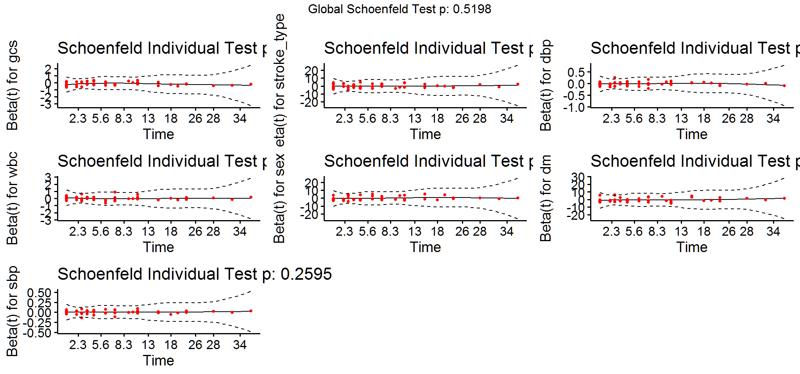

{}
From the output above, the test is not statistically significant, and
therefore the global test is also not statistically significant.
Therefore, we can assume the proportional hazards.

In the graphical diagnostic using the function ggcoxzph() \[in the
survminer package\], the solid line is a smoothing spline fit to the
plot, with the dashed lines representing a +/- 2-standard-error band
around the fit. From the graphical inspection, there is no pattern with
time. The assumption of proportional hazards appears to be supported for
the covariates sex (which is, recall, a two-level factor, accounting for
the two bands in the graph).
{}

## another approach

Another approach is to graphically check the PH assumption by comparing
**-log–log survival curves**. A log–log survival curve is simply a
transformation of an estimated survival curve that results from taking
the natural log of an estimated survival probability twice.

`\(h(t, X) = h_{0}(t)e^{ \sum_{j=1}^{p} \beta_{j}X_{j}}\)` which is
equivalent to `\(S(t,X) = [S_{0}(t)]^{e^{ \sum_{j=1}^{p} \beta_{j}X_{j}}}\)`

Therefore, `$$-ln(-ln(S(t, X)))$$`

`$$= -ln(-ln([S_{0}(t)]^{e^{ \sum_{j=1}^{p} \beta_{j}X_{j}}}))$$`
`$$= -ln[-ln(S_{0}(t))] - ln[e^{ \sum_{j=1}^{p} \beta_{j}X_{j}}]$$`

`$$=  - \sum_{j=1}^{p} \beta_{j} X_{j} - ln[-ln(S_{0}(t))]$$`

Therefore, the corresponding log–log curves for these individuals are
given as shown here, where we have simply substituted `\(X_1\)` and `\(X_2\)`
for `\(X\)` in the previous expression for the log–log curve for any
individual `\(X\)`.

`$$ln(-ln(S(t, X_1))) - ln(-ln(S(t, X_2)))$$`
`$$= \sum_{j=1}^{p} \beta_{j} (X_{1j} - X_{2j})$$`

The baseline survival function has dropped out, so that the difference
in log–log curves involves an expression that does not involve time t.
The above formula says that if we use a Cox PH model and we plot the
estimated -log–log survival curves for two groups of individuals on the
same graph, the two plots would be approximately parallel.

{}
The distance between the two curves is the linear expression involving
the differences in predictor values, which does not involve time. Note,
in general, if the vertical distance between two curves is constant,
then the curves are parallel.
{}

``` r
m = survfit(Surv(time2,status == 'dead') ~  stroke_type
                       ,data = surv_data)
s = summary(m)
s_table = data.frame(s$strata, s$time, s$n.risk, s$n.event, s$n.censor, s$surv, s$lower, s$upper)
s_table = s_table %>%
              rename(strata=s.strata, time=s.time, surv=s.surv, lower=s.lower, upper=s.upper) %>%
              mutate(negloglogsurv=-log(-log(surv)))
```

``` r
plot<-ggplot(s_table, aes(x=time, y=negloglogsurv, color=strata)) + 
  geom_line(size=1.25) +
  theme(text=element_text(size=16),
        plot.title=element_text(hjust=0.5)) +
  ggthemes::scale_colour_tableau()+
  tvthemes::theme_avatar()+
  ylab("-ln(-ln(S(t)))") +
  ggtitle("-log-log plot of survival time by surv_data type")
```

``` r
plot
```

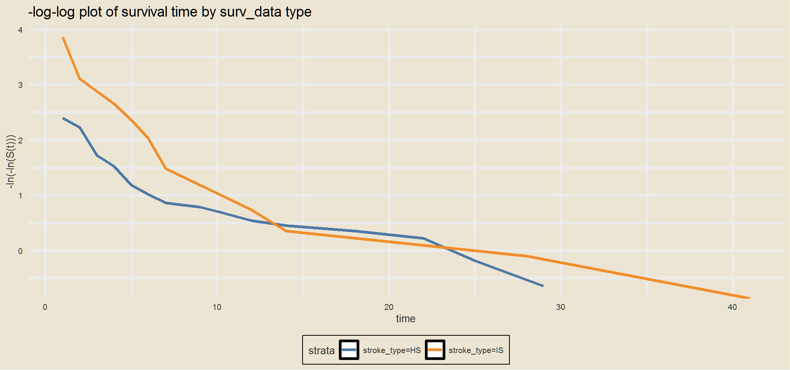

The two curve cross, therefore this result suggests that the two
groups in surv_data type do not satisfy the PH assumption.

{}

## Testing influential observations

To test influential observations or outliers, we can visualize either:
the **dfbeta values** or the **deviance residuals**.

- 1)  dfbeta values

This plot produces the estimated changes in the coefficients divided by
their standard errors. The comparison of the magnitudes of the largest
dfbeta values to the regression coefficients suggests that none of the
observations is terribly influential individually.

{}

``` r
ggcoxdiagnostics(surv_data_stype, type = "dfbeta",
                 linear.predictions = FALSE, ggtheme = theme_bw())
```

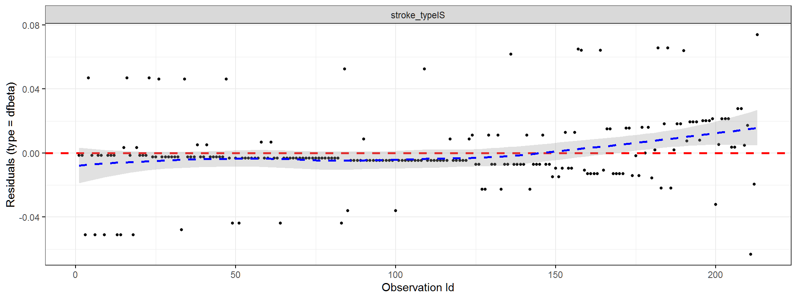

{}

    2)  deviance residuals

The deviance residual is a normalized transformation of the martingale
residual. These residuals should be roughly symmetrically distributed
about zero with a standard deviation of 1.

- [x] Positive values correspond to individuals that “died too soon”
  compared to expected survival times.

- [x] Negative values correspond to individual that “lived too long”.

- [x] Very large or small values are outliers, which are poorly predicted
  by the model.

{}

``` r
ggcoxdiagnostics(stroke_type, type = "deviance",
                 linear.predictions = FALSE, tvtheme = theme_avatar())
```

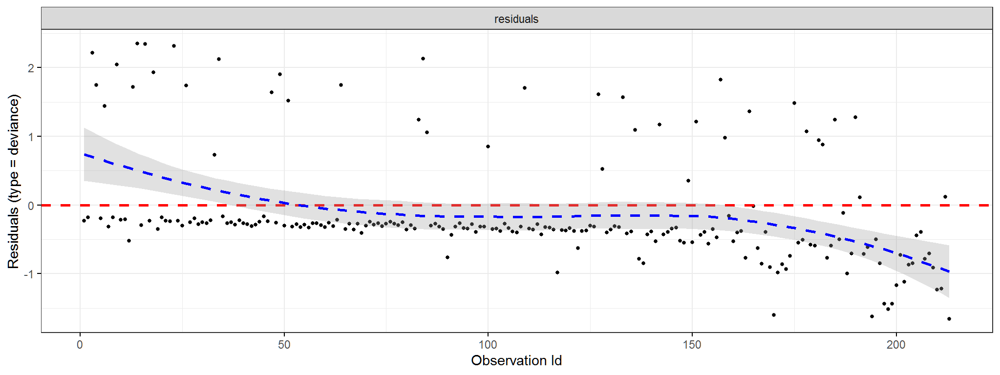

``` r
ggcoxdiagnostics(stroke_type, type = "martingale",
                 linear.predictions = FALSE, ggtheme = theme_bw())
```

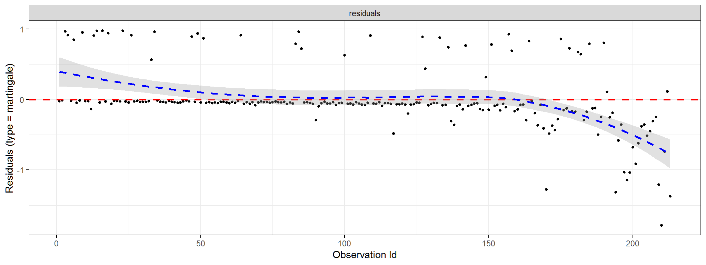

``` r
ggcoxdiagnostics(stroke_type, type = "deviance", ox.scale = 'time')
```

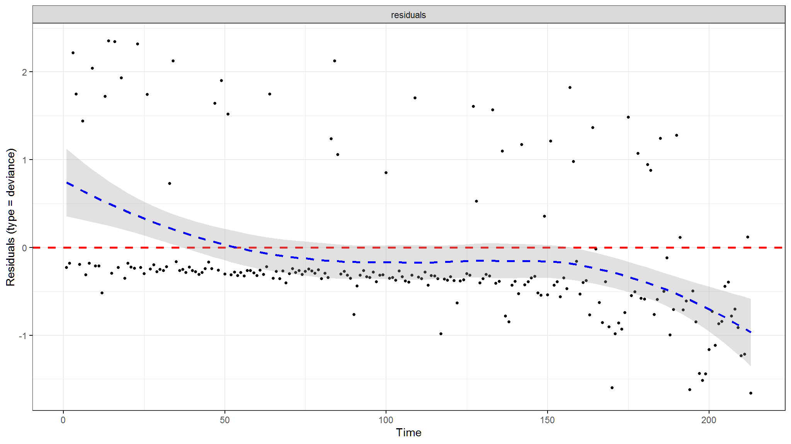

``` r
ggcoxdiagnostics(stroke_type, type = "deviance", ox.scale = "linear.predictions")
```

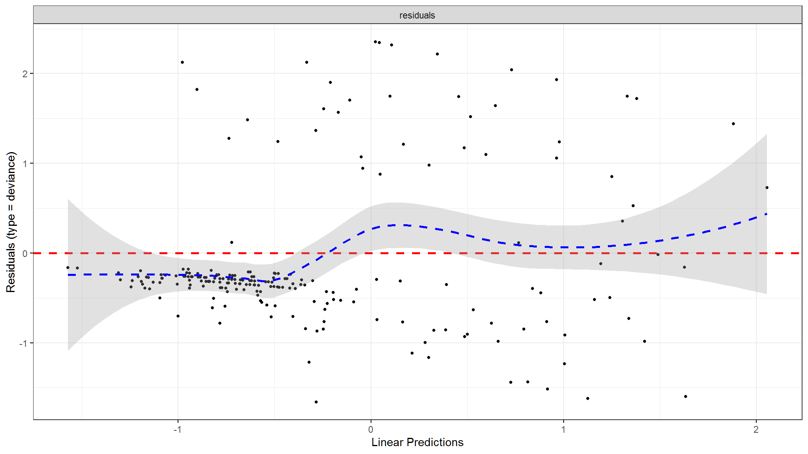

``` r
ggcoxdiagnostics(stroke_type, type = "schoenfeld", ox.scale = "observation.id")
```

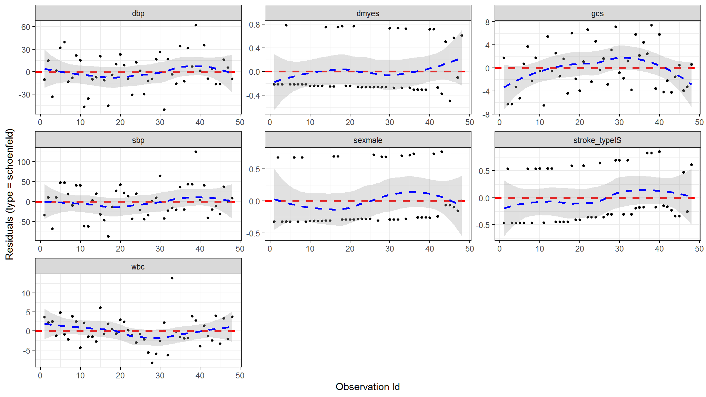

[^1]: Cox regression and the logrank test from `survdiff` are going to give you similar results most of the time. The log-rank test is asking if survival curves differ significantly between two groups. Cox regression is asking which of many categorical or continuous variables significantly affect survival.
