<script src="//yihui.org/js/math-code.js" defer></script>
<!-- Just one possible MathJax CDN below. You may use others. -->
<script defer
  src="//mathjax.rstudio.com/latest/MathJax.js?config=TeX-MML-AM_CHTML">
</script>

{}

## Introduction

Brain Cancers include primary brain tumours which starts in the brain and almost never spread to other parts of the body and secondary tumours which are caused by cancers that began in another part of the body .

> There are more than 40 major types of brain tumours, which are grouped into two main types:

- benign - slow-growing and unlikely to spread. Common types are meningiomas, neuromas, pituitary tumours and craniopharyngiomas.
- malignant - cancerous and able to spread into other parts of the brain or spinal cord. Common types include astrocytomas, oligodendrogliomas, glioblastomas and mixed gliomas.

> It is estimated that more than 1,900 people were diagnosed with brain cancer in 2023. The average age at diagnosis is 59 years old.

### Brain cancer signs and symptoms

Headaches are often the first symptom of a brain tumour. The headaches can be mild, severe, persistent, or come and go. A headache isn’t always a brain tumour but if you’re worried, be sure to see your GP.

#### Other symptoms include:

- [x] seizures: severe (e.g. a convulsion) or mild (a fleeting disturbance of awareness, sensation or jerking muscles) weakness or paralysis in part of the body
- [x] loss of balance
- [x] general irritability, drowsiness or a change in personality nausea and vomiting
- [x] disturbed vision, hearing, smell or taste.

## References

- Understanding Brain Tumours, Cancer Council Australia ©2020. Last medical review of source booklet: May 2020.
- Australian Institute of Health and Welfare. Cancer data in Australia \[Internet\]. Canberra: Australian Institute of Health and Welfare, 2023 \[cited 2023 Sept 04\]. Available from: https://www.aihw.gov.au/reports/cancer/cancer-data-in-australia

## Objectives of the study

- determine factors that determine mortality of brain cancer patients
- compare survival times of certain groups of breast cancer patients
- determine the extend to which diagnosis affects survival of patients
- learn more about using R for biostatistical studies and clinical research

### Methodology

My research aims at patients’ brain cancer survival analysis . In the analysis I did a detailed research on the variables that determine whether patients get over a disease or surrender in a certain duration time. Thus I used a non-parametric statistic estimator to create a Kaplan-Meier Survival model to measure the survival function from lifetime duration data. We fit a cox proportional model and Logistic regression model.

{}

{}

## Brain Cancer Data

A data frame with 88 observations and 8 variables:

- [x] sex : Factor with levels “Female” and “Male”
- [x] diagnosis : Factor with levels “Meningioma”, “LG glioma”, “HG glioma”, and “Other”.
- [x] Location : factor with levels “Infratentorial” and “Supratentorial”.
- [x] ki : Karnofsky index.
- [x] gtv : Gross tumor volume, in cubic centimeters.
- [x] stereo : Stereotactic method factor with levels “SRS” and “SRT”.
- [x] status : Whether the patient is dead at the end of the study: 0=No, 1=yes.
- [x] time : Survival time, in months.
  {}

## Setup

``` r
library(pacman)
p_load(tidyverse, tidymodels, ISLR2, survival, censored,dlookr,pubh,sjPlot,compareGroups,survminer)
```

### take a look at the dataset

``` r
BrainCancer<-readr::read_csv("NCU_braincancer.csv")
```

``` r
skimr::skim(BrainCancer)
```

<table style="width: auto;" class="table table-condensed">
<caption>
<span id="tab:unnamed-chunk-3"></span>Table 1: Data summary
</caption>
<tbody>
<tr>
<td style="text-align:left;">
Name
</td>
<td style="text-align:left;">
BrainCancer
</td>
</tr>
<tr>
<td style="text-align:left;">
Number of rows
</td>
<td style="text-align:left;">
88
</td>
</tr>
<tr>
<td style="text-align:left;">
Number of columns
</td>
<td style="text-align:left;">
8
</td>
</tr>
<tr>
<td style="text-align:left;">
\_\_\_\_\_\_\_\_\_\_\_\_\_\_\_\_\_\_\_\_\_\_\_
</td>
<td style="text-align:left;">
</td>
</tr>
<tr>
<td style="text-align:left;">
Column type frequency:
</td>
<td style="text-align:left;">
</td>
</tr>
<tr>
<td style="text-align:left;">
factor
</td>
<td style="text-align:left;">
4
</td>
</tr>
<tr>
<td style="text-align:left;">
numeric
</td>
<td style="text-align:left;">
4
</td>
</tr>
<tr>
<td style="text-align:left;">
\_\_\_\_\_\_\_\_\_\_\_\_\_\_\_\_\_\_\_\_\_\_\_\_
</td>
<td style="text-align:left;">
</td>
</tr>
<tr>
<td style="text-align:left;">
Group variables
</td>
<td style="text-align:left;">
None
</td>
</tr>
</tbody>
</table>

**Variable type: factor**

<table>
<thead>
<tr>
<th style="text-align:left;">
skim_variable
</th>
<th style="text-align:right;">
n_missing
</th>
<th style="text-align:right;">
complete_rate
</th>
<th style="text-align:left;">
ordered
</th>
<th style="text-align:right;">
n_unique
</th>
<th style="text-align:left;">
top_counts
</th>
</tr>
</thead>
<tbody>
<tr>
<td style="text-align:left;">
sex
</td>
<td style="text-align:right;">
0
</td>
<td style="text-align:right;">
1.00
</td>
<td style="text-align:left;">
FALSE
</td>
<td style="text-align:right;">
2
</td>
<td style="text-align:left;">
Fem: 45, Mal: 43
</td>
</tr>
<tr>
<td style="text-align:left;">
diagnosis
</td>
<td style="text-align:right;">
1
</td>
<td style="text-align:right;">
0.99
</td>
<td style="text-align:left;">
FALSE
</td>
<td style="text-align:right;">
4
</td>
<td style="text-align:left;">
Men: 42, HG : 22, Oth: 14, LG : 9
</td>
</tr>
<tr>
<td style="text-align:left;">
loc
</td>
<td style="text-align:right;">
0
</td>
<td style="text-align:right;">
1.00
</td>
<td style="text-align:left;">
FALSE
</td>
<td style="text-align:right;">
2
</td>
<td style="text-align:left;">
Sup: 69, Inf: 19
</td>
</tr>
<tr>
<td style="text-align:left;">
stereo
</td>
<td style="text-align:right;">
0
</td>
<td style="text-align:right;">
1.00
</td>
<td style="text-align:left;">
FALSE
</td>
<td style="text-align:right;">
2
</td>
<td style="text-align:left;">
SRT: 65, SRS: 23
</td>
</tr>
</tbody>
</table>

**Variable type: numeric**

<table>
<thead>
<tr>
<th style="text-align:left;">
skim_variable
</th>
<th style="text-align:right;">
n_missing
</th>
<th style="text-align:right;">
complete_rate
</th>
<th style="text-align:right;">
mean
</th>
<th style="text-align:right;">
sd
</th>
<th style="text-align:right;">
p0
</th>
<th style="text-align:right;">
p25
</th>
<th style="text-align:right;">
p50
</th>
<th style="text-align:right;">
p75
</th>
<th style="text-align:right;">
p100
</th>
<th style="text-align:left;">
hist
</th>
</tr>
</thead>
<tbody>
<tr>
<td style="text-align:left;">
ki
</td>
<td style="text-align:right;">
0
</td>
<td style="text-align:right;">
1
</td>
<td style="text-align:right;">
81.02
</td>
<td style="text-align:right;">
10.51
</td>
<td style="text-align:right;">
40.00
</td>
<td style="text-align:right;">
80.00
</td>
<td style="text-align:right;">
80.00
</td>
<td style="text-align:right;">
90.0
</td>
<td style="text-align:right;">
100.00
</td>
<td style="text-align:left;">
\<U+2581\>\<U+2581\>\<U+2583\>\<U+2587\>\<U+2587\>
</td>
</tr>
<tr>
<td style="text-align:left;">
gtv
</td>
<td style="text-align:right;">
0
</td>
<td style="text-align:right;">
1
</td>
<td style="text-align:right;">
8.66
</td>
<td style="text-align:right;">
8.66
</td>
<td style="text-align:right;">
0.01
</td>
<td style="text-align:right;">
2.50
</td>
<td style="text-align:right;">
6.51
</td>
<td style="text-align:right;">
12.1
</td>
<td style="text-align:right;">
34.64
</td>
<td style="text-align:left;">
\<U+2587\>\<U+2583\>\<U+2581\>\<U+2581\>\<U+2581\>
</td>
</tr>
<tr>
<td style="text-align:left;">
status
</td>
<td style="text-align:right;">
0
</td>
<td style="text-align:right;">
1
</td>
<td style="text-align:right;">
0.40
</td>
<td style="text-align:right;">
0.49
</td>
<td style="text-align:right;">
0.00
</td>
<td style="text-align:right;">
0.00
</td>
<td style="text-align:right;">
0.00
</td>
<td style="text-align:right;">
1.0
</td>
<td style="text-align:right;">
1.00
</td>
<td style="text-align:left;">
\<U+2587\>\<U+2581\>\<U+2581\>\<U+2581\>\<U+2585\>
</td>
</tr>
<tr>
<td style="text-align:left;">
time
</td>
<td style="text-align:right;">
0
</td>
<td style="text-align:right;">
1
</td>
<td style="text-align:right;">
27.46
</td>
<td style="text-align:right;">
20.12
</td>
<td style="text-align:right;">
0.07
</td>
<td style="text-align:right;">
10.39
</td>
<td style="text-align:right;">
24.03
</td>
<td style="text-align:right;">
41.6
</td>
<td style="text-align:right;">
82.56
</td>
<td style="text-align:left;">
\<U+2587\>\<U+2585\>\<U+2585\>\<U+2582\>\<U+2581\>
</td>
</tr>
</tbody>
</table>

## Data wrangling

``` r
data<-BrainCancer |> 
  mutate(brain_status=ifelse(status==1,"dead","alive"))
## check missing values
colSums(is.na(data))
#>          sex    diagnosis          loc           ki          gtv       stereo 
#>            0            1            0            0            0            0 
#>       status         time brain_status 
#>            0            0            0
```

- there is only one missing value

``` r
## remove the missing values
cases<-complete.cases(data) 
data<-data[cases,]
```

## Explanatory data Analysis(EDA)

## distribution of numeric variables

``` r
# Histogram of all numeric variables
data %>%
  keep(is.numeric) %>% 
  gather() %>% 
  ggplot(aes(value)) +
  facet_wrap(~ key, scales = "free") +
  geom_histogram(bins=30,fill=tvthemes::avatar_pal()(1))+
  ggthemes::theme_wsj()
```

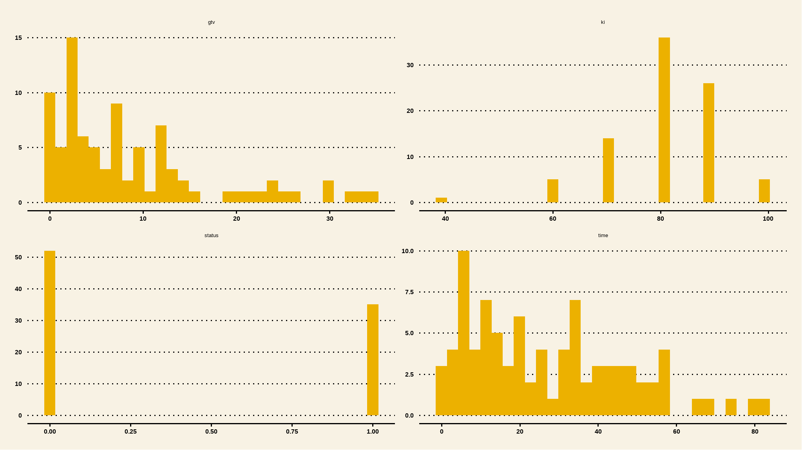

## Correlations

``` r
## select only numeric values
cor_data<-data %>%
  keep(is.numeric)
## create a correlation matrix
corl<-cor(cor_data)
corrplot::corrplot(corl,method="color",addCoef.col = "black")
```

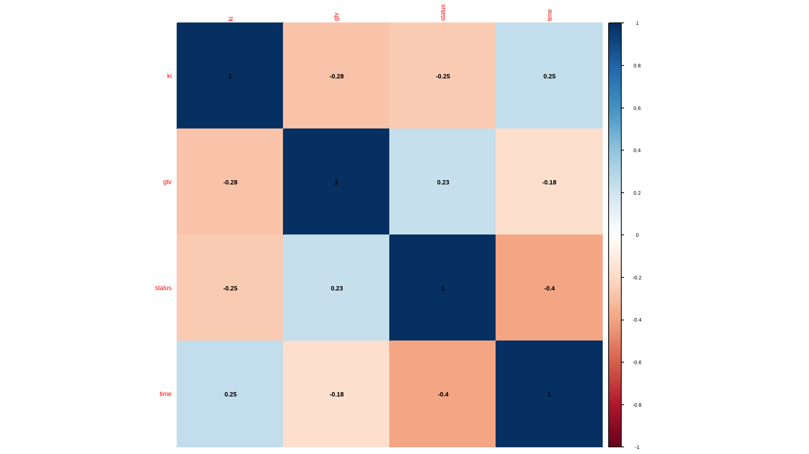

{}

- status is really not supposed to be numeric but rather a factor variable
- time and gross tumor volume are all positively skewed
- karnofsky index is as good as being a factor so i will further categorize the data
- the correlations are not really significant given the variables at hand

{}

## further manipulation

``` r
data <- data |> 
  mutate(kan_index = ifelse(ki>=80,"index>79","index<80"))

data |> 
  janitor::tabyl(kan_index)
```

<table class="huxtable" style="border-collapse: collapse; border: 0px; margin-bottom: 2em; margin-top: 2em; ; margin-left: auto; margin-right: auto;  " id="tab:unnamed-chunk-8">
<col><col><col><tr>
<th style="vertical-align: top; text-align: left; white-space: normal; border-style: solid solid solid solid; border-width: 0.4pt 0pt 0.4pt 0.4pt;    padding: 6pt 6pt 6pt 6pt; font-weight: bold;">kan_index</th><th style="vertical-align: top; text-align: right; white-space: normal; border-style: solid solid solid solid; border-width: 0.4pt 0pt 0.4pt 0pt;    padding: 6pt 6pt 6pt 6pt; font-weight: bold;">n</th><th style="vertical-align: top; text-align: right; white-space: normal; border-style: solid solid solid solid; border-width: 0.4pt 0.4pt 0.4pt 0pt;    padding: 6pt 6pt 6pt 6pt; font-weight: bold;">percent</th></tr>
<tr>
<td style="vertical-align: top; text-align: left; white-space: normal; border-style: solid solid solid solid; border-width: 0.4pt 0pt 0pt 0.4pt;    padding: 6pt 6pt 6pt 6pt; background-color: rgb(242, 242, 242); font-weight: normal;">index&lt;80</td><td style="vertical-align: top; text-align: right; white-space: normal; border-style: solid solid solid solid; border-width: 0.4pt 0pt 0pt 0pt;    padding: 6pt 6pt 6pt 6pt; background-color: rgb(242, 242, 242); font-weight: normal;">20</td><td style="vertical-align: top; text-align: right; white-space: normal; border-style: solid solid solid solid; border-width: 0.4pt 0.4pt 0pt 0pt;    padding: 6pt 6pt 6pt 6pt; background-color: rgb(242, 242, 242); font-weight: normal;">0.23</td></tr>
<tr>
<td style="vertical-align: top; text-align: left; white-space: normal; border-style: solid solid solid solid; border-width: 0pt 0pt 0.4pt 0.4pt;    padding: 6pt 6pt 6pt 6pt; font-weight: normal;">index&gt;79</td><td style="vertical-align: top; text-align: right; white-space: normal; border-style: solid solid solid solid; border-width: 0pt 0pt 0.4pt 0pt;    padding: 6pt 6pt 6pt 6pt; font-weight: normal;">67</td><td style="vertical-align: top; text-align: right; white-space: normal; border-style: solid solid solid solid; border-width: 0pt 0.4pt 0.4pt 0pt;    padding: 6pt 6pt 6pt 6pt; font-weight: normal;">0.77</td></tr>
</table>

## comparing dependent variable with numeric variables

``` r
subset <- data |>
  dplyr::select(gtv,time,ki,status)

# Bring in external file for visualisations
source('functions/visualisations.R')

# Use plot function
plot <- histoplotter(subset, status, 
                     chart_x_axis_lbl = "survival status", 
                     chart_y_axis_lbl = 'Measures',
                     boxplot_color = 'navy', 
                     boxplot_fill = tvthemes::avatar_pal()(1), 
                     box_fill_transparency = 0.2) 

# Add extras to plot
plot + 
  tvthemes::theme_theLastAirbender() +
  tvthemes::scale_color_avatar()+
  theme(legend.position = 'top') 
```

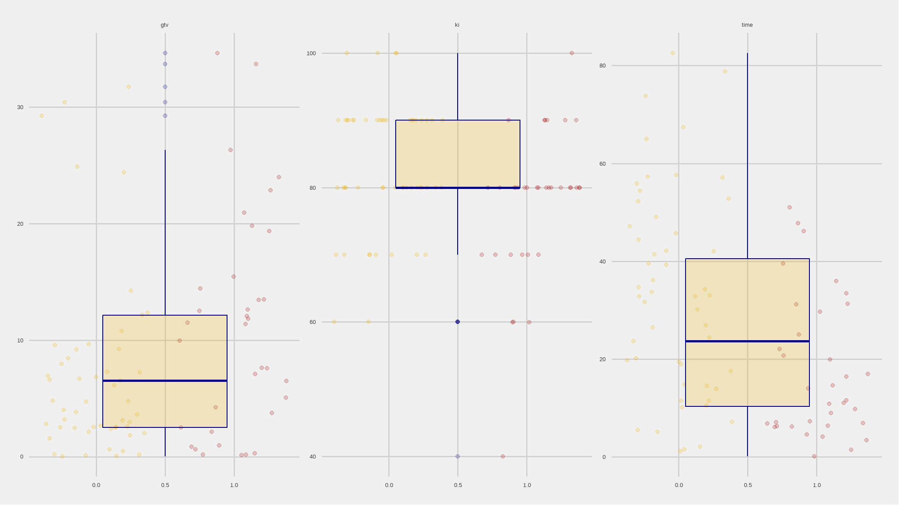

## categorical data

``` r
iv_rates <- data |>
  dplyr::mutate(status = ifelse(status==1,"yes","no")) |>
  select(kan_index,loc,stereo,status) |> 
  gather() |> 
  group_by(key,value) |>
  summarize(count = n()) |> 
  mutate(prop = count/sum(count)) |>
  ungroup() 

plot<-iv_rates |>
  ggplot(aes(fill=key, y=prop, x=value)) + 
  geom_col(color="black",width = 0.5)+ 
  facet_wrap(~key,scales="free") +
  theme(legend.position="bottom") + 
  geom_label(aes(label=scales::percent(prop)), color="white") + 
  labs(
    title = "survival ratio",
    subtitle = "Brain Cancer Analysis",
    y = "proportion(%)", 
    x = "",
    fill="status",
    caption="B.Ncube::Data enthusiast") + 
  scale_y_continuous(labels = scales::percent)+
  tvthemes::scale_fill_kimPossible()+
  tvthemes::theme_theLastAirbender(title.font="Slayer",
                                   text.font = "Slayer")+
  theme(legend.position = 'none')+
  theme(axis.text.x = element_text(angle = 45, hjust = 1)) 
plot
```

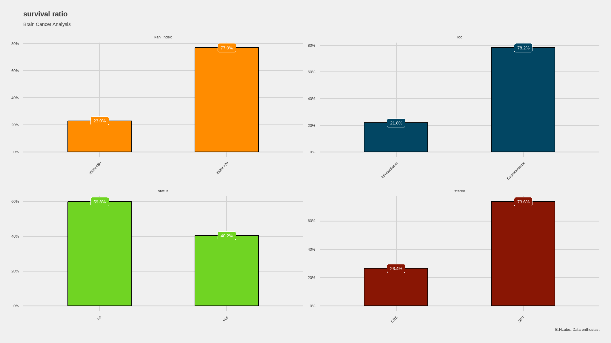

### mortality Rate

``` r
data|>
  dplyr::group_by(brain_status)|> 
  dplyr::summarize(count=n(),
             mean=mean(gtv, na.rm = T),
             std_dev=sd(gtv, na.rm = T),
             median=median(gtv, na.rm = T), 
             min=min(gtv, na.rm = T),
             max=max(gtv, na.rm = T))|> 
 tibble::column_to_rownames(var = "brain_status") |> 
 base::as.matrix()
#>       count      mean  std_dev median  min   max
#> alive    52  7.034423 7.828455   4.36 0.01 31.74
#> dead     35 11.142286 9.451387  11.38 0.14 34.64

#Calculate mortality rate
print(paste('Mortality rate (%) is ',round(35/(35+53)*100,digits=2)))
#> [1] "Mortality rate (%) is  39.77"
```

- we can view this in a plot or chart

``` r
library(extrafont)
loadfonts(quiet=TRUE)

iv_rates <- data |>
  group_by(brain_status) |>
  summarize(count = n()) |> 
  mutate(prop = count/sum(count)) |>
  ungroup() 

plot<-iv_rates |>
  ggplot(aes(x=brain_status, y=prop, fill=brain_status)) + 
  geom_col(color="black",width = 0.5)+ 
  theme(legend.position="bottom") + 
  geom_label(aes(label=scales::percent(prop)), color="white") + 
  labs(
    title = "mortality ratio",
    subtitle = "Brain Cancer Analysis",
    y = "proportion(%)", 
    x = "",
    fill="status",
    caption="B.Ncube::Data enthusiast") + 
  scale_y_continuous(labels = scales::percent)+ 
geom_hline(yintercept = (sum(data$status)/nrow(data)), col = "white", lty = 2) +
  tvthemes::scale_fill_kimPossible()+
  tvthemes::theme_theLastAirbender(title.font="Slayer",
                                   text.font = "Slayer")+
  theme(legend.position = 'right')
plot
```

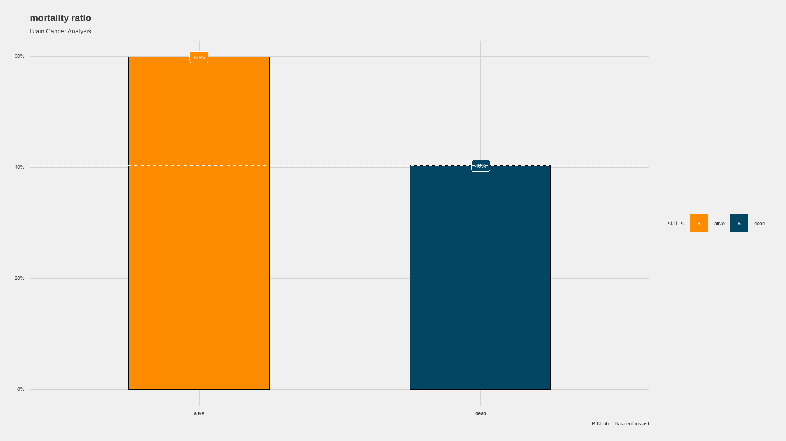

## Cancer outcome by diagnosis type

``` r
ggplot(data) +                                             
  aes(x=brain_status) +                                 
  aes(fill=diagnosis) +                                   
  geom_bar(aes( y=..count../tapply(..count.., ..x.. ,sum)[..x..]),   
      position="dodge",                                   
      color="black") +                                  
    tvthemes::scale_color_kimPossible() +   
    tvthemes::scale_fill_avatar()  +
  geom_text(aes( y=..count../tapply(..count.., ..x.. ,sum)[..x..],           
     label=scales::percent(..count../tapply(..count.., ..x.. ,sum)[..x..]) ),    
     stat="count",                              
     position=position_dodge(1.0),                         
     vjust=-0.5, 
     size=3) + 
  scale_y_continuous(limits=c(0,100)) +                    
  scale_y_continuous(labels = scales::percent) +     
  
 ggtitle("Cancer Outcome, diagnosis type") +                                  # title and axis labels=
     xlab("Diagnosis") +  
     ylab("% of Group") + 
  theme_minimal()   
```

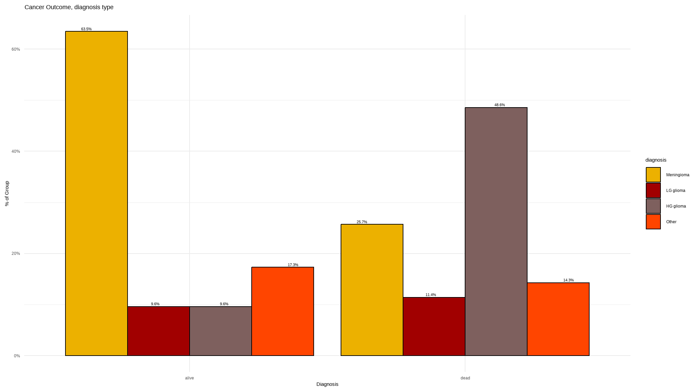
{}
+ a greater percent of those died where diagnosed `HG glioma`
+ lets see the values in the following table
{}

``` r
sjt.xtab(data$diagnosis,data$brain_status,      
         show.row.prc=TRUE,                        
         show.summary=FALSE,                                        
         title="Cross Tab Diagnosis x Cancer") 
```

<table style="border-collapse:collapse; border:none;">
<caption style="font-weight: bold; text-align:left;">
Cross Tab Diagnosis x Cancer
</caption>
<tr>
<th style="border-top:double; text-align:center; font-style:italic; font-weight:normal; border-bottom:1px solid;" rowspan="2">
diagnosis
</th>
<th style="border-top:double; text-align:center; font-style:italic; font-weight:normal;" colspan="2">
brain_status
</th>
<th style="border-top:double; text-align:center; font-style:italic; font-weight:normal; font-weight:bolder; font-style:italic; border-bottom:1px solid; " rowspan="2">
Total
</th>
</tr>
<tr>
<td style="border-bottom:1px solid; text-align:center; padding:0.2cm;">
alive
</td>
<td style="border-bottom:1px solid; text-align:center; padding:0.2cm;">
dead
</td>
</tr>
<tr>
<td style="padding:0.2cm;  text-align:left; vertical-align:middle;">
Meningioma
</td>
<td style="padding:0.2cm; text-align:center; ">
<span style="color:black;">33</span><br><span style="color:#333399;">78.6 %</span>
</td>
<td style="padding:0.2cm; text-align:center; ">
<span style="color:black;">9</span><br><span style="color:#333399;">21.4 %</span>
</td>
<td style="padding:0.2cm; text-align:center;  ">
<span style="color:black;">42</span><br><span style="color:#333399;">100 %</span>
</td>
</tr>
<tr>
<td style="padding:0.2cm;  text-align:left; vertical-align:middle;">
LG glioma
</td>
<td style="padding:0.2cm; text-align:center; ">
<span style="color:black;">5</span><br><span style="color:#333399;">55.6 %</span>
</td>
<td style="padding:0.2cm; text-align:center; ">
<span style="color:black;">4</span><br><span style="color:#333399;">44.4 %</span>
</td>
<td style="padding:0.2cm; text-align:center;  ">
<span style="color:black;">9</span><br><span style="color:#333399;">100 %</span>
</td>
</tr>
<tr>
<td style="padding:0.2cm;  text-align:left; vertical-align:middle;">
HG glioma
</td>
<td style="padding:0.2cm; text-align:center; ">
<span style="color:black;">5</span><br><span style="color:#333399;">22.7 %</span>
</td>
<td style="padding:0.2cm; text-align:center; ">
<span style="color:black;">17</span><br><span style="color:#333399;">77.3 %</span>
</td>
<td style="padding:0.2cm; text-align:center;  ">
<span style="color:black;">22</span><br><span style="color:#333399;">100 %</span>
</td>
</tr>
<tr>
<td style="padding:0.2cm;  text-align:left; vertical-align:middle;">
Other
</td>
<td style="padding:0.2cm; text-align:center; ">
<span style="color:black;">9</span><br><span style="color:#333399;">64.3 %</span>
</td>
<td style="padding:0.2cm; text-align:center; ">
<span style="color:black;">5</span><br><span style="color:#333399;">35.7 %</span>
</td>
<td style="padding:0.2cm; text-align:center;  ">
<span style="color:black;">14</span><br><span style="color:#333399;">100 %</span>
</td>
</tr>
<tr>
<td style="padding:0.2cm;  border-bottom:double; font-weight:bolder; font-style:italic; text-align:left; vertical-align:middle;">
Total
</td>
<td style="padding:0.2cm; text-align:center;   border-bottom:double;">
<span style="color:black;">52</span><br><span style="color:#333399;">59.8 %</span>
</td>
<td style="padding:0.2cm; text-align:center;   border-bottom:double;">
<span style="color:black;">35</span><br><span style="color:#333399;">40.2 %</span>
</td>
<td style="padding:0.2cm; text-align:center;   border-bottom:double;">
<span style="color:black;">87</span><br><span style="color:#333399;">100 %</span>
</td>
</tr>
</table>

## mortality rate by sex

### Create a customised function for summarising categorical data per status

``` r
summarize_status <- function(tbl){tbl %>% 
  summarise(n_died = sum(brain_status == "yes"),
            n_total = n()) %>%
  ungroup() %>% 
  mutate(pct_died = n_died / n_total) %>% 
  arrange(desc(pct_died)) %>% 
  mutate(low = qbeta(0.025, n_died + 5, n_total - n_died + .5),
         high = qbeta(0.975, n_died + 5, n_total - n_died + .5),
         pct = n_total / sum(n_total),
         percentage=scales::percent(pct_died))
  } 
```

### mortality rate summary per sex

``` r
data |> 
  group_by(sex) |> 
  summarize_status()
```

<table class="huxtable" style="border-collapse: collapse; border: 0px; margin-bottom: 2em; margin-top: 2em; ; margin-left: auto; margin-right: auto;  " id="tab:unnamed-chunk-16">
<col><col><col><col><col><col><col><col><tr>
<th style="vertical-align: top; text-align: left; white-space: normal; border-style: solid solid solid solid; border-width: 0.4pt 0pt 0.4pt 0.4pt;    padding: 6pt 6pt 6pt 6pt; font-weight: bold;">sex</th><th style="vertical-align: top; text-align: right; white-space: normal; border-style: solid solid solid solid; border-width: 0.4pt 0pt 0.4pt 0pt;    padding: 6pt 6pt 6pt 6pt; font-weight: bold;">n_died</th><th style="vertical-align: top; text-align: right; white-space: normal; border-style: solid solid solid solid; border-width: 0.4pt 0pt 0.4pt 0pt;    padding: 6pt 6pt 6pt 6pt; font-weight: bold;">n_total</th><th style="vertical-align: top; text-align: right; white-space: normal; border-style: solid solid solid solid; border-width: 0.4pt 0pt 0.4pt 0pt;    padding: 6pt 6pt 6pt 6pt; font-weight: bold;">pct_died</th><th style="vertical-align: top; text-align: right; white-space: normal; border-style: solid solid solid solid; border-width: 0.4pt 0pt 0.4pt 0pt;    padding: 6pt 6pt 6pt 6pt; font-weight: bold;">low</th><th style="vertical-align: top; text-align: right; white-space: normal; border-style: solid solid solid solid; border-width: 0.4pt 0pt 0.4pt 0pt;    padding: 6pt 6pt 6pt 6pt; font-weight: bold;">high</th><th style="vertical-align: top; text-align: right; white-space: normal; border-style: solid solid solid solid; border-width: 0.4pt 0pt 0.4pt 0pt;    padding: 6pt 6pt 6pt 6pt; font-weight: bold;">pct</th><th style="vertical-align: top; text-align: left; white-space: normal; border-style: solid solid solid solid; border-width: 0.4pt 0.4pt 0.4pt 0pt;    padding: 6pt 6pt 6pt 6pt; font-weight: bold;">percentage</th></tr>
<tr>
<td style="vertical-align: top; text-align: left; white-space: normal; border-style: solid solid solid solid; border-width: 0.4pt 0pt 0pt 0.4pt;    padding: 6pt 6pt 6pt 6pt; background-color: rgb(242, 242, 242); font-weight: normal;">Female</td><td style="vertical-align: top; text-align: right; white-space: normal; border-style: solid solid solid solid; border-width: 0.4pt 0pt 0pt 0pt;    padding: 6pt 6pt 6pt 6pt; background-color: rgb(242, 242, 242); font-weight: normal;">0</td><td style="vertical-align: top; text-align: right; white-space: normal; border-style: solid solid solid solid; border-width: 0.4pt 0pt 0pt 0pt;    padding: 6pt 6pt 6pt 6pt; background-color: rgb(242, 242, 242); font-weight: normal;">45</td><td style="vertical-align: top; text-align: right; white-space: normal; border-style: solid solid solid solid; border-width: 0.4pt 0pt 0pt 0pt;    padding: 6pt 6pt 6pt 6pt; background-color: rgb(242, 242, 242); font-weight: normal;">0</td><td style="vertical-align: top; text-align: right; white-space: normal; border-style: solid solid solid solid; border-width: 0.4pt 0pt 0pt 0pt;    padding: 6pt 6pt 6pt 6pt; background-color: rgb(242, 242, 242); font-weight: normal;">0.0336</td><td style="vertical-align: top; text-align: right; white-space: normal; border-style: solid solid solid solid; border-width: 0.4pt 0pt 0pt 0pt;    padding: 6pt 6pt 6pt 6pt; background-color: rgb(242, 242, 242); font-weight: normal;">0.194</td><td style="vertical-align: top; text-align: right; white-space: normal; border-style: solid solid solid solid; border-width: 0.4pt 0pt 0pt 0pt;    padding: 6pt 6pt 6pt 6pt; background-color: rgb(242, 242, 242); font-weight: normal;">0.517</td><td style="vertical-align: top; text-align: left; white-space: normal; border-style: solid solid solid solid; border-width: 0.4pt 0.4pt 0pt 0pt;    padding: 6pt 6pt 6pt 6pt; background-color: rgb(242, 242, 242); font-weight: normal;">0%</td></tr>
<tr>
<td style="vertical-align: top; text-align: left; white-space: normal; border-style: solid solid solid solid; border-width: 0pt 0pt 0.4pt 0.4pt;    padding: 6pt 6pt 6pt 6pt; font-weight: normal;">Male</td><td style="vertical-align: top; text-align: right; white-space: normal; border-style: solid solid solid solid; border-width: 0pt 0pt 0.4pt 0pt;    padding: 6pt 6pt 6pt 6pt; font-weight: normal;">0</td><td style="vertical-align: top; text-align: right; white-space: normal; border-style: solid solid solid solid; border-width: 0pt 0pt 0.4pt 0pt;    padding: 6pt 6pt 6pt 6pt; font-weight: normal;">42</td><td style="vertical-align: top; text-align: right; white-space: normal; border-style: solid solid solid solid; border-width: 0pt 0pt 0.4pt 0pt;    padding: 6pt 6pt 6pt 6pt; font-weight: normal;">0</td><td style="vertical-align: top; text-align: right; white-space: normal; border-style: solid solid solid solid; border-width: 0pt 0pt 0.4pt 0pt;    padding: 6pt 6pt 6pt 6pt; font-weight: normal;">0.0358</td><td style="vertical-align: top; text-align: right; white-space: normal; border-style: solid solid solid solid; border-width: 0pt 0pt 0.4pt 0pt;    padding: 6pt 6pt 6pt 6pt; font-weight: normal;">0.206</td><td style="vertical-align: top; text-align: right; white-space: normal; border-style: solid solid solid solid; border-width: 0pt 0pt 0.4pt 0pt;    padding: 6pt 6pt 6pt 6pt; font-weight: normal;">0.483</td><td style="vertical-align: top; text-align: left; white-space: normal; border-style: solid solid solid solid; border-width: 0pt 0.4pt 0.4pt 0pt;    padding: 6pt 6pt 6pt 6pt; font-weight: normal;">0%</td></tr>
</table>

{}
+ from the dataset , `\(\frac{20}{43}\)` men died while the other 15 where woman who died
+ we can present these more visually with the graphs below
{}

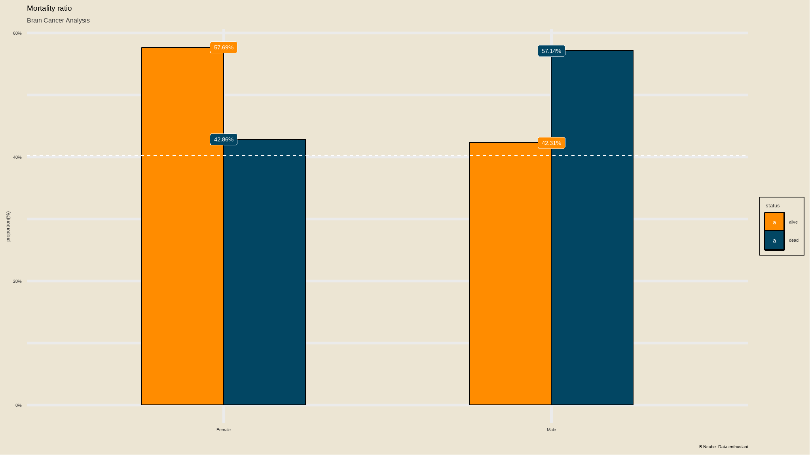

{}
+ mortality is greater in males than it is in females
+ the white dashed line indicate the overal mortality rate
{}

## Outcome by diagnosis faceted by sex

``` r
ggplot(data) +                             # data to use 
  aes(x=brain_status) +                                        # x = predictor  (factor) 
  aes(fill=diagnosis) +                                         # fill = outcome (factor)  
  geom_bar( position="dodge",                                        # side-by-side  
       color="black") +                                                  # choose color of bar borders 
    tvthemes::scale_color_kimPossible() +       # choose colors of bars 
    tvthemes::scale_fill_avatar()  +   # bars 
  geom_text(aes(label=after_stat(count)),                    # required  
     stat='count',                                           # required 
     position=position_dodge(1.0),                           # required for centering  
     vjust= -0.5, 
     size=3) + 
   scale_x_discrete(limits = rev) +                                       # reverse order to 0 cups first 
   # FORCE y-axis ticks 
  facet_grid(~ sex)  +                                              # Strata in 1 row 
  ggtitle("Cancer Outcome, diagnosis type\nStratified") +           # title and axis labels 
  xlab("") +  
  ylab("Count") + 
  theme_bw() + 
  theme(legend.title=element_blank()) + 
  theme(legend.text=element_text(color="black", size=6)) + 
  theme(legend.position="right") 
```

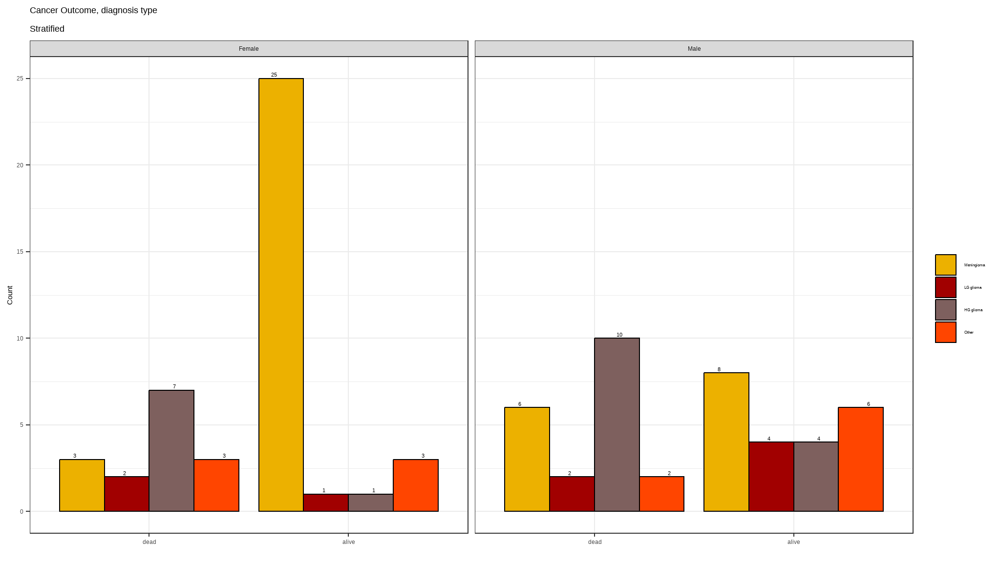
+ Meningioma affects more women than it affects men.
+ both men and women diagnosed with HG glioma are more likely to die

## is there any association between diagnosis and cancer outcome

``` r
data %>% contingency(brain_status ~ diagnosis) 
#>             Outcome
#> Predictor    dead alive
#>   Other         5     9
#>   HG glioma    17     5
#>   LG glioma     4     5
#>   Meningioma    9    33
#> 
#>              Outcome +    Outcome -      Total                 Inc risk *
#> Exposed +            5            4          9     55.56 (21.20 to 86.30)
#> Exposed -           17            9         26     65.38 (44.33 to 82.79)
#> Total               22           13         35     62.86 (44.92 to 78.53)
#> 
#> Point estimates and 95% CIs:
#> -------------------------------------------------------------------
#> Inc risk ratio                                 0.85 (0.44, 1.62)
#> Inc odds ratio                                 0.66 (0.14, 3.10)
#> Attrib risk in the exposed *                   -9.83 (-47.09, 27.43)
#> Attrib fraction in the exposed (%)            -17.69 (-124.96, 38.43)
#> Attrib risk in the population *                -2.53 (-26.83, 21.78)
#> Attrib fraction in the population (%)         -4.02 (-20.73, 10.38)
#> -------------------------------------------------------------------
#> Yates corrected chi2 test that OR = 1: chi2(1) = 0.016 Pr>chi2 = 0.900
#> Fisher exact test that OR = 1: Pr>chi2 = 0.698
#>  Wald confidence limits
#>  CI: confidence interval
#>  * Outcomes per 100 population units 
#> 
#> 
#> 	Fisher's Exact Test for Count Data
#> 
#> data:  dat
#> p-value = 0.0001994
#> alternative hypothesis: two.sided
```

{}
**Comments**
+ the outcome is a result of a `fisher's exact test` for association
+ the plimenary suggest that at 5% level of significance ,diagnosis( Meningioma , LG glioma ,HG glioma and other diagnostics) and stereo variable are significantly associated with survival of patients.
{}

### Bivarate relationships for all variables

``` r
results <- compareGroups(brain_status ~ diagnosis+ki+sex+loc+stereo+gtv, data = data) 
results
#> 
#> 
#> -------- Summary of results by groups of 'brain_status'---------
#> 
#> 
#>   var       N  p.value  method            selection
#> 1 diagnosis 87 <0.001** categorical       ALL      
#> 2 ki        87 0.023**  continuous normal ALL      
#> 3 sex       87 0.255    categorical       ALL      
#> 4 loc       87 0.096*   categorical       ALL      
#> 5 stereo    87 0.063*   categorical       ALL      
#> 6 gtv       87 0.037**  continuous normal ALL      
#> -----
#> Signif. codes:  0 '**' 0.05 '*' 0.1 ' ' 1
```

{}
+ the above results show the relationship between the cancer outcome and patient characteristics
+ the p-values correspond to `chi-squared test` for categorical data and `t.test` for numeric data
+ diagnosis as mentioned in previous results is associated with cancer outcome.
+ Gross tumor volume and kanrfsky index have p-values less than 5% implying there is significant mean differences for these values per each outcome category
{}

``` r
readytable <- createTable(results, show.ratio=TRUE, show.p.overall = FALSE)       
print(readytable, header.labels = c(p.ratio = "p-value"))      
#> 
#> --------Summary descriptives table by 'brain_status'---------
#> 
#> ___________________________________________________________________ 
#>                       alive       dead            OR        p-value 
#>                       N=52        N=35                              
#> ¯¯¯¯¯¯¯¯¯¯¯¯¯¯¯¯¯¯¯¯¯¯¯¯¯¯¯¯¯¯¯¯¯¯¯¯¯¯¯¯¯¯¯¯¯¯¯¯¯¯¯¯¯¯¯¯¯¯¯¯¯¯¯¯¯¯¯ 
#> diagnosis:                                                          
#>     Meningioma     33 (63.5%)   9 (25.7%)        Ref.        Ref.   
#>     LG glioma       5 (9.62%)   4 (11.4%)  2.87 [0.58;13.7]  0.191  
#>     HG glioma       5 (9.62%)  17 (48.6%)  11.6 [3.55;45.2] <0.001  
#>     Other           9 (17.3%)   5 (14.3%)  2.02 [0.50;7.71]  0.314  
#> ki                 83.1 (9.61) 77.7 (11.1) 0.95 [0.91;0.99]  0.025  
#> sex:                                                                
#>     Female         30 (57.7%)  15 (42.9%)        Ref.        Ref.   
#>     Male           22 (42.3%)  20 (57.1%)  1.80 [0.76;4.38]  0.185  
#> loc:                                                                
#>     Infratentorial 15 (28.8%)   4 (11.4%)        Ref.        Ref.   
#>     Supratentorial 37 (71.2%)  31 (88.6%)  3.03 [0.97;11.9]  0.057  
#> stereo:                                                             
#>     SRS            18 (34.6%)   5 (14.3%)        Ref.        Ref.   
#>     SRT            34 (65.4%)  30 (85.7%)  3.08 [1.07;10.5]  0.037  
#> gtv                7.03 (7.83) 11.1 (9.45) 1.06 [1.00;1.11]  0.036  
#> ¯¯¯¯¯¯¯¯¯¯¯¯¯¯¯¯¯¯¯¯¯¯¯¯¯¯¯¯¯¯¯¯¯¯¯¯¯¯¯¯¯¯¯¯¯¯¯¯¯¯¯¯¯¯¯¯¯¯¯¯¯¯¯¯¯¯¯
```

{}
+ the extended output shows more significant categories that determine cancer outcome
+ LG glioma has is the most significant category associated with cancer outcome since its p-value value is `p<0.001` which is less than 5%
+ the same applies for `stereo:SRT`
{}

## extended Analysis

``` r
library(glue)
bind_count = function(x){
  as_tibble(x) %>% 
  add_count(value) %>% 
  mutate(value = glue("{value} ({n})")) %>%
    pull(value)
  
}
```

``` r
# Scatter plot
data %>% 
  na.omit() %>% 
  group_by(diagnosis = bind_count(diagnosis)) %>% 
  summarize_status() %>% 
  mutate(diagnosis = fct_reorder(diagnosis, pct_died)) %>% 
  ggplot(mapping = aes(x = pct_died, y = diagnosis)) +
  geom_point(aes(size = pct), show.legend = T) +
  geom_errorbarh(aes(xmin = low, xmax = high), height = .3) +
  labs(
    x = "Percentage of patients in each category who died",
    title = "Distribution of status by diagnosis",
    size = "%prevalence",
    subtitle = ""
  ) +
  scale_x_continuous(labels = percent) +
  scale_size_continuous(labels = percent) +
  theme(plot.title = element_text(hjust = 0.5))
```

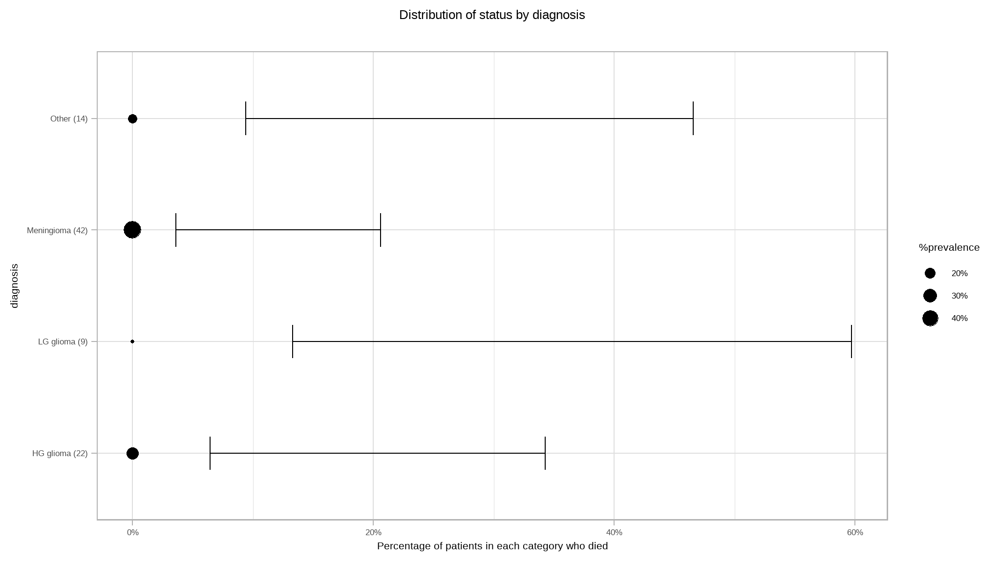

{}

It can also be noted that cumulatively, people with **LG glioma** and **HG glioma** had high chances of death.

{}

## Survival Analysis.

``` r
fit <- survfit(Surv(time, status) ~ sex, data = data)
# Access to the sort summary table
summary(fit)$table
#>            records n.max n.start events    rmean se(rmean) median 0.95LCL
#> sex=Female      45    45      45     15 53.15313  5.645267  51.02   46.16
#> sex=Male        42    42      42     20 45.20122  5.732211  31.25   20.69
#>            0.95UCL
#> sex=Female      NA
#> sex=Male        NA

ggsurvplot(fit, data = data,
 surv.median.line = "hv", # Add medians survival

 # Change legends: title & labels
 legend.title = "Sex",
 legend.labs = c("Male", "Female"),
 # Add p-value and tervals
 pval = TRUE,

 conf.int = TRUE,
 # Add risk table
 risk.table = TRUE,
 tables.height = 0.2,
 tables.theme = theme_cleantable(),

 # Color palettes. Use custom color: c("#E7B800", "#2E9FDF"),
 # or brewer color (e.g.: "Dark2"), or ggsci color (e.g.: "jco")
 palette = "#Dark2",
 ggtheme = theme_bw(), # Change ggplot2 theme
 font.main = c(14, "bold", "darkblue"),
 font.x = c(12, "bold.italic", "darkblue"),
 font.y = c(12, "bold.italic", "darkblue"),
 font.tickslab = c(10, "plain", "darkgreen")
)
```

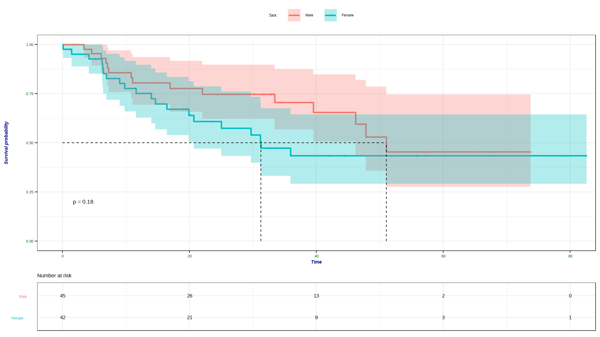

{}
+ females tend to survive longer than men
+ the difference in survival time is not statistically significant at 5% level of significance
{}

## difference in survival per diagnosis


{}
+ Meningioma patients have a longer survival time as compared to other patients
+ there is significant difference in survival times between patients of different diagnosis type
at 5% level of significance

- the median survival times for `LG glioma, HG glioma, and Other` are approximately 49,11 and 29 months respectively .
  {}

## difference in survival per Stereotactic

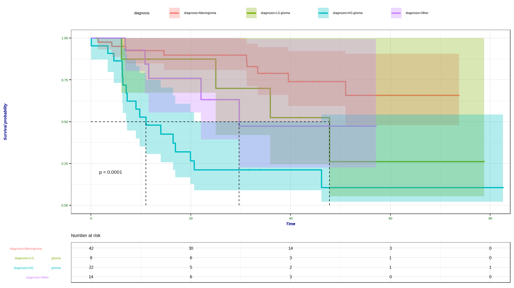

{}
+ those with location at supratentorial have a longer survival time as compared to their counterparts
+ the difference in survival time is rather not statistically significant
{}

## Now lets fit a model

### Logistic regression

``` r
source(file = "R/helper.R")
data<- data |> 
  select(-brain_status)

data$status<-as.factor(data$status)

lr_mod <- parsnip::logistic_reg()|> 
   set_engine('glm') |> 
  set_mode("classification")  

model<-lr_mod |> 
  fit(status~. -time,data=data)

model %>%
  pluck("fit") %>%
  summary()
#> 
#> Call:
#> stats::glm(formula = status ~ . - time, family = stats::binomial, 
#>     data = data)
#> 
#> Coefficients:
#>                    Estimate Std. Error z value Pr(>|z|)    
#> (Intercept)         5.36393    3.50137   1.532 0.125535    
#> sexMale             0.30110    0.56563   0.532 0.594500    
#> diagnosisLG glioma  1.14990    0.84737   1.357 0.174777    
#> diagnosisHG glioma  2.64083    0.73785   3.579 0.000345 ***
#> diagnosisOther      1.01974    0.90625   1.125 0.260492    
#> locSupratentorial   0.96505    0.89706   1.076 0.282021    
#> ki                 -0.11264    0.05147  -2.189 0.028630 *  
#> gtv                 0.03413    0.03468   0.984 0.325042    
#> stereoSRT           0.34450    0.73961   0.466 0.641369    
#> kan_indexindex>79   1.05054    1.08104   0.972 0.331158    
#> ---
#> Signif. codes:  0 '***' 0.001 '**' 0.01 '*' 0.05 '.' 0.1 ' ' 1
#> 
#> (Dispersion parameter for binomial family taken to be 1)
#> 
#>     Null deviance: 117.264  on 86  degrees of freedom
#> Residual deviance:  84.789  on 77  degrees of freedom
#> AIC: 104.79
#> 
#> Number of Fisher Scoring iterations: 5
```

# perform a stepwise regression

``` r
stepmodel_logit <- stats::step(model, direction = "both", trace = FALSE)
summary(stepmodel_logit)
#> 
#> Call:
#> glm(formula = status ~ diagnosis + ki, family = binomial, data = data)
#> 
#> Coefficients:
#>                    Estimate Std. Error z value Pr(>|z|)    
#> (Intercept)         4.81278    2.30775   2.085  0.03703 *  
#> diagnosisLG glioma  1.39942    0.80736   1.733  0.08304 .  
#> diagnosisHG glioma  2.84898    0.69866   4.078 4.55e-05 ***
#> diagnosisOther      0.57859    0.72100   0.802  0.42227    
#> ki                 -0.07735    0.02947  -2.625  0.00867 ** 
#> ---
#> Signif. codes:  0 '***' 0.001 '**' 0.01 '*' 0.05 '.' 0.1 ' ' 1
#> 
#> (Dispersion parameter for binomial family taken to be 1)
#> 
#>     Null deviance: 117.264  on 86  degrees of freedom
#> Residual deviance:  89.741  on 82  degrees of freedom
#> AIC: 99.741
#> 
#> Number of Fisher Scoring iterations: 4
```

{}

## **comments and interprettations**

- from the logistic regression `diagnosis-HG glioma` and karnofsky index are statistically significant predictors of survival.
- we speak of **odds** when we use logistic regression
  {}

## Now we fit a Cox proportional hazards model:

``` r
cox_spec <- 
  proportional_hazards() %>% 
  set_engine("survival")

cox_fit <- cox_spec |> 
  fit(Surv(time, status) ~ ., data = BrainCancer)


cox_fit %>%
  pluck("fit") %>%
  summary()
#> Call:
#> survival::coxph(formula = Surv(time, status) ~ ., data = data, 
#>     model = TRUE, x = TRUE)
#> 
#>   n= 87, number of events= 35 
#>    (1 observation deleted due to missingness)
#> 
#>                        coef exp(coef) se(coef)      z Pr(>|z|)    
#> sexMale             0.18375   1.20171  0.36036  0.510  0.61012    
#> diagnosisLG glioma  0.91502   2.49683  0.63816  1.434  0.15161    
#> diagnosisHG glioma  2.15457   8.62414  0.45052  4.782 1.73e-06 ***
#> diagnosisOther      0.88570   2.42467  0.65787  1.346  0.17821    
#> locSupratentorial   0.44119   1.55456  0.70367  0.627  0.53066    
#> ki                 -0.05496   0.94653  0.01831 -3.001  0.00269 ** 
#> gtv                 0.03429   1.03489  0.02233  1.536  0.12466    
#> stereoSRT           0.17778   1.19456  0.60158  0.296  0.76760    
#> ---
#> Signif. codes:  0 '***' 0.001 '**' 0.01 '*' 0.05 '.' 0.1 ' ' 1
#> 
#>                    exp(coef) exp(-coef) lower .95 upper .95
#> sexMale               1.2017     0.8321    0.5930    2.4352
#> diagnosisLG glioma    2.4968     0.4005    0.7148    8.7215
#> diagnosisHG glioma    8.6241     0.1160    3.5664   20.8546
#> diagnosisOther        2.4247     0.4124    0.6678    8.8031
#> locSupratentorial     1.5546     0.6433    0.3914    6.1741
#> ki                    0.9465     1.0565    0.9132    0.9811
#> gtv                   1.0349     0.9663    0.9906    1.0812
#> stereoSRT             1.1946     0.8371    0.3674    3.8839
#> 
#> Concordance= 0.794  (se = 0.04 )
#> Likelihood ratio test= 41.37  on 8 df,   p=2e-06
#> Wald test            = 38.7  on 8 df,   p=6e-06
#> Score (logrank) test = 46.59  on 8 df,   p=2e-07
```

<h3>
Hazard Ratios
</h3>

Recall that the Cox model is expressed by the hazard function `\(h(t)\)`:

`\(h(t) = h_0(t) \times exp(\beta_1x_1 + \beta_2x_2 + \ldots + \beta_px_p)\)`

The quantity of interest from a Cox regression model is the hazard ratio. The quantities `\(exp(\beta_i)\)` are the hazard ratios.

{}
The Hazard Ratio (HR) can be interpreted as follows:

- HR = 1: No effect
- HR \< 1: indicates a decreased risk of death
- HR \> 1: indicates an increased risk of death
  {}

<h3>
How to Interpret Results
</h3>

The `estimate` column in the summary above is the regression parameter `\(\beta_i\)` of the Cox model.

<div>

<p>
<span class="success">The `estimate` column quantifies the effect size (the impact) that the covariate has on the patient’s survival time.</span>
</p>

</div>

The expression is `\(exp(\beta_i)\)` is the hazard ratio – this is the `blah` column of the summary above.

So for example, we obtained a regression parameter `\(\beta_1 = 0.9152\)` for the placebo vs D-penicillamine (the experiemental drug). The hazard ratio for this covariate is `\(HR = exp(\beta_1) = 2.4968\)`.

{}
A HR \< 1 indicates reduced hazard of death.

Therefore, we would say that patients diagnosed with the `LG glioma` have a 2.4968 times <b>increased</b> hazard of death compared to other patients. The p-value associated with this regression parameter is `\(p=0.15161\)`, which indicates that the difference is not significant.
{}

## perform stepwise regression on `cox`

``` r
stepmodel_cox <- MASS::stepAIC(cox_fit, direction = "both", trace = FALSE)
summary(stepmodel_cox)
#> Call:
#> coxph(formula = Surv(time, status) ~ diagnosis + ki + gtv, data = BrainCancer)
#> 
#>   n= 87, number of events= 35 
#>    (1 observation deleted due to missingness)
#> 
#>                        coef exp(coef) se(coef)      z Pr(>|z|)    
#> diagnosisLG glioma  1.09706   2.99535  0.60985  1.799   0.0720 .  
#> diagnosisHG glioma  2.23701   9.36528  0.43529  5.139 2.76e-07 ***
#> diagnosisOther      0.72336   2.06134  0.57704  1.254   0.2100    
#> ki                 -0.05417   0.94727  0.01832 -2.957   0.0031 ** 
#> gtv                 0.04166   1.04254  0.02043  2.040   0.0414 *  
#> ---
#> Signif. codes:  0 '***' 0.001 '**' 0.01 '*' 0.05 '.' 0.1 ' ' 1
#> 
#>                    exp(coef) exp(-coef) lower .95 upper .95
#> diagnosisLG glioma    2.9953     0.3339    0.9065    9.8981
#> diagnosisHG glioma    9.3653     0.1068    3.9903   21.9805
#> diagnosisOther        2.0613     0.4851    0.6652    6.3874
#> ki                    0.9473     1.0557    0.9139    0.9819
#> gtv                   1.0425     0.9592    1.0016    1.0851
#> 
#> Concordance= 0.786  (se = 0.043 )
#> Likelihood ratio test= 40.33  on 5 df,   p=1e-07
#> Wald test            = 38.72  on 5 df,   p=3e-07
#> Score (logrank) test = 46.19  on 5 df,   p=8e-09
```

## comments

- the stepwise regression model results in a optimal set of variables that predict death by brain cancer
