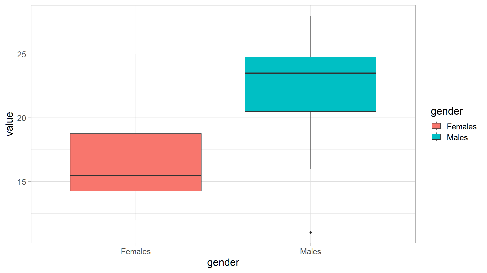
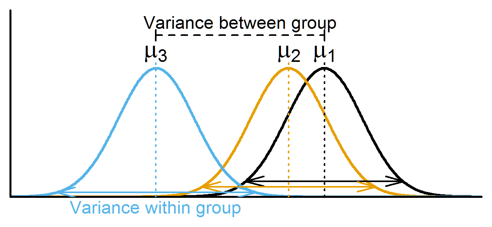
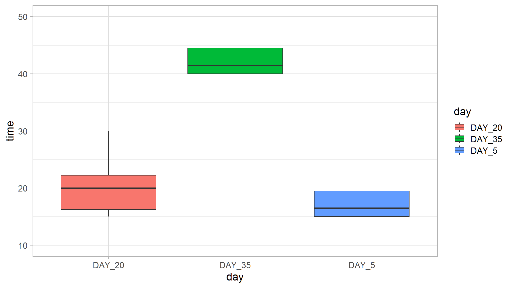
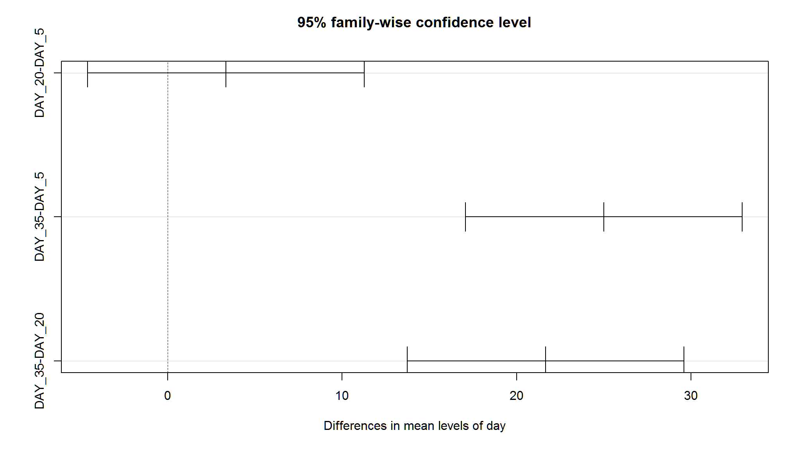

<link href="index.en_files/tabwid/tabwid.css" rel="stylesheet" />
<script src="index.en_files/tabwid/tabwid.js"></script>
<script src="//yihui.org/js/math-code.js" defer></script>
<!-- Just one possible MathJax CDN below. You may use others. -->
<script defer
  src="//mathjax.rstudio.com/latest/MathJax.js?config=TeX-MML-AM_CHTML">
</script>

## Motivation

As a statistics tutor ,One of the question i always encounter is *How do i apply statistics in real life* , like **Zvinoshanda here zvinhu izvi** , well the answer is yes. With the rise in popularity of big data , statistical literacy is as important as other literacies . Knowing how to handle and draw conclusions is a must

### T-test

When you have a single explanatory variable which is qualitative and only have **two levels**, you
can run a *student’s T-test* to test for a difference in the mean of the
two levels. If appropriate for your data, you can choose to test a
unilateral hypothesis. This means that you can test the more specific
assumption that one level has a higher mean than the other, rather than
that they simply have different means.Note that robustness of this test increases with sample size and is higher when groups have equal sizes

For the t-test, the t statistic used to find the p-value calculation is calculated as:
`\(t = (\overline{y_{1}}-\overline{y_{2}})/\sqrt{\frac{s_{1}^2} n_{1} + \frac{s_{2}^2} n_{2}}\)`

where

`\(\overline{y_{1}}\)` and `\(\overline{y_{2}}\)` are the means of the response variable y for group 1 and 2, respectively,  
`\(s_{1}^2\)` and `\(s_{2}^2\)` are the variances of the response variable y for group 1 and 2, respectively,  
`\(n_{1}\)` and `\(n_{2}\)` are the sample sizes of groups 1 and 2, respectively.

Note that the t-test is mathematically equivalent to a one-way ANOVA
with 2 levels.

# Assumptions

If the assumptions of the t-test are not met, the test can give
misleading results. Here are some important things to note when testing
the assumptions of a t-test.

1.  **Normality of data**  
    As with simple linear regression, the residuals need to be normally
    distributed. If the data are not normally distributed, but have
    reasonably symmetrical distributions, a mean which is close to the
    centre of the distribution, and only one mode (highest point in the
    frequency histogram) then a t-test will still work as long as the
    sample is sufficiently large (rule of thumb \~30 observations). If
    the data is heavily skewed, then we may need a very large sample
    before a t-test works. In such cases, an alternate non-parametric
    test should be used.

2.  **Homoscedasticity**  
    Another important assumption of the two-sample t-test is that the
    variance of your two samples are equal. This allows you to calculate
    a pooled variance, which in turn is used to calculate the standard
    error. If population variances are unequal, then the probability of
    a Type I error is greater than `\(\alpha\)`.  
    The robustness of the t-test increases with sample size and is
    higher when groups have equal sizes.  
    We can test for difference in variances among two populations and
    ask what is the probability of taking two samples from two
    populations having identical variances and have the two sample
    variances be as different as are `\(s_{1}^2\)` and `\(s_{2}^2\)`.  
    To do so, we must do the variance ratio test (i.e. an F-test).

# Running a t-test (Question from Zou Module)

A psychologist gave a test to 10 females and 10 males to test the hypothesis that
males should score higher on the tests. The following scores were obtained.

``` r
Females<- c(20,	15,	19,	18,13,	14,	16,	12,	15,	25)
Males<-c(20	,16	,24	,11	,23,	25,	22,	24,	26,	28)

df<-cbind(Females,Males) %>% 
   data.frame() 

df %>% rownames_to_column(var = " ") %>%
  janitor::adorn_totals(where = c("row", "col")) %>%
  flextable::flextable() %>%
  flextable::colformat_int(j = c(2, 3, 4), big.mark = ",") %>%
  flextable::autofit()
```

<div class="tabwid"><style>.cl-2f45c430{}.cl-2f11cbe4{font-family:'Arial';font-size:11pt;font-weight:normal;font-style:normal;text-decoration:none;color:rgba(0, 0, 0, 1.00);background-color:transparent;}.cl-2f29136c{margin:0;text-align:left;border-bottom: 0 solid rgba(0, 0, 0, 1.00);border-top: 0 solid rgba(0, 0, 0, 1.00);border-left: 0 solid rgba(0, 0, 0, 1.00);border-right: 0 solid rgba(0, 0, 0, 1.00);padding-bottom:5pt;padding-top:5pt;padding-left:5pt;padding-right:5pt;line-height: 1;background-color:transparent;}.cl-2f291394{margin:0;text-align:right;border-bottom: 0 solid rgba(0, 0, 0, 1.00);border-top: 0 solid rgba(0, 0, 0, 1.00);border-left: 0 solid rgba(0, 0, 0, 1.00);border-right: 0 solid rgba(0, 0, 0, 1.00);padding-bottom:5pt;padding-top:5pt;padding-left:5pt;padding-right:5pt;line-height: 1;background-color:transparent;}.cl-2f297992{width:0.625in;background-color:transparent;vertical-align: middle;border-bottom: 1.5pt solid rgba(102, 102, 102, 1.00);border-top: 1.5pt solid rgba(102, 102, 102, 1.00);border-left: 0 solid rgba(0, 0, 0, 1.00);border-right: 0 solid rgba(0, 0, 0, 1.00);margin-bottom:0;margin-top:0;margin-left:0;margin-right:0;}.cl-2f2979b0{width:0.871in;background-color:transparent;vertical-align: middle;border-bottom: 1.5pt solid rgba(102, 102, 102, 1.00);border-top: 1.5pt solid rgba(102, 102, 102, 1.00);border-left: 0 solid rgba(0, 0, 0, 1.00);border-right: 0 solid rgba(0, 0, 0, 1.00);margin-bottom:0;margin-top:0;margin-left:0;margin-right:0;}.cl-2f2979ba{width:0.693in;background-color:transparent;vertical-align: middle;border-bottom: 1.5pt solid rgba(102, 102, 102, 1.00);border-top: 1.5pt solid rgba(102, 102, 102, 1.00);border-left: 0 solid rgba(0, 0, 0, 1.00);border-right: 0 solid rgba(0, 0, 0, 1.00);margin-bottom:0;margin-top:0;margin-left:0;margin-right:0;}.cl-2f2979c4{width:0.625in;background-color:transparent;vertical-align: middle;border-bottom: 1.5pt solid rgba(102, 102, 102, 1.00);border-top: 1.5pt solid rgba(102, 102, 102, 1.00);border-left: 0 solid rgba(0, 0, 0, 1.00);border-right: 0 solid rgba(0, 0, 0, 1.00);margin-bottom:0;margin-top:0;margin-left:0;margin-right:0;}.cl-2f2979ce{width:0.625in;background-color:transparent;vertical-align: middle;border-bottom: 0 solid rgba(0, 0, 0, 1.00);border-top: 0 solid rgba(0, 0, 0, 1.00);border-left: 0 solid rgba(0, 0, 0, 1.00);border-right: 0 solid rgba(0, 0, 0, 1.00);margin-bottom:0;margin-top:0;margin-left:0;margin-right:0;}.cl-2f2979d8{width:0.871in;background-color:transparent;vertical-align: middle;border-bottom: 0 solid rgba(0, 0, 0, 1.00);border-top: 0 solid rgba(0, 0, 0, 1.00);border-left: 0 solid rgba(0, 0, 0, 1.00);border-right: 0 solid rgba(0, 0, 0, 1.00);margin-bottom:0;margin-top:0;margin-left:0;margin-right:0;}.cl-2f2979e2{width:0.693in;background-color:transparent;vertical-align: middle;border-bottom: 0 solid rgba(0, 0, 0, 1.00);border-top: 0 solid rgba(0, 0, 0, 1.00);border-left: 0 solid rgba(0, 0, 0, 1.00);border-right: 0 solid rgba(0, 0, 0, 1.00);margin-bottom:0;margin-top:0;margin-left:0;margin-right:0;}.cl-2f2979ec{width:0.625in;background-color:transparent;vertical-align: middle;border-bottom: 0 solid rgba(0, 0, 0, 1.00);border-top: 0 solid rgba(0, 0, 0, 1.00);border-left: 0 solid rgba(0, 0, 0, 1.00);border-right: 0 solid rgba(0, 0, 0, 1.00);margin-bottom:0;margin-top:0;margin-left:0;margin-right:0;}.cl-2f2979f6{width:0.625in;background-color:transparent;vertical-align: middle;border-bottom: 0 solid rgba(0, 0, 0, 1.00);border-top: 0 solid rgba(0, 0, 0, 1.00);border-left: 0 solid rgba(0, 0, 0, 1.00);border-right: 0 solid rgba(0, 0, 0, 1.00);margin-bottom:0;margin-top:0;margin-left:0;margin-right:0;}.cl-2f297a00{width:0.871in;background-color:transparent;vertical-align: middle;border-bottom: 0 solid rgba(0, 0, 0, 1.00);border-top: 0 solid rgba(0, 0, 0, 1.00);border-left: 0 solid rgba(0, 0, 0, 1.00);border-right: 0 solid rgba(0, 0, 0, 1.00);margin-bottom:0;margin-top:0;margin-left:0;margin-right:0;}.cl-2f297a0a{width:0.693in;background-color:transparent;vertical-align: middle;border-bottom: 0 solid rgba(0, 0, 0, 1.00);border-top: 0 solid rgba(0, 0, 0, 1.00);border-left: 0 solid rgba(0, 0, 0, 1.00);border-right: 0 solid rgba(0, 0, 0, 1.00);margin-bottom:0;margin-top:0;margin-left:0;margin-right:0;}.cl-2f297a0b{width:0.625in;background-color:transparent;vertical-align: middle;border-bottom: 0 solid rgba(0, 0, 0, 1.00);border-top: 0 solid rgba(0, 0, 0, 1.00);border-left: 0 solid rgba(0, 0, 0, 1.00);border-right: 0 solid rgba(0, 0, 0, 1.00);margin-bottom:0;margin-top:0;margin-left:0;margin-right:0;}.cl-2f297a14{width:0.625in;background-color:transparent;vertical-align: middle;border-bottom: 1.5pt solid rgba(102, 102, 102, 1.00);border-top: 0 solid rgba(0, 0, 0, 1.00);border-left: 0 solid rgba(0, 0, 0, 1.00);border-right: 0 solid rgba(0, 0, 0, 1.00);margin-bottom:0;margin-top:0;margin-left:0;margin-right:0;}.cl-2f297a28{width:0.871in;background-color:transparent;vertical-align: middle;border-bottom: 1.5pt solid rgba(102, 102, 102, 1.00);border-top: 0 solid rgba(0, 0, 0, 1.00);border-left: 0 solid rgba(0, 0, 0, 1.00);border-right: 0 solid rgba(0, 0, 0, 1.00);margin-bottom:0;margin-top:0;margin-left:0;margin-right:0;}.cl-2f297a29{width:0.693in;background-color:transparent;vertical-align: middle;border-bottom: 1.5pt solid rgba(102, 102, 102, 1.00);border-top: 0 solid rgba(0, 0, 0, 1.00);border-left: 0 solid rgba(0, 0, 0, 1.00);border-right: 0 solid rgba(0, 0, 0, 1.00);margin-bottom:0;margin-top:0;margin-left:0;margin-right:0;}.cl-2f297a32{width:0.625in;background-color:transparent;vertical-align: middle;border-bottom: 1.5pt solid rgba(102, 102, 102, 1.00);border-top: 0 solid rgba(0, 0, 0, 1.00);border-left: 0 solid rgba(0, 0, 0, 1.00);border-right: 0 solid rgba(0, 0, 0, 1.00);margin-bottom:0;margin-top:0;margin-left:0;margin-right:0;}</style><table data-quarto-disable-processing='true' class='cl-2f45c430'><thead><tr style="overflow-wrap:break-word;"><th class="cl-2f297992"><p class="cl-2f29136c"><span class="cl-2f11cbe4"> </span></p></th><th class="cl-2f2979b0"><p class="cl-2f291394"><span class="cl-2f11cbe4">Females</span></p></th><th class="cl-2f2979ba"><p class="cl-2f291394"><span class="cl-2f11cbe4">Males</span></p></th><th class="cl-2f2979c4"><p class="cl-2f291394"><span class="cl-2f11cbe4">Total</span></p></th></tr></thead><tbody><tr style="overflow-wrap:break-word;"><td class="cl-2f2979ce"><p class="cl-2f29136c"><span class="cl-2f11cbe4">1</span></p></td><td class="cl-2f2979d8"><p class="cl-2f291394"><span class="cl-2f11cbe4">20</span></p></td><td class="cl-2f2979e2"><p class="cl-2f291394"><span class="cl-2f11cbe4">20</span></p></td><td class="cl-2f2979ec"><p class="cl-2f291394"><span class="cl-2f11cbe4">40</span></p></td></tr><tr style="overflow-wrap:break-word;"><td class="cl-2f2979f6"><p class="cl-2f29136c"><span class="cl-2f11cbe4">2</span></p></td><td class="cl-2f297a00"><p class="cl-2f291394"><span class="cl-2f11cbe4">15</span></p></td><td class="cl-2f297a0a"><p class="cl-2f291394"><span class="cl-2f11cbe4">16</span></p></td><td class="cl-2f297a0b"><p class="cl-2f291394"><span class="cl-2f11cbe4">31</span></p></td></tr><tr style="overflow-wrap:break-word;"><td class="cl-2f2979f6"><p class="cl-2f29136c"><span class="cl-2f11cbe4">3</span></p></td><td class="cl-2f297a00"><p class="cl-2f291394"><span class="cl-2f11cbe4">19</span></p></td><td class="cl-2f297a0a"><p class="cl-2f291394"><span class="cl-2f11cbe4">24</span></p></td><td class="cl-2f297a0b"><p class="cl-2f291394"><span class="cl-2f11cbe4">43</span></p></td></tr><tr style="overflow-wrap:break-word;"><td class="cl-2f2979ce"><p class="cl-2f29136c"><span class="cl-2f11cbe4">4</span></p></td><td class="cl-2f2979d8"><p class="cl-2f291394"><span class="cl-2f11cbe4">18</span></p></td><td class="cl-2f2979e2"><p class="cl-2f291394"><span class="cl-2f11cbe4">11</span></p></td><td class="cl-2f2979ec"><p class="cl-2f291394"><span class="cl-2f11cbe4">29</span></p></td></tr><tr style="overflow-wrap:break-word;"><td class="cl-2f2979f6"><p class="cl-2f29136c"><span class="cl-2f11cbe4">5</span></p></td><td class="cl-2f297a00"><p class="cl-2f291394"><span class="cl-2f11cbe4">13</span></p></td><td class="cl-2f297a0a"><p class="cl-2f291394"><span class="cl-2f11cbe4">23</span></p></td><td class="cl-2f297a0b"><p class="cl-2f291394"><span class="cl-2f11cbe4">36</span></p></td></tr><tr style="overflow-wrap:break-word;"><td class="cl-2f2979f6"><p class="cl-2f29136c"><span class="cl-2f11cbe4">6</span></p></td><td class="cl-2f297a00"><p class="cl-2f291394"><span class="cl-2f11cbe4">14</span></p></td><td class="cl-2f297a0a"><p class="cl-2f291394"><span class="cl-2f11cbe4">25</span></p></td><td class="cl-2f297a0b"><p class="cl-2f291394"><span class="cl-2f11cbe4">39</span></p></td></tr><tr style="overflow-wrap:break-word;"><td class="cl-2f2979f6"><p class="cl-2f29136c"><span class="cl-2f11cbe4">7</span></p></td><td class="cl-2f297a00"><p class="cl-2f291394"><span class="cl-2f11cbe4">16</span></p></td><td class="cl-2f297a0a"><p class="cl-2f291394"><span class="cl-2f11cbe4">22</span></p></td><td class="cl-2f297a0b"><p class="cl-2f291394"><span class="cl-2f11cbe4">38</span></p></td></tr><tr style="overflow-wrap:break-word;"><td class="cl-2f2979f6"><p class="cl-2f29136c"><span class="cl-2f11cbe4">8</span></p></td><td class="cl-2f297a00"><p class="cl-2f291394"><span class="cl-2f11cbe4">12</span></p></td><td class="cl-2f297a0a"><p class="cl-2f291394"><span class="cl-2f11cbe4">24</span></p></td><td class="cl-2f297a0b"><p class="cl-2f291394"><span class="cl-2f11cbe4">36</span></p></td></tr><tr style="overflow-wrap:break-word;"><td class="cl-2f2979ce"><p class="cl-2f29136c"><span class="cl-2f11cbe4">9</span></p></td><td class="cl-2f2979d8"><p class="cl-2f291394"><span class="cl-2f11cbe4">15</span></p></td><td class="cl-2f2979e2"><p class="cl-2f291394"><span class="cl-2f11cbe4">26</span></p></td><td class="cl-2f2979ec"><p class="cl-2f291394"><span class="cl-2f11cbe4">41</span></p></td></tr><tr style="overflow-wrap:break-word;"><td class="cl-2f2979f6"><p class="cl-2f29136c"><span class="cl-2f11cbe4">10</span></p></td><td class="cl-2f297a00"><p class="cl-2f291394"><span class="cl-2f11cbe4">25</span></p></td><td class="cl-2f297a0a"><p class="cl-2f291394"><span class="cl-2f11cbe4">28</span></p></td><td class="cl-2f297a0b"><p class="cl-2f291394"><span class="cl-2f11cbe4">53</span></p></td></tr><tr style="overflow-wrap:break-word;"><td class="cl-2f297a14"><p class="cl-2f29136c"><span class="cl-2f11cbe4">Total</span></p></td><td class="cl-2f297a28"><p class="cl-2f291394"><span class="cl-2f11cbe4">167</span></p></td><td class="cl-2f297a29"><p class="cl-2f291394"><span class="cl-2f11cbe4">219</span></p></td><td class="cl-2f297a32"><p class="cl-2f291394"><span class="cl-2f11cbe4">386</span></p></td></tr></tbody></table></div>

Assuming that the populations are normal with equal variance test the claim at 5% level of
Significance run a t test. (20).

## In R

- R understands both the t.test and anova more oftenly in long format rather than wide format

``` r

df_new<-df |> 
  gather("gender","value")
ggplot(df_new,aes(x=gender,y=value,fill=gender))+geom_boxplot()
```



> There seem to be a difference just by looking at the boxplot. Let’s make sure are assumptions are met before doing the test.

``` r
# Assumption of equal variance
vattest<-var.test(value~gender,data=df_new)
vattest
#> 
#> 	F test to compare two variances
#> 
#> data:  value by gender
#> F = 0.58943, num df = 9, denom df = 9, p-value = 0.4431
#> alternative hypothesis: true ratio of variances is not equal to 1
#> 95 percent confidence interval:
#>  0.1464067 2.3730524
#> sample estimates:
#> ratio of variances 
#>          0.5894327
```

**comment**

``` r
vattest$p.value
#> [1] 0.4431275
```

> the *p-value* is greater than **0.05** indicating theat that there is no significance difference in the variances for males and females.

``` r
vattest$estimate
#> ratio of variances 
#>          0.5894327
```

> the ratio is also close to one hence the assumption of homogeniety holds

## Running the test mannually

`$$\bar{X}_{males}=21.9$$` `$$\bar{X}_{females}=16.7$$`

## Hypothesis

- H0: `\(\bar{X}_{males}=\bar{X}_{females}\)`
- H1: `\(\bar{X}_{males}>\bar{X}_{females}\)`

`$$S^2_{females}=\frac{\sum(x-\bar{x}_{females})^2}{n-1}$$`
`$$S^2_{females}=\frac{(20-16.7)^2+(15-16.7)^2+...+(25-16.7)^2}{9}=15.12222$$`

`$$S^2_{males}=\frac{\sum(x-\bar{x}_{males})^2}{n-1}$$`
`$$S^2_{males}=\frac{(20-21.9)^2+(16-21.9)^2+...+(28-21.9)^2}{9}=25.65556$$`

`$$S_{pooled}=\frac{(N_{males}-1)S^2_{males}+(N_{females}-1)S^2_{females}}{N_{males}+N_{females}-2}$$`

`$$S_{pooled}=\frac{(9)(25.65556)+(9)(15.12222)}{18}=20.38889$$`

## test statistic

`$$t=\frac{\bar{X}_{males}-\bar{X}_{females}}{S_{pooled}(\frac{1}{N_{males}}+\frac{1}{N_{females}})}$$`

`$$t=\frac{21.9-16.7}{20.38889(2/10)}=2.575085$$`

`$$t_{0.05}(18)=1.734$$`

## Conclusion

since `\(t>t_{0.05}(18)\)` we reject the null hypothesis and conclude that
there is evidence to prove that the means are not equal and suggest that
the average for males is greater than that of females.

## In R, t-tests are implemented using the function `t.test`.

``` r
t.test(Y ~ X2, data= data, alternative = c("greater","less","two.sided"),var.equal=TRUE)
```

``` r
# or equivalently
ttest1 <- t.test(value~gender, var.equal=TRUE,alternative="greater",data=df_new)
ttest1
#> 
#> 	Two Sample t-test
#> 
#> data:  value by gender
#> t = -2.5751, df = 18, p-value = 0.9905
#> alternative hypothesis: true difference in means between group Females and group Males is greater than 0
#> 95 percent confidence interval:
#>  -8.701683       Inf
#> sample estimates:
#> mean in group Females   mean in group Males 
#>                  16.7                  21.9
```

*var.equal=TRUE* implies we are enforcing the restriction that the variances are equal

``` r
-1*ttest1$statistic
#>        t 
#> 2.575085
```

> this is the value we calculated earlier

``` r
ttest1$p.value
#> [1] 0.9904643
```

> the p-value is greater than 0.05 hence we conclude that the true difference in means between group Females and group Males is greater than 0

## Analysis of Variance (ANOVA)

Analysis of Variance (ANOVA) is a type of `linear model` for a continuous
response variable and one or more categorical explanatory variables. The
categorical explanatory variables can have any number of levels
(groups). For example, the variable race might have three levels:
Black,White and Hispanic. ANOVA tests whether the means of the response
variable differ between the levels by comparing the variation within a
group with the variation among groups. For example, if mean `IQ` for those who are black differs with those who are white.

{}
ANOVA calculations are based on the `sum of squares partitioning` and
compares the :

- [x] `within-level variance` to the
- [x] `between-level variance`.

> If the between-level variance is greater than the
> within-level variance, this means that the levels affect the
> explanatory variable more than the random error (corresponding to the
> within-level variance), and that the explanatory variable is likely
> to be significantly influenced by the levels.
> {}



## Doing the calculation

In the ANOVA, the comparison of the between-level variance to the
within-level variance is made through the calculation of the
`F-statistic` that correspond to the ratio of the mean sum of squares of
the level (MS<sub>Lev</sub>) on the mean sum of squares of the error (MS<sub>$\epsilon$</sub>).
These two last terms are obtained by dividing their two respective sums
of squares by their corresponding degrees of freedom, as is typically
presented in a ANOVA table . Finally, the p-value of the ANOVA is calculated
from the F-statistic that follows a Chi-square (χ<sup>2</sup>) distribution.

## Anova Table

<table style="width:99%;">
<colgroup>
<col style="width: 5%" />
<col style="width: 8%" />
<col style="width: 27%" />
<col style="width: 24%" />
<col style="width: 17%" />
<col style="width: 15%" />
</colgroup>
<thead>
<tr class="header">
<th style="text-align: left;">Source of<br />
variation</th>
<th style="text-align: left;">Degrees of<br />
freedom (df)</th>
<th style="text-align: left;">Sums of squares</th>
<th style="text-align: center;">Mean squares</th>
<th style="text-align: center;">F-statistic</th>
<th></th>
</tr>
</thead>
<tbody>
<tr class="odd">
<td style="text-align: left;">Total</td>
<td style="text-align: left;"><code>\(ra-1\)</code></td>
<td style="text-align: left;"><code>\(SS_{t}=\sum x^2 - \frac{G^2}{N}\)</code></td>
<td style="text-align: center;"></td>
<td style="text-align: center;"></td>
<td></td>
</tr>
<tr class="even">
<td style="text-align: left;">Facteur A</td>
<td style="text-align: left;"><code>\(a-1\)</code></td>
<td style="text-align: left;"><code>\(SS_{f}=\frac{\sum{T_j^2}}{n}-\frac{G^2}{N}\)</code></td>
<td style="text-align: center;"><code>\(MS_{f}=\frac{SS_{f}}{(a-1)}\)</code></td>
<td style="text-align: center;">`(F= {MS_{</td>
<td>E}})`</td>
</tr>
<tr class="odd">
<td style="text-align: left;">Error</td>
<td style="text-align: left;"><code>\(a(r-1)\)</code></td>
<td style="text-align: left;"><code>\(SS_{\epsilon}=SS_{total}  – SS_{group}\)</code></td>
<td style="text-align: center;">`(MS_{}=\frac{SS_{}}{a(</td>
<td style="text-align: center;">r-1)})`</td>
<td></td>
</tr>
</tbody>
</table>

let `\(T_j\)` be total for the `\(j_{th}\)` group and
Grand total=G

## QUESTION

To investigate maternal behavior of laboratory rats, we separated the rat pup from the
mother and recorded the time (in seconds) required for the mother to retrieve the pup.
We ran the study with 5-, 20-, and 35 – day – old pups because we were interested in
whether retrieval time various with the age of pup. The data are given below, where
there are six pups per group.

| day 5 | day 20 | day 35 |
|-------|--------|--------|
| 10    | 15     | 35     |
| 15    | 30     | 40     |
| 25    | 20     | 50     |
| 15    | 15     | 43     |
| 20    | 23     | 45     |
| 18    | 20     | 40     |
| 103   | 123    | 253    |

### Calculating the test statistic

let `\(T_j\)` be total for the `\(j_{th}\)` group `\(T_5=103\)` ,$T_{20}=123$ and
`\(T_{35}=253\)` Grand total=G=103+123+253=479

`$$SS_{total}=\sum x^2 - \frac{G^2}{N}$$`
`$$SS_{total} =(10^2+15^2+25^2+ ... + 45^2+40^2)-479^2/18=15377-12746.72$$`

`$$SS_{total}=2630.278$$`

`$$SS_{group}=\frac{\sum{T_j^2}}{n}-\frac{G^2}{N}$$`

`$$SS_{group}=\frac{103^2+123^2+253^2}{6}-\frac{479^2}{18}$$`

`$$SS_{group}=\frac{89747}{6}-\frac{479^2}{18}$$` `$$SS_{group}=2211.111$$`

`$$SS_{error}  = SS_{total}  – SS_{group}$$`  
`$$SS_{error}  = 419.167$$`

| Source | df  | SS       | MS       | F          |
|--------|-----|----------|----------|------------|
| Groups | 2   | 2211.111 | 1105.555 | *39.56257* |
| Error  | 15  | 419.167  | 27.94447 |            |
| Total  | 17  | 2630.278 | 154.7222 |            |

### Define the hypothesis

- H0 : all Means are equal
- H1 : At least one mean is different

### critical value

`$$F_{2,15}(0.05)=3.68$$`

### **Conclusion**

Because our obtained F = 39.56257 exceeds
`\(F_{.05} = 3.68\)`, we will reject `\(H_0\)` and conclude that the groups were
sampled from populations with different means.

## Doing this in R

``` r
library(tidyverse)
df<-tribble(~DAY_5 ,~DAY_20,~DAY_35,
 	10,	15,	35,
 	15,	30,	40,
 	25,	20,	50,
 	15,	15,	43,
 	20,	23,	45,
 	18,	20,	40)
df
#> # A tibble: 6 x 3
#>   DAY_5 DAY_20 DAY_35
#>   <dbl>  <dbl>  <dbl>
#> 1    10     15     35
#> 2    15     30     40
#> 3    25     20     50
#> 4    15     15     43
#> 5    20     23     45
#> 6    18     20     40
```

### Look at the means

``` r
sapply(df,mean)
#>    DAY_5   DAY_20   DAY_35 
#> 17.16667 20.50000 42.16667
```

### look at the standard deviation

``` r
sapply(df,sd)
#>    DAY_5   DAY_20   DAY_35 
#> 5.115336 5.612486 5.115336
```

## Change to long format

``` r
out_new<-df |> 
  gather("day","time")
```

## visually inspect

``` r
ggplot(out_new,aes(x=day,y=time,fill=day))+geom_boxplot()
```



Let’s now run the ANOVA. In R, ANOVA can be called either directly with the `aov` function, or with the `anova` function performed on a linear model implemented with `lm`:

``` r
# Using aov()
aov1 <- aov(time ~ day, data=out_new)
summary(aov1)
#>             Df Sum Sq Mean Sq F value   Pr(>F)    
#> day          2 2211.1  1105.6   39.56 1.04e-06 ***
#> Residuals   15  419.2    27.9                     
#> ---
#> Signif. codes:  0 '***' 0.001 '**' 0.01 '*' 0.05 '.' 0.1 ' ' 1

# Using lm()
anov1 <- lm(time ~ day, data=out_new)
anova(anov1)
#> Analysis of Variance Table
#> 
#> Response: time
#>           Df  Sum Sq Mean Sq F value    Pr(>F)    
#> day        2 2211.11 1105.56  39.563 1.042e-06 ***
#> Residuals 15  419.17   27.94                      
#> ---
#> Signif. codes:  0 '***' 0.001 '**' 0.01 '*' 0.05 '.' 0.1 ' ' 1
```

## breaking down the output (Conclusion from R)

- *F-value=39.56* just as we calculated before
- *Pr(F)* is less than 5 percent indicating that the means are significantly different

### Complementary test

Importantly, ANOVA cannot identify which treatment is different from the
others in terms of response variable. It can only identify that a
difference is present. To determine the location of the difference(s),
post-hoc tests that compare the levels of the explanatory variables
(i.e. the treatments) two by two, must be performed. While several
post-hoc tests exist (e.g. Fischer’s least significant difference,
Duncan’s new multiple range test, Newman-Keuls method, Dunnett’s test,
etc.), the Tukey’s range test is used in this example using the function
`TukeyHSD` as follows:

``` r
# Where does the Diet difference lie?
TukeyHSD(aov(anov1),ordered=T)

# or equivalently
TukeyHSD(aov1,ordered=T)
```

## Conclusion

- looking at the column with *p adj* , values that are less than `0.05` indicate that the pair has a significant difference in means thus pairs `DAY_35-DAY_5` and `DAY_35-DAY_20` are are significant

## the plot

``` r
tkplot<-TukeyHSD(aov1,ordered=T)
plot(tkplot)
```


