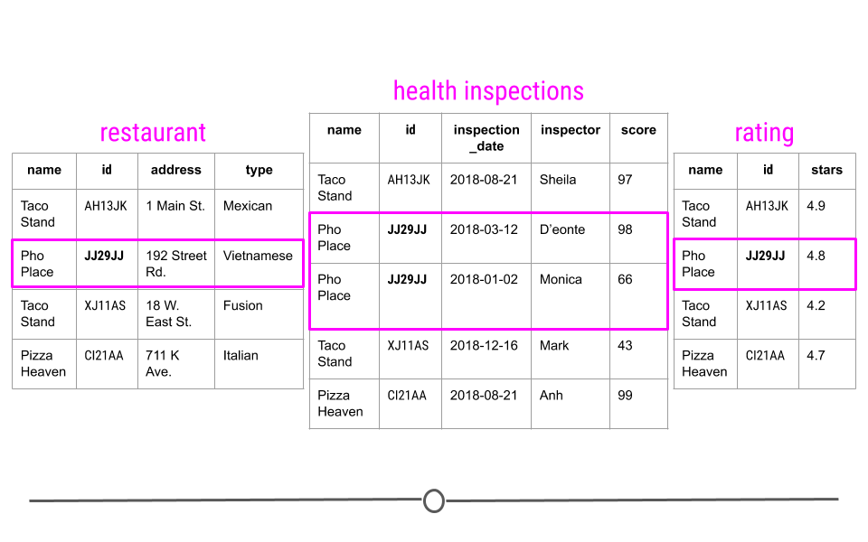
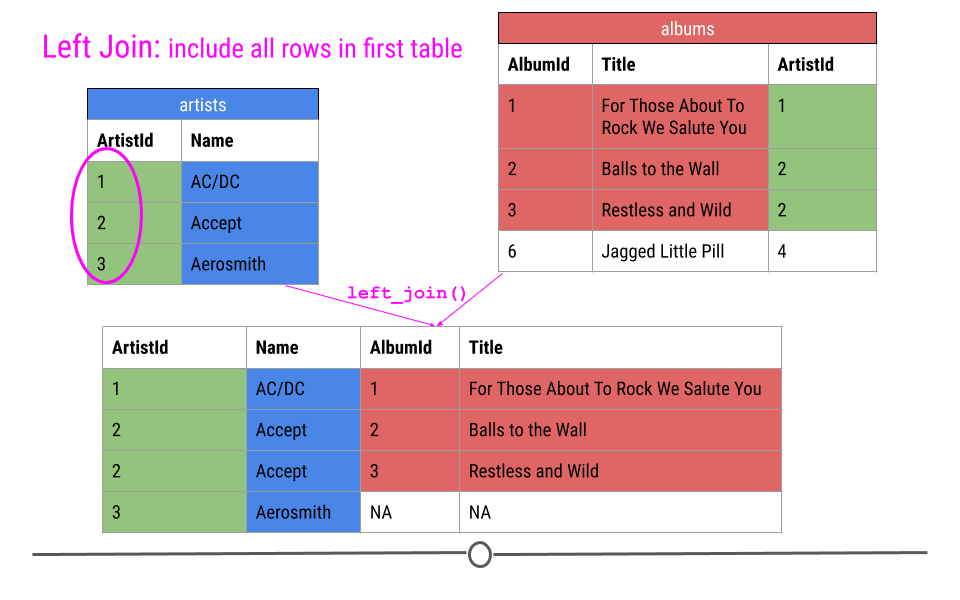

<script src="//yihui.org/js/math-code.js" defer></script>
<!-- Just one possible MathJax CDN below. You may use others. -->
<script defer
  src="//mathjax.rstudio.com/latest/MathJax.js?config=TeX-MML-AM_CHTML">
</script>


{}

## Introduction to databases

We do realise that most of the softwares around are designed to solve a problem!. To better understand what databases are ,we need to first understand the problems that necessitated the advent of databases. The answer to this is quite obvious ! `you have some data` or `large amounts of information` that you need to store, this data could be about:

- [x] Customers
- [x] Products
- [x] Employees etc

But why worry? , we could store the data in text files or even spreadsheets or if they are documents we can just organise them in folders.... is it! . Just having data is not a good enough reason to have a database , having data is not the problem but the problem is what comes next. Below are some of the problems that a database can solve 

- [x] size of the data
- [x] ease of updating
- [x] accuracy
- [x] sensitivity
- [x] redundancy
- [x] importance

so what`s a database?

### What is a database?

A structured storage space where the data is kept in many `tables` and
organized so that the necessary information can be easily fetched,
manipulated, and summarized.

{}

### tables and fields 


{}
A `table` is an organized set of related data stored in a tabular form,
i.e., in rows and columns. A `field` is another term for a `column` of a
table and `record` is the other name for a `row`
{}

### Relational Data


{}

To better understand this, let's consider a scenario were Bongani Has a
business. say I have a number of different restaurants. In one table I
might have information about these restaurants including, where they are
located and what type of food they serve. I may then have a second table
where information about health and safety inspections is stored. Each
inspection is a different row and the date of the inspection, the
inspector, and the safety rating are stored in this table. Finally, I
might have a third table. This third table contains information pulled
from an API, regarding the number of stars given to each restaurant, as
rated by people online. Each table contains different bits of
information; however, there is a common column `id` in each of the
tables. This allows the information to be linked between the tables. The
restaurant with the `id` "JJ29JJ" in the restaurant table would refer to
the same restaurant with the `id` "JJ29JJ" in the health inspections
table, and so on. The values in this `id` column are known as
`unique identifiers` because they uniquely identify each restaurant. No
two restaurants will have the same `id`, and the same restaurant will
always have the same `id`, no matter what table you're looking at. The
fact that these tables have unique identifiers connecting each table to
all the other tables makes this example what we call **relational
data**.

{}



### Why relational data?

Storing data in this way has a number of advantages; however, the three
most important are:

1.  Efficient Data Storage
2.  Avoids Ambiguity
3.  Privacy


### DBMS

`DDMS` stands for `Database Management System`, a software package used
to perform various operations on the data stored in a database, such as
accessing, updating, wrangling, inserting, and removing data. There are
various types of DBMS, such as relational, hierarchical, network, graph,
or object-oriented. These types are based on the way the data is
organized, structured, and stored in the system.

### RDBMS

`RDBMS` stands for `Relational Database Management System`. It's the
most common type of DBMS used for working with data stored in multiple
tables related to each other by means of shared keys. The SQL
programming language is particularly designed to interact with RDBMS.
Some examples of RDBMS are MySQL, PostgreSQL, Oracle, MariaDB, etc.


{}

### SQL constraints

| constraints | Description                                                            |
|------------------------------------|------------------------------------|
| DEFAULT     | provides a default value for a column                                  |
| UNIQUE      | allows only unique values                                              |
| NOT NULL    | allows only non-null values.                                           |
| PRIMARY KEY | allows only unique and strictly non-null values (NOT NULL and UNIQUE). |
| FOREIGN KEY | provides shared keys between two and more tables                       |

{}

### unique key

A column (or multiple columns) of a table to which the UNIQUE constraint was imposed to ensure unique values in that column, including a possible NULL value (the only one).

### foreign key

A column (or multiple columns) of a table to which the FOREIGN KEY constraint was imposed to link this column to the primary key in another table (or several tables). The purpose of foreign keys is to keep connected various tables of a database.

### SQL queries

A query is a piece of code written in SQL to access the data from a database or to modify the data. Correspondingly, there are two types of SQL queries: select and action queries. The first ones are used to retrieve the necessary data (this also includes limiting, grouping, ordering the data, extracting the data from multiple tables, etc.), while the second ones are used to create, add, delete, update, rename the data, etc.

### SQL comments

A human-readable clarification on what a particular piece of code does. SQL code comments can be single-line (preceded by a double dash --) or span over multiple lines (as follows: /*comment_text*/). When the SQL engine runs, it ignores code comments. The purpose of adding SQL code comments is to make the code more comprehensive for those people who will read it in the future.

### types of SQL commands (or SQL subsets) 


|Command                            |Explanation                                                                                                               |
|:----------------------------------|:-------------------------------------------------------------------------------------------------------------------------|
|Data Definition Language (DDL)     |to define and modify the structure of a database.                                                                         |
|Data Manipulation Language (DML)   |to access, manipulate, and modify data in a database.                                                                     |
|Data Control Language (DCL)        |to control user access to the data in the database and give or, revoke privileges to a specific user or a group of users. |
|Transaction Control Language (TCL) |to control transactions in a database.                                                                                    |
|Data Query Language (DQL)          |to perform queries on the data in a database to retrieve the necessary information from it.                               |


{}

### creating a table

> any computer system that deals with storing data needs to have the four fundamental functions that have the ability to:

+ `C`-REATE
+ `R`-EAD
+ `U`-UPDATE
+ `D`-ELETE 

commonly pronounced as `CRUD` 

> we use the `CREATE TABLE` statement. 


```r
CREATE TABLE table_name (col_1 datatype,
                           col_2 datatype,
                           col_3 datatype);
```

for instance if run the following query !

```r
CREATE TABLE my_table (age INTERGER,
                       sex TEXT);

```

we add the values to the table using `INSERT INTO .... VALUES (....)`


```r
INSERT INTO my_table VALUES (34,'male');
INSERT INTO my_table VALUES (47,'female');
INSERT INTO my_table VALUES (32,'male');   
```

then call the database using `SELECT`

```r
SELECT * FROM my_table;
```

{}


```
#> # A tibble: 3 x 2
#>     age sex   
#>   <dbl> <chr> 
#> 1    34 male  
#> 2    47 female
#> 3    32 male
```

### Querying a database
+ we will use the `Employee attrition database`
+ A *query* is a request for data from a database table (or combination of tables). 
+ Querying is an essential skill for a data scientist, since the data you need for your analyses will often live in databases.


{}

**`SELECT` statement**

**select all with `*`**

+ In SQL, you can select data from a table using a *SELECT* statement. For example, the following query selects the name column from the people table:
`SELECT name FROM people;`
+ you may want to select all columns from a table use `*` rather than typing all the columns


```r
SELECT * FROM dat_new
```

{}


```
#>    EmployeeNumber Attrition Age    BusinessTravel DailyRate
#> 1               1       Yes  41     Travel_Rarely      1102
#> 2               2        No  49 Travel_Frequently       279
#> 3               4       Yes  37     Travel_Rarely      1373
#> 4               5        No  33 Travel_Frequently      1392
#> 5               7        No  27     Travel_Rarely       591
#> 6               8        No  32 Travel_Frequently      1005
#> 7              10        No  59     Travel_Rarely      1324
#> 8              11        No  30     Travel_Rarely      1358
#> 9              12        No  38 Travel_Frequently       216
#> 10             13        No  36     Travel_Rarely      1299
#>                Department DistanceFromHome Education EducationField
#> 1                   Sales                1         2  Life Sciences
#> 2  Research & Development                8         1  Life Sciences
#> 3  Research & Development                2         2          Other
#> 4  Research & Development                3         4  Life Sciences
#> 5  Research & Development                2         1        Medical
#> 6  Research & Development                2         2  Life Sciences
#> 7  Research & Development                3         3        Medical
#> 8  Research & Development               24         1  Life Sciences
#> 9  Research & Development               23         3  Life Sciences
#> 10 Research & Development               27         3        Medical
#>    EmployeeCount EnvironmentSatisfaction Gender HourlyRate JobInvolvement
#> 1              1                       2 Female         94              3
#> 2              1                       3   Male         61              2
#> 3              1                       4   Male         92              2
#> 4              1                       4 Female         56              3
#> 5              1                       1   Male         40              3
#> 6              1                       4   Male         79              3
#> 7              1                       3 Female         81              4
#> 8              1                       4   Male         67              3
#> 9              1                       4   Male         44              2
#> 10             1                       3   Male         94              3
#>    JobLevel                   JobRole JobSatisfaction MaritalStatus
#> 1         2           Sales Executive               4        Single
#> 2         2        Research Scientist               2       Married
#> 3         1     Laboratory Technician               3        Single
#> 4         1        Research Scientist               3       Married
#> 5         1     Laboratory Technician               2       Married
#> 6         1     Laboratory Technician               4        Single
#> 7         1     Laboratory Technician               1       Married
#> 8         1     Laboratory Technician               3      Divorced
#> 9         3    Manufacturing Director               3        Single
#> 10        2 Healthcare Representative               3       Married
#>    MonthlyIncome MonthlyRate NumCompaniesWorked Over18 OverTime
#> 1           5993       19479                  8      Y      Yes
#> 2           5130       24907                  1      Y       No
#> 3           2090        2396                  6      Y      Yes
#> 4           2909       23159                  1      Y      Yes
#> 5           3468       16632                  9      Y       No
#> 6           3068       11864                  0      Y       No
#> 7           2670        9964                  4      Y      Yes
#> 8           2693       13335                  1      Y       No
#> 9           9526        8787                  0      Y       No
#> 10          5237       16577                  6      Y       No
#>    PercentSalaryHike PerformanceRating RelationshipSatisfaction StandardHours
#> 1                 11                 3                        1            80
#> 2                 23                 4                        4            80
#> 3                 15                 3                        2            80
#> 4                 11                 3                        3            80
#> 5                 12                 3                        4            80
#> 6                 13                 3                        3            80
#> 7                 20                 4                        1            80
#> 8                 22                 4                        2            80
#> 9                 21                 4                        2            80
#> 10                13                 3                        2            80
#>    StockOptionLevel TotalWorkingYears TrainingTimesLastYear WorkLifeBalance
#> 1                 0                 8                     0               1
#> 2                 1                10                     3               3
#> 3                 0                 7                     3               3
#> 4                 0                 8                     3               3
#> 5                 1                 6                     3               3
#> 6                 0                 8                     2               2
#> 7                 3                12                     3               2
#> 8                 1                 1                     2               3
#> 9                 0                10                     2               3
#> 10                2                17                     3               2
#>    YearsAtCompany YearsInCurrentRole YearsSinceLastPromotion
#> 1               6                  4                       0
#> 2              10                  7                       1
#> 3               0                  0                       0
#> 4               8                  7                       3
#> 5               2                  2                       2
#> 6               7                  7                       3
#> 7               1                  0                       0
#> 8               1                  0                       0
#> 9               9                  7                       1
#> 10              7                  7                       7
#>    YearsWithCurrManager
#> 1                     5
#> 2                     7
#> 3                     0
#> 4                     0
#> 5                     2
#> 6                     6
#> 7                     0
#> 8                     0
#> 9                     8
#> 10                    7
```

{}
**selecting a subset**

+ you can achieve this by defining the columns to be selected e.g


```r
SELECT col_1,col_2,col_3 
FROM my_table;
```

using the database we get


```r
SELECT Attrition,Department,Education 
FROM dat_new;
```
 
{}


```
#>    Attrition             Department Education
#> 1        Yes                  Sales         2
#> 2         No Research & Development         1
#> 3        Yes Research & Development         2
#> 4         No Research & Development         4
#> 5         No Research & Development         1
#> 6         No Research & Development         2
#> 7         No Research & Development         3
#> 8         No Research & Development         1
#> 9         No Research & Development         3
#> 10        No Research & Development         3
```


{}

**select `distinct` items in SQL**

+ Often your results will include many duplicate values. If you want to select all the unique values from a column, you can use the *DISTINCT* keyword. for instance if you have the following database table:

{}


```
#> # A tibble: 5 x 3
#>   Name      age sex   
#>   <chr>   <dbl> <chr> 
#> 1 Bongani    34 male  
#> 2 Eliza      47 female
#> 3 Bongani    34 male  
#> 4 Peter      27 male  
#> 5 Fadzie     19 female
```
+ we can see that `Bongani` has been recorded twice in the dataset


```r
SELECT DISTINCT name,age,sex 
FROM database_table
```


```
#>      Name age    sex
#> 1 Bongani  34   male
#> 2   Eliza  47 female
#> 3   Peter  27   male
#> 4  Fadzie  19 female
```

{}

**filtering using `WHERE` in SQL**

+ *WHERE* is a filtering clause
+ In SQL, the WHERE keyword allows you to filter based on both text and numeric values in a table. There are a few different comparison operators you can use:

- [x] _= equal_
- [x] _<> not equal_
- [x] _< less than_
- [x] _> greater than_
- [x] _<= less than or equal to_
- [x] _>= greater than or equal to_

+ You can build up your WHERE queries by combining multiple conditions with the _AND_ keyword.


```r
SELECT DISTINCT name,age,sex
FROM df
WHERE sex='male';
```

{}


```
#>      Name age  sex
#> 1 Bongani  34 male
#> 2   Peter  27 male
```

{}

**`COUNT` and `AS` alias in SQL**

+ The *COUNT* statement lets you count then returning the number of rows in one or more columns.
+ we use `AS` to rename default name 
+ `COUNT(*)` tells you how many rows are in a table

{}


```r
SELECT COUNT(*) AS pple_count
FROM database_table;
```


```
#>   pple_count
#> 1          5
```

+ the above query calculates the number of rows in the data and finds `5 rows`
 
> we can use `COUNT(DISTINCT column)` to get the number of unique rows


```r
SELECT COUNT(DISTINCT name) AS unique_count
FROM database_table;
```


```
#>   unique_count
#> 1            4
```
the query above will calculate rows with distinct names and finds them to be 4

**We can use `COUNT` with `WHERE`**

+ We can do this to get the number of terms after filtering
+ how many people are male?


```r
SELECT COUNT(*) AS num_male
FROM database_table
WHERE sex='male';
```


```
#>   num_male
#> 1        3
```

{}

## Manipulating and Aggregating


## Create a database for the exercises


```r
con<-dbConnect(RSQLite::SQLite(), ":memory:")
copy_to(con,data1)
copy_to(con,data2)
```

### filtering using `WHERE` in SQL

> the following points were outlined previously

+ *WHERE* is a filtering clause
+ In SQL, the WHERE keyword allows you to filter based on both text and numeric values in a table. There are a few different comparison operators you can use:

+ _= equal_
+ _<> not equal_
+ _< less than_
+ _> greater than_
+ _<= less than or equal to_
+ _>= greater than or equal to_

+ You can build up your WHERE queries by combining multiple conditions with the _AND_ keyword.

{}


```sql
SELECT * 
FROM data2 
WHERE category='Potato'
```


<div class="knitsql-table">


Table: <span id="tab:unnamed-chunk-30"></span>Table 1: 1 records

| recipe| calories| sugar| protein|category |
|------:|--------:|-----:|-------:|:--------|
|    624|   236.62|  0.81|    9.07|Potato   |

</div>


## filtering using `IN` and `WHERE` in SQL


```sql
SELECT * 
FROM data2 
WHERE category IN ('Chicken','Chicken Breast')
```


<div class="knitsql-table">


Table: <span id="tab:unnamed-chunk-31"></span>Table 2: 5 records

| recipe| calories| sugar| protein|category       |
|------:|--------:|-----:|-------:|:--------------|
|    609|       NA|    NA|      NA|Chicken Breast |
|    671|   481.88|  1.34|   51.90|Chicken        |
|    683|   147.24|  0.94|   54.00|Chicken        |
|    419|  1830.28|  1.83|   44.74|Chicken Breast |
|    117|       NA|    NA|      NA|Chicken Breast |

</div>

{}

### `COUNT` and `AS` alias in SQL

+ The *COUNT* statement lets you count then returning the number of rows in one or more columns.
+ we use `AS` to rename default name 
+ `COUNT(*)` tells you how many rows are in a table
{}


```sql
SELECT COUNT(*) AS n 
FROM data2
```


<div class="knitsql-table">


Table: <span id="tab:unnamed-chunk-32"></span>Table 3: 1 records

|  n|
|--:|
| 25|

</div>

### count filters in SQL


```sql
SELECT COUNT(category) AS n_potato
FROM data2 
WHERE category IN ('Chicken Breast','Chicken')
```


<div class="knitsql-table">


Table: <span id="tab:unnamed-chunk-33"></span>Table 4: 1 records

| n_potato|
|--------:|
|        5|

</div>

### Updating a database using `dbExecute`

+ categories before


```
#>        category n percent
#>       Beverages 1    0.04
#>       Breakfast 4    0.16
#>         Chicken 2    0.08
#>  Chicken Breast 3    0.12
#>         Dessert 3    0.12
#>            Meat 4    0.16
#>   One Dish Meal 3    0.12
#>            Pork 1    0.04
#>          Potato 1    0.04
#>       Vegetable 3    0.12
```

### Updating a database

+ we need to change a category called `Breakfast` to `Breakfast meal`
+ we shall use `REPLACE`


```sql
UPDATE data2 
SET category= REPLACE(category,'Breakfast','Breakfast meal')
WHERE category='Breakfast'
```

### Querying to check results


```sql
SELECT category, COUNT(category) as n_per_category
FROM data2
GROUP BY category
```


<div class="knitsql-table">


Table: <span id="tab:unnamed-chunk-36"></span>Table 5: Displaying records 1 - 10

|category       | n_per_category|
|:--------------|--------------:|
|Beverages      |              1|
|Breakfast meal |              4|
|Chicken        |              2|
|Chicken Breast |              3|
|Dessert        |              3|
|Meat           |              4|
|One Dish Meal  |              3|
|Pork           |              1|
|Potato         |              1|
|Vegetable      |              3|

</div>

+ we see that `Breakfast` has updated to `Breakfast meal`

{}

### Missing data in SQL

+ in SQL, `NULL` represents a missing or unknown value. You can check for NULL values using the expression IS NULL
+ Use `IS NULL` AND `IS NOT NULL`

{}

*filtering missing data*


```sql
SELECT * 
FROM data2 
WHERE Protein IS NULL
```


<div class="knitsql-table">


Table: <span id="tab:unnamed-chunk-37"></span>Table 6: 3 records

| recipe| calories| sugar| protein|category       |
|------:|--------:|-----:|-------:|:--------------|
|    912|       NA|    NA|      NA|Dessert        |
|    609|       NA|    NA|      NA|Chicken Breast |
|    117|       NA|    NA|      NA|Chicken Breast |

</div>

*filtering nonmissing data*


```sql
SELECT * 
FROM data2 
WHERE Protein IS NOT NULL
```


<div class="knitsql-table">


Table: <span id="tab:unnamed-chunk-38"></span>Table 7: Displaying records 1 - 10

| recipe| calories| sugar| protein|category       |
|------:|--------:|-----:|-------:|:--------------|
|    624|   236.62|  0.81|    9.07|Potato         |
|    102|   198.98|  0.39|   39.12|Vegetable      |
|    427|   187.41| 86.97|    4.49|Dessert        |
|    324|    49.50|  4.69|   53.33|Breakfast meal |
|    380|    75.89|  8.18|   17.64|Meat           |
|    671|   481.88|  1.34|   51.90|Chicken        |
|    683|   147.24|  0.94|   54.00|Chicken        |
|    208|    20.98|  9.80|    0.82|Beverages      |
|    633|   105.95|  0.07|    7.55|Vegetable      |
|    859|   388.44|  4.62|   13.93|Pork           |

</div>

## How many categories do we have

{}

### select `distinct` items in SQL

+ Often your results will include many duplicate values. If you want to select all the unique values from a column, you can use the *DISTINCT* keyword.
{}


```sql
SELECT COUNT(DISTINCT category) AS unique_categories 
FROM data2
```


<div class="knitsql-table">


Table: <span id="tab:unnamed-chunk-39"></span>Table 8: 1 records

| unique_categories|
|-----------------:|
|                10|

</div>

# Advanced filters
### filtering in SQL


```sql
SELECT * 
FROM data2 WHERE sugar > 1 AND sugar < 5 
AND category='Breakfast meal'
```


<div class="knitsql-table">


Table: <span id="tab:unnamed-chunk-40"></span>Table 9: 3 records

| recipe| calories| sugar| protein|category       |
|------:|--------:|-----:|-------:|:--------------|
|    324|     49.5|  4.69|   53.33|Breakfast meal |
|    598|    212.4|  2.25|   23.78|Breakfast meal |
|    526|     93.5|  2.57|   23.68|Breakfast meal |

</div>


+ also achieved by using `BETWEEN` and `AND`


```sql
SELECT * 
FROM data2 
WHERE sugar BETWEEN 1 AND 5 
AND category='Breakfast meal'
```


<div class="knitsql-table">


Table: <span id="tab:unnamed-chunk-41"></span>Table 10: 3 records

| recipe| calories| sugar| protein|category       |
|------:|--------:|-----:|-------:|:--------------|
|    324|     49.5|  4.69|   53.33|Breakfast meal |
|    598|    212.4|  2.25|   23.78|Breakfast meal |
|    526|     93.5|  2.57|   23.68|Breakfast meal |

</div>

{}

### filtering text data in SQL

+ use `LIKE`
+ the `LIKE` operator can be used in a WHERE clause to search for a pattern in a column. 
+ To accomplish this, you use something called a wildcard as a placeholder for some other values. There are two wildcards you can use with LIKE:

> The `%` wildcard will match zero, one, or many characters in text

> The `_` wildcard will match a single character

{}


```sql
SELECT * 
FROM data2 
WHERE category LIKE 'Chicken%'
```


<div class="knitsql-table">


Table: <span id="tab:unnamed-chunk-42"></span>Table 11: 5 records

| recipe| calories| sugar| protein|category       |
|------:|--------:|-----:|-------:|:--------------|
|    609|       NA|    NA|      NA|Chicken Breast |
|    671|   481.88|  1.34|   51.90|Chicken        |
|    683|   147.24|  0.94|   54.00|Chicken        |
|    419|  1830.28|  1.83|   44.74|Chicken Breast |
|    117|       NA|    NA|      NA|Chicken Breast |

</div>

### Aggregate functions in SQL


```sql
SELECT AVG(sugar) AS avg_sugar,
       MAX(sugar) AS max_sugar,
       MIN(sugar) AS min_sugar,
       VARIANCE(sugar) AS variance,
       STDEV(sugar) AS stnd_deviation
FROM data2;
```


<div class="knitsql-table">


Table: <span id="tab:unnamed-chunk-43"></span>Table 12: 1 records

| avg_sugar| max_sugar| min_sugar| variance| stnd_deviation|
|---------:|---------:|---------:|--------:|--------------:|
|  11.24864|     86.97|      0.07| 426.5449|       20.65296|

</div>

### Grouping and aggregating in SQL


```sql
SELECT category,AVG(sugar) AS avg_sugar,
                       MAX(sugar) AS max_sugar,
                       MIN(sugar) AS min_sugar
FROM data2
GROUP BY category;
```


<div class="knitsql-table">


Table: <span id="tab:unnamed-chunk-44"></span>Table 13: Displaying records 1 - 10

|category       |  avg_sugar| max_sugar| min_sugar|
|:--------------|----------:|---------:|---------:|
|Beverages      |  9.8000000|      9.80|      9.80|
|Breakfast meal |  5.1600000|     11.13|      2.25|
|Chicken        |  1.1400000|      1.34|      0.94|
|Chicken Breast |  1.8300000|      1.83|      1.83|
|Dessert        | 69.5700000|     86.97|     52.17|
|Meat           | 13.5525000|     30.06|      5.21|
|One Dish Meal  |  3.9066667|      6.09|      1.46|
|Pork           |  4.6200000|      4.62|      4.62|
|Potato         |  0.8100000|      0.81|      0.81|
|Vegetable      |  0.8066667|      1.96|      0.07|

</div>

> we can order the data by a certain column using `ORDER BY` clause


```sql
SELECT category,AVG(sugar) AS avg_sugar,
                       MAX(sugar) AS max_sugar,
                       MIN(sugar) AS min_sugar
FROM data2
GROUP BY category
ORDER BY avg_sugar;
```


<div class="knitsql-table">


Table: <span id="tab:unnamed-chunk-45"></span>Table 14: Displaying records 1 - 10

|category       |  avg_sugar| max_sugar| min_sugar|
|:--------------|----------:|---------:|---------:|
|Vegetable      |  0.8066667|      1.96|      0.07|
|Potato         |  0.8100000|      0.81|      0.81|
|Chicken        |  1.1400000|      1.34|      0.94|
|Chicken Breast |  1.8300000|      1.83|      1.83|
|One Dish Meal  |  3.9066667|      6.09|      1.46|
|Pork           |  4.6200000|      4.62|      4.62|
|Breakfast meal |  5.1600000|     11.13|      2.25|
|Beverages      |  9.8000000|      9.80|      9.80|
|Meat           | 13.5525000|     30.06|      5.21|
|Dessert        | 69.5700000|     86.97|     52.17|

</div>

> the above output shows results arranged in ascending order of `avg_sugar` , if we needed to begin with the largest descending we could use`ORDER BY...DESC`


```sql
SELECT category,AVG(sugar) AS avg_sugar,
                       MAX(sugar) AS max_sugar,
                       MIN(sugar) AS min_sugar
FROM data2
GROUP BY category
ORDER BY avg_sugar DESC;
```


<div class="knitsql-table">


Table: <span id="tab:unnamed-chunk-46"></span>Table 15: Displaying records 1 - 10

|category       |  avg_sugar| max_sugar| min_sugar|
|:--------------|----------:|---------:|---------:|
|Dessert        | 69.5700000|     86.97|     52.17|
|Meat           | 13.5525000|     30.06|      5.21|
|Beverages      |  9.8000000|      9.80|      9.80|
|Breakfast meal |  5.1600000|     11.13|      2.25|
|Pork           |  4.6200000|      4.62|      4.62|
|One Dish Meal  |  3.9066667|      6.09|      1.46|
|Chicken Breast |  1.8300000|      1.83|      1.83|
|Chicken        |  1.1400000|      1.34|      0.94|
|Potato         |  0.8100000|      0.81|      0.81|
|Vegetable      |  0.8066667|      1.96|      0.07|

</div>

### Using `UPPER()`

> Sometimes you may want to change a column to all upper cases


```sql
SELECT recipe,category , UPPER(category) AS upper_cat
FROM data2;
```


<div class="knitsql-table">


Table: <span id="tab:unnamed-chunk-47"></span>Table 16: Displaying records 1 - 10

| recipe|category       |upper_cat      |
|------:|:--------------|:--------------|
|    624|Potato         |POTATO         |
|    102|Vegetable      |VEGETABLE      |
|    427|Dessert        |DESSERT        |
|    324|Breakfast meal |BREAKFAST MEAL |
|    912|Dessert        |DESSERT        |
|    380|Meat           |MEAT           |
|    609|Chicken Breast |CHICKEN BREAST |
|    671|Chicken        |CHICKEN        |
|    683|Chicken        |CHICKEN        |
|    208|Beverages      |BEVERAGES      |

</div>

## Basic arithmetic

+ In addition to using aggregate functions, you can perform basic arithmetic with symbols like `+, -, *, and /`.
+ lets create weird variables here


```sql
SELECT category,(sugar-protein) AS diff_sugar_protein 
FROM data2;
```


<div class="knitsql-table">


Table: <span id="tab:unnamed-chunk-48"></span>Table 17: Displaying records 1 - 10

|category       | diff_sugar_protein|
|:--------------|------------------:|
|Potato         |              -8.26|
|Vegetable      |             -38.73|
|Dessert        |              82.48|
|Breakfast meal |             -48.64|
|Dessert        |                 NA|
|Meat           |              -9.46|
|Chicken Breast |                 NA|
|Chicken        |             -50.56|
|Chicken        |             -53.06|
|Beverages      |               8.98|

</div>

{}

## `CASE` statements

> this contains a `WHEN,THEN` and `ELSE` statement ,finished with `END`

### Take the stair `CASE`

+ using `CASE WHEN` to categorise or group data as follows
+ `SELECT`....
+ `CASE WHEN` *condition* `THEN` *category*
+ `WHEN` *condition* `THEN` *category*
+ .........................................
+ `ELSE` *some_category*
+ `END AS` *variable name*

{}


```sql
SELECT recipe , sugar,
   CASE WHEN sugar BETWEEN 0 AND 50 THEN '0-50'
        WHEN sugar BETWEEN 51 AND 100 THEN '51-100'
        WHEN sugar BETWEEN 101 AND 200 THEN '101-200'
        WHEN sugar IS NULL THEN 'missing'
        ELSE '>200'
        END AS sugar_category
FROM data2;
```


<div class="knitsql-table">


Table: <span id="tab:unnamed-chunk-49"></span>Table 18: Displaying records 1 - 10

| recipe| sugar|sugar_category |
|------:|-----:|:--------------|
|    624|  0.81|0-50           |
|    102|  0.39|0-50           |
|    427| 86.97|51-100         |
|    324|  4.69|0-50           |
|    912|    NA|missing        |
|    380|  8.18|0-50           |
|    609|    NA|missing        |
|    671|  1.34|0-50           |
|    683|  0.94|0-50           |
|    208|  9.80|0-50           |

</div>


> we can letter perform aggregations on the new column for instance get the count per each category


```sql
SELECT COUNT(*) AS count_per_category,
   CASE WHEN sugar BETWEEN 0 AND 50 THEN '0-50'
        WHEN sugar BETWEEN 51 AND 100 THEN '51-100'
        WHEN sugar BETWEEN 101 AND 200 THEN '101-200'
        WHEN sugar IS NULL THEN 'missing'
        ELSE '>200'
        END AS sugar_category
FROM data2
GROUP BY sugar_category;
```


<div class="knitsql-table">


Table: <span id="tab:unnamed-chunk-50"></span>Table 19: 3 records

| count_per_category|sugar_category |
|------------------:|:--------------|
|                 20|0-50           |
|                  2|51-100         |
|                  3|missing        |

</div>


{}

### SQL subqueries

> A subquery is a query nested in another query and is useful for intermediate transformations


```r
SELECT column
FROM (SELECT column 
      FROM table) AS subquery;
```

> subqueries can be found anywhere within `SELECT,FROM,WHERE,GROUP BY`

#### use cases

- [x] comparing groups to summarised values
- [x] Reshaping Data
- [x] Combining data that cannot be joined

> for instance

+ use data1 and data2 databases for this task
+ the following is just an example and calories in data2 and data1 are the same so the result is the same
{}


```sql
SELECT recipe,calories
FROM data2 
WHERE calories > 
      (SELECT AVG(calories) FROM data1);
```


<div class="knitsql-table">


Table: <span id="tab:unnamed-chunk-52"></span>Table 20: 9 records

| recipe| calories|
|------:|--------:|
|    671|   481.88|
|    859|   388.44|
|    171|   431.28|
|    282|   409.99|
|     91|   388.37|
|    868|   307.36|
|    885|   504.09|
|    419|  1830.28|
|    639|   321.95|

</div>

{}

### Summarize group statistics using subqueries

Sometimes you want to understand how a value varies across groups. For example, how does the maximum value per group vary across groups?

To find out, first summarize by group, and then compute summary statistics of the group results. One way to do this is to compute group values in a subquery, and then summarize the results of the subquery.

> what is the standard deviation across meal cateries in the maximum amount of sugar? What about the mean, min, and max of the maximums as well?

> Start by writing a subquery to compute the `max()`  per categoy; alias the subquery result as sugar_max. Then compute the standard deviation of sugar_max with `stddev()`.
Compute the `min()`, `max()`, and `avg()` of sugar_max too.

{}


```sql
SELECT AVG(sugar_max) AS avg_sugar,
       MAX(sugar_max) AS max_sugar,
       MIN(sugar_max) AS min_sugar,
       VARIANCE(sugar_max) AS variance,
       STDEV(sugar_max) AS stnd_deviation
FROM (SELECT MAX(sugar) AS sugar_max
      FROM data2
         -- Compute max by...
      GROUP BY category) AS max_results
```


<div class="knitsql-table">


Table: <span id="tab:unnamed-chunk-53"></span>Table 21: 1 records

| avg_sugar| max_sugar| min_sugar| variance| stnd_deviation|
|---------:|---------:|---------:|--------:|--------------:|
|    15.461|     86.97|      0.81| 707.2168|       26.59355|

</div>

## SQL JOINS
### setting up the data

+ to aid with illustrations , I have created some `fake datasets` to assist in explaining and these are `join_df1.csv` and `join_df2.csv` datasets
+ read in CSV files and store them as databases in R


```r
# read in example csv files (join_df1 and join_df2)
join_df1 <- read.csv("join_df1.csv") |> 
  dplyr::rename(A=bongi)
join_df2 <- read.csv("join_df2.csv")|> 
  dplyr::rename(A=bongi)

join<-dbConnect(RSQLite::SQLite(), ":memory:")
copy_to(join,join_df1)
copy_to(join,join_df2)
```

### join_df1


```sql
SELECT * FROM join_df1
```


<div class="knitsql-table">


Table: <span id="tab:unnamed-chunk-55"></span>Table 22: 8 records

|A      |  B|  C|
|:------|--:|--:|
|red    |  2|  3|
|orange |  4|  6|
|yellow |  8|  9|
|green  |  0|  0|
|indigo |  3|  3|
|blue   |  1|  1|
|purple |  5|  5|
|white  |  8|  2|

</div>

> this data has 8 rows and 3 columns 

### join_df2


```sql
SELECT * FROM join_df2
```


<div class="knitsql-table">


Table: <span id="tab:unnamed-chunk-56"></span>Table 23: 7 records

|A      |  D|
|:------|--:|
|red    |  3|
|orange |  5|
|yellow |  7|
|green  |  1|
|indigo |  3|
|blue   |  6|
|pink   |  9|

</div>

> this has 7 rows and 2 columns

+ note that we will use the column `A` as our `unique identifier`

{}

### Querying A join

> generally the following step show how a join is done in SQL

+ `SELECT` t1.comon_column1`,`t1.common_column2`,`...
+ `FROM` table1 `AS` t1
+ `<type> JOIN` table2 `AS` t2
+ `ON` t1.common_unique_column = t2.common_unique_column`;`

### Inner Join

When talking about inner joins, we are only going to keep an observation if it is found in all of the tables we're combining. Here, we're combining the tables based on the `ArtistId` column. In our dummy example, there are only two artists that are found in *both* tables. These are highlighted in green and will be the rows used to join the two tables. Then, once the inner join happens, only these artists' data will be included after the inner join.

{}


when doing an `inner join`, data from any observation found in all the tables being joined are included in the output. Here, `ArtistId`s "1" and "2" are in both the `artists` and `albums` tables. Thus, those will be the only `ArtistId`s in the output from the inner join. 

And, since it's a mutating join, our new table will have information from both tables! We now have `ArtistId`, `Name`, `AlbumId`, *and* `Title` in a single table! We've joined the two tables, based on the column `ArtistId`!


### See this in `ACTION`


```sql
SELECT * 
FROM join_df1
INNER JOIN join_df2
USING(A)
```


<div class="knitsql-table">


Table: <span id="tab:unnamed-chunk-59"></span>Table 24: 6 records

|A      |  B|  C|  D|
|:------|--:|--:|--:|
|red    |  2|  3|  3|
|orange |  4|  6|  5|
|yellow |  8|  9|  7|
|green  |  0|  0|  1|
|indigo |  3|  3|  3|
|blue   |  1|  1|  6|

</div>

> we note from the above that only `the colours` that are `common to both tables` are returned. however instead of using `USING` we can use `ON table1.columnname=table2.columnname` where `columnname` is the column that tables to be matched by and in our example this is column `A` . when using this method it is important to give each table an `ALIAS` which is a `shorthand` for our tables


```sql
SELECT * 
FROM join_df1 AS j1
INNER JOIN join_df2 AS j2
ON j1.A=j2.A;            
```


<div class="knitsql-table">


Table: <span id="tab:unnamed-chunk-60"></span>Table 25: 6 records

|A      |  B|  C|A      |  D|
|:------|--:|--:|:------|--:|
|red    |  2|  3|red    |  3|
|orange |  4|  6|orange |  5|
|yellow |  8|  9|yellow |  7|
|green  |  0|  0|green  |  1|
|indigo |  3|  3|indigo |  3|
|blue   |  1|  1|blue   |  6|

</div>

> looking at the table above ,we note that `column A` has been repeated twice , thus we need to only `SELECT` the `column A` From only one of our tables hence we specify the repeated columns in the `SELECT` statement using the `table.columnname` method . So in the example above `SELECT j1.A,B,C,D`
specifies that we want we want column `A` to come from table `j1` (j1.A)


```sql
SELECT j1.A,B,C,D 
FROM join_df1 AS j1
INNER JOIN join_df2 AS j2
ON j1.A=j2.A;
```


<div class="knitsql-table">


Table: <span id="tab:unnamed-chunk-61"></span>Table 26: 6 records

|A      |  B|  C|  D|
|:------|--:|--:|--:|
|red    |  2|  3|  3|
|orange |  4|  6|  5|
|yellow |  8|  9|  7|
|green  |  0|  0|  1|
|indigo |  3|  3|  3|
|blue   |  1|  1|  6|

</div>

> great :)! , generally we can apply the same scenario to all kinds of joins

{}

### left join in SQL

For a left join, all rows in the first table specified will be included in the output. Any row in the second table that is *not* in the first table will not be included. 

In our toy example this means that `ArtistID`s 1, 2, and 3 will be included in the output; however, `ArtistID` 4 will not.


 
Thus, our output will again include all the columns from both tables combined into a single table; however, for `ArtistId` 3, there will be NAs for `AlbumId` and `Title`. NAs will be filled in for any observations in the first table specified that are missing in the second table.



{}

> Let us see it in ACTION


```sql
SELECT j1.A,B,C,D 
FROM join_df1 AS j1
LEFT JOIN join_df2 AS j2
ON j1.A=j2.A;
```


<div class="knitsql-table">


Table: <span id="tab:unnamed-chunk-64"></span>Table 27: 8 records

|A      |  B|  C|  D|
|:------|--:|--:|--:|
|red    |  2|  3|  3|
|orange |  4|  6|  5|
|yellow |  8|  9|  7|
|green  |  0|  0|  1|
|indigo |  3|  3|  3|
|blue   |  1|  1|  6|
|purple |  5|  5| NA|
|white  |  8|  2| NA|

</div>

> great , we notice the `NA` values found in the last column


{}

### RIGHT JOIN IN SQL

Right Join is similar to what we just discussed; however, in the output from a right join, all rows in the final table specified are included in the output. NAs will be included for any observations found in the last specified table but not in the other tables.

In our toy example, that means, information about `ArtistID`s 1, 2, and 4 will be included. 


Again, in our toy example, we see that `right join` combines the information across tables; however, in this case, `ArtistId` 4 is included, but `Name` is an NA, as this information was not in the `artists` table for this artist.


{}

> Let us see a `RIGHT JOIN` in action


```sql
SELECT j1.A,B,C,D 
FROM join_df1 AS j1
RIGHT JOIN join_df2 AS j2
ON j1.A=j2.A;
```


<div class="knitsql-table">


Table: <span id="tab:unnamed-chunk-67"></span>Table 28: 7 records

|A      |  B|  C|  D|
|:------|--:|--:|--:|
|red    |  2|  3|  3|
|orange |  4|  6|  5|
|yellow |  8|  9|  7|
|green  |  0|  0|  1|
|indigo |  3|  3|  3|
|blue   |  1|  1|  6|
|NA     | NA| NA|  9|

</div>

> great , notice now where the `NA` is displayed

{}

### full join in SQL

Finally, a full join will take every observation from every table and include it in the output.


Thus, in our toy example, this join produces five rows, including all the observations from either table. NAs are filled in when data are missing for an observation.


{}

> let us see a `FULL JOIN` in ACTION


```sql
SELECT j1.A,B,C,D 
FROM join_df1 AS j1
FULL JOIN join_df2 AS j2
ON j1.A=j2.A;
```


<div class="knitsql-table">


Table: <span id="tab:unnamed-chunk-70"></span>Table 29: 9 records

|A      |  B|  C|  D|
|:------|--:|--:|--:|
|red    |  2|  3|  3|
|orange |  4|  6|  5|
|yellow |  8|  9|  7|
|green  |  0|  0|  1|
|indigo |  3|  3|  3|
|blue   |  1|  1|  6|
|purple |  5|  5| NA|
|white  |  8|  2| NA|
|NA     | NA| NA|  9|

</div>

{}

### Window functions

+ A window function performs an aggregate-like operation on a set of query rows. 

> However, whereas an aggregate operation groups query rows into a single result row, a window function produces a result for each query row:

### Anatomy of a window function

+ `FUNCTION_NAME() OVER()`
+ `ORDER BY`
+ `PARTITION BY`
+ `ROWS/RANGE PRECEDING/FOLLOWING/UNBOUNDED`

{}

### Creating a fake dataset in R


```r
library(tidyverse)

sales<-tribble(~ year , ~country , ~product    , ~profit ,~Own ,~Time,
                 2000 , "Finland", "Computer"  ,   1500  ,"Y"  ,"D",
                 2000 , "Finland" ,"Phone"      ,   100   ,"Y"  ,"D",
                 2001 , "Finland" ,"Phone"      ,     10  ,"N"  ,"D",
                 2000 , "India"   ,"Calculator" ,     75  ,"Y"  ,"E",
                 2000 , "India"   ,"Calculator" ,     75  ,"N"  ,"E",
                 2000 , "India"   ,"Computer"   ,   1200  ,"N"  ,"E",
                 2000 , "USA"     , "Calculator",     75  ,"Y"  ,"E",
                 2000 , "USA"     , "Computer"  ,   1500  ,"N"  ,"E",
                 2001 , "USA"     ,"Calculator" ,     50  ,"Y"  ,"E",
                 2001 , "USA"     ,"Computer"   ,   1500  ,"Y"  ,"E",
                 2001 , "USA"     ,"Computer"   ,   1200  ,"Y"  ,"D",
                 2001 , "USA"     , "TV"        ,    150  ,"Y"  ,"D",
                 2001 , "USA"     , "TV"        ,    100  ,"Y"  ,"D")
sales
#> # A tibble: 13 x 6
#>     year country product    profit Own   Time 
#>    <dbl> <chr>   <chr>       <dbl> <chr> <chr>
#>  1  2000 Finland Computer     1500 Y     D    
#>  2  2000 Finland Phone         100 Y     D    
#>  3  2001 Finland Phone          10 N     D    
#>  4  2000 India   Calculator     75 Y     E    
#>  5  2000 India   Calculator     75 N     E    
#>  6  2000 India   Computer     1200 N     E    
#>  7  2000 USA     Calculator     75 Y     E    
#>  8  2000 USA     Computer     1500 N     E    
#>  9  2001 USA     Calculator     50 Y     E    
#> 10  2001 USA     Computer     1500 Y     E    
#> 11  2001 USA     Computer     1200 Y     D    
#> 12  2001 USA     TV            150 Y     D    
#> 13  2001 USA     TV            100 Y     D
```

### Load in the necessary packages


```r
library(odbc)
library(DBI)
library(RSQLite)
```


### Set up a database using the datafile


```r
wind<-dbConnect(RSQLite::SQLite(), ":memory:")
copy_to(wind,sales)
```

### Lets get started

+ The row for which function evaluation occurs is called the current row.
+ The query rows related to the current row over which function evaluation occurs comprise the window for the current row.

{}

### `ROW_NUMBER() OVER()` 

+ use it if maybe you have duplicates or intend to create rowids for your data

{}


```sql
SELECT ROW_NUMBER() OVER () AS row_id , year, country, product, profit
FROM sales;
```


<div class="knitsql-table">


Table: <span id="tab:unnamed-chunk-74"></span>Table 30: Displaying records 1 - 10

|row_id | year|country |product    | profit|
|:------|----:|:-------|:----------|------:|
|1      | 2000|Finland |Computer   |   1500|
|2      | 2000|Finland |Phone      |    100|
|3      | 2001|Finland |Phone      |     10|
|4      | 2000|India   |Calculator |     75|
|5      | 2000|India   |Calculator |     75|
|6      | 2000|India   |Computer   |   1200|
|7      | 2000|USA     |Calculator |     75|
|8      | 2000|USA     |Computer   |   1500|
|9      | 2001|USA     |Calculator |     50|
|10     | 2001|USA     |Computer   |   1500|

</div>

{}

### PARTITION BY

+ This splits the table into `partitions` based on a column's unique values and results aren't rolled into one column

> therefore `ROW_NUMBER()` With `PARTITION BY` produces the row number of each row within its partition. In this case, rows are numbered per country. By default, partition rows are unordered and row numbering is nondeterministic. 

{}


```sql
SELECT ROW_NUMBER() OVER(PARTITION BY country) AS row_num1,
       year, country, product, profit
FROM sales;
```


<div class="knitsql-table">


Table: <span id="tab:unnamed-chunk-75"></span>Table 31: Displaying records 1 - 10

| row_num1| year|country |product    | profit|
|--------:|----:|:-------|:----------|------:|
|        1| 2000|Finland |Computer   |   1500|
|        2| 2000|Finland |Phone      |    100|
|        3| 2001|Finland |Phone      |     10|
|        1| 2000|India   |Calculator |     75|
|        2| 2000|India   |Calculator |     75|
|        3| 2000|India   |Computer   |   1200|
|        1| 2000|USA     |Calculator |     75|
|        2| 2000|USA     |Computer   |   1500|
|        3| 2001|USA     |Calculator |     50|
|        4| 2001|USA     |Computer   |   1500|

</div>

> its also possible to use `ROW_NUMBER()` With `ORDER BY` to determine ranks 


```sql
SELECT ROW_NUMBER() OVER(ORDER BY profit DESC) AS row_num1,
       year, country, product, profit
FROM sales;
```


<div class="knitsql-table">


Table: <span id="tab:unnamed-chunk-76"></span>Table 32: Displaying records 1 - 10

|row_num1 | year|country |product    | profit|
|:--------|----:|:-------|:----------|------:|
|1        | 2000|Finland |Computer   |   1500|
|2        | 2000|USA     |Computer   |   1500|
|3        | 2001|USA     |Computer   |   1500|
|4        | 2000|India   |Computer   |   1200|
|5        | 2001|USA     |Computer   |   1200|
|6        | 2001|USA     |TV         |    150|
|7        | 2000|Finland |Phone      |    100|
|8        | 2001|USA     |TV         |    100|
|9        | 2000|India   |Calculator |     75|
|10       | 2000|India   |Calculator |     75|

</div>

> in the above example , we see that we have ranked our data according to `profits` implying that each rowid also signifies the rank of profit

{}

### RANK()

+ ROW_NUMBER assigns different numbers to profits with the same amount, so it's not a useful ranking function; if profits are the same , they should have the same rank.
{}

> in such a case we use `RANK()`


```sql
SELECT RANK() OVER(ORDER BY profit DESC) AS RANK, 
     profit ,year, country, product
FROM sales;
```


<div class="knitsql-table">


Table: <span id="tab:unnamed-chunk-77"></span>Table 33: Displaying records 1 - 10

| RANK| profit| year|country |product    |
|----:|------:|----:|:-------|:----------|
|    1|   1500| 2000|Finland |Computer   |
|    1|   1500| 2000|USA     |Computer   |
|    1|   1500| 2001|USA     |Computer   |
|    4|   1200| 2000|India   |Computer   |
|    4|   1200| 2001|USA     |Computer   |
|    6|    150| 2001|USA     |TV         |
|    7|    100| 2000|Finland |Phone      |
|    7|    100| 2001|USA     |TV         |
|    9|     75| 2000|India   |Calculator |
|    9|     75| 2000|India   |Calculator |

</div>

### `DENSE_RANK()`

> we can use `DENSE_RANK()` if we need ranks to be ordered or require a further partition


```sql
SELECT DENSE_RANK() OVER(PARTITION BY country ORDER BY profit DESC) AS RANK, 
     profit ,year, country, product
FROM sales;
```


<div class="knitsql-table">


Table: <span id="tab:unnamed-chunk-78"></span>Table 34: Displaying records 1 - 10

| RANK| profit| year|country |product    |
|----:|------:|----:|:-------|:----------|
|    1|   1500| 2000|Finland |Computer   |
|    2|    100| 2000|Finland |Phone      |
|    3|     10| 2001|Finland |Phone      |
|    1|   1200| 2000|India   |Computer   |
|    2|     75| 2000|India   |Calculator |
|    2|     75| 2000|India   |Calculator |
|    1|   1500| 2000|USA     |Computer   |
|    1|   1500| 2001|USA     |Computer   |
|    2|   1200| 2001|USA     |Computer   |
|    3|    150| 2001|USA     |TV         |

</div>

> now we have ranked our profits by country starting with the highest profit in each country

{}

### Aggregations

+ window functions are similar to `GROUP BY` aggregate function but all rows stay in the output
{}

> using the sales information table, these two queries perform aggregate operations that produce a single global sum for all rows taken as a group, and sums grouped per country:


```sql
SELECT SUM(profit) AS total_profit
FROM sales;
```


<div class="knitsql-table">


Table: <span id="tab:unnamed-chunk-79"></span>Table 35: 1 records

| total_profit|
|------------:|
|         7535|

</div>


> lets us see a `GROUP BY` in action


```sql
SELECT country, SUM(profit) AS country_profit
FROM sales
GROUP BY country;
```


<div class="knitsql-table">


Table: <span id="tab:unnamed-chunk-80"></span>Table 36: 3 records

|country | country_profit|
|:-------|--------------:|
|Finland |           1610|
|India   |           1350|
|USA     |           4575|

</div>
       

> On the other hand , window operations do not collapse groups of query rows to a single output row. Instead, they produce a result for each row. Like the preceding queries, the following query uses `SUM()`, but this time as a window function:


```sql
SELECT
year, country, product, profit,
         SUM(profit) OVER() AS total_profit,
         SUM(profit) OVER(PARTITION BY country) AS country_profit
FROM sales
ORDER BY country, year, product, profit;         
```


<div class="knitsql-table">


Table: <span id="tab:unnamed-chunk-81"></span>Table 37: Displaying records 1 - 10

| year|country |product    | profit| total_profit| country_profit|
|----:|:-------|:----------|------:|------------:|--------------:|
| 2000|Finland |Computer   |   1500|         7535|           1610|
| 2000|Finland |Phone      |    100|         7535|           1610|
| 2001|Finland |Phone      |     10|         7535|           1610|
| 2000|India   |Calculator |     75|         7535|           1350|
| 2000|India   |Calculator |     75|         7535|           1350|
| 2000|India   |Computer   |   1200|         7535|           1350|
| 2000|USA     |Calculator |     75|         7535|           4575|
| 2000|USA     |Computer   |   1500|         7535|           4575|
| 2001|USA     |Calculator |     50|         7535|           4575|
| 2001|USA     |Computer   |   1200|         7535|           4575|

</div>
       
{}

> we have included  `OVER` clause that specifies how to partition query rows into groups for processing by the window function:

+ The first OVER clause is empty, which treats the entire set of query rows as a single partition. The window function thus produces a global sum, but does so for each row.
+ The second OVER clause partitions rows by country, producing a sum per partition (per country). The function produces this sum for each partition row.

> Window functions are permitted only in the select list and `ORDER BY` clause. Query result rows are determined from the `FROM` clause, after `WHERE, GROUP BY`, and `HAVING` processing, and windowing execution occurs before `ORDER BY`, `LIMIT`, and `SELECT DISTINCT`.


### WITH CLAUSE

+ This is used to create a temporary relation such that the output of this temporary relation is available and is used by the query that is associated with the `WITH` clause. for instance the following table can be created as a temporary table 

### FRAMES

> Frames allow you to "peek" forwards or backward without first using the relative fetching functions, `LAG` and `LEAD`, to fetch previous rows' values into the current row.

#### ROWS BETWEEN

- [x] `ROWS BETWEEN [START] AND [FINISH]`
+ `n PRECEDING` : `n` rows before current row
+ `CURRENT ROW` : the current row 
+ `n FOLLOWING` : `n` rows after the current row 
{}


> the following query calculates the number of sales per year and per country(i.e grouped by year and country)


```sql
SELECT
    year, country, COUNT(*) AS num_sales
  FROM sales
  GROUP BY year, country;
```


<div class="knitsql-table">


Table: <span id="tab:unnamed-chunk-82"></span>Table 38: 5 records

| year|country | num_sales|
|----:|:-------|---------:|
| 2000|Finland |         2|
| 2000|India   |         3|
| 2000|USA     |         2|
| 2001|Finland |         1|
| 2001|USA     |         5|

</div>

like soo...

### `WITH` and a `FRAME`

+ We create a temporary table called `country_sales`


```sql
WITH Country_sales AS (
  SELECT
    year, country, COUNT(*) AS num_sales
  FROM sales
  GROUP BY year, country)

SELECT
  year, country, num_sales,
  -- Calculate each country's 3s-ales moving total
  SUM(num_sales) OVER
    (PARTITION BY country
     ORDER BY year ASC
     ROWS BETWEEN
     2 PRECEDING AND CURRENT ROW) AS sales_MA
FROM Country_sales
ORDER BY country ASC, year ASC;
```


<div class="knitsql-table">


Table: <span id="tab:unnamed-chunk-83"></span>Table 39: 5 records

| year|country | num_sales| sales_MA|
|----:|:-------|---------:|--------:|
| 2000|Finland |         2|        2|
| 2001|Finland |         1|        3|
| 2000|India   |         3|        3|
| 2000|USA     |         2|        2|
| 2001|USA     |         5|        7|

</div>


