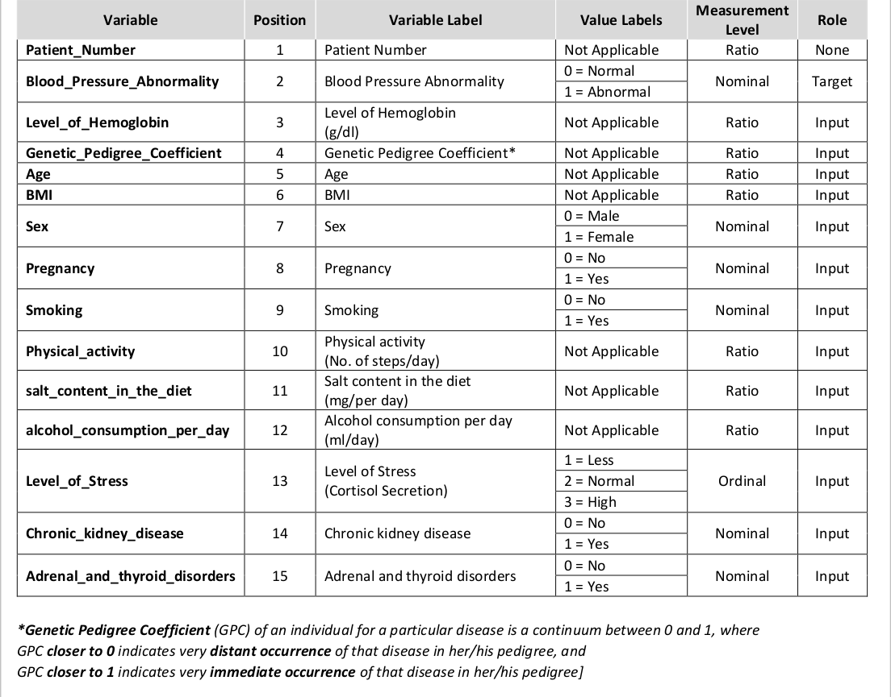

<script src="//yihui.org/js/math-code.js" defer></script>
<!-- Just one possible MathJax CDN below. You may use others. -->
<script defer
  src="//mathjax.rstudio.com/latest/MathJax.js?config=TeX-MML-AM_CHTML">
</script>

```{r setup, include = FALSE}
knitr::opts_chunk$set(cache = TRUE, 
                      echo = TRUE, 
                      message = FALSE, 
                      warning = FALSE,
                      fig.path = "static",
                      fig.height=6, 
                      fig.width = 1.777777*6,
                      fig.align='center',
                      tidy = FALSE, 
                      comment = NA, 
                      highlight = TRUE, 
                      prompt = FALSE, 
                      crop = TRUE,
                      comment = "#>",
                      collapse = TRUE)
knitr::opts_knit$set(width = 60)
library(tidyverse)
library(reshape2)
theme_set(theme_light(base_size = 16))
make_latex_decorator <- function(output, otherwise) {
  function() {
      if (knitr:::is_latex_output()) output else otherwise
  }
}
insert_pause <- make_latex_decorator(". . .", "\n")
insert_slide_break <- make_latex_decorator("----", "\n")
insert_inc_bullet <- make_latex_decorator("> *", "*")
insert_html_math <- make_latex_decorator("", "$$")
```

{}

# Introduction

In my last linkedin Post I mentioned about how :

+ Taking a sample from two groups from a population and seeing if there's a significant or substantial difference between them is a standard task in statistics. 
+ Measuring performance on a test before and after some sort of intervention, measuring average GDP in two different continents, measuring average height in two groups of flowers, etc.
+ we like to know if any group differences we see are attributable to chance / measurement error, or if they're real.

{}

> In most cases statisticians opt to answer these questions using the `t.test()`


## load the dataset and package
```{r}
options(scipen=999)
## load packages
library(tidyverse)
library(infer)
library(scales)     # Nicer formatting for numbers
library(broom)      # Convert model results to tidy data frames
library(infer)      # Statistical inference with simulation
library(ggridges)   # Ridge plots
library(ggstance)   # Horizontal pointranges and bars
library(patchwork) 
## define custom theme

theme_fancy <- function() {
  theme_minimal(base_family = "Asap Condensed") +
    theme(panel.grid.minor = element_blank())
}

## load in the dataset
out_new<- vroom::vroom("bloodpressure.csv")
```

## Data dictionery
```{r ,echo=FALSE}

```

## recode the dataset

+ I once carried out a study using this data on [**B Ncube Analysis**](https://rpubs.com/BayesianN/abnormal)

```{r}
data_new<- out_new |> 
  mutate(Blood_Pressure_Abnormality= ifelse(Blood_Pressure_Abnormality==0,"Normal","Abnormal")) |> 
  mutate(Sex = ifelse(Sex==0,"Male","Female")) |> 
  mutate(Pregnancy=ifelse(Pregnancy==0,"No","Yes")) |> 
  mutate(Smoking=ifelse(Smoking==0,"No","Yes")) |>
  mutate(Chronic_kidney_disease=ifelse(Chronic_kidney_disease==0,"No","Yes")) |> 
  mutate(Adrenal_and_thyroid_disorders=ifelse(Adrenal_and_thyroid_disorders==0,"No","Yes")) |> 
  mutate(Level_of_Stress=case_when(Level_of_Stress==1~"Less",
                                   Level_of_Stress==2~"Normal",
                                   Level_of_Stress==3~"High"))
```

## Explanatory Data Analysis

```{r}
temp.1<-data_new |> 
  group_by(Blood_Pressure_Abnormality) |> 
  mutate(x.lab=paste0(Blood_Pressure_Abnormality,
                      "\n",
                      "(n=",
                      n(),
                      ")"))
```


```{r eda-plots, message=FALSE, width=7, height=5,warning=FALSE}

eda_boxplot <- ggplot(temp.1,
       aes(x=x.lab,
           y=Level_of_Hemoglobin,
           fill=Blood_Pressure_Abnormality))+
  geom_boxplot(outlier.shape = NA)+
  stat_boxplot(geom="errorbar")+
  geom_jitter(aes(fill=Blood_Pressure_Abnormality),
              shape=21,
              alpha=0.8,
              width=0.05)+
  scale_y_continuous(limits=c(0,20),
                     labels=function(x) paste0(
                                               {x/1},"g/dl"))+
  ggthemes::scale_fill_tableau()+
  ggthemes::theme_pander()+
  labs(x="BP level",
       y="Level Of Hemoglobin",
       title="Distribution of hemoglobin by BP level")+
  theme_fancy()

eda_histogram <- ggplot(data_new, aes(x = Level_of_Hemoglobin, fill = Blood_Pressure_Abnormality)) +
  geom_histogram(binwidth = 1, color = "white") +
  scale_fill_manual(values = c("#0288b7", "#a90010"), guide = FALSE) + 
  scale_x_continuous(breaks = seq(1, 10, 1)) +
  labs(y = "Count", x = "Level of Hemoglobin") +
  facet_wrap(~ Blood_Pressure_Abnormality, nrow = 2) +
  theme_fancy() +
  theme(panel.grid.major.x = element_blank())

eda_ridges <- ggplot(data_new, aes(x = Level_of_Hemoglobin, y = fct_rev(Blood_Pressure_Abnormality), fill = Blood_Pressure_Abnormality)) +
  stat_density_ridges(quantile_lines = TRUE, quantiles = 2, scale = 3, color = "white") + 
  scale_fill_manual(values = c("#0288b7", "#a90010"), guide = FALSE) + 
  scale_x_continuous(breaks = seq(0, 10, 2)) +
  labs(x = "Level of Hemoglobin", y = NULL,
       subtitle = "White line shows median Level of Hemoglobin") +
  theme_fancy()

(eda_boxplot | eda_histogram) / 
    eda_ridges + 
  plot_annotation(title = "Do Abnormal BP patients have higher Level of Hemoglobin than those with Normal Blood pressure?",
                  subtitle = "Sample of 400 patients",
                  theme = theme(text = element_text(family = "Asap Condensed"),
                                plot.title = element_text(face = "bold",
                                                          size = rel(1.5))))
```

{}

+ the plots suggest that there is some observable differences in hemoglogin between the two groups
+ but visuals alone are not enough to give a clear picture

{}


## Run a t.test assuming equal variances.

```{r t-test-equal}
# Assume equal variances
t_test_eq <- t.test(Level_of_Hemoglobin ~ Blood_Pressure_Abnormality, data = data_new, var.equal = TRUE)
t_test_eq
```


{}

The default output is helpful—the p-value is really tiny *(p<0.001)*, which means there's a tiny chance that we'd see a difference that big in group means in a world where there's no difference

{}

## but there is some drawbacks with this

{}

- there are some assumptions that need to be met for the t.test to work
- some the more general assumptions are **equality of variances* and *normality of data*

{}

## testing for assumptions

For all these tests, the null hypothesis is that the two groups have similar (homogeneous) variances. If the p-value is less than 0.05, we can assume that they have unequal or heterogeneous variances.

- [**Bartlett test**](https://en.wikipedia.org/wiki/Bartlett%27s_test): Check homogeneity of variances based on the mean

```{r bartlett-test}
bartlett.test(Level_of_Hemoglobin ~ Blood_Pressure_Abnormality, data = data_new)
```

- [**Levene test**](https://en.wikipedia.org/wiki/Levene%27s_test): Check homogeneity of variances based on the median, so it's more robust to outliers

```{r levene-test}
    # Install the car package first
car::leveneTest(Level_of_Hemoglobin ~ Blood_Pressure_Abnormality, data = data_new)
```

- [**Fligner-Killeen test**](https://biostats.w.uib.no/test-for-homogeneity-of-variances-levenes-test/): Check homogeneity of variances based on the median, so it's more robust to outliers

```{r fligner-test}
fligner.test(Level_of_Hemoglobin ~ Blood_Pressure_Abnormality, data = data_new)
```

- [**Kruskal-Wallis test**](https://en.wikipedia.org/wiki/Kruskal%E2%80%93Wallis_one-way_analysis_of_variance): Check homogeneity of distributions nonparametrically

```{r kruskal-wallis-test}
kruskal.test(Level_of_Hemoglobin ~ Blood_Pressure_Abnormality, data = data_new)
```

## Simulation-based tests

Instead of dealing with all the assumptions of the data and finding the exact statistical test we can use the power of bootstrapping, permutation, and simulation to construct a null distribution and calculate confidence intervals.

{}

## Step 1

- [x] First we calculate the difference in means in the actual data:

{}


```{r sim-diff-means}
# Calculate the difference in means
diff_means <- data_new %>% 
  specify(Level_of_Hemoglobin ~ Blood_Pressure_Abnormality) %>%
  calculate("diff in means", order = c("Abnormal", "Normal"))
diff_means
```
{}

## Step 2

- [x] Then we can generate a bootstrapped distribution of the difference in means based on our sample and calculate the confidence interval:

{}


```{r sim-boot, fig.width=7, fig.height=3,warning=FALSE}
boot_means <- data_new %>% 
  specify(Level_of_Hemoglobin ~ Blood_Pressure_Abnormality) %>% 
  generate(reps = 1000, type = "bootstrap") %>% 
  calculate("diff in means", order = c("Abnormal", "Normal"))

boostrapped_confint <- boot_means %>% get_confidence_interval()

boot_means %>% 
  visualize() + 
  shade_confidence_interval(boostrapped_confint,
                            color = "#8bc5ed", fill = "#85d9d2") +
  geom_vline(xintercept = diff_means$stat, size = 1, color = "#77002c") +
  labs(title = "Bootstrapped distribution of differences in means",
       x = "Action − Comedy", y = "Count",
       subtitle = "Red line shows observed difference; shaded area shows 95% confidence interval") +
  theme_fancy()
```

{}

> We have a simulation-based confidence interval, and it doesn't contain zero, so we can have some confidence that there's a real difference between the two groups. 

{}


{}

## Step 3

- [x] next we generate a world where there's no difference by shuffling all the Abnormal/Normal labels through permutation

{}

```{r sim-generate-null-world, fig.width=7, fig.height=3,warning=FALSE}
# Step 2: Invent a world where δ is null
genre_diffs_null <- data_new %>% 
  specify(Level_of_Hemoglobin ~ Blood_Pressure_Abnormality) %>%
  hypothesize(null = "independence") %>% 
  generate(reps = 5000, type = "permute") %>% 
   calculate("diff in means", order = c("Abnormal", "Normal"))

# Step 3: Put actual observed δ in the null world and see if it fits
genre_diffs_null %>% 
  visualize() + 
  geom_vline(xintercept = diff_means$stat, size = 1, color = "#77002c") +
  scale_y_continuous(labels = comma) +
  labs(x = "Simulated difference in average ratings (Abnormal − Normal)", 
       y = "Count",
       title = "Simulation-based null distribution of differences in means",
       subtitle = "Red line shows observed difference") +
  theme_fancy()
```

That red line is pretty far to the left and seems like it wouldn't fit very well in a world where there's no actual difference between the groups. We can calculate the probability of seeing that red line in a null world (step 4) with `get_p_value()` (and we can use the cool new `pvalue()` function in the **scales** library to format it as < 0.001):


{}

## Step 4

- [x] Calculate probability that observed δ could exist in

{}

```{r sim-p-value}
# Step 4: Calculate probability that observed δ could exist in null world
genre_diffs_null %>% 
  get_p_value(obs_stat = diff_means, direction = "both") %>% 
  mutate(p_value_clean = pvalue(p_value))
```

{}

## Conclusion

- [x] Because the p-value is so small, it passes pretty much all evidentiary thresholds (p < 0.05, p < 0.01, etc), so we can safely say that there's a difference between the two groups.

{}


