# background

> Visualisation is the process of representing data graphically and interacting with these representations. The objective is to gain insight into the data.

To work with **ggplot2**\index{ggplot2}, remember that at least your R codes must

-   start with `ggplot()`
-   identify which data to plot `data = Your Data`
-   state variables to plot for example `aes(x = Variable on x-axis, y = Variable on y-axis )` for bivariate
-   choose type of graph, for example `geom_histogram()` for histogram, and `geom_points()` for scatterplots\index{Scatterplot}

# setup

+ installing *tidyverse* package which contains *dplyr* and *ggplot2*


```r
library(tidyverse)
```

```
## Warning: package 'ggplot2' was built under R version 4.2.3
```

```
## Warning: package 'tibble' was built under R version 4.2.3
```

```
## Warning: package 'dplyr' was built under R version 4.2.3
```

```
## -- Attaching core tidyverse packages ------------------------ tidyverse 2.0.0 --
## v dplyr     1.1.2     v readr     2.1.4
## v forcats   1.0.0     v stringr   1.5.0
## v ggplot2   3.4.2     v tibble    3.2.1
## v lubridate 1.9.2     v tidyr     1.3.0
## v purrr     1.0.1     
## -- Conflicts ------------------------------------------ tidyverse_conflicts() --
## x dplyr::filter() masks stats::filter()
## x dplyr::lag()    masks stats::lag()
## i Use the ]8;;http://conflicted.r-lib.org/conflicted package]8;; to force all conflicts to become errors
```

```r
loan_data <- read_csv('loan_data_cleaned.csv')
```

```
## New names:
## Rows: 29091 Columns: 9
## -- Column specification
## -------------------------------------------------------- Delimiter: "," chr
## (4): grade, home_ownership, emp_cat, ir_cat dbl (5): ...1, loan_status,
## loan_amnt, annual_inc, age
## i Use `spec()` to retrieve the full column specification for this data. i
## Specify the column types or set `show_col_types = FALSE` to quiet this message.
## * `` -> `...1`
```

```r
loan_data <- loan_data |>
  mutate(default=ifelse(loan_status==1,"defaulted","not defaulted")) |> 
  mutate_if(is.character,as.factor)
```

# getting started

+ Calling ggplot() along just creates a blank plot

```r
ggplot()
```


# next up

+ I need to tell ggplot what data to use

```r
ggplot(data=loan_data)
```


# grammar of graphics

+ And then give it some instructions using the grammar of graphics.
+ Let's build a simple scatterplot with annual income on the x-axis and loan amount on the y axis


```r
ggplot(data=loan_data) +
  geom_point(mapping=aes(x=annual_inc, y=loan_amnt))
```

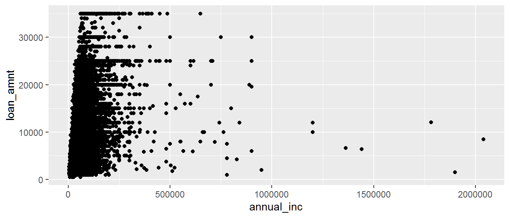

# refining...

+ Let's try representing a different dimension.  
+ What if we want to differentiate public vs. private schools?
+ We can do this using the shape attribute


```r
ggplot(data=loan_data) +
  geom_point(mapping=aes(x=annual_inc, y=loan_amnt, shape=default))
```

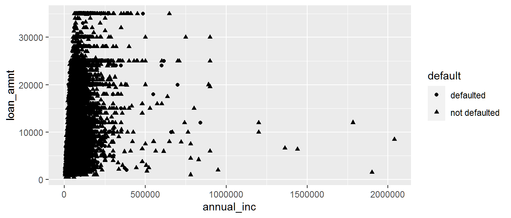

# not neat!!..try color.

+ That's hard to see the difference.  What if we try color instead?

```r
ggplot(data=loan_data) +
  geom_point(mapping=aes(x=annual_inc, y=loan_amnt, color=default))
```

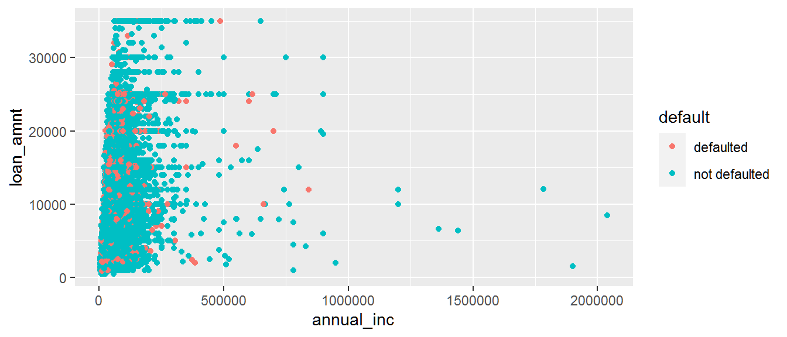

# try size!

+ I can also alter point size.  Let's do that to represent grade

```r
ggplot(data=loan_data) +
  geom_point(mapping=aes(x=annual_inc, y=loan_amnt, color=default, size=grade))
```

```
## Warning: Using size for a discrete variable is not advised.
```

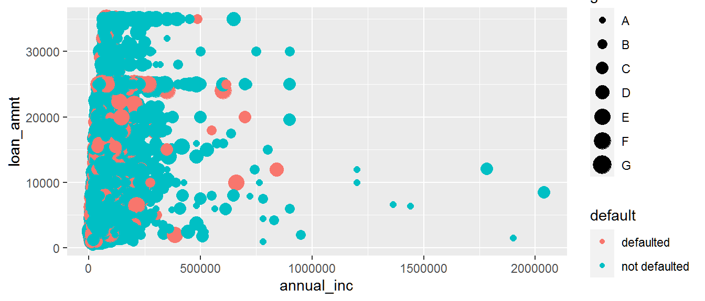

# transparency

+ And, lastly, let's add some transparency so we can see through those points a bit
+ Experiment with the alpha value a bit.


```r
ggplot(data=loan_data) +
  geom_point(mapping=aes(x=annual_inc, y=loan_amnt, color=default, size=grade), alpha=1)
```

```
## Warning: Using size for a discrete variable is not advised.
```


# very transparent


```r
ggplot(data=loan_data) +
  geom_point(mapping=aes(x=annual_inc, y=loan_amnt, color=default, size=grade), alpha=1/100)
```

```
## Warning: Using size for a discrete variable is not advised.
```

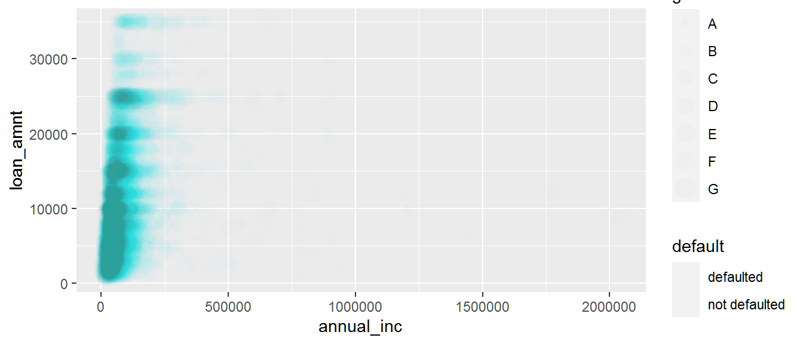

# How many people defaulted?


```r
# This calls for a bar graph!
ggplot(data=loan_data) +
  geom_bar(mapping=aes(x=default))
```

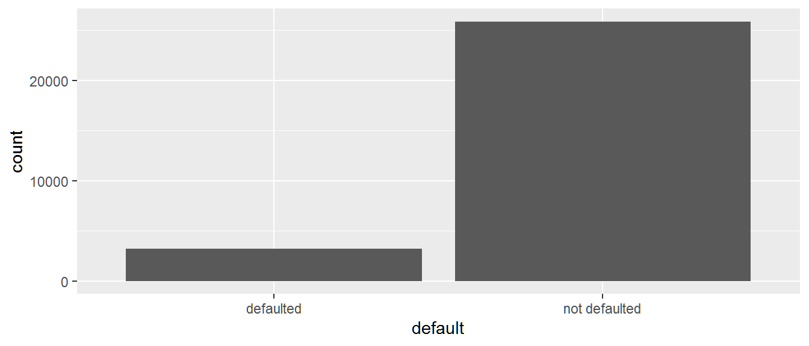

# Break it out by grade


```r
ggplot(data=loan_data) +
  geom_bar(mapping=aes(x=default, color=grade))
```

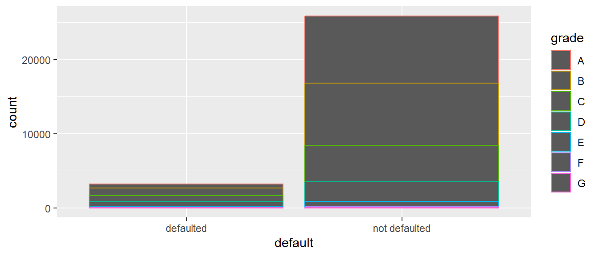

# Well, that's unsatisfying!  Try fill instead of color


```r
ggplot(data=loan_data) +
  geom_bar(mapping=aes(x=default, fill=grade))
```

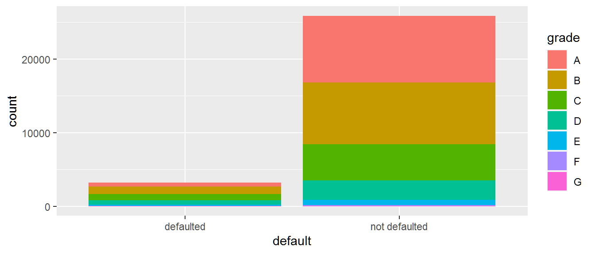

# How about loan amount by default status?

+ First, I'll use some dplyr to create the right tibble

```r
loan_data %>%
  group_by(default) %>%
  summarize(average_amount=mean(loan_amnt))
```

```
## # A tibble: 2 x 2
##   default       average_amount
##   <fct>                  <dbl>
## 1 defaulted              9389.
## 2 not defaulted          9619.
```

# And I can pipe that straight into ggplot

+ but this will produce an error


```r
loan_data %>%
  group_by(default) %>%
  summarize(average_amount=mean(loan_amnt)) %>%
  ggplot() +
  geom_bar(mapping=aes(x=default, y=average_amount))
```

# use geom_col() instead

+ But I need to use a column graph instead of a bar graph to specify my own y


```r
loan_data %>%
  group_by(default) %>%
  summarize(average_amount=mean(loan_amnt)) %>%
  ggplot() +
  geom_col(mapping=aes(x=default, y=average_amount))
```

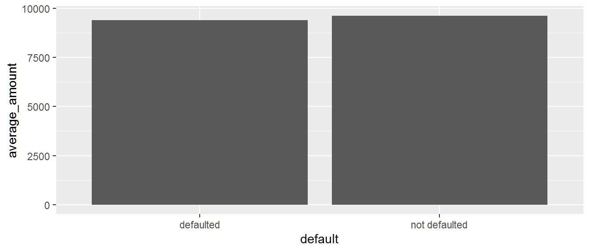

# Histograms

+ Let's look at annual income
+ Histograms can help us by binning results


```r
ggplot(data=loan_data) +
  geom_histogram(mapping=aes(x=annual_inc), origin=0)
```

```
## Warning: The `origin` argument of `stat_bin()` is deprecated as of ggplot2 2.1.0.
## i Please use the `boundary` argument instead.
## This warning is displayed once every 8 hours.
## Call `lifecycle::last_lifecycle_warnings()` to see where this warning was
## generated.
```

```
## `stat_bin()` using `bins = 30`. Pick better value with `binwidth`.
```

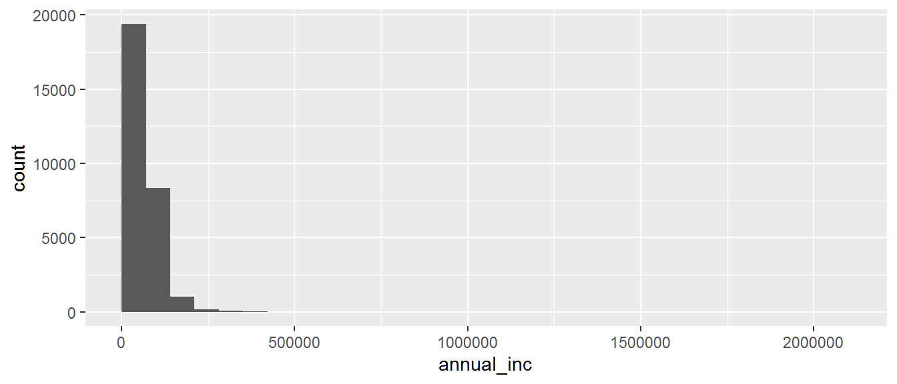

# What if we want fewer groups? Let's ask for 4 bins


```r
ggplot(data=loan_data) +
  geom_histogram(mapping=aes(x=annual_inc), bins=4, origin=0)
```

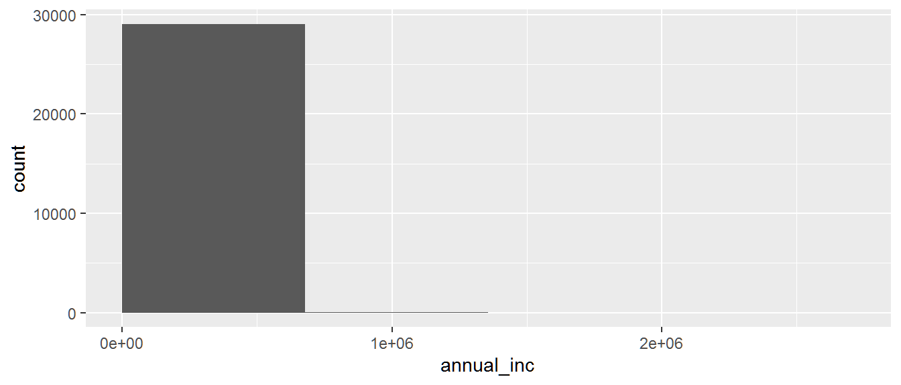

# Or 10 bins.


```r
ggplot(data=loan_data) +
  geom_histogram(mapping=aes(x=annual_inc), bins=10, origin=0)
```


# Or we can specify the width of the bins instead


```r
ggplot(data=loan_data) +
  geom_histogram(mapping=aes(x=annual_inc), binwidth=1000, origin=0)
```

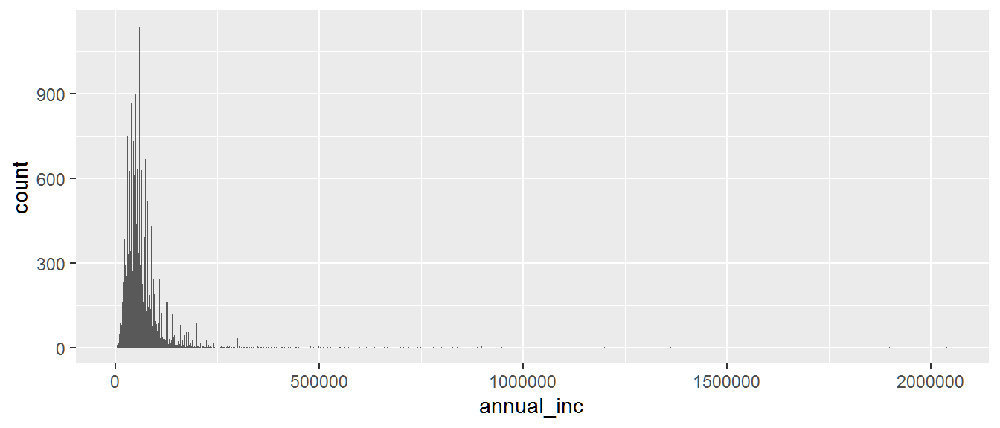

# large binwidth


```r
ggplot(data=loan_data) +
  geom_histogram(mapping=aes(x=annual_inc), binwidth=10000, origin=0)
```

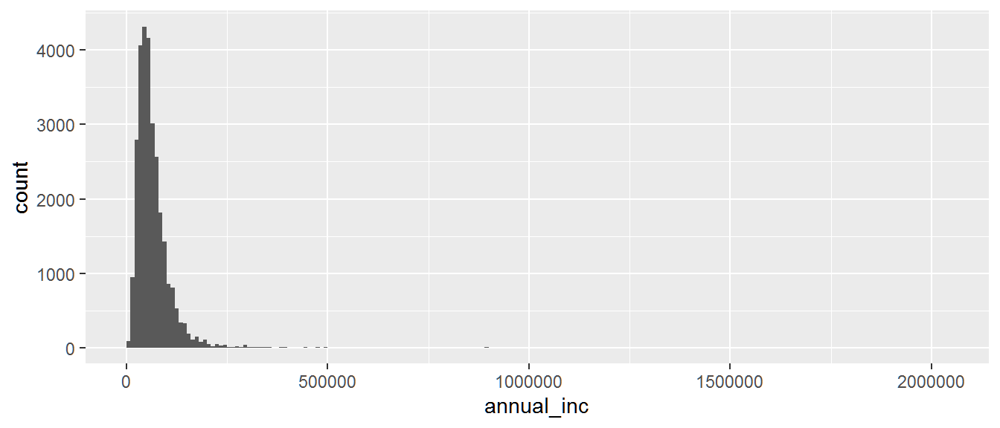

# changing background

## Change the plot background color

```r
ggplot(data=loan_data) +
  geom_bar(mapping=aes(x=loan_status, fill=home_ownership)) +
  theme(plot.background=element_rect(fill='purple'))
```

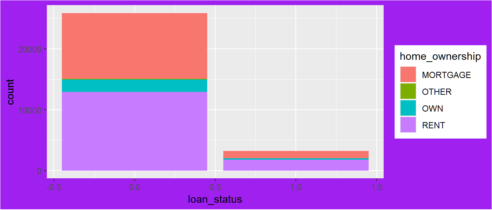

# Change the panel background color


```r
ggplot(data=loan_data) +
  geom_bar(mapping=aes(x=loan_status, fill=home_ownership)) +
  theme(panel.background=element_rect(fill='purple'))
```

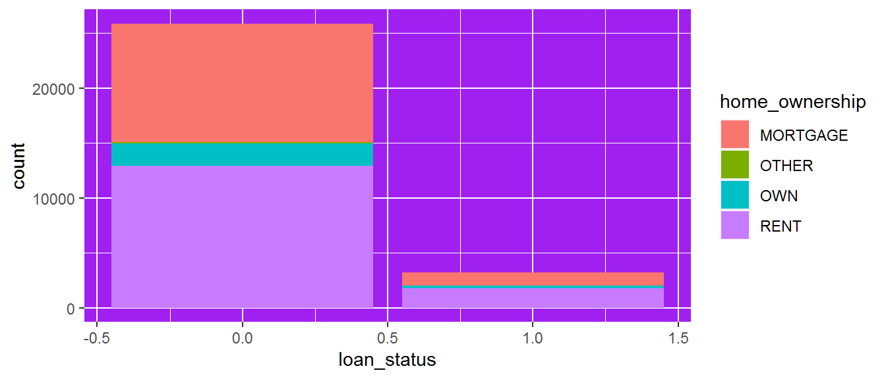

# Let's be minimalist and make both backgrounds disappear

```r
ggplot(data=loan_data) +
  geom_bar(mapping=aes(x=loan_status, fill=home_ownership)) +
  theme(panel.background=element_blank()) +
  theme(plot.background=element_blank())
```


# Add grey gridlines

```r
ggplot(data=loan_data) +
  geom_bar(mapping=aes(x=loan_status, fill=home_ownership)) +
  theme(panel.background=element_blank()) +
  theme(plot.background=element_blank()) +
  theme(panel.grid.major=element_line(color="grey"))
```

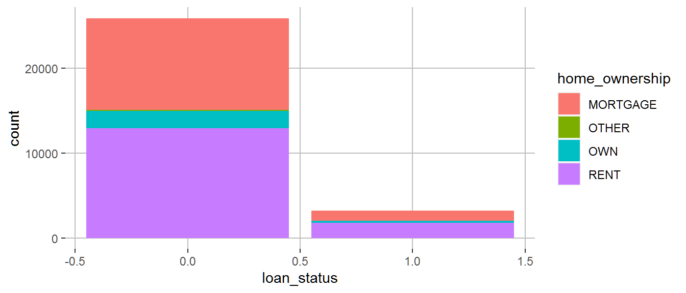

# Only show the y-axis gridlines

```r
ggplot(data=loan_data) +
  geom_bar(mapping=aes(x=loan_status, fill=home_ownership)) +
  theme(panel.background=element_blank()) +
  theme(plot.background=element_blank()) +
  theme(panel.grid.major.y=element_line(color="grey"))+
  scale_fill_manual(values=c("orange","blue","green","blue4"))
```


```r
library(ggthemes)
```

```
## Warning: package 'ggthemes' was built under R version 4.2.3
```

```r
ggplot(data=loan_data) +
  geom_bar(mapping=aes(x=loan_status, fill=home_ownership)) +
  theme(panel.background=element_blank()) +
  theme(plot.background=element_blank()) +
  theme(panel.grid.major.y=element_line(color="grey"))+
  scale_fill_manual(values=c("orange","blue","green","blue4"))+
  theme_solarized()+
  theme_wsj()
```

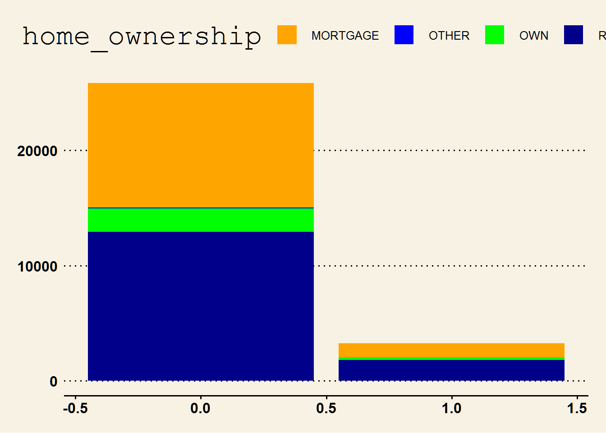


```r
ggplot(data=loan_data, aes(x = loan_status)) + 
  geom_bar(fill = "chartreuse") + 
  theme(axis.text.x = element_text(angle = 90))
```


